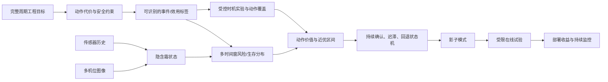

# 循环结霜—除霜最优控制时间点：从第一性原理到多模态 AI 的分析方法论

本轮重点更新：新增逐字小红书引文与原帖链接；新增“现在什么时候做什么”；新增多点预测前六张分析表；新增多点预测之外的方法优先级；新增高 Star 工具与 GitHub 讨论的使用边界；新增“分析结果怎样公式化选择下一步”的六道门；把工程防御内容放回后部，不再阻断前部学习主线。

## 先认来源：怎样区分原话、证据和建议

全文采用七种标签。看到标签，就知道一句话来自哪里、能支持到什么程度：

- 【小红书原话｜作者或评论者】“引号内是检索时看到的逐字原话。”后接可打开的原帖链接。原话不做润色，也不冒充科学定论。
- 【论文结论】写明作者、年份和论文链接。这里是论文直接支持的结论；若是本文对论文的应用解释，会另标【本文建议】。
- 【项目数据】只写本项目文件中实际统计或观察到的事实，例如有效循环数、图片数和通道表现。
- 【权威方法资料】来自 NIST、标准、权威教材或机构方法指南，用于支持实验设计和统计流程，不证明本设备效果。
- 【官方工具文档】来自软件官方 README/用户指南，只说明接口和实现能力，不把软件功能当成科学性能证据。
- 【GitHub 项目讨论】来自具体 issue/discussion，帮助识别真实接口语义和踩坑；它是项目交流记录，不等于同行评议结论。
- 【本文建议】是我根据目标、项目数据、论文和工程经验作出的推导。它不是任何来源的原话，可以被后续实验推翻。

引用规则很简单：**只有标为【小红书原话】、放在中文引号内并附原帖链接的文字，才声称是小红书逐字引用；逐字不等于正确。**小红书原话的作用是提供经验、疑问和可检验假设；是否适合结霜控制，仍要由项目数据和实验决定。

没有来源标签的公式推导、术语解释、表格组织和过渡文字，默认属于本文的教学性整理，不是小红书、论文或项目原话。凡涉及本项目具体数字、外部研究结论或工具能力，均应显式加标签和链接；若后文遗漏，应按这一规则回查，而不能依语气猜来源。

证据强度也要看“它在支持哪种结论”：

| 来源 | 最适合支持 | 不能单独支持 |
|---|---|---|
| 小红书原话 | 常见困惑、工程经验、搜索线索 | 算法普遍更优、最少样本量、节能比例 |
| 同类热泵论文 | 某设备和协议下的方法可行性、领域公式 | 直接搬到本设备后的收益和最优参数 |
| 通用方法论文 | 生存、多步、优化等方法的数学性质 | 本项目一定有效 |
| 项目数据 | 本设备已有循环、图片、趋势和缺口 | 未做实验的动作结果、跨季节泛化 |
| 权威方法资料 | 通用实验/统计流程和术语 | 本设备的参数、收益、最优模型 |
| 官方工具文档 | 软件支持哪些接口、输入和评价 | 对本数据一定优于其他软件 |
| GitHub 项目讨论 | 默认行为、已知问题、使用语义 | 普遍规律或同行评议结论 |
| 本文建议 | 下一步分析顺序和候选假设 | 已被证明的事实 |

同一篇论文也可能对不同结论有不同强度。例如，一篇受控热泵实验可以较强地支持“该设备上此策略有效”，但只能较弱地支持“所有设备都应使用同一阈值”。

## 现在什么时候应该做什么：先看这一页

【本文建议】**现在不要直接构造多点预测算法。**先用现有循环回答两个问题：什么事件代表“已经不值得继续制热”；哪些信号能在这个事件发生前稳定变化。只有第二个问题答案为“能”，预测才有信息基础。

下面是从零开始的工作顺序。每一步都有明确产物，也有“如果……就……”的下一步。

| 顺序 | 现在做什么 | 只看什么结果 | 如果结果是这样，就做什么 |
|---|---|---|---|
| 1 | 写清控制目标 | 过早除霜损失什么，过晚除霜损失什么 | 若说不清，先定义代理目标，不谈“最优” |
| 2 | 给每个循环画完整过程图 | 结霜、性能下降、旧除霜是否有稳定先后 | 若先后关系不重复，先按工况分组 |
| 3 | 标出三个事件 | 首霜、性能明显下降、旧控制器启动 | 若三者差很大，分别建标签，不能混成一个 |
| 4 | 分析当前值、斜率、加速度、累计变化 | 哪类量最早偏离正常状态 | 若单一量已稳定领先，先做阈值或变化点 |
| 5 | 做提前量分析 | 能否提前 5、10、20 分钟知道事件 | 若没有稳定提前量，先改标签、传感器或工况分组，不上复杂模型 |
| 6 | 跑三个最简单基线 | 已运行时间、当前值不变、最近斜率外推 | 若复杂特征不超过基线，说明尚未提取到新信息 |
| 7 | 判断你真正需要哪种输出 | 状态、事件概率、剩余时间、未来曲线还是动作价值 | 输出由决策需要选，不由流行算法选 |
| 8 | 再决定是否多点预测 | 5/10/20 分钟是否对应不同动作 | 若三个窗口只导向同一动作，保留一个窗口即可 |
| 9 | 检查照片的额外价值 | 加照片后，未见循环是否预测得更早或更准 | 若没有增益，图片先用于标注，不进入在线模型 |
| 10 | 主动改变除霜时机做实验 | 同工况下早、中、晚启动的总收益曲线 | 有了这条曲线，才开始估计真正最优点 |
| 11 | 预测后优化 | 比较“现在除霜”和“再等一会”的预计代价 | 每次重算，输出动作和近优时间区间 |


这张图从右侧最终目的向左倒推。任何一层说不清，就先停在该层补定义或补实验，不用更复杂模型跳过去。

### 第 1 步：先定义“必须除霜事件”，不要先定义模型

最容易犯的错误，是把旧控制器的启动时刻当成正确答案。它只表示“以前什么时候除”，不表示“什么时候最好”。

当前可先定义一个可测的代理事件，例如：供热量相对同工况无霜基线下降 10%，并持续 3 分钟。把这个时刻记为 \(T_{perf}\)。阈值 10% 和持续 3 分钟不是定律，应由工程可接受损失和数据分布确定。

如果目前算不出供热量或 COP，就先选最接近性能的指标，例如出回水温差、蒸发压力或稳定的温度残差。此时结论只能叫“代理性能事件预测”，不能叫“最优除霜预测”。

这一阶段的产物只有一张标签表：

| cycle_id | 首霜区间 | 性能事件区间 | 旧除霜时刻 | 标签依据 | 人工可信度 |
|---|---:|---:|---:|---|---|

### 第 2 步：先把每个循环看懂，再把循环堆在一起

每个循环画一张“故事图”。横轴用从本循环开始经过的分钟数；纵向至少放：环境温湿度、关键盘管温度/压力、供热或 COP 代理量、控制状态、三张代表性照片和三个事件标记。

看图只回答四个问题：

1. 同一信号在多数循环中是否朝同一方向变化？
2. 变化发生在首霜前、首霜后，还是性能下降后？
3. 不同环境条件下，曲线只是快慢不同，还是形状也不同？
4. 旧除霜时刻附近的变化是真实物理劣化，还是旧控制动作造成的？

如果 5 个有效循环看起来像 5 种完全不同的过程，不要立刻训练一个总模型。先按入口空气温湿度、负荷、初始盘管温度或控制设定分组；你可能面对的是多个机制，而不是一个难学的机制。

### 第 3 步：寻找“最早且稳定”的信号，不寻找“相关性最高”的信号

对每个候选传感器计算五种很直观的量：

- 当前值：现在是多少；
- 斜率：最近几分钟升得快还是降得快；
- 加速度：变化是否正在加快；
- 相对基线偏差：比相同工况下的正常值偏了多少；
- 累计偏差：异常已经积累了多久、多少。

然后把每个量第一次明显变化的时刻，与 \(T_{perf}\) 相减：

\[
L_{i,k}=T_{perf,i}-T_{signal,i,k}.
\]

\(L>0\) 表示信号提前出现；\(L<0\) 表示发现得太晚。真正重要的不是平均提前量最大，而是多数循环都为正、波动又小。

如果“斜率”比“当前值”更早且更稳定，就优先做趋势或变化点；如果“累计偏差”最好，就优先做累积损失/状态模型；如果只有照片最早，就把视觉先做成霜状态测量器。

### 第 4 步：画一张提前量矩阵，再决定是否值得预测

建立一张表，行是信号，列是提前 3、5、10、15、20、30 分钟。格子里记录：在该提前量时，信号能否把“即将发生性能事件”和“暂时不会发生”分开。

| 信号或特征 | 3 min | 5 min | 10 min | 20 min | 跨循环方向一致吗 |
|---|---:|---:|---:|---:|---|
| 温度残差当前值 |  |  |  |  |  |
| 温度残差斜率 |  |  |  |  |  |
| 压力滚动中位数 |  |  |  |  |  |
| 图像霜覆盖率 |  |  |  |  |  |
| 已运行时间 |  |  |  |  |  |

如果只有 3 分钟格子有信息，而设备完成判断和动作需要 5 分钟，那么这个信号虽与结霜相关，却没有控制价值。反过来，如果 20 分钟时已有微弱信息、5 分钟时很强，就适合做短中长多时间窗预测。

### 第 5 步：在选算法前，先让四种简单方法参加比赛

第一轮不需要深度学习。每种目标至少比较：

1. 已运行时间：相似工况通常运行多久达到事件；
2. 当前值不变：未来仍等于现在；
3. 最近斜率外推：按最近趋势继续走；
4. 一个可解释模型：逻辑回归、GAM 或浅层树。

这一步不是为了“保守”，而是为了定位突破口。若已运行时间就很强，真正难题是如何适应工况变化；若斜率外推很强，核心是找稳定趋势；若浅树显著更好，说明变量之间存在条件组合；若都很差，复杂网络通常只会更隐蔽地失败。

### 第 6 步：根据你看到的数据形状，选择问题形式

| 你在分析中看到什么 | 应先试的方法 | 它回答什么 |
|---|---|---|
| 一个值越过阈值就接近需要点 | 可学习阈值、GAM | 现在是否足够严重 |
| 斜率或均值突然换挡 | 在线变化点检测 | 是否刚进入加速劣化阶段 |
| 只关心未来 5/10/20 分钟会不会发生 | 多时间窗事件分类 | 每个时间窗的风险 |
| 有些循环没等到事件就结束 | 生存/危险率模型 | 事件尚未发生条件下，下一段时间发生概率 |
| 事件定义稳定，需要倒计时 | 剩余时间 RUL | 距离事件还有多久及其区间 |
| 决策依赖未来最低值、积分或曲线形状 | 多步轨迹预测 | 未来性能路径怎样 |
| 真实霜厚看不见，但传感器和图片都在反映它 | 状态空间/隐状态模型 | 当前潜在霜状态是多少 |
| 可以主动试早、中、晚除霜 | 响应面或贝叶斯优化 | 哪个候选时机收益最好 |
| 已能估计等待损失和除霜成本 | 预测后优化 | 现在除还是继续等 |

没有一种方法因“这是结霜问题”就天然最好。最合适的方法，是用最少假设回答当前决策所需问题的方法。

### 第 7 步：什么时候才开始多点预测

满足以下四条时，再正式构造多点模型：

1. 已有明确目标事件，且不是把旧动作冒充最优标签；
2. 至少一个信号在目标事件前有重复的领先变化；
3. 不同预测窗口对应不同用途，例如 20 分钟准备、10 分钟预警、5 分钟触发；
4. 简单基线和按完整循环的验证流程已经跑通。

第一版不要一次预测所有传感器的所有未来点。先输出：

\[
[P(T\le t+5\mid T>t),\ P(T\le t+10\mid T>t),\ P(T\le t+20\mid T>t)].
\]

通俗地说，就是“在尚未需要除霜的前提下，未来 5、10、20 分钟内变得需要除霜的概率”。这三个输出比一长串温度预测更贴近动作。

### 第 8 步：什么时候把照片加入模型

先用照片回答“现在霜到哪一阶段”，不要一开始让图像网络直接决定除霜。给少量分散帧标注无霜、初霜、扩展、厚霜或覆盖率，再检查图片状态是否领先性能事件。

然后做三次完全相同的循环外测试：仅传感器、仅图片、传感器加图片。如果融合模型只在训练集更好，图片没有证明额外价值；如果它在新循环中更早发现事件，图片才值得作为在线输入。

### 第 9 步：真正的最优点来自“改变动作后的结果”

历史数据只告诉你旧策略选择的一个时刻。要知道早 10 分钟或晚 10 分钟是否更好，必须在相近工况下主动试不同启动时机，并记录启动前损失、除霜能耗、除霜时长、恢复时间和恢复后的有效供热。

对每种工况画出候选启动时刻 \(\tau\) 与单循环总代价 \(C(\tau)\) 的关系。最低处是估计最优点；如果谷底很平，就报告“近优区间”，不要报告虚假的唯一分钟。

这一步完成前，模型最多能预测“结霜状态”“性能事件”或“旧控制时刻”。完成后，才有数据训练“动作价值”或校正最优控制策略。

### 你明天可以直接做的五件事

1. 从 5—6 个严格有效循环中，每个选出一张完整过程图。
2. 人工标出首霜区间、性能下降区间和旧除霜时刻。
3. 对 5 个最可信传感器计算 1/3/5/10 分钟斜率、相对基线偏差和累计偏差。
4. 做“性能事件时刻减信号首次变化时刻”的提前量表，即 \(L=T_{perf}-T_{signal}\)，正值表示提前发现。
5. 根据表格结果，在“阈值、变化点、多时间窗、生存/RUL”四条路线中只选两条进入首轮比较。

完成这五件事后，你再开始写训练代码，会比直接试 LSTM、Transformer 或多输出网络更快接近真正突破。

### 入门只需先懂六个词

| 词 | 最通俗的意思 | 本项目例子 |
|---|---|---|
| 标签 label | 模型要学的“答案” | 未来 10 分钟是否达到性能事件 |
| 特征 feature | 当时能看到的“线索” | 最近 5 分钟温度斜率、图片霜覆盖率 |
| 基线 baseline | 新方法必须打败的简单对手 | 固定时长、当前值不变、最近斜率 |
| 预测窗 horizon | 要看多远的未来 | 5、10、20 分钟 |
| 删失 censoring | 记录结束时答案还没出现 | 循环提前停止，不知道事件之后何时发生 |
| 校准 calibration | 概率说话是否算数 | 报 70% 风险的时刻，大约七成真的发生 |

你不需要先学会所有模型。只要每次能说清“答案是什么、线索是什么、看多远、和谁比、数据没看到结局时怎么办”，就已经能设计正确的第一版实验。

## 阅读导航：不要试图第一次就记住全部方法

本文按“先形成主线，再按任务回查”使用：

| 你的当前目的 | 先读 | 读完应能回答 |
|---|---|---|
| 先把问题想清楚 | 0–2、8、20、41 | 最优点是什么，为什么旧触发不是标签 |
| 盘活现有数据 | 3、7、9–10、14、21、34、37.20 | 一行/一图能支持什么结论，怎样做第一轮分析 |
| 决定多点预测 | 6、13、22、35、44、48 | 预测什么“点”，怎样切分、校准并转成报警 |
| 决定用什么算法 | 11–12、29、31、36、38 | 什么分析结果允许模型升级，怎样反证自己 |
| 使用照片 | 23–24、32、37 | 图片做标签、在线输入还是审计，如何证明增量价值 |
| 设计新增实验 | 4、17、28、31、39、43 | 至少多少循环、怎样改变时机并识别反事实 |
| 做可维护 AI infra | 19、21、30、46–47 | 怎样处理 86 GB、版本、反馈回路和选择性标签 |
| 走向设备控制 | 15–18、26–28、33、42、45、48 | 怎样把模型包在安全状态机内并分阶段上线 |

若 AI 基础较弱，第一次只读：**0 → 1 → 3 → 4 → 6 → 7 → 8 → 20 → 21 → 34 → 41**。先掌握“目标—标签—独立单位—基线—验证—动作”六个词，再阅读深度学习、因果推断和强化学习。算法名不是前置知识；能够指出一个结果的分母、标签来源和部署时可用信息，已经抓住本项目最重要的方法论。

如果当前只想尽快取得研究突破，按“现在什么时候应该做什么”完成前五件事，再读 5、6、10、11、12、17。15、19、25—27、30、42、45—48 是后续严谨化和上线阶段材料，不应打断当前的“找事件—找领先信号—选问题形式”主线。

每次实际分析只需完成一个闭环：

> 工程决定 → 可识别目标 → 独立单位 → 最简单基线 → 外层验证 → 失败复盘 → 下一批最有价值的数据

遇到陌生方法时不要先问“怎么调参”，依次问：它估计什么数学对象；需要什么标签；依赖哪些假设；相对哪条基线；用什么独立单位验证；输出如何改变动作。第 40 章可查术语，第 41 章可查公式，第 36 章可查模型卡。

## 原始七问直答

以下短答案均为【本文建议】；项目事实、论文和小红书原话在对应章节分别标注。

| 问题 | 最短答案 | 深入位置 |
|---|---|---|
| 1. 这叫什么问题 | 多模态、部分可观测、带竞争代价与安全约束的最优停止/序贯决策；近期可拆成状态估计、早期事件预测和动态生存 | 1–2、20、39、41 |
| 2. 至少多少循环 | 没有脱离目标的最低数；5–10 只能探索，20–30 可做受限简单基线，50–100 才较适合稳定传统模型，真正策略样本量必须由方差、MEID、工况和精度模拟 | 3–4、31、43 |
| 3. 主流 AI 方法 | 规则/变化点、逻辑/GAM、树、生存/危险率、状态空间、TCN/LSTM/Transformer、视觉融合、物理残差、MPC、因果/策略学习和 RL | 11、28、36 |
| 4. 多点预测是否正确 | 正确，但首选多个 horizon 的累计事件风险/生存分布；原始轨迹预测只在代价确实依赖积分、极值或形状时优先 | 6、22、35、44、48 |
| 5. 是否由分析选算法 | 是；没有仅凭“结霜时序”就唯一最优的模型。当前有一个强默认起点：规则 + elapsed/persistence/slope + 逻辑/GAM/浅树 + 离散危险率 | 7、12、29、32 |
| 6. 哪些分析最重要 | 标签语义、独立循环、时间可得性、删失机制、相对 baseline 的提前性、条件增量、外层泛化、概率校准和动作代价 | 9–10、13–16、21、25–26、37–38 |
| 7. 如何形成完整方法论 | 从周期价值倒推动作、反事实、标签、观测、数据产品、最小模型、验证和实验；每层不过门就不升级 | 18–21、27、30、34、42–47 |

其中“20–30、50–100”等是项目规划量级，不是统计定律。真正立项时应使用第 31、43 章的精度/功效模拟，并保留新日期和新工况作独立确认。

## 0. 一页结论：现在最应该做什么

你的最终问题不是普通的“时间序列多步预测”，而是一个**连续做决定的问题**：每隔一段时间，都要在“继续制热”和“启动除霜”之间选一个。

学术上，它叫“带部分可观测状态和竞争代价的序贯决策/最优停止问题”。“部分可观测”只是说真实霜厚和换热热阻看不全，只能通过传感器与图片间接判断；“竞争代价”是说过早除和过晚除都会损失。

最优除霜时间不是数据中天然存在的一列。`defrost_start` 只记录旧控制器何时行动；拿它训练，得到的是“模仿旧控制器”，不是“超过旧控制器”。

真正要比较的是：现在除霜，与再等 5、10、20 分钟相比，整个循环的净收益差多少。只有通过计算或实验得到这些候选动作的结果，“最优”才有数学含义。

推荐路线不是一步到位训练 Transformer，而是四层递进：

1. **可解释代理目标层**：用供热能力、COP、盘管/翅片温度、蒸发压力、图像霜覆盖率构造结霜严重度和性能损失；先证明这些量在循环内的演化稳定且跨工况可比较。
2. **多时间窗风险层**：在每个时刻预测未来 5/10/20 分钟内达到“必须除霜”状态的风险或性能损失，而不是先预测所有原始通道的每一个未来点。
3. **决策层**：把多时间窗风险、继续运行收益、除霜成本和安全约束合成一个触发规则；输出“现在除霜/继续观察”和可信度。
4. **策略验证层**：通过按整循环、按日期、按工况的离线回放，再通过受控在线 A/B 或交叉实验验证，最终才称为最优控制。

多点预测是可行的，但它是**中间表示**，不是最终目的。对控制更有价值的多点通常不是完整未来曲线，而是多个决策时间窗上的风险向量：

\[
\mathbf r_t=
\left[
P(t<T^*\le t+5\text{ min}\mid T^*>t,\mathcal H_t),
P(t<T^*\le t+10\text{ min}\mid T^*>t,\mathcal H_t),
P(t<T^*\le t+20\text{ min}\mid T^*>t,\mathcal H_t)
\right].
\]

这里 \(T^*\) 是目标事件时刻，\(\mathcal H_t\) 是当前时刻以前的全部可用信息。只在事件尚未发生时发出预测。

若目标是性能明显下降，就写 \(T^*=T_{perf}\)；若只是模仿旧控制器，就写 \(T^*=T_{legacy}\)；只有能表示决策需要点时才写 \(T^*=T_{need}\)。三种标签不能混名。

时间窗越长，累计风险不应越小，即 \(r_5\le r_{10}\le r_{20}\)。这种输出比“一次预测未来 120 个温度点”更贴近控制。

你现在最大的限制不是模型，而是**独立有效循环数**。【项目数据】33 条循环摘要中，26 条 `incomplete`、1 条 `invalid`、6 条 `valid`；其中只有 5 条同时有可用 baseline。

因此样本量是约 5—6 个循环，不是 10 秒网格形成的数万行。当前足够做：逐循环看规律、定义标签、寻找领先信号、比较简单规则并规划新实验。当前不足以证明：深度网络能泛化，或某个复杂多模态模型已经找到最优策略。

## 1. 从终点倒推：什么叫“最优除霜时间”

### 1.1 先区别四种容易混淆的时间

一个结霜—除霜循环中至少存在四种不同时间：

- \(T_{onset}\)：物理结霜开始，可由图像首霜、表面状态或物理判据定义。
- \(T_{perf}\)：性能劣化达到预先声明的可测阈值，例如供热量相对条件基线下降 10% 并持续一定时间。
- \(T_{need}\)：从系统收益和约束看，“再继续运行”的边际价值已不如“立即除霜”。
- \(T_{legacy}\)：现有控制器实际启动除霜的时间。

通常只有 \(T_{legacy}\) 被直接记录。它既可能晚于 \(T_{need}\)，造成低效运行，也可能早于 \(T_{need}\)，造成不必要除霜。算法研究必须明确预测的是哪一个时间。若目标是最优控制，最终对象应是 \(T_{need}\) 或其策略等价物，而不是简单预测 \(T_{legacy}\)。

### 1.2 最小可用的优化定义

在时刻 \(t\)，允许选择动作 \(a_t\in\{0,1\}\)：0 表示继续制热，1 表示启动除霜。定义从当前开始到下一个稳定制热阶段的累计代价：

\[
J(\pi)=\mathbb{E}_\pi\left[
\sum_{t=0}^{H}
\left(
w_E E_t+w_Q L^{heat}_t+w_D C^{defrost}_t+w_S C^{switch}_t+w_R R_t
\right)
\right].
\]

其中：

- \(E_t\)：耗电或电费；
- \(L^{heat}_t\)：供热不足或目标水温偏差；
- \(C^{defrost}_t\)：除霜期间反向吸热、停供热和恢复阶段的代价；
- \(C^{switch}_t\)：频繁切换、压缩机与阀件冲击；
- \(R_t\)：安全、可靠性、极端结霜或液击等风险；
- \(w_*\)：由工程目标决定的权重；
- \(\pi\)：根据历史观测作动作的策略。

最优策略为

\[
\pi^*=\arg\min_\pi J(\pi).
\]

如果先不做完整动态控制，可定义单循环候选触发时刻 \(\tau\) 的代价：

\[
C_i(\tau)=
\int_{t_{0,i}}^{\tau}L_{run,i}(t)\,dt
+C_{defrost,i}(\tau)
+C_{recovery,i}(\tau)
+C_{risk,i}(\tau),
\]

\[
\tau_i^*=\arg\min_{\tau\in\mathcal T_i}C_i(\tau).
\]

这就是最直接的“最优时间点”定义。它要求每个候选时刻都能估算等待代价和除霜代价。若目前没有随机或计划性地在不同时间启动除霜，\(C_i(\tau)\) 对未执行动作的部分是反事实，无法仅靠普通监督学习直接知道。

### 1.3 更适合在线控制的边际判据

实际控制不需要每秒求完整积分。可比较“立即除霜”和“再等 \(\Delta\) 分钟”的预期代价：

\[
\Delta C_t(\Delta)=
\mathbb{E}[C(\text{wait }\Delta\mid\mathcal H_t)]
-\mathbb{E}[C(\text{defrost now}\mid\mathcal H_t)].
\]

当 \(\Delta C_t(\Delta)>0\) 且满足持续性、迟滞和安全条件时触发。这一写法直接揭示模型真正需要预测什么：不是“霜有多少”本身，而是**等待的未来损失**、**除霜后的恢复收益**和不确定性。

\(T_{need}\) 不是像首霜那样独立于控制目标的天然物理事件，更严格地应定义为停止边界：

\[
T_{need}=
\inf\left\{
t:
Q^{defrost}(\mathcal H_t;w,\mathcal A,\mathcal U)
\le
Q^{continue}(\mathcal H_t;w,\mathcal A,\mathcal U)
\right\},
\]

其中 \(w\) 是代价权重，\(\mathcal A\) 是允许动作，\(\mathcal U\) 是未来环境/负荷情景。电价、供热需求、恢复成本、安全边界或未来天气改变时，同一霜状态的 \(T_{need}\) 也可能改变。因此：

- \(T_{onset}\) 和冻结定义后的 \(T_{perf}\) 可作为相对稳定的事件预测目标；
- \(T_{need}\) 只有在代价、情景和动作集合冻结后，才能作为生存/倒计时标签；
- 长期最稳的控制接口是条件成本或动作优势，而不是脱离场景的唯一“最佳分钟”；
- 报告应写“在给定权重与工况支持域下的最优/近优区间”。

这不是否定多点预测，而是明确其角色：多点风险描述未来状态分布，决策层再用当前代价把分布映射为当下动作。

### 1.4 若暂时无法识别真正最优：代理目标分级

在数据不足时，应明确使用代理目标，不把代理说成最优：

- L0 事件模仿：预测现有控制器将在多久后除霜。可验证，但只模仿旧规则。
- L1 状态识别：识别无霜、轻霜、中霜、重霜或连续霜覆盖率。回答“现在有多严重”。
- L2 性能预警：预测未来 \(h\) 分钟供热量/COP 是否下降超过阈值。回答“继续运行会不会明显变差”。
- L3 决策效用：预测不同候选动作的未来累计代价。回答“现在除还是等一会更划算”。
- L4 长期策略：同时考虑多个循环、环境变化和设备寿命的策略优化。

当前数据最现实的近期目标是 L1+L2，并为 L3 设计受控实验。直接宣称做到 L4 会越过识别条件。

### 1.5 “预测出来”与“计算出来”不是二选一

得到时间点有四条不同证据路线：

| 路线 | 数学对象 | 需要的证据 | 主要风险 |
|---|---|---|---|
| 直接计算 | \(\tau^*(c)=\arg\min_\tau C(c,\tau)\) | 物理/经验损失模型或候选时机响应面 | 成本模型错、未测工况 |
| 直接预测时间 | \(\hat\tau=f(c,\mathcal H_t)\) | 大量可信 \(\tau^*\) 标签 | 学到旧动作或标签噪声 |
| 预测后优化 | 先估 \(C_{wait},C_{now}\) 或 \(F_t(h)\)，再求动作 | 风险/成本可校准，代价明确 | 两阶段误差传播 |
| 直接策略学习 | \(\pi(\mathcal H_t)\to a_t\) | 动作覆盖、奖励、仿真/在线探索和安全外壳 | 反事实外推、奖励错设 |

所谓“直接计算”也会包含预测：未来环境、霜增长、供热损失与恢复成本通常未知，需要模型估计。所谓“直接预测时间”也隐含计算：它的训练标签必须先由人工、物理规则、受控响应面或某个优化器产生。两者真正区别在于**代价函数是否保持显式**。

本项目优先采用可审计的预测后优化：

\[
\hat A_t(\Delta)=
\underbrace{\mathbb E_{\hat F_t}[C_{wait}(\Delta)]}_{\text{由多点风险/结果模型估计}}
-
\underbrace{\hat C_{now}(\mathcal H_t)}_{\text{除霜与恢复代价}},
\]

这里的 \(C_{wait}\) 是继续动作的**净代价**：包含劣化、能耗和安全损失，并扣除等待期间仍获得的有用供热；不是只累计坏处。这样才与全文 \(A=Q^{continue}-Q^{defrost}\) 完全同义。

\[
\hat a_t=
\begin{cases}
\text{defrost}, & \hat A_t(\Delta)>\theta_A
\text{ 且质量、支持域、安全、持续性均通过},\\
\text{continue/fallback}, & \text{否则}.
\end{cases}
\]

它比直接回归一个 \(\hat T\) 更适合早期阶段，原因是：

1. 可以分别检查风险预测错、除霜成本错还是阈值错；
2. 成本权重变化时不必重新伪造“最优时间”标签；
3. 输出整条风险曲线与近优区间，能表达不确定性；
4. 可先用简单规则/GAM/生存模型替换每个部件，逐步升级；
5. 最终受控实验得到 \(C(c,\tau)\) 后，可校正而不是推翻整个接口。

直接时间预测仍可作为基线，但标签必须命名为 time-to-\(T_{perf}\)、time-to-\(T_{legacy}\) 或由受控实验得到的 time-to-\(T_{need}\)。若标签来自旧控制器，模型名称也应写 legacy-time predictor，不能仅因 MAE 很小就称 optimal-time predictor。

## 2. 这个问题应该叫什么：多种视角下的准确定性

### 2.1 核心定性

最完整的名称是：

**多模态、部分可观测、带竞争代价与安全约束的除霜最优停止/序贯决策问题。**

每个修饰语都有实际含义：

- 多模态：传感器序列与多视角照片共同描述不可直接测量的霜状态。
- 部分可观测：真实霜质量、厚度、换热热阻等状态没有被完整直接测量。
- 最优停止：在每一时刻选择继续观察还是停止当前制热阶段并除霜。
- 序贯决策：动作会改变后续状态和数据分布。
- 竞争代价：过早除霜和过晚除霜都有损失。
- 安全约束：即使平均收益较好，也不能违反压力、温度、结霜严重度等边界。

### 2.2 可拆成的五个机器学习子问题

1. **隐状态估计**：从历史观测估计结霜严重度 \(z_t\)。
2. **多时间窗预测**：预测未来性能或事件风险 \(p_h(t)\)。
3. **剩余时间/生存分析**：估计距离目标事件还有多久，允许删失数据。
4. **变化点与早期预警**：识别从稳定制热向加速劣化转变的时刻。
5. **策略学习/最优停止**：综合预测与成本决定是否触发除霜。

这五个子问题不是互斥算法，而是从感知到控制的层级。一个可靠系统通常先有 1—4，再把结果送入 5。

### 2.3 状态空间形式

定义不可完全观测的物理状态

\[
s_t=[m_{frost,t},\,\delta_{frost,t},\,R_{th,t},\,\eta_t,\,x^{equipment}_t],
\]

观测为

\[
o_t=[x^{sensor}_t,\,x^{control}_t,\,x^{environment}_t,\,I_t].
\]

状态转移和观测模型为

\[
s_{t+1}=f(s_t,a_t,u_t)+\epsilon_t,
\qquad
o_t=g(s_t)+\nu_t,
\]

其中 \(u_t\) 是环境和负荷外生输入，\(I_t\) 是图片，\(\epsilon_t,\nu_t\) 表示过程与测量噪声。控制器实际依据的是信念状态

\[
b_t=P(s_t\mid o_{0:t},a_{0:t-1}),
\]

而非真实状态。这说明照片的价值不只是再加一列特征，而是帮助缩小对隐含霜状态的不确定性。

### 2.4 生存分析形式

若已冻结代价/情景/动作定义，并把目标声明为达到相应停止边界的事件时间 \(T^*\)，危险率为

\[
\lambda(t\mid\mathcal H_t)=
\lim_{\Delta t\to0}
\frac{P(t\le T^*<t+\Delta t\mid T^*\ge t,\mathcal H_t)}{\Delta t}.
\]

生存函数

\[
S(t\mid\mathcal H_t)=P(T^*>t\mid\mathcal H_t)
=\exp\left[-\int_0^t\lambda(u\mid\mathcal H_u)du\right].
\]

剩余时间可用生存分布的中位数或期望表示。生存分析的优势是自然处理循环尚未到达事件便结束的右删失数据；这与你的数据中大量 `incomplete` 循环高度相关。但前提是“不完整”的原因与事件过程之间的关系必须被分析，不能机械地把所有残缺循环都当作非信息删失。

### 2.5 多时间窗分类形式

定义在未来 \(h\) 分钟内是否达到目标事件：

\[
y_{t,h}=\mathbb{1}(t<T^*\le t+h),\quad
t\in\mathcal R=\{t:T^*>t\},\quad h\in\{5,10,20\}\text{ min}.
\]

模型输出

\[
\hat p_{t,h}=P(t<T^*\le t+h\mid T^*>t,\mathcal H_t).
\]

与直接预测时间点相比，这种方式对标签误差更鲁棒、容易与实际控制提前量对应，也能输出不同提前量下的召回率和误报率。事件发生后的点已不再面临“何时触发”的决定，必须从风险集退出，不能作为容易识别的正样本留在训练/测试中。需加入单调约束或后处理以满足 \(\hat p_{t,5}\le\hat p_{t,10}\le\hat p_{t,20}\)。

### 2.6 最优停止形式

设 \(V(b_t)\) 为处于信念状态 \(b_t\) 时的最小未来代价：

\[
V(b_t)=\min\left\{
C_{stop}(b_t),
C_{continue}(b_t)+\gamma\mathbb{E}[V(b_{t+1})\mid b_t]
\right\}.
\]

当第一项不大于第二项时启动除霜。这个 Bellman 形式是第一性原理上的终点，但当前不必立即用强化学习求解。先用可解释模型估计两项，再做阈值/动态规划，往往比小样本直接深度强化学习可靠。

### 2.7 它也像“状态维修/RUL”，但不是一次性寿命预测

【论文结论】[Bougacha、Varnier 与 Zerhouni（2021）](https://doi.org/10.36001/ijphm.2020.v11i2.2928)关于 PHM 后预测决策的综述强调，预测结果需要进入后续的成本、可用性和风险决策。

【本文建议】借用相邻领域术语，本问题可称为 **prognostics-informed decision-making**：先从监测数据构造健康/结霜指标，预测距离性能阈值的剩余时间，再决定何时干预。这支持“多点风险是控制中间量”，但不证明 RUL 是本项目唯一最佳输出。

但不能把热泵循环直接当轴承寿命：

- 除霜是重复、可恢复的干预，不是一次性更换；
- 恢复并不总回到同一初态，残水/残冰和热惯性产生 carryover；
- 事件可由控制器提前阻止，标签随策略改变；
- 过早干预也有显著代价，而不是越早维修越安全；
- 环境和负荷使劣化速率在每循环内外变化。

因此在权重、情景和动作集合冻结后，“剩余可运行时间” \(R_t=T_{need}-t\) 是可用的预测接口；未冻结时应写成 \(R_t(w,\mathcal U,\mathcal A)\)。最终模型更接近带复位状态的 recurrent optimal stopping / semi-Markov control：

\[
s_{i,t}\xrightarrow[\text{continue}]{}
s_{i,t+1},
\qquad
s_{i,t}\xrightarrow[\text{defrost}]{}
s_{i+1,0}\sim P(\cdot\mid s_{i,t},a_t,c_i).
\]

这也解释了为何评估必须跨越恢复期并记录上一循环：若只优化本循环触发前的 RUL 误差，模型可能把成本推到除霜和下一循环。

## 3. 当前数据审计：你真正拥有多少信息

### 3.1 本项目现状

【项目数据】截至当前审计：

- 7 个实验日期：0714、0715、0716、0717、0720、0721、0722；
- 33 个循环摘要；
- 状态为 `valid` 的循环 6 个，`incomplete` 26 个，`invalid` 1 个；
- `valid` 且 baseline 可用的循环 5 个；
- 总计 34,835 张已匹配 RGB 图片；
- 原始数据目录约 86 GB；
- 10 秒 Processed 网格；
- 当前候选传感器为蒸发压力、蒸发温度、盘管温度、翅片温度；
- 现有证据包含 132 条 feature-cycle 指标和 3,168 条 future-association 结果；
- 已观察的正式结霜阶段中位时长约 182.13 分钟，但有效循环中也有约 51、66、153 分钟的明显差异。

【项目数据】现有探索证据显示，蒸发压力、蒸发温度、盘管温度在 6 个可用于趋势的循环、4 个日期上呈强一致下降；翅片温度的全局相关较弱且 baseline 有缺失。这个结果可以帮助候选筛选，但 release note 已明确：它不构成因果、样本外预测、独立增量价值、最终传感器选择或最优除霜策略。

### 3.1.1 现有证据最关键的四个读法

| 【项目数据】现有结果 | 最通俗的解释 | 现在该做什么 |
|---|---|---|
| 三个候选量在 6 个循环、4 个日期上方向一致下降 | 它们能描述“过程正在推进” | 保留为当前状态/趋势候选，不宣称会提前预警 |
| 四个候选量的 `lead_valid_cycle_count` 均为 0 | 当前证据包还没有算出相对目标事件的有效领先时间 | 先定义 \(T_{perf}\)，再逐循环计算 \(T_{perf}-T_{signal}\) |
| 蒸发压力与蒸发温度标为 `definition_dependency=True` | 蒸发温度很可能由压力和制冷剂关系换算；不是两份独立证据 | 第一轮只保留一个主输入，另一个作可读物理量/一致性检查 |
| 翅片温度缺少有效 baseline/趋势证据 | 现在不能判断它无用，只能说现有记录无法评价 | 先核对通道映射、实测覆盖和基线，再决定删除或补采 |

【本文建议】因此当前最准确的研究状态是：**已找到状态随时间变化的候选量，尚未找到被证明稳定领先性能事件的预测量。**这不是失败，而是把下一步缩得很清楚：不要先构造多点网络；先把性能事件落到每个循环上，生成领先时间表。

具体按下面顺序做：

1. 用供热能力或 COP 相对本循环早期基线的持续下降定义一个临时 \(T_{perf}\)，同时对 5%、10%、15% 三档做敏感性分析；三档是待比较阈值，不是已知真理。
2. 对盘管温度、蒸发压力/蒸发温度二选一，计算当前值、1/3/5/10 分钟斜率、相对基线偏差和累计偏差。
3. 每个特征只用当时及以前数据确定首次持续异常时刻 (T_{signal})，不要在完整循环上回看找最漂亮拐点。
4. 逐循环计算 \(L=T_{perf}-T_{signal}\)，同时报告中位数、四分位距、方向一致率和有效循环数。
5. 与 `elapsed-time-only` 比较：如果运行时间已经产生同样提前量，候选传感器还没有证明增量价值；如果传感器在留出循环更早且误报不增，才进入多时间窗或生存模型。

第一轮特征集合应非常小：`elapsed`、盘管温度残差及其斜率、蒸发压力残差及其斜率、一个累计性能损失量。不要同时塞入压力和由它换算的蒸发温度，再把重复信息误认为多变量融合成功。

### 3.1.2 现有未来关联图到底说明了什么

【项目数据】冻结的 `figure_3_future_horizon_map` 中，候选量的当前残差水平与未来 5/10/20 分钟供热能力或 COP 变化呈弱到中等负关联；例如 10 分钟格子里，蒸发压力、蒸发温度和盘管温度对供热能力变化的跨循环汇总约为 ρ=-0.20、-0.20、-0.18，对 COP 变化约为 ρ=-0.29、-0.29、-0.26。用于比较的有效量级为 6 个循环、4 个日期。

【项目数据】同一图中的 `past_slope_5min` 大多接近零，或只在 1—2 个循环上可算而被标为 exploratory；盘管温度斜率在 5/10/20 分钟对未来供热变化的汇总约为 -0.02、-0.09、-0.06。冻结 release 已明确，这些是循环内时间关联，可能由共同过程进度和目标当前值的数学耦合产生，不是样本外预测技能。

【本文建议】因此不要把“残差水平有关联”翻译成“已经适合多步预测”。先做两个条件增量问题：

1. 已知运行时间和当前供热能力后，候选传感器残差还能否改善未来 10 分钟事件风险？
2. 已知候选传感器当前值后，斜率、加速度或累计偏差还能否改善？

用嵌套模型直接比较即可：

\[
M_0: y_{t,h}\sim elapsed_t+y_t,
\]

\[
M_1: y_{t,h}\sim elapsed_t+y_t+r_t,
\]

\[
M_2: y_{t,h}\sim elapsed_t+y_t+r_t+\dot r_t+A_t,
\]

其中 \(r_t\) 是候选传感器残差，\(\dot r_t\) 是过去斜率，\(A_t\) 是累计异常。若 \(M_1\) 不能在留出循环超过 \(M_0\)，当前值只是在复述时间/性能；若 \(M_2\) 不能超过 \(M_1\)，暂时不需要复杂时序编码器。

【项目数据】`figure_1_cycle_evolution` 的横轴是完整正式结霜阶段归一化后的 0—1 进度，必须知道阶段终点才能计算；图下注释也明确说顶部刻度不是物理首霜点。

【本文建议】这张图适合发现形状和日期差异，不可直接作为在线输入或“可提前多少分钟”的证据。下一张关键图必须改用从稳定制热开始的真实分钟，并以独立定义的 \(T_{perf}\) 对齐；只有这样才能回答什么时候应该动作。

### 3.1.3 直接从现有证据包开始：六个产物按什么顺序生成

【项目数据】`cycle_eligibility.csv` 中可直接用于主趋势分析的是 6 个 valid 循环：0716 `cycle_002`、0717 `cycle_003`、0721 `cycle_004`、0722 `cycle_001/002/003`。其余 26 个 incomplete 和 1 个 invalid 先保留，但不与主结果混算。

【本文建议】不要先写模型类。按下面顺序生成六个小表，每完成一张才决定下一步。

| 何时做 | 输入 | 现在生成什么 | 看见什么才继续 |
|---|---|---|---|
| 第一天 | `cycle_eligibility.csv` 与各日 `cycle_summary.csv` | `cycle_scope_v1`：每个循环能用于哪些任务 | 主分析循环、图像循环、删失循环边界清楚 |
| 第二天 | 6 个 valid 循环的性能量 | `cycle_event_v1`：5%/10%/15% 性能事件区间 | 至少一档在多数循环中可重复定义 |
| 第三天 | `feature_cycle_metrics.csv` 与原序列 | `signal_event_v1`：每个特征首次历史异常时刻 | 至少一个特征不是只在事件后变化 |
| 第四天 | 前两张事件表 | `lead_time_v1`：\(L=T_{perf}-T_{signal}\) | 中位数为正、IQR 可接受、方向一致 |
| 第五天 | `future_association.csv` 与过去窗口特征 | `horizon_profile_v1`：每个 horizon 的分母、阳性率、基线技能 | 5/10/20 分钟至少两个窗口有独立用途和信息 |
| 第六天以后 | 以上五表 | `baseline_benchmark_v1`：elapsed、当前值、斜率、GAM/逻辑、离散生存 | 复杂特征在留出循环稳定超过 elapsed-only |

若在第二天停住，问题是性能事件定义，不是算法；若在第四天停住，问题是缺少领先信号，不是网络不够深；若在第五天停住，说明多点窗口没有独立价值；若简单生存模型一次给出的风险曲线足够，直接保留生存路线。只有第六张表显示尚有稳定增量，才进入 TCN、LSTM 或多模态融合。

### 3.2 行数不等于样本量

同一循环内相邻 10 秒数据高度相关。若第 \(i\) 个循环有 \(n_i\) 行，自相关为 \(\rho_k\)，有效样本量近似为

\[
n_{eff,i}\approx
\frac{n_i}{1+2\sum_{k=1}^{K}\rho_k}.
\]

更重要的是泛化单位：若目标是对新循环或新日期泛化，独立单元是循环/日期，而不是行。即便 5 个循环各有 1000 行，把行随机拆成训练和测试也会让同一条轨迹的邻近片段同时出现，产生严重泄露。

### 3.3 当前不完整循环不是垃圾，但用途不同

26 个 `incomplete` 循环不能全部丢弃，也不能直接当完整标签使用。应按原因分层：

- `outside_complete_cycle`：只有局部片段，可用于自监督表征、传感器质量和局部动力学，不能用于完整事件时间标签。
- `defrost_state_gap`：可能拥有完整结霜演化但控制状态中断；若图片/其他通道能独立恢复边界，可在专门的敏感性分析中使用，不能悄悄并入主分析。
- `heating_duration_out_of_range`：可能代表真实短循环、异常工况或切分错误；应作为异常机制研究，而不是简单删除。

生存分析可利用右删失，但要求删失机制近似独立；设备日志缺失往往不是随机的，因此应记录删失原因并建模/分层验证。

### 3.4 34,835 张图片主要不在严格可监督循环里

对冻结 release 的 33 行 `cycle_summary` 重新交叉审计得到：

| 循环类别 | 摘要数 | RGB 图片数 | 当前最合适用途 |
|---|---:|---:|---|
| valid 且有图 | 2 | 4,349 | 严格多模态探索/外层循环评估 |
| valid 但无图 | 4 | 0 | 传感器任务；不能训练同步融合 |
| incomplete: defrost_state_gap | 12 | 17,387 | 边界恢复、表征、删失敏感性 |
| incomplete: outside_complete_cycle | 14 | 13,093 | 图像质量、ROI、自监督/阶段局部表征 |
| invalid | 1 | 6 | 异常案例，不作主训练标签 |

这解释了为什么“图片 3.48 万张”与“严格多模态循环只有 2 个”可以同时成立：像素样本多，独立并具有最终标签的实验单元少。30,480 张图片来自 incomplete 循环，它们不是无价值，但其价值主要是学习视觉测量、检查机位、建立人工标签和尝试恢复边界；不能靠随机拆图把它们变成数万个独立最优时机样本。

还有一个必须冻结语义的时间事实：`experiment_date=2026-07-22` 的三个 valid 循环，其 `heating_start/defrost_start/defrost_end` 日历日期均为 2026-07-23。这可能是夜间实验批次名、时区/业务日定义或日期标注错误，当前不能擅自改值。数据合同必须区分：

```text
experiment_run_id / nominal_experiment_date
event_time_utc
event_time_local + timezone
local_calendar_date
```

在含日期的外层切分、漂移图或日级 bootstrap 前，先确认“0722”是批次 ID 还是自然日。否则同一批实验可能被错误分组，或造成看似跨日的泄露/漂移。

`valid` 只表示循环边界合同通过，不表示每个任务所需通道都完美。严格 `valid + baseline + image` 的两条是 0716 `cycle_002` 与 0717 `cycle_003`；前者摘要仍记录 270 s 原始时间轴最大缺口。三个 0722 valid 循环的总体传感器观测比例约 0.908—0.911，0721 `cycle_004` 虽为 valid，却因 `too_much_imputation` 无可用 baseline。

因此每个任务还要声明自己的可用条件：允许的最大缺口相对 5/10/20 分钟 horizon 有多大，哪些通道必须实测，插补是否跨事件，图片最近帧有多旧。一个全局 `valid=true` 不能替代这些任务条件。

### 3.5 恢复 incomplete 时防止“用答案制造答案”

若用蒸发压力突变恢复 `defrost_start`，再宣称蒸发压力能完美预测这个恢复标签，就产生 incorporation bias/循环论证；若恢复算法看到动作后的数据，而预测窗口只允许看到动作前数据，还会直接未来泄露。恢复边界时固定以下合同：

```text
original_cycle_status                 # 永不覆盖
recovery_method / evidence_channels
recovered_interval_start/end
recovery_confidence + reviewer
recovery_version
allowed_tasks / forbidden_features
```

优先使用独立证据：控制器原日志、阀位/模式位、人工核验图片或另一套时钟；若必须用候选传感器恢复，则该通道不能在同一主分析中被当作独立预测证据，或必须用外部规则/交叉拟合隔离恢复器。边界只有区间精度时保留区间，不强行生成精确秒。主结果仍以原始 valid 循环为锚；恢复循环进入预注册敏感性分析，只有结论方向一致时才增强可信度。

## 4. 至少需要多少个循环：没有单一魔法数字

### 4.1 数量由五件事共同决定

最小循环数取决于：目标复杂度、工况覆盖、标签噪声、循环间差异、验证方式。应先问“能支撑什么强度的结论”，再问数字。

可采用以下阶段性门槛作为实验规划启发，而不是统计保证：

| 阶段 | 独立有效循环的建议量级 | 可做什么 | 不应声称什么 |
|---|---:|---|---|
| 管线与机制探索 | 5—10 | 检查方向、图像对齐、代理标签、单循环回放 | 泛化性能、最优策略 |
| 简单基线与可行性 | 20—30，覆盖主要工况 | 规则、线性/逻辑、浅树、留一循环评估 | 稳健多模态深度学习 |
| 稳定传统机器学习 | 50—100，且每个关键工况至少约 10—20 | XGBoost/随机森林/生存模型、概率校准 | 对未见季节/设备的普遍适用 |
| 小型时序/图像模型 | 100—300+，标签质量稳定 | 轻量 TCN/LSTM、冻结图像编码器 | 大模型从头训练 |
| 复杂多模态/策略学习 | 数百到上千，含多种干预时间 | 深度多模态、离线策略学习 | 无在线验证的“最优” |

【本文建议】你的 5—6 个严格有效循环处于第一阶段。下一目标不应只是“再采到 30 个”，而应是让 30 个循环覆盖环境温度、湿度、负荷、风机/压缩机工况、霜形成速度和不同除霜启动时机。

【论文结论】[Tan 等（2025）](https://doi.org/10.1016/j.applthermaleng.2025.127235)的 double-cycle 方法表明，在其理论假设和实验协议下可用两个过程加速估计最优启动点。

【本文建议】这能降低**生成一个受控标签**的实验成本，却不增加该标签跨日期、工况、设备泛化所需的独立样本。不要把“某工况两次过程可求点”误解成“两个循环可训练泛化 AI”。详见 28.1。

### 4.2 按事件数做功效规划

若做“未来 10 分钟是否需要除霜”的分类，关键不是总窗口数，而是正事件分布于多少独立循环。经验上至少要让每个预测变量的有效事件数充足；在小样本阶段，应把自由度压得很低、使用正则化并用 bootstrap 给出宽置信区间。

若比较两个触发策略的循环总能耗，设每循环差值标准差为 \(\sigma_d\)，希望检测最小有意义差异 \(\delta\)，配对设计近似需要

\[
n\approx\left(\frac{(z_{1-\alpha/2}+z_{1-\beta})\sigma_d}{\delta}\right)^2.
\]

\(\sigma_d\) 应由 pilot 循环估计，并按环境/负荷分层。没有 \(\sigma_d\) 时，任何“至少 30 个”都只是经验数。当前数据最重要的统计任务之一，就是估计循环间方差和同工况内方差，为下一轮实验做功效分析。

### 4.3 工况覆盖比盲目增加重复更重要

建立工况向量

\[
c_i=[T_{amb},RH_{amb},T_{water,set},\dot m_{water},f_{comp},f_{fan},\text{initial state},\ldots].
\]

先在工况空间聚类或分箱，再检查每一格有多少独立循环。若所有 100 个循环都在同一温湿度附近，模型只学到窄工况；若 30 个循环均匀覆盖预定运行域，反而更有价值。训练/验证应按工况和日期分组，报告内插与外推性能。

## 5. 小红书第一轮方法论提炼：哪些值得吸收，哪些必须校验

这一章只记录小红书提供的启发。每一个观点先放逐字原话，再写它对本项目意味着什么；没有引号的句子都不是小红书原话。

### 5.1 建模前先问：数据有什么结构

- 【小红书原话｜太阳可以是蓝色的么】“特征工程是机器学习流程中的关键步骤，指通过一系列技术从原始数据中提取、构造、选择和转换特征，使数据更适合机器学习模型，从而提高模型性能的过程。”[原帖：时序数据的特征工程](https://www.xiaohongshu.com/search_result/69562003000000001e0360f2?xsec_token=ABJmyD4fynmEm7t6JsWrG5gVFtl3AhFUo-72p1vgrtZB8=&xsec_source=)
- 【小红书原话｜太阳可以是蓝色的么】“核心是要提取时间序列中的时间依赖模式、周期性规律、趋势变化和统计特性。”[原帖](https://www.xiaohongshu.com/search_result/69562003000000001e0360f2?xsec_token=ABJmyD4fynmEm7t6JsWrG5gVFtl3AhFUo-72p1vgrtZB8=&xsec_source=)
- 【小红书原话｜太阳可以是蓝色的么】“中位数比均值更能抵抗极端值的影响，代表市场的一般水平。”[原帖](https://www.xiaohongshu.com/search_result/69562003000000001e0360f2?xsec_token=ABJmyD4fynmEm7t6JsWrG5gVFtl3AhFUo-72p1vgrtZB8=&xsec_source=)
- 【小红书原话｜太阳可以是蓝色的么】“将多个宏观特征组合，可以定义出清晰的市场状态标签。”[原帖](https://www.xiaohongshu.com/search_result/69562003000000001e0360f2?xsec_token=ABJmyD4fynmEm7t6JsWrG5gVFtl3AhFUo-72p1vgrtZB8=&xsec_source=)

【本文建议】这篇笔记讨论的是金融时序，不能直接证明结霜规律。但它提出了四个值得检验的动作：看历史依赖、看阶段变化、用稳健统计量、把连续信号组合成状态。对本项目，就是先比较当前值、滚动中位数、斜率、加速度和相对无霜基线的偏差，再决定是否需要复杂模型。

【本文建议】不要照搬帖子中的 20 日或 60 日窗口。结霜窗口应由物理时间尺度决定：例如过去 1、3、5、10 分钟分别能否稳定指示劣化。窗口是待比较的研究问题，不是默认参数。

### 5.2 多点预测之外：先检查“状态是否刚刚变了”

- 【小红书原话｜Mia】“时间序列中的拐点（或变点，changepoints）检测是指识别出时间序列数据中统计性质（如均值、方差等）发生显著变化的点。”[原帖：时间序列预测之拐点检测算法创新](https://www.xiaohongshu.com/search_result/672484e7000000001b02a38c?xsec_token=ABDGXfLtjViES9d0YJ9SOJNzXIRHYgrEqfPoTQq09jflM=&xsec_source=)
- 【小红书原话｜Mia】“在不同的时间尺度上同时进行拐点检测，可以帮助捕捉到时间序列中的长期和短期变化。”[原帖](https://www.xiaohongshu.com/search_result/672484e7000000001b02a38c?xsec_token=ABDGXfLtjViES9d0YJ9SOJNzXIRHYgrEqfPoTQq09jflM=&xsec_source=)
- 【小红书原话｜Mia】“随着物联网和实时数据流的兴起，需要能够在数据到达时即时识别拐点的算法。”[原帖](https://www.xiaohongshu.com/search_result/672484e7000000001b02a38c?xsec_token=ABDGXfLtjViES9d0YJ9SOJNzXIRHYgrEqfPoTQq09jflM=&xsec_source=)
- 【小红书原话｜Mia】“将时间序列数据与外部知识（如专家知识、领域特定的规则、其他数据源等）结合，以提高拐点检测的准确性和可解释性。”[原帖](https://www.xiaohongshu.com/search_result/672484e7000000001b02a38c?xsec_token=ABDGXfLtjViES9d0YJ9SOJNzXIRHYgrEqfPoTQq09jflM=&xsec_source=)
- 【小红书原话｜评论者“黄”】“这个非平稳也很难看出来拐点在哪”[原帖评论区](https://www.xiaohongshu.com/search_result/672484e7000000001b02a38c?xsec_token=ABDGXfLtjViES9d0YJ9SOJNzXIRHYgrEqfPoTQq09jflM=&xsec_source=)
- 【小红书原话｜Momo】“变化点检测，用于检测均值、方差、斜率的显著变化”[原帖：变化点检测 change points detection](https://www.xiaohongshu.com/search_result/67f8e252000000000b0145a7?xsec_token=ABQiBH6xInl8V9wLXv0VciaPhHaJX3QpOsKZpf6dzLtbk=&xsec_source=)
- 【小红书原话｜Momo】“这个包经常需要调参，不然很可能给出非常多的change poingts”[原帖](https://www.xiaohongshu.com/search_result/67f8e252000000000b0145a7?xsec_token=ABQiBH6xInl8V9wLXv0VciaPhHaJX3QpOsKZpf6dzLtbk=&xsec_source=)
- 【小红书原话｜评论者“railgun147”】“这种都是你看到未来才觉得change point 画的合理，很倒车镜”[原帖评论区](https://www.xiaohongshu.com/search_result/67f8e252000000000b0145a7?xsec_token=ABQiBH6xInl8V9wLXv0VciaPhHaJX3QpOsKZpf6dzLtbk=&xsec_source=)
- 【小红书原话｜评论者“J&J”】“能自动检测inflection 即使有可能有很多false positive 也绝对是有价值的！”[原帖评论区](https://www.xiaohongshu.com/search_result/67f8e252000000000b0145a7?xsec_token=ABQiBH6xInl8V9wLXv0VciaPhHaJX3QpOsKZpf6dzLtbk=&xsec_source=)

【本文建议】变化点检测回答“现在是否进入了新阶段”，多点预测回答“未来会怎样”。如果传感器斜率的变化点总能比性能恶化早 10 分钟出现，那么先做在线变化点报警，可能比预测 120 个未来点更简单、更有效。

【本文建议】这里必须区分离线和在线。“倒车镜”是很准确的提醒：离线算法看过整个循环后找到的漂亮拐点，未必能在当时被发现。分析时应模拟真实运行：在每个时刻只给算法看此前数据，记录首次报警与目标事件的时间差，同时统计每循环错误拐点数。

### 5.3 预测最准，不等于除霜决策最好

- 【小红书原话｜日常.】“仅追求预测误差最小化，并不一定能带来最优的决策成本！”[原帖：最优预测不等于最优决策](https://www.xiaohongshu.com/search_result/6969e213000000000b0113d4?xsec_token=ABitpN4D6RIXRecCOtmURhcDLRzioye1c4rG_7aqv_0uE=&xsec_source=)
- 【小红书原话｜日常.】“一个在MSE数值上很小的预测误差，可能会导致决策严重偏离最优解，产生巨大的决策误差”[原帖](https://www.xiaohongshu.com/search_result/6969e213000000000b0113d4?xsec_token=ABitpN4D6RIXRecCOtmURhcDLRzioye1c4rG_7aqv_0uE=&xsec_source=)
- 【小红书原话｜日常.】“SPO Loss：定义为‘基于预测值做出的决策在真实环境下的成本’与‘全知视角下最优成本’之间的差值”[原帖](https://www.xiaohongshu.com/search_result/6969e213000000000b0113d4?xsec_token=ABitpN4D6RIXRecCOtmURhcDLRzioye1c4rG_7aqv_0uE=&xsec_source=)

【本文建议】先不要直接把 SPO+ 当成本项目的首个算法。这篇笔记真正提供的判断标准是：模型应按“是否改善除霜结果”选，而不只按“是否更准”选。首轮可以同时报告预测误差和决策后悔值：模型给出的触发时刻，其代价比该循环可知的最佳候选时刻多多少。

### 5.4 简单基线不是陪跑，而是先回答“复杂模型有没有必要”

- 【小红书原话｜宇宙无敌暴龙战神（已黑化）】“不管是复杂模型，还是简单的组合模型，换各种数据集，也没有效果能比过MA（1）”[原帖：我说白了，没有模型预测能打过MA（1）](https://www.xiaohongshu.com/search_result/6961e9040000000021031468?xsec_token=ABvsigLfuGcLbIiD_ajyitw9dUDVz4dY4Lj0Op3ikb9Io=&xsec_source=)
- 【小红书原话｜评论者“Aloune”】“如果你预测是历史的前n步预测第n+1步，那这个模型纯粹就是在跟随最后一个数据点”[原帖评论区](https://www.xiaohongshu.com/search_result/6961e9040000000021031468?xsec_token=ABvsigLfuGcLbIiD_ajyitw9dUDVz4dY4Lj0Op3ikb9Io=&xsec_source=)
- 【小红书原话｜评论者“小红🍠”】“这是in the sample, 你试试OOS，才知道有没有过拟合”[原帖评论区](https://www.xiaohongshu.com/search_result/6961e9040000000021031468?xsec_token=ABvsigLfuGcLbIiD_ajyitw9dUDVz4dY4Lj0Op3ikb9Io=&xsec_source=)
- 【小红书原话｜评论者“克莱登大学博士生”】“你说的是AR1吧，不是MA1”[原帖评论区](https://www.xiaohongshu.com/search_result/6961e9040000000021031468?xsec_token=ABvsigLfuGcLbIiD_ajyitw9dUDVz4dY4Lj0Op3ikb9Io=&xsec_source=)

【本文建议】帖子标题里的 MA(1) 术语受到评论质疑，因此本文不把它当统计模型结论。可保留的启发只有一个：必须比较“下一刻等于当前值”的 persistence 基线、最近斜率外推和 elapsed-time 基线。若复杂模型不能在未见循环上超过这些方法，它没有提供新的可用信息。

### 5.5 先按循环切分，再做任何会“学习数据”的处理

- 【小红书原话｜算法博士】“时间序列预测，他把数据随机切分成7:2:1。今天的训练集里混了明天的数据，模型提前看了答案，当然准啊。”[原帖：学弟：我要发顶会了 我：你数据泄露了兄弟](https://www.xiaohongshu.com/search_result/69d7ac790000000021038f57?xsec_token=ABYp-PLpVM4KidKBbDfAxr7DZ_N5ixUwgPBuTe5BTM-54=&xsec_source=)
- 【小红书原话｜算法博士】“预测t时刻，用上了t+1的信息。上线之后拿不到未来数据，直接崩成狗。”[原帖](https://www.xiaohongshu.com/search_result/69d7ac790000000021038f57?xsec_token=ABYp-PLpVM4KidKBbDfAxr7DZ_N5ixUwgPBuTe5BTM-54=&xsec_source=)
- 【小红书原话｜算法博士】“归一化也是，对整个数据集fit，验证集的信息早就泄露给训练集了。”[原帖](https://www.xiaohongshu.com/search_result/69d7ac790000000021038f57?xsec_token=ABYp-PLpVM4KidKBbDfAxr7DZ_N5ixUwgPBuTe5BTM-54=&xsec_source=)
- 【小红书原话｜算法博士在评论区回复】“我觉得比较稳妥的流程是：数据清洗 → 划分训练集/测试集 → 在训练集上拟合归一化参数 → 用该参数归一化训练集和测试集 → 对归一化后的数据做滑动窗口”[原帖评论区](https://www.xiaohongshu.com/search_result/69d7ac790000000021038f57?xsec_token=ABYp-PLpVM4KidKBbDfAxr7DZ_N5ixUwgPBuTe5BTM-54=&xsec_source=)

【本文建议】对本项目，“明天”应替换成“另一个循环或另一个实验日期”。先把完整循环分给训练、验证和测试，再在训练循环上计算归一化、插补、特征选择和阈值。不能先把一个循环切成许多窗口，再随机分窗口；那会让几乎相邻的片段同时出现在训练和测试中。

### 5.6 生存分析能保留“还没等到事件”的循环

- 【小红书原话｜数据科学家阿宝哥】“简单说，就是研究\"某个事件什么时候发生\"的统计方法。”[原帖：生存分析完全指南](https://www.xiaohongshu.com/search_result/6a034a6b00000000350214fd?xsec_token=ABPSnHOoXZ1PtVEnQW9-wlvW6JOc2pTYr8bbkcb7DpP8s=&xsec_source=)
- 【小红书原话｜数据科学家阿宝哥】“删失数据：研究结束时事件还没发生，但这些数据不是废的！它告诉我们\"至少活了这么久\"”[原帖](https://www.xiaohongshu.com/search_result/6a034a6b00000000350214fd?xsec_token=ABPSnHOoXZ1PtVEnQW9-wlvW6JOc2pTYr8bbkcb7DpP8s=&xsec_source=)
- 【小红书原话｜数据科学家阿宝哥】“风险函数 h(t)：已经活到t时刻，下一瞬间\"挂掉\"的概率”[原帖](https://www.xiaohongshu.com/search_result/6a034a6b00000000350214fd?xsec_token=ABPSnHOoXZ1PtVEnQW9-wlvW6JOc2pTYr8bbkcb7DpP8s=&xsec_source=)

【本文建议】把“挂掉”换成“达到性能事件”即可。一个循环记录结束时还没达到事件，并不等于永远不会达到；它至少证明在已观察时段内事件未发生。这正是生存模型比直接删除不完整循环更有吸引力的地方，但前提是记录为什么结束。

### 5.7 剩余时间不能只给一个过度精确的数字

- 【小红书原话｜岂曰无衣】“在设备预测性维护里，RUL（剩余寿命）常被当作一个‘数字答案’，但真正的工程决策需要知道：这个答案有多可靠。”[原帖：预测和剩余使用寿命预测中不确定性分析](https://www.xiaohongshu.com/search_result/6974191b000000000d008c18?xsec_token=ABDAxe5hF_-Pcu3CvJAZocz3x4QNgQuQS_Kx_t7xdGCUI=&xsec_source=)
- 【小红书原话｜岂曰无衣】“不确定性必须校准，否则模型容易‘看起来很自信、其实不靠谱’。”[原帖](https://www.xiaohongshu.com/search_result/6974191b000000000d008c18?xsec_token=ABDAxe5hF_-Pcu3CvJAZocz3x4QNgQuQS_Kx_t7xdGCUI=&xsec_source=)

【本文建议】如果最后输出“还有 12 分钟应该除霜”，同时给出一个区间，例如 8—18 分钟，往往比假装精确到 12.0 分钟更诚实。更适合第一版的接口是 5/10/20 分钟事件概率或剩余时间分布，而不是单个倒计时。

### 5.8 什么时候才讨论 Transformer

- 【小红书原话｜家乡】“所以我现在做新数据，通常会先跑 Linear、DLinear、MLP 这种简单 baseline，再决定要不要上Transformer。”[原帖：做时序预测的一点心得体会](https://www.xiaohongshu.com/search_result/6a65db28000000001002a97d?xsec_token=AB70WP5ZcdRtpseCQgEzoWTkCgQJ4ThucHUZubyGJ_BfE=&xsec_source=)
- 【小红书原话｜家乡】“简单模型都没跑明白，直接堆复杂结构，很容易最后多花很多时间，提升却不明显。”[原帖](https://www.xiaohongshu.com/search_result/6a65db28000000001002a97d?xsec_token=AB70WP5ZcdRtpseCQgEzoWTkCgQJ4ThucHUZubyGJ_BfE=&xsec_source=)
- 【小红书原话｜家乡】“深度学习不代表可以完全不管特征。”[原帖](https://www.xiaohongshu.com/search_result/6a65db28000000001002a97d?xsec_token=AB70WP5ZcdRtpseCQgEzoWTkCgQJ4ThucHUZubyGJ_BfE=&xsec_source=)
- 【小红书原话｜家乡】“我自己的流程一般是先看缺失率和异常分布，再决定插值方式，异常点也不会全部直接删，因为有些异常本身就是有效状态。”[原帖](https://www.xiaohongshu.com/search_result/6a65db28000000001002a97d?xsec_token=AB70WP5ZcdRtpseCQgEzoWTkCgQJ4ThucHUZubyGJ_BfE=&xsec_source=)

【本文建议】对本项目，“简单模型跑明白”不是只得到一个分数，而是知道它靠什么工作：elapsed-only 靠固定周期，slope-only 靠趋势，GAM 靠平滑非线性，浅树靠变量组合。只有复杂模型在未见循环中产生更长的有效提前量或更低的决策代价，升级才有研究价值。

### 5.9 多步方案必须在建模前选，而不是建模后补

- 【小红书原话｜家乡】“递归预测的问题是前一步预测错了，下一步还会继续拿这个错误结果往后推，预测窗口一长，误差就容易越滚越大。”[原帖](https://www.xiaohongshu.com/search_result/6a65db28000000001002a97d?xsec_token=AB70WP5ZcdRtpseCQgEzoWTkCgQJ4ThucHUZubyGJ_BfE=&xsec_source=)
- 【小红书原话｜家乡】“窗口短，可以先试递归；中长期预测，我更倾向直接多步输出，或者分段预测。”[原帖](https://www.xiaohongshu.com/search_result/6a65db28000000001002a97d?xsec_token=AB70WP5ZcdRtpseCQgEzoWTkCgQJ4ThucHUZubyGJ_BfE=&xsec_source=)
- 【小红书原话｜家乡】“别等模型都搭完了，才发现预测方式本身就不适合任务。”[原帖](https://www.xiaohongshu.com/search_result/6a65db28000000001002a97d?xsec_token=AB70WP5ZcdRtpseCQgEzoWTkCgQJ4ThucHUZubyGJ_BfE=&xsec_source=)
- 【小红书原话｜阿正】“应该只预测下一个时间点，然后重复这个过程？还是一次性预测整个未来区间？”[原帖：一步预测 vs 多步预测](https://www.xiaohongshu.com/search_result/6a0149590000000035025ed8?xsec_token=AB7YA7RXBw27Z48De1TSkL2f_FqlP5B6Gd7LNnsyTBDdc=&xsec_source=)
- 【小红书原话｜评论者“o慕v慕o”】“还可以多步➕滚动，预测未来十步，但是模型是预测五步，再迭代一次达到预测十步的效果”[原帖评论区](https://www.xiaohongshu.com/search_result/6a0149590000000035025ed8?xsec_token=AB7YA7RXBw27Z48De1TSkL2f_FqlP5B6Gd7LNnsyTBDdc=&xsec_source=)
- 【小红书原话｜评论者“FerbNoWords”】“但是因为样本量就不多（比如两年数据）每个独立建模是不是不够准啊 还是能offset掉误差累计”[原帖评论区](https://www.xiaohongshu.com/search_result/6a0149590000000035025ed8?xsec_token=AB7YA7RXBw27Z48De1TSkL2f_FqlP5B6Gd7LNnsyTBDdc=&xsec_source=)

【本文建议】这几条原话提供的是候选方案和担忧，不是结论。本项目应先做“多时间窗事件概率”，再把完整轨迹的递归、直接和分段方案作为需要积分/极值时的对照。评估必须按真实推理方式滚动，否则看不到递归误差。

### 5.10 曲线很平滑，可能正好错过最重要的拐点

- 【小红书原话｜asferry】“预测结果过于平滑，峰值预测不准”[原帖：时序/时空预测过于平滑/模糊以及lag的问题](https://www.xiaohongshu.com/search_result/688f0b9f0000000004004102?xsec_token=ABgew9vD1x4-sSqWOZfEYGgBZLiRXoQ0w17mxRlh-gR2g=&xsec_source=)
- 【小红书原话｜asferry】“训练采用的是一步预测，而预测的horizon太大。”[原帖](https://www.xiaohongshu.com/search_result/688f0b9f0000000004004102?xsec_token=ABgew9vD1x4-sSqWOZfEYGgBZLiRXoQ0w17mxRlh-gR2g=&xsec_source=)
- 【小红书原话｜asferry】“预测输入窗口太小：极端情况下，只用t预测t+1，就容易出现滞后的情况”[原帖](https://www.xiaohongshu.com/search_result/688f0b9f0000000004004102?xsec_token=ABgew9vD1x4-sSqWOZfEYGgBZLiRXoQ0w17mxRlh-gR2g=&xsec_source=)
- 【小红书原话｜性感公螳螂】“想在实验里面加一个多步预测的实验，可是为什么评估指标越来越差呢？”[原帖：单步预测变多步预测，为什么误差越来越大了](https://www.xiaohongshu.com/search_result/695e377c000000001a02f5e2?xsec_token=ABOmqV0VoUhHOTLLkDnDaB9LuJWoQ9dGs3V1RlWSvW2qs=&xsec_source=)
- 【小红书原话｜评论者“绫波”】“滚动预测不仅误差大 自回归还有时间滞后”[原帖评论区](https://www.xiaohongshu.com/search_result/695e377c000000001a02f5e2?xsec_token=ABOmqV0VoUhHOTLLkDnDaB9LuJWoQ9dGs3V1RlWSvW2qs=&xsec_source=)
- 【小红书原话｜评论者“charlie97”】“2属于不能用，不如直接拿上一个结果”[原帖评论区](https://www.xiaohongshu.com/search_result/688f0b9f0000000004004102?xsec_token=ABgew9vD1x4-sSqWOZfEYGgBZLiRXoQ0w17mxRlh-gR2g=&xsec_source=)

【本文建议】这些原话中有提问、经验和情绪化判断，不能合并成“多步一定失败”。结霜控制最怕的是“平均曲线不错，关键拐点滞后”。因此完整轨迹除了 MAE/RMSE，还要单独测最低点、最大斜率、首次越阈和事件提前量。若模型只复制上一时刻，它可以有很低的点误差，却不能提前控制。

### 5.11 图片加进来，不保证比传感器更好

- 【小红书原话｜研究属性大爆发】“合在一起还不如单模态。”[原帖：双模态融合效果很差](https://www.xiaohongshu.com/search_result/69846b76000000002202c8fb?xsec_token=AB9sqoOL0XW-0TNZsQT3zF1BFzlsZM0DDAbWaM7PZ_Tc8=&xsec_source=)
- 【小红书原话｜评论者“五柳”】“对齐了吗”[原帖评论区](https://www.xiaohongshu.com/search_result/69846b76000000002202c8fb?xsec_token=AB9sqoOL0XW-0TNZsQT3zF1BFzlsZM0DDAbWaM7PZ_Tc8=&xsec_source=)
- 【小红书原话｜评论者“momo”】“联合训练有模态竞争”[原帖评论区](https://www.xiaohongshu.com/search_result/69846b76000000002202c8fb?xsec_token=AB9sqoOL0XW-0TNZsQT3zF1BFzlsZM0DDAbWaM7PZ_Tc8=&xsec_source=)
- 【小红书原话｜攻城狮小薛】“很多人以为把不同模态的特征简单拼接或者相加就是融合了,但实际上不同模态提取出来的特征可能根本不在一个语义空间里。”[原帖：多模态融合不work的原因有哪些？](https://www.xiaohongshu.com/search_result/69685f50000000001a0358af?xsec_token=ABZ0IArScjLqAlVFYrO_2NTA-H8xUU4Yyzw3sOAorXLls=&xsec_source=)

【本文建议】对结霜图片而言，“对齐”首先不是 embedding 对齐，而是时间和物理对象对齐：这张照片对应哪个循环、哪个时刻、哪一段翅片，以及传感器读数的时间误差是多少。先比较传感器-only、图片-only、融合三组结果；只有融合在未见循环上改善提前量或决策代价，才说明图片提供了增量信息。

### 5.12 先研究结霜机理，再决定 AI 学什么

- 【小红书原话｜phm是世界第一好方向】“phm应该是先扎根到某个特地领域，对相关设备结构，生产工艺有深入了解之后再做的事情。而不是先去研究phm算法再去推广到各行各业。”[原帖：故障诊断和寿命预测越来越难落地](https://www.xiaohongshu.com/search_result/69325102000000001d03f550?xsec_token=AB8dstbU6sSoVGzBUB_WWgityhYhQVCZJz3sdZ_zEAjJs=&xsec_source=)
- 【小红书原话｜评论者“cucat”】“其实phm不是难在数学方法，有成百上千个方法，难在不知道具体问题该用那些方法，该怎么用才有效果！”[原帖评论区](https://www.xiaohongshu.com/search_result/69325102000000001d03f550?xsec_token=AB8dstbU6sSoVGzBUB_WWgityhYhQVCZJz3sdZ_zEAjJs=&xsec_source=)
- 【小红书原话｜评论者“tracysun”】“故障诊断这个方向其实最应该研究的是故障机理”[原帖评论区](https://www.xiaohongshu.com/search_result/69325102000000001d03f550?xsec_token=AB8dstbU6sSoVGzBUB_WWgityhYhQVCZJz3sdZ_zEAjJs=&xsec_source=)
- 【小红书原话｜评论者“Turbine”】“我也做这个方向，但是从不跟深度学习风，而是从企业拿数据做特征工程+机器学习的路子”[原帖评论区](https://www.xiaohongshu.com/search_result/69325102000000001d03f550?xsec_token=AB8dstbU6sSoVGzBUB_WWgityhYhQVCZJz3sdZ_zEAjJs=&xsec_source=)

【本文建议】对本项目，机理分析不是要求先做完整 CFD。只需把可检验链条写清：温湿度与表面温度决定结霜条件；霜层改变换热和流动；性能变量随之劣化；除霜付出即时成本并换来恢复。每个特征和标签都应落在这条链上。这样，“斜率、累计偏差、图片覆盖率、压力残差”不是盲目特征，而是机理的可测代理。

### 5.13 特征工程应围绕物理时间尺度，不是制造越多列越好

- 【小红书原话｜算法改进猫博士】“特征工程还是很重要，趋势、周期、残差分解之后分别建模,效果比直接扔原始数据好”[原帖：今年做时间序列预测的一点心得](https://www.xiaohongshu.com/search_result/69e82bb1000000001a034934?xsec_token=ABeMZmRcovWhx5zLrcYOUloYls7GrqkuDTv7XrRbZXlmA=&xsec_source=)
- 【小红书原话｜算法改进猫博士】“关键是要根据数据特点选模型,别看什么火就用什么。”[原帖](https://www.xiaohongshu.com/search_result/69e82bb1000000001a034934?xsec_token=ABeMZmRcovWhx5zLrcYOUloYls7GrqkuDTv7XrRbZXlmA=&xsec_source=)
- 【小红书原话｜算法改进猫博士】“数据质量决定模型上限”[原帖](https://www.xiaohongshu.com/search_result/69e82bb1000000001a034934?xsec_token=ABeMZmRcovWhx5zLrcYOUloYls7GrqkuDTv7XrRbZXlmA=&xsec_source=)
- 【小红书原话｜评论者“小西”】“特征工程是要对所有原始特征进行滞后特征构造和滚动特征等构造嘛？还是说只对目标变量？”[原帖评论区](https://www.xiaohongshu.com/search_result/69e82bb1000000001a034934?xsec_token=ABeMZmRcovWhx5zLrcYOUloYls7GrqkuDTv7XrRbZXlmA=&xsec_source=)

【本文建议】答案不是“所有列都做”。首轮只对目标量、5—10 个有物理意义的传感器和少量外生工况做 1/3/5/10 分钟的滞后、滚动中位数、斜率、加速度、相对基线偏差和累计偏差。若一个特征不能回答“当前状态、变化速度、偏离正常或累计损失”之一，就先不做。

### 5.14 模型从“要回答的问题”选，不从复杂程度选

- 【小红书原话｜Eurydice】“模型选择不该从复杂程度开始，而该先问：想预测平均变化，研究波动与联动，还是识别一次外生冲击？”[原帖：时间序列模型这么多，到底怎么选？](https://www.xiaohongshu.com/search_result/6a6ac9d9000000001302e664?xsec_token=ABbZnmRvF1CrjhlDFoDdfCxn1ualh9J2BUQz3fEorhNbI=&xsec_source=)
- 【小红书原话｜Eurydice】“每一类都尽量说明它解决什么、适合什么数据，又不能回答什么。”[原帖](https://www.xiaohongshu.com/search_result/6a6ac9d9000000001302e664?xsec_token=ABbZnmRvF1CrjhlDFoDdfCxn1ualh9J2BUQz3fEorhNbI=&xsec_source=)
- 【小红书原话｜Eurydice】“预测准确不等于机制清晰，动态联动或连通性较高也不自动等于因果关系。”[原帖](https://www.xiaohongshu.com/search_result/6a6ac9d9000000001302e664?xsec_token=ABbZnmRvF1CrjhlDFoDdfCxn1ualh9J2BUQz3fEorhNbI=&xsec_source=)

【本文建议】把这三问改写成结霜语言：我要识别当前霜状态、预测性能事件、估计还剩多久、预测未来损失曲线，还是比较两个动作？分别对应状态分类、事件风险、生存/RUL、多步回归和预测后优化。先选问题形式，再选具体算法。

### 5.15 多时间窗不是把一个模型复制三份

- 【小红书原话｜理性老哥】“这不叫多时间尺度，这叫分三次跑代码。”[原帖：多时间尺度不是把24小时切碎](https://www.xiaohongshu.com/search_result/6a3538ae000000001c0275e0?xsec_token=ABOEKDZJHGzvWNIT-oAsWMr3vwtX_ZYMT674uNWEyiIgA=&xsec_source=)
- 【小红书原话｜理性老哥】“每一层变量和约束怎么衔接；前后尺度的结果怎么解释。”[原帖](https://www.xiaohongshu.com/search_result/6a3538ae000000001c0275e0?xsec_token=ABOEKDZJHGzvWNIT-oAsWMr3vwtX_ZYMT674uNWEyiIgA=&xsec_source=)

【本文建议】5/10/20 分钟的三个概率必须有不同决策含义。可以定义为：20 分钟高风险时提高采样和准备；10 分钟高风险时进入预警；5 分钟高风险且持续时生成触发候选。若三个窗口没有不同用途，就没有必要叫“多点控制”。

### 5.16 数据少时，下一次实验本身也可以由算法选择

- 【小红书原话｜wangyh】“贝叶斯优化是一种「聪明地试错」的方法，用最少的试验次数找到最优解。”[原帖：硬核科普｜贝叶斯优化](https://www.xiaohongshu.com/search_result/69db5e8c000000001a02a314?xsec_token=ABTdrRSbt4JMhmU3IR39wnrNxzQhHDxgp-dU_w9hmozGw=&xsec_source=)
- 【小红书原话｜wangyh】“用采集函数决定下一个试验点 → 平衡「探索」和「利用」”[原帖](https://www.xiaohongshu.com/search_result/69db5e8c000000001a02a314?xsec_token=ABTdrRSbt4JMhmU3IR39wnrNxzQhHDxgp-dU_w9hmozGw=&xsec_source=)
- 【小红书原话｜科学链接】“主动机器学习 AML = 主动学习 + 贝叶斯优化，搭配实验设计 DoE，少量实验就能完成建模 / 条件优化，不用海量数据。”[原帖：主动机器学习实验提速神器](https://www.xiaohongshu.com/search_result/6a4a6e6c000000001101fed5?xsec_token=ABjUPAfxkjPCaoacwRHnW4EvggpfWsmgAZCOYyp12wTpw=&xsec_source=)

【本文建议】不要把“几十次就能找到好解”当作本项目保证。可迁移的核心是：第一轮早/中/晚时机扫描后，用已有的时机—代价点拟合一条带不确定性的曲线；下一次实验选择“可能更优”或“最能减少不确定性”的时机。它适合减少受控实验次数，不替代目标函数、工况分层和真实测量。

### 5.17 做消融之前，先把问题写成一句话

- 【小红书原话｜薛薛很靠谱】“每个消融实验都应该验证一个具体的假设。我会在设计阶段就明确每个实验要回答什么问题。”[原帖：消融实验经验总结](https://www.xiaohongshu.com/search_result/69e4794100000000230132fe?xsec_token=ABwn5YlkB7zAoSNBU_VzrEX2ZU-MVeRMceXmESluUMsGM=&xsec_source=)
- 【小红书原话｜薛薛很靠谱】“如果改进的幅度还没有标准差大，那基本就是随机波动，不能说明问题。”[原帖](https://www.xiaohongshu.com/search_result/69e4794100000000230132fe?xsec_token=ABwn5YlkB7zAoSNBU_VzrEX2ZU-MVeRMceXmESluUMsGM=&xsec_source=)

【本文建议】对本项目，第一次消融只问三句：运行时间是否已经解释了风险；传感器在运行时间之外是否有增量；图片在运行时间和传感器之外是否还有增量。三次比较使用同一循环切分，并给出每个留出循环的差值。先不要同时更换图片编码器、融合层和预测头，否则结果变好时不知道是哪一项起作用。

### 5.18 时机试验从单因素起步，但不能永远停在单因素

- 【小红书原话｜CLOVER*】“DOE的理念是用尽可能少的试验次数得到最多的信息。”[原帖：响应面方法中一定需要单因素试验吗？](https://www.xiaohongshu.com/search_result/69fa4355000000001e00e3bd?xsec_token=ABfiGzg3eju45_zG9FyZt1nqT-Si-oOrq88rNxI3hV-qU=&xsec_source=)
- 【小红书原话｜CLOVER*】“不能探究因素间的交互作用。”[原帖](https://www.xiaohongshu.com/search_result/69fa4355000000001e00e3bd?xsec_token=ABfiGzg3eju45_zG9FyZt1nqT-Si-oOrq88rNxI3hV-qU=&xsec_source=)

【本文建议】先在窄工况内做早、中、晚启动扫描，回答“曲线大致向哪弯”；再让湿度或负荷与启动时机一起变化，回答“工况是否改变最佳时机”。前一轮用于找范围，后一轮用于识别交互。若直接铺开时机×湿度×温度×负荷的所有格子，现有循环数会被迅速摊薄；若永远只改时机一个因素，又无法得到随工况变化的最优策略。

### 5.19 看不见真实霜厚时，可以先估计“隐状态”

- 【小红书原话｜BEGIN】“隐马尔可夫模型（Hidden Markov Model，HMM）是一种统计模型，用于描述观测序列和隐藏状态序列之间的概率关系。”[原帖：讲透一个强大的算法模型：HMM](https://www.xiaohongshu.com/search_result/669bb4ed0000000025003e0a?xsec_token=AB0-n0Zy46ahEIcBH_5C_v9HRSf8ZfRTM3ApEArX4XmKU=&xsec_source=)
- 【小红书原话｜isaacmmm】“用状态描述系统内部变化，用输入影响状态，用输出观察状态。”[原帖：一篇看懂控制理论里的状态空间模型](https://www.xiaohongshu.com/search_result/6a0942180000000006021f5e?xsec_token=ABv_oRkm9pBA0CpUMM2TKWI-GiJuRQiwy-6Fdw_eDhtuc=&xsec_source=)
- 【小红书原话｜isaacmmm】“状态测不到怎么办？ 用观测器估计状态，再拿估计值去控制。”[原帖](https://www.xiaohongshu.com/search_result/6a0942180000000006021f5e?xsec_token=ABv_oRkm9pBA0CpUMM2TKWI-GiJuRQiwy-6Fdw_eDhtuc=&xsec_source=)

【本文建议】这正对应本项目：真实霜质量、厚度和换热热阻是内部状态；温度、压力、功率和照片是带噪输出；压缩机、风机与除霜命令是输入。

先看人工标出的无霜—初霜—扩展—严重阶段是否具有稳定顺序。若阶段大体单向推进、各阶段观测分布不同，可先做 3—5 状态 HMM；若要估计连续霜负荷并显式加入控制输入，再做状态空间模型。若人工都分不清阶段，就不要用 HMM 的状态名掩盖标签不清。

### 5.20 事件风险应随新观测更新，而不是只在循环开头预测一次

- 【小红书原话｜灵活胖子的进步之路】“Cox模型能处理随时间变的协变量，像肌酐值。”[原帖：科研必备！Cox模型时依协变量与系数超详解](https://www.xiaohongshu.com/search_result/67b9a85e000000002900db63?xsec_token=ABYlzMKWon_unxhNJ1TcsevG0Imhl3q64PtkGEZR18YJ0=&xsec_source=)
- 【小红书原话｜灵活胖子的进步之路】“但有个关键雷区——不能用未来数据，比如不能在已知的协变量值间插值预测未来值。”[原帖](https://www.xiaohongshu.com/search_result/67b9a85e000000002900db63?xsec_token=ABYlzMKWon_unxhNJ1TcsevG0Imhl3q64PtkGEZR18YJ0=&xsec_source=)

【本文建议】若同一循环里温度、压力、图像霜级不断更新，风险也应每分钟重算。分析时把一个循环拆成按时间顺序的 `(start, stop]` 区间，每个区间只使用当时已到达的最新观测；不要在两张照片之间用后一张照片反向插值。第一版可用离散危险率逻辑/GAM，通常比直接上 Cox 时变协变量更容易校验，并天然输出未来 5/10/20 分钟风险。

### 5.21 第一轮可迁移假设

第一轮检索围绕“时间序列多步预测、XGBoost、Transformer、数据泄露”。可迁移的高价值假设包括：

1. 一步递归、多输出直接预测和“先预测短块再滚动”的混合方案都有适用场景；不存在只凭任务名称就确定的唯一最优方法。
2. 工程小样本中，XGBoost/线性/简单移动基线经常能超过复杂网络；必须先做强基线，而不是以模型新颖性替代问题分析。
3. 是否使用跨变量注意力，应先分析变量间的条件依赖和增量信息；通道多不等于多变量模型一定有益。
4. 时序任务必须避免未来泄露：按时间/循环切分、仅用历史特征、训练集拟合归一化和插补器、检查滑窗边界。
5. 评论区反复提出“小样本、多步误差累积、复杂模型过拟合”的担忧，说明模型选择必须由有效独立循环数与部署输入可得性约束。

但需纠正两个常见简化：

- “时序一定按全局 70/10/20 切分”不适合所有循环实验。你的数据应优先按完整循环和日期分组；同一循环任何片段不得跨集合。若研究跨日期泛化，应让测试日期完全未见。
- “XGBoost 或 Transformer 普遍更好”都不是可接受结论。需要在同一信息集、同一切分、同一损失和同一概率校准下比较，并报告工况外推性能与推理成本。

其内容只用于形成检查清单，不直接支撑科学性能结论。后续小节继续按“原话—解释—本项目动作”的格式增补。

### 5.22 预测方式要在建模前由“预测长度”和“可用信息”决定

- 【小红书原话｜家乡】“多步预测一定要提前想清楚”[原帖：做时序预测的一点心得体会](https://www.xiaohongshu.com/search_result/6a65db28000000001002a97d?xsec_token=AB70WP5ZcdRtpseCQgEzoWTkCgQJ4ThucHUZubyGJ_BfE=&xsec_source=)
- 【小红书原话｜家乡】“窗口短，可以先试递归；中长期预测，我更倾向直接多步输出，或者分段预测。”[同一原帖](https://www.xiaohongshu.com/search_result/6a65db28000000001002a97d?xsec_token=AB70WP5ZcdRtpseCQgEzoWTkCgQJ4ThucHUZubyGJ_BfE=&xsec_source=)
- 【小红书原话｜家乡】“趋势、周期、季节性、节假日、天气、工况、事件变量这些信息，如果任务里本来就存在，提前处理好通常比让模型自己硬猜更省事。”[同一原帖](https://www.xiaohongshu.com/search_result/6a65db28000000001002a97d?xsec_token=AB70WP5ZcdRtpseCQgEzoWTkCgQJ4ThucHUZubyGJ_BfE=&xsec_source=)

【本文建议】先为每个 horizon 画“可用样本数、阳性率、事件时间误差、相对 elapsed-only 的增量”四条曲线，再决定递归、直接或分段。结霜控制的中长期外生变量只能加入在预测时确实已知的量，例如预报或设定值；未来实测湿度、未来负荷和未来照片不能偷放进输入。若 5、10、20 分钟风险都能由同一生存曲线稳定导出，就不必训练三个互不相干的模型。

### 5.23 有数据不等于有提前量；先找“比性能事件更早”的量

- 【小红书原话｜Mark工业视界】“有数据 ≠ 有预警。”[原帖：到底什么是预测性维护PHM？](https://www.xiaohongshu.com/search_result/6a02c1bf0000000038022833?xsec_token=ABWxDtjpIt6U6eaIT64aEgde-d54qKFUoqO81BxWiPCpw=&xsec_source=)
- 【小红书原话｜Mark工业视界】“正确的做法是根据设备故障机理来选传感器类型和采样策略。”[同一原帖](https://www.xiaohongshu.com/search_result/6a02c1bf0000000038022833?xsec_token=ABWxDtjpIt6U6eaIT64aEgde-d54qKFUoqO81BxWiPCpw=&xsec_source=)
- 【小红书原话｜Mark工业视界】“基线不是常量，是和工况联动的动态曲线。”[同一原帖](https://www.xiaohongshu.com/search_result/6a02c1bf0000000038022833?xsec_token=ABWxDtjpIt6U6eaIT64aEgde-d54qKFUoqO81BxWiPCpw=&xsec_source=)

【本文建议】这三句话在本项目里对应三个动作：先定义 \(T_{perf}\)，再算每个候选信号的 \(T_{signal}\)，最后比较 \(L=T_{perf}-T_{signal}\)。温度或压力只要与时间一起下降，却不能稳定早于性能事件，就只是“过程指示器”，不是“预警器”。固定原始阈值跨温湿度不稳时，先用无霜/早期阶段拟合工况基线，再在残差上找阈值、斜率和变化点。

### 5.24 先判断“结霜数据里有没有可学增量”，再决定模型复杂度

- 【小红书原话｜柑橘上校】“感觉特征工程、数据清洗认真做一些，能抵过试二十个前沿模型”[原帖：对时序预测领域的一点质疑](https://www.xiaohongshu.com/search_result/6a296ca50000000022029e1e?xsec_token=ABYfWCFBPkVt-wSybkvFQYZgv5nkgRuOaNMPnTXP6zymw=&xsec_source=)
- 【小红书原话｜评论者“布朗运动”】“时序模型是领域强相关的，一个天气预报模型和一个外卖订单模型基本是两个完全不同的东西。”[同一原帖评论区](https://www.xiaohongshu.com/search_result/6a296ca50000000022029e1e?xsec_token=ABYfWCFBPkVt-wSybkvFQYZgv5nkgRuOaNMPnTXP6zymw=&xsec_source=)
- 【小红书原话｜评论者“胖头の小鱼”】“时序模型的预测精度有时候都不如简单的把数据前移”[同一原帖评论区](https://www.xiaohongshu.com/search_result/6a296ca50000000022029e1e?xsec_token=ABYfWCFBPkVt-wSybkvFQYZgv5nkgRuOaNMPnTXP6zymw=&xsec_source=)

【本文建议】把这三句话变成建模前的三次检查，而不是把它们当作反对 AI 的结论。

1. 先做领域检查：写出“结霜状态 \(\rightarrow\) 换热恶化 \(\rightarrow\) 性能事件 \(\rightarrow\) 除霜收益”的因果草图，逐个标明传感器和照片到底测到哪一环。解释不清的通道先列为探索变量，不急着送进模型。
2. 再做可预测性检查：用严格留出循环比较 `elapsed-only`、上一时刻值、历史中位循环、当前值加斜率。若复杂特征不能超过这些基线，问题多半在标签、领先信息或工况覆盖，不在网络深度。
3. 最后做模型检查：只有当同一组留出循环上，新增历史形状、跨通道关系或图片表征对多数循环都有稳定增量，才升级到 TCN、Transformer 或多模态模型。

这里“把数据前移”可形式化为 persistence/shift 基线。预测未来 \(h\) 分钟的性能量时令

\[
\hat y_{t+h}^{shift}=y_t,
\]

若预测事件风险，则用当前状态或最近窗口的风险作为未来基线。它很简单，却回答最关键的问题：模型是真的从历史中提取了领先结构，还是只因为序列变化缓慢而显得准确。第一张结果表应逐 horizon 报告

\[
\Delta Loss_h=Loss_h(\text{candidate})-Loss_h(\text{shift}),
\]

并按循环列出 \(\Delta Loss_{i,h}\)。只有总体 \(\Delta Loss_h<0\)，且多数独立循环也小于 0，才说明候选模型有可重复增量。

### 5.25 预测回答“未来可能怎样”，优化回答“现在应该做什么”

- 【小红书原话｜algorithm实习僧】“这俩不是并列关系，是上下游关系。机器学习解决的是\"信息从哪来\"的问题，运筹优化解决的是\"拿到信息之后怎么做决策\"的问题。”[原帖：聊一聊运筹优化和机器学习之间的关系](https://www.xiaohongshu.com/search_result/69c67b530000000021005a8e?xsec_token=ABEkduLO7TAlcBbAU7jGVySf3uGtYUhRon6uJF0TKaRKQ=&xsec_source=)

【本文建议】对本项目，上游信息可以是霜隐状态、未来 5/10/20 分钟性能事件概率或未来性能轨迹；下游决策是在安全约束下比较“现在除霜”和“继续等待”的完整周期代价。两层分别写成

\[
p_\theta(z_{t:t+H}\mid\mathcal H_t),
\qquad
a_t^*=\arg\min_{a\in\{wait,defrost\}}
\mathbb E[C(a,z_{t:t+H})\mid\mathcal H_t].
\]

分析帮助：若预测分数高而控制收益不升，优先检查代价函数和动作映射；若动作逻辑清楚但输入风险不准，才回到预测模型。不要用一个端到端分数同时掩盖两层错误。

### 5.26 高相关不等于一定删掉；要问条件增量

- 【小红书原话｜评论者“Jonas”】“有时候特征相关性高点无所谓的，反而主要是组合起来带来的边际效益提升重要”[原帖评论区：特征工程怎么那么难啊](https://www.xiaohongshu.com/search_result/67bdb47d000000001201c4d0?xsec_token=ABxb_-bOx37sHkhRhOE2Ma2sHy3gPnpRprLRmVk2kGrQc=&xsec_source=)

【本文建议】这条评论不是变量选择定律，但纠正了“相关系数高就删一个”的机械做法。蒸发压力与蒸发温度存在定义依赖，不能在证据计数里当两票；然而是否保留两者，应比较第二个变量在第一个变量和工况已知后是否改善留出循环：

\[
\Delta_j=Loss(M_{base}+x_j)-Loss(M_{base}).
\]

若 \(\Delta_j<0\) 在多数循环成立，可能存在噪声互补、非线性或缺失互补；若只在训练内改善、系数/SHAP 不稳定或外层无增量，就保留物理上更直接、质量更好的一个。相关矩阵用于发现冗余候选，条件增量才用于选型。

## 6. 多点预测：正确，但需要把“点”定义对

### 6.0 在写多点模型前，先完成六张分析表

【本文建议】多点预测不是起点。先完成下面六张表；每张表都决定一个建模选择。

#### 表 1：事件时间表——决定你到底预测什么

每个循环一行，记录循环开始、首霜、性能事件、旧除霜和循环结束。事件只能确定在一个时间区间时，同时记录最早和最晚边界，不要硬填一个精确点。

如果性能事件无法重复标出，就先不要训练“需要除霜”模型。可先训练图片霜阶段或旧动作模仿模型，同时改进性能指标。

#### 表 2：horizon 样本表——决定预测窗能不能用

对每个候选窗 \(h\in\{3,5,10,15,20,30\}\) 分别统计：

- 事件前可用 anchor 数；
- 未来 (h) 分钟内发生事件的正例 anchor 数；
- 完整覆盖未来 (h) 分钟的负例 anchor 数；
- 因循环提前结束而无法判定的 anchor 数；
- 覆盖了多少个独立循环，而不是多少行。

如果某个窗口的正例只来自一个循环，该窗口暂时没有跨循环学习价值。若 30 分钟几乎全是正例、3 分钟几乎全是负例，就调整窗口，不要靠类别权重掩盖一个没有区分度的设计。

#### 表 2A：horizon 指纹——判断多个“点”是否真的不同

对累计事件标签

\[
y_{t,h}=\mathbb 1(0<R_t\le h),
\]

当 \(h_1<h_2\) 时，正例天然嵌套：\(y_{t,h_1}=1\Rightarrow y_{t,h_2}=1\)。因此 5/10/20 分钟三列高度相关是标签定义的数学结果，不是模型学到了三个尺度。建模前为每个 horizon 生成一行：

| \(h\) | 可评价循环 | 有正例循环 | 有负例循环 | anchor 阳性率 | 新增时间带事件循环 | 相对 elapsed-only skill 下界 | 首个可行动时刻 | 对应动作 |
|---:|---:|---:|---:|---:|---:|---:|---:|---|
| 5 min |  |  |  |  | \((0,5]\) |  |  | 触发候选 |
| 10 min |  |  |  |  | \((5,10]\) |  |  | 预警/复核 |
| 20 min |  |  |  |  | \((10,20]\) |  |  | 准备/提高采样 |

“新增时间带事件循环”统计的是首次落入 \((h_{j-1},h_j]\) 的**独立循环数**，不是新增多少重叠窗口。还应计算条件增量风险：

\[
\Delta F_t(h_j\mid h_{j-1})
=P(h_{j-1}<R_t\le h_j\mid R_t>h_{j-1},\mathcal H_t).
\]

它回答：“已经知道未来 \(h_{j-1}\) 分钟不会发生后，再多看一段时间，是否有新信息？”若 10→20 分钟只增加一个事件循环，或者 skill 下界不再高于 0，20 分钟头暂时没有可验证价值。若 5/10/20 都有 skill，但最终都映射为同一个动作，则仍优先单一可行动窗或一条生存曲线。

看到 horizon 指纹后立即分流：

- **只有一个窗有正负循环且有 skill**：做单窗逻辑/GAM/浅树，不做多输出。
- **多个窗有新增事件、不同动作且 skill 为正**：做共享表征的多 horizon 或离散危险率。
- **多个窗标签可用，但累计概率经常交叉**：改用生存危险率参数化，天然保持单调。
- **远窗新增事件多但 skill 消失**：当前观测看不了那么远；缩短范围或增加上游外生信息。
- **近窗正例极少、事件时刻本身不精确**：合并时间带或使用区间删失，不用过窄硬标签。
- **窗口很多但只来自少数循环**：先采循环；增加步幅只会减少重复计算，不会增加事件信息。

#### 表 3：提前量—区分度表——决定有没有可预测信号

对每个传感器特征，在事件前 3/5/10/20 分钟取值，与离事件较远的时刻比较。先画分布和每循环连线，再计算简单区分指标；不要先只看总样本 AUC。

如果某特征只在事件发生后才明显改变，它适合做状态确认，不适合预警。如果它在 10 分钟前已稳定改变，就可进入 5/10/20 分钟多时间窗模型。

#### 表 4：基线技能表——决定复杂模型是否有空间

在同一批留出循环上比较：

| 基线 | 它利用的信息 | 若它已经很好，说明什么 |
|---|---|---|
| elapsed-only | 已运行多久 | 循环时长较固定，工况自适应是突破口 |
| last-value | 当前状态 | 序列变化慢，单步高分可能没有意义 |
| slope | 最近趋势 | 主要信息在局部趋势，不必先用长上下文 |
| historical median cycle | 相似循环典型轨迹 | 循环模板很强，应研究工况匹配 |

新模型的价值应写成相对提升：

\[
Skill_h=1-\frac{Loss_h(\text{new model})}{Loss_h(\text{baseline})}.
\]

(Skill_h>0) 才表示超过基线。还要看提升是否出现在多数循环，而不是一个长循环贡献了大量窗口。

#### 表 5：窗口用途表——决定是否真的需要多点

| 预测窗 | 在设备上能做的事 | 所需准确性 | 允许什么错误 |
|---|---|---|---|
| 20 min | 准备、提高监测频率 | 可偏保守 | 少量早预警 |
| 10 min | 进入预警、缩短复核周期 | 需较稳定 | 不能频繁进出 |
| 5 min | 形成启动候选 | 要高可信 | 过早和过晚代价不同 |

如果 5、10、20 分钟最终都只是弹出同一个提示，它们不是三个决策任务。此时一个动态生存曲线或单一可行动窗口可能更简洁。

#### 表 6：输出一致性表——决定模型结构

累计事件概率应满足：

\[
P(T\le t+5)\le P(T\le t+10)\le P(T\le t+20).
\]

若三个独立分类器经常违反这个顺序，优先改用离散危险率/生存模型，或对输出增加单调约束。若不同窗口确实依赖不同特征，可保留共享主干、分窗口输出头，但仍要校正单调性。

六张表完成后再选算法：事件时间清楚且有删失，先做生存；只关心固定窗口，先做逻辑/GAM或浅树多时间窗；未来积分和极值决定代价，才做完整多步轨迹；领先变化点已足够稳定，就先做在线变化点。

### 6.1 四种不同的多点含义

“多点预测”至少可能指：

1. 预测一个变量未来多个时间点的完整轨迹；
2. 同时预测多个传感器未来轨迹；
3. 预测多个未来时间窗内的事件风险；
4. 在多个候选触发时间上估计动作价值。

对最优除霜而言，3 和 4 通常比 1 和 2 更直接。完整轨迹可解释，但误差经过代价函数累积后未必带来更好控制。

### 6.2 递归、直接、多输出、混合策略

设输入历史窗口为 \(X_{t-L+1:t}\)，要预测 \(H\) 步：

- 递归：训练一步模型 \(\hat y_{t+1}=f(X_t)\)，再把预测作为下一步输入。参数少，但误差累积、训练与推理输入分布不一致。
- 直接：每个 horizon 单独训练 \(\hat y_{t+h}=f_h(X_t)\)。无递归误差，但模型多、不同 horizon 预测可能不连贯。
- 多输出：单模型同时输出 \([\hat y_{t+1},\ldots,\hat y_{t+H}]\)。利用 horizon 相关性，但输出维度高、数据需求大。
- 混合块预测：每次输出短块，再递归块级滚动。折中误差累积与输出维度。

【小红书原话｜评论者“o慕v慕o”】“还可以多步➕滚动，预测未来十步，但是模型是预测五步，再迭代一次达到预测十步的效果”[原帖评论区](https://www.xiaohongshu.com/search_result/6a0149590000000035025ed8?xsec_token=AB7YA7RXBw27Z48De1TSkL2f_FqlP5B6Gd7LNnsyTBDdc=&xsec_source=)

【本文建议】这属于混合块预测。它仍会累积误差，必须按实际滚动方式训练和评估，不能只评估把真实上一步喂给模型的理想条件。

### 6.3 对你最合适的第一版多点方案

首版建议建立三个并行目标：

\[
\Delta Q_{t,h}=Q_{t+h}-Q_t,
\quad
\Delta COP_{t,h}=COP_{t+h}-COP_t,
\quad
y_{t,h}=\mathbb{1}(\text{未来 }h\text{ 分钟达到决策阈值}),
\]

其中 \(h\in\{5,10,20\}\) 分钟；事件分类的 anchor 仅取阈值尚未达到的风险集，达到后的点退出，不作为容易识别的正样本。先用过去 5、10、30 分钟的统计与趋势特征训练共享输入、分 horizon 输出的简单模型；同时保留 naive 基线：当前值不变、最近斜率外推、按循环归一化时间的历史中位轨迹。若简单模型无法稳定超过 naive，就不应升级深度模型。

### 6.4 多点预测的评估不能只报平均 RMSE

至少报告：

- 每个 horizon 的 MAE/RMSE，而不是把所有点平均；
- 事件风险的 AUROC、AUPRC、Brier score、校准曲线；
- 提前量：在真实目标事件前多久首次持续报警；
- 每循环误报次数与误报持续时间；
- 过早/过晚触发的非对称代价；
- 按日期和工况的性能分布；
- 概率区间覆盖率和区间宽度；
- 最终策略的循环总能耗、有效供热量、除霜次数和恢复时间。

控制评价应比预测评价优先：RMSE 更低不保证策略收益更高。

### 6.5 5/10/20 分钟是首版网格，不是自然常数

horizon 应从动作链倒推。最短有用提前量至少覆盖：

\[
h_{min}^{useful}\ge
d_{data}+d_{compute}+d_{persistence}
+d_{command}+d_{actuation}+d_{margin},
\]

其中依次是数据到达、计算、持续确认、命令传输、设备响应和安全裕度。若整条链已需 6 分钟，预测未来 1 分钟事件即使准确也没有控制价值。最长 horizon 则受以下限制：霜过程在多远以后仍可预测、外生环境预报是否可靠、策略在多远以后尚未重新决策、以及事件数是否足够。

首版可保留 5/10/20 分钟，是因为它们形成短—中—长三个尺度，便于检查信号何时出现；但冻结前应做一张 horizon 设计表：

| 依据 | 要测的量 | 对 horizon 的影响 |
|---|---|---|
| 数据链 | 图片/传感器延迟、推理延迟 | 短窗不能小于可用延迟 |
| 控制链 | 持续确认、阀/压缩机响应 | 决定最短可行动提前量 |
| 物理链 | 劣化从可见到不可接受的时间 | 决定中窗 |
| 安全链 | 最晚允许动作时间 | 决定长窗上界 |
| 标签链 | 人工/图片事件区间宽度 | 窗口不能远小于标签分辨率 |
| 统计链 | 每 horizon 的独立事件数 | 过长/过短都可能极端不平衡 |

建议先在训练数据内查看 3/5/10/15/20/30 分钟的事件数、标签不确定区间和可行动性，再**预先锁定**三个具有不同决策含义的窗；外层测试不能继续挑最好看的 horizon。更多输出点不等于更多独立监督，反而增加多重选择和校准负担。

若控制器每分钟重算，20 分钟风险不表示现在必须执行；它表示未来进入需要区的累计概率，可用于准备、提高采样频率或缩短确认窗口。短、中、长 horizon 可以对应不同动作权限，例如：

- 长窗高：提高监测/保留建议，不动作；
- 中窗高：进入预警态并检查所有安全/质量门；
- 短窗高且持续：才产生除霜候选；
- 任一硬边界触发：绕过 AI 概率，执行确定性保护。

这比对三个概率分别设置三个互不相关的开关更容易解释和验证。

### 6.6 多点预测的 GO / NO-GO 判断

做多时间窗事件预测，至少应有 4 个“是”：

- 目标事件能在多数循环中重复标出；
- 至少一个信号能在目标事件前稳定变化；
- 5、10、20 分钟分别有足够的独立循环贡献正负例；
- 三个窗口分别对应准备、预警、触发等不同动作含义；
- 简单模型在至少一个有用窗口超过 elapsed/last-value/slope 基线；
- 输出概率可以做到随时间窗增长而不下降。

若只有 0—2 个“是”，先不做多点；回到标签、工况分组或测量。若有 3—4 个“是”，可做逻辑/GAM或离散生存的探索版。若有 5—6 个“是”，再比较浅树、TCN或多输出网络。

做完整未来轨迹预测则另加一条：最终代价必须真的依赖未来曲线的积分、最低点、峰值或恢复形状。若控制只需要“未来 10 分钟会不会到事件”，完整轨迹是绕远路。

## 7. 第一版可执行分析漏斗

### Gate A：数据与时间因果性

检查每个时刻部署时真正可获得的变量；任何在未来生成、循环结束后计算或由完整循环归一化得到的量都不能进入在线模型。按 `experiment_date × cycle_id` 分组切分。图片只使用预测时刻之前最近可用帧，并记录图像延迟。

### Gate B：标签与代价

同时保留三套标签：现有除霜事件、性能退化事件、图像结霜事件。比较三者的时间差分布，不能默认一致。定义过早和过晚的工程代价，并做权重敏感性分析。

### Gate C：可预测性

用单通道/多通道 lead-lag、互信息、条件增量价值和跨循环方向一致性判断信号是否在事件前出现。特别避免把“循环时间进度”当作传感器能力：加入 elapsed-time-only 基线，若传感器模型没有显著超过它，说明模型主要学到固定周期。

### Gate D：模型复杂度

按以下顺序晋级：规则/变化点 → 正则线性或逻辑模型 → 树模型/生存模型 → 轻量 TCN/LSTM → 多模态深度模型。只有当前一级在完整循环外验证稳定胜过基线，才进入下一级。

### Gate E：控制验证

离线回放只给出候选策略；由于历史数据只有旧策略的动作结果，无法可靠知道其他触发时刻的反事实后果。需要受控地改变除霜启动时机，记录完整恢复阶段，再用配对/随机顺序实验估计策略差异。

## 8. 当前阶段的明确判断

1. 问题的最终本质是最优停止/序贯决策，不是纯多步预测。
2. 多点预测正确且有用，但优先做多时间窗风险与动作价值，不必一开始预测所有未来原始点。
3. 不存在不看数据就唯一最合适的 AI 模型；但存在非常明确的正确建模顺序：先定义代价与标签，再分析可预测性，最后由有效循环数和工况覆盖选择复杂度。
4. 当前 5—6 个严格有效循环只能支持探索与管线验证，不能支撑复杂 AI 的可信比较。
5. 现有 26 个不完整循环仍可用于自监督、质量分析或带原因的删失模型，但不能冒充完整独立标签。
6. 最优时间无法仅从旧控制器单一触发策略中无条件识别；下一轮实验必须主动制造不同触发时机，才有因果比较基础。
7. 你已经拥有很好的 AI infra 起点：数据合同、循环级数据集、时间对齐、缺失约束、baseline 和证据输出。下一阶段应补“标签层、分组评估层、策略回放层”，而不是推翻现有管线。

## 9. 标签不是一列数：建立“结霜—性能—动作”标签本体

### 9.1 为什么标签设计比模型选择更难

监督学习假定训练标签代表目标真相，但除霜问题存在三个事实：物理霜状态没有完整直接测量；旧控制器动作不等于最优动作；不同专家对“应该除霜”的判断可能不同。若不先建标签本体，模型精度再高也不知道学到了什么。

建议为每一时刻维护三条相互独立的标签轴：

| 轴 | 标签例子 | 来源 | 回答的问题 |
|---|---|---|---|
| 物理霜状态 | 首霜、覆盖率、厚度等级、遮塞比例 | 图片、人工标注、专用传感器 | 霜发展到什么程度 |
| 性能状态 | 供热量/COP 相对基线损失、压差或风量损失 | 传感器与热力计算 | 霜造成多大运行损失 |
| 控制动作 | 旧策略启动、专家建议启动、实验指定启动 | 控制日志/实验计划 | 实际或建议采取什么动作 |

三条轴必须允许不一致。例如图像已经出现明显霜，但性能尚未显著下降；或性能下降来自环境温度变化而不是霜；或旧策略因固定计时提前除霜。这些不一致本身是最重要的科研信息。

### 9.2 图像标签的推荐层级

不要一开始让人工逐张给连续霜厚度。推荐从低成本到高信息量分层：

1. **可用性标签**：清晰/模糊、过曝/欠曝、遮挡、镜头结露、机位错位。
2. **阶段标签**：无霜、初霜、发展、严重、除霜中、恢复。
3. **区域标签**：预定义换热器 ROI 内的霜覆盖比例，或若干固定网格的覆盖状态。
4. **空间分布标签**：上/中/下、迎风/背风、回路位置的不均匀程度。
5. **连续代理**：颜色/纹理变化、分割面积、估计厚度或遮塞率。

【论文结论】2021 年 Energy 论文 *Applying image recognition to frost built-up detection in air source heat pumps*（DOI: 10.1016/j.energy.2021.121004）说明图像识别可用于该研究的 ASHP 霜积聚检测。

【本文建议】前两层标签可快速建立可靠样本；第三层连接换热面积；第四层解释单点传感器为什么可能失效。对本项目，应先检查拍摄角度、光照、背景和 ROI 稳定性，而不是直接照搬论文算法。

### 9.3 标签时间误差

如果图片每 \(\Delta_I\) 分钟一张，人工首霜时间只能被定位在相邻两帧之间。令真实事件 \(T\in[t_k,t_{k+1})\)，则它是区间删失而非精确点。训练时可：

- 使用区间删失生存模型；
- 把窗口内标签软化，而不是硬指定某一秒；
- 评估时给出容忍带，如 \(\pm\Delta_I/2\)；
- 不让 10 秒传感器网格制造虚假的秒级标签精度。

专家标签也应记录 `annotator_id`、置信度、判据版本和复核状态。若两名标注者对阶段不一致，先测 Cohen's kappa 或加权 kappa，再修订定义；不能只用多数票掩盖定义含糊。

### 9.4 性能退化标签

用早期稳定代理基线 \(Q_{0,i}\)、\(COP_{0,i}\) 定义相对损失：

\[
d^Q_{i,t}=1-\frac{Q_{i,t}}{Q_{0,i}},\qquad
d^{COP}_{i,t}=1-\frac{COP_{i,t}}{COP_{0,i}}.
\]

目标事件可以定义为 \(d^Q\) 超过 \(\theta_Q\) 并持续 \(p\) 分钟，同时排除控制状态突变和测量覆盖不足。持续性条件可写为

\[
T_{perf}=\inf\left\{t:
\frac{1}{p}\int_t^{t+p}\mathbb{1}(d^Q_u\ge\theta_Q)du\ge\eta
\right\}.
\]

阈值不应只选一个。至少对 5%、10%、15%、20% 做敏感性分析，并分别报告标签数量、事件时间稳定性和与图像阶段的一致程度。若结论随阈值轻微改变就翻转，说明标签尚不稳健。

### 9.5 把工况造成的变化与结霜损失分开

原始供热量下降可能同时受环境温度、进水温度、流量、压缩机频率等影响。先拟合“无明显霜或早期稳定”条件下的期望性能模型

\[
\hat Q^{clean}_t=f_{clean}(T_{amb,t},RH_t,T_{water,in,t},\dot m_t,f_{comp,t},f_{fan,t}),
\]

再定义条件残差

\[
r^Q_t=Q_t-\hat Q^{clean}_t.
\]

这样比单纯用循环初始值更能跨工况比较，但有两个前提：`clean` 数据必须被独立定义；\(f_{clean}\) 的训练和预测必须遵循分组切分。当前 `cycle_local_early_stable_proxy` 是合理起点，却不是绝对无霜真值，文档和模型命名都应保留 `proxy`。

### 9.6 动作标签与反事实标签

为避免与动作优势 \(A_t\) 混淆，本节用 \(D_t\) 表示实际执行的离散动作。若只记录旧动作 \(D_t\)，监督标签是

\[
y^{imitate}_t=\mathbb{1}(t\ge T_{legacy}),
\]

它回答“旧策略会怎么做”。真正决策需要潜在结果 \(Y^{(a)}\)：

\[
\tau_t(x)=\mathbb{E}[Y^{(wait)}-Y^{(defrost)}\mid X_t=x].
\]

只有当不同动作在相似状态下都有足够覆盖，且混杂可测或动作随机化时，才能估计条件处理效应。若历史上几乎总在固定条件触发，动作概率接近 0 或 1，存在 positivity 违背；任何离线强化学习都会被限制在历史支持域内。

### 9.7 推荐的标签注册表

每个标签必须在配置中记录：

```text
label_name
semantic_definition
source_columns_or_images
causal_availability_time
threshold_and_persistence
missing_and_censoring_policy
uncertainty_or_interval
version
allowed_tasks
forbidden_claims
```

例如 `performance_degrade_q10_p5_v1` 明确表示供热损失 10%、持续 5 分钟、版本 1。不要使用模糊的 `frost_label`，否则半年后无法解释结果。

## 10. 分析策略：从“画图”升级为一组会否定假设的检验

### 10.1 分析的基本单位

所有分析同时保留四个尺度：

- 行级：10 秒观测，用于计算局部动态；
- 窗口级：过去 5/10/30 分钟，用于特征与报警；
- 循环级：独立实验单元，用于性能和不确定性；
- 日期/工况级：泛化单元，用于外推评估。

行级统计不能替代循环级不确定性。任何总体相关必须先算每循环效应，再跨循环汇总，避免长循环凭行数获得更大权重。项目当前 evidence 使用 date-balanced 聚合，这一思想应延续到预测评估。

### 10.2 分析必须回答的八个问题

1. **边界可靠吗**：结霜发展和除霜边界是否由足够连续的控制信号确定？
2. **标签可靠吗**：图像、性能和旧动作的时间关系是否稳定？
3. **信号早于目标吗**：候选传感器变化是否真的领先，而不是同步或滞后？
4. **信号独立有用吗**：控制环境温度、循环进度和运行指令后是否仍有增量价值？
5. **跨循环一致吗**：效应方向、幅度和提前量在日期/工况间是否稳定？
6. **部署时可得吗**：每个特征在决策时刻是否已经产生且质量可知？
7. **简单基线能否做到**：固定计时、最后值、斜率和单阈值有多强？
8. **预测改善决策吗**：更好的预测是否降低真实代价，而非只降低 RMSE？

如果某个分析不帮助回答这八问之一，它很可能只是装饰性 EDA。

### 10.3 数据质量画像

对每个 `date × cycle × channel` 计算：覆盖率、最大缺口、缺口段数、异常范围比例、常数段比例、重复值、时间抖动、插补比例、传感器阶跃、与物理相关通道的矛盾。对图像计算帧率、时间偏差、模糊度、亮度、ROI 对齐误差、镜头结露概率。

质量指标本身也要进入模型输入或报警抑制逻辑。例如预测概率很高但关键通道刚断线，不应与高质量观测同等处理。

### 10.4 循环对齐的三种坐标

同时绘制：

- 绝对时间 \(t-t_{stable}\)：适合部署和提前量；
- 归一化进度 \(u=(t-t_{stable})/(T_{legacy}-t_{stable})\)：适合形状比较，但上线不可用，因为分母依赖未来；
- 距旧除霜时间 \(r=T_{legacy}-t\)：适合回顾预警，但不能直接作为在线特征。

这是极易发生的泄露点。归一化进度和剩余旧控制器时间可用于画图/标签构造，不得进入在线预测器。

### 10.5 基线残差与动态特征

对每个通道 \(x\) 构造：

\[
x^{res}_t=x_t-b_{i,x},
\]

\[
s^{(w)}_t=\operatorname{TheilSenSlope}(x_{t-w:t}),
\]

以及窗口均值、标准差、极差、分位数、面积、变化率、二阶差分、单调比例、缺失比例。Theil-Sen 或稳健局部回归比普通两点差分抗噪。所有窗口严格只看过去。

【本文建议】特征数量必须受循环数约束。当前 5—6 个有效循环时，特征工程用于机制探索，不应用大量 wrapper 搜索挑出“最佳组合”。LASSO、递归消除、遗传算法等方法本身不会创造信息，而且若在全数据上筛选会泄露。任何筛选、标准化和超参搜索都应只在当前训练折内完成。

### 10.6 信号提前性分析

简单相关 \(corr(x_t,Q_t)\) 不能证明预警能力。建议做：

\[
\rho_x(h)=\operatorname{corr}(x_t,\Delta Q_{t,h}),\quad h>0,
\]

并比较加入候选特征前后的增量性能：

\[
\Delta Skill_x=\mathcal L(M_{base})-\mathcal L(M_{base+x}).
\]

其中 \(M_{base}\) 至少包含环境、控制、当前性能和 elapsed time。只有 \(\Delta Skill_x\) 在留出循环中稳定为正，候选传感器才有独立预测价值。相关性强但不增加 skill，可能只是共同随时间变化。

### 10.7 变化点与加速劣化

除霜触发可能更接近“劣化速度改变”而不是固定阈值。可测试 CUSUM、Page-Hinkley、Bayesian online change point detection、分段回归：

\[
x_t=\beta_0+\beta_1 t+\beta_2(t-\kappa)_++\epsilon_t,
\]

其中 \(\kappa\) 是斜率变化点。评价 \(\kappa\) 与图像初霜、性能退化和旧除霜时间的关系。变化点方法数据需求低、可解释、适合做首版实时基线。

【论文结论】Adams 与 MacKay（2007）的 Bayesian Online Changepoint Detection 不需要看到完整循环后再切段。它在每个新观测到来时更新当前 `run length` 的概率分布；这里的 run length 是“距离最近一次变化已经过去多久”。论文支持“只用已到达数据在线判断是否刚进入新阶段”，不支持“检测到任何变化就一定应该除霜”。[原论文](https://arxiv.org/abs/0710.3742)

【本文建议】先在盘管温度残差、蒸发压力残差和性能残差上做 BOCPD/CUSUM 在线回放。每个循环只记录三项：第一次报警相对 \(T_{perf}\) 的提前量、性能事件前的误变化点数、跨循环方向一致率。若报警不领先 \(T_{perf}\)，就把它当状态描述，不把它包装成预警模型。

### 10.8 跨循环异质性

对每个循环得到效应 \(\hat\theta_i\)，用层级模型而不是简单合并：

\[
\hat\theta_i\sim\mathcal N(\theta_i,se_i^2),\qquad
\theta_i\sim\mathcal N(\mu+\gamma^\top c_i,\tau^2).
\]

\(c_i\) 是工况，\(\tau\) 是循环间异质性。目标不是只得到平均效应 \(\mu\)，还要知道什么工况下效应改变。若 \(\tau\) 很大，统一阈值不适合；应做工况自适应或个体化模型。

### 10.9 图像与传感器对照分析

把图像视为独立测量通道，先做一致性而非立即融合：

- 图像霜覆盖增加是否领先/滞后蒸发温度下降？
- 不同机位的首霜时间差是否稳定？
- 哪个机位最早、最稳、最少遮挡？
- 在相同图像霜级别下，性能损失是否因工况不同？
- 传感器异常循环中，图像能否保持有效；反之亦然？

只有证明互补性后，多模态融合才有意义。如果图片只是重复传感器已经稳定表达的信息，应优先保留低成本传感器；图片可作为离线真值或抽检手段。

## 11. 主流方法地图：每种方法在解决哪个子问题

### 11.1 物理/启发式按需除霜

常见策略包括温度—时间、温湿度—时间、压力/压差、过热度、风量/有效质量流量、光电或图像判据。优势是可解释、易部署；弱点是固定阈值难适应多工况，单点传感器可能受空间不均匀结霜影响。

【论文结论】Wang 等（2020，DOI: 10.1016/j.energy.2019.116505）以名义输出供热能量损失系数的最小值定义最优启动点。Li 等（2020，DOI: 10.1016/j.enbuild.2020.110064）再把该点形成启动方法；其现场单元实验报告，相比常用 T-T 方法，霜冻—除霜运行期间输出供热能力与 COP 分别提高 36.79% 和 27.85%。

上述比例只属于论文设备、方法和工况，不能作为本项目预期收益。论文能支持的是：先定义完整周期损失，再求最低点，已有领域先例。

【本文建议】复现一个可解释 loss coefficient，并把它作为离线候选 \(\tau^*\)，是进入 AI 前最有价值的基线。

### 11.2 规则与有限状态机

将控制器写成：候选信号超过阈值 → 持续 \(p\) 分钟 → 多条件确认 → 启动 → 最短锁定时间 → 恢复。规则应含迟滞：触发阈值 \(\theta_{on}\) 与恢复阈值 \(\theta_{off}\) 不同，避免抖动。

规则不是“低级方案”，而是必须存在的安全基线和部署后备。它还能把复杂模型输出转为可靠动作，例如只有 \(P(T^*\le10\text{min})>0.8\) 持续 3 分钟且压力安全条件满足才触发。

### 11.3 统计回归与广义加性模型

线性、逻辑、Elastic Net、GAM 能显式表达方向和非线性：

\[
\operatorname{logit}P(y_{t,h}=1)=\beta_0+\sum_j f_j(x_{j,t})+b_{cycle}.
\]

GAM 的平滑函数 \(f_j\) 允许温度/湿度存在非单调风险区，层级随机效应表示循环差异。优点是小样本、可解释、容易施加单调约束；缺点是复杂交互需人工指定。

### 11.4 生存与事件时间模型

可选 Cox time-varying、Aalen additive hazards、随机生存森林、gradient boosting survival、DeepSurv/动态深度生存。它们输出整个事件时间分布，天然适合“多久后需要除霜”和删失数据。

Cox 形式：

\[
\lambda_i(t)=\lambda_0(t)\exp(\beta^\top x_i(t)).
\]

关键假设是比例风险；若违反，可加入时间交互、分层或使用更灵活模型。评价用 time-dependent AUC、C-index、integrated Brier score 和概率校准，不能只用时间 MAE。

【官方工具文档】scikit-survival 的评价指南指出：C-index 只利用风险排序，不检验预测风险值本身是否校准；time-dependent Brier score 同时反映概率误差和区分能力，cumulative/dynamic AUC 回答“到某个时间前发生事件的人能否被区分”。[官方指南](https://scikit-survival.readthedocs.io/en/stable/user_guide/evaluating-survival-models.html)

【本文建议】这项分析的目的，是区分“会排队”和“会报概率”。第一张生存结果表不要只放一个 C-index；对 5/10/20 分钟分别放 `可评价循环数 / 事件数 / 删失数 / dynamic AUC / Brier / 校准截距与斜率`，并附每循环风险曲线。若排序尚可而 Brier、校准很差，模型只能用于粗排风险，不能直接把 0.8 当作 80% 触发概率。IPCW 评价还依赖删失分布估计和条件独立删失；保护停机、日志损坏等原因必须单独做敏感性分析。

### 11.5 树模型

Random Forest、XGBoost、LightGBM、CatBoost 适合由历史窗口提取的表格特征，可捕捉阈值和交互，对尺度不敏感。多步可用每 horizon 一个模型或多输出包装，并非只能单步。优点是少量工程样本下常有强基线；缺点是不能自然理解连续时间结构，外推和概率校准需额外检查。

首版建议：逻辑/GAM 与浅层 XGBoost 并行，限制深度、叶节点最小样本、特征数；使用循环级 nested validation。SHAP 只能解释模型关联，不能把 SHAP 正负当因果效应。

### 11.6 状态估计与滤波

Kalman/扩展 Kalman/无迹 Kalman、粒子滤波、Hidden Markov Model 和状态空间模型用于估计潜在霜状态。简单一维模型可写成：

\[
z_{t+1}=z_t+g(u_t)\Delta t+w_t,
\quad
o_t=h(z_t,u_t)+v_t.
\]

优点是把物理演化、测量噪声和不确定性统一；适合传感器不齐和在线更新。若真实结霜过程强非线性、多峰，粒子滤波更灵活但计算更重。

#### 11.6.1 上 HMM 前先分析“阶段是否真的存在”

HMM 不是把曲线自动切成“无霜、初霜、重霜”三段的魔法。它假设：系统在某个不可直接看见的状态中，该状态产生当前观测，并按转移概率进入下一状态。建模前必须先回答两个问题：不同阶段能否由当前及过去观测区分；阶段转移是否符合预想的顺序。

**什么时候做什么：**

1. **先做阶段标注，不先训练 HMM。** 用图片霜覆盖、性能残差和控制边界分别产生候选阶段；保存标注者、阈值和不确定区间。若三种定义相互冲突，先分析冲突，不要让隐状态名称掩盖标签问题。
2. **再画留出循环的阶段条件分布。** 对每个阶段画盘管温度残差、蒸发压力残差、斜率、图像霜覆盖率的分布。只看训练循环分得开没有意义；至少要看“在未参与定阈值的循环上还能否分开”。
3. **再统计转移矩阵和反向跳转。** 设候选阶段为 \(1,\ldots,K\)，\(N_{ab}\) 是从阶段 \(a\) 到 \(b\) 的次数：

\[
\hat P_{ab}=\frac{N_{ab}}{\sum_{b'=1}^{K}N_{ab'}},
\qquad
B=\frac{\sum_{b<a}N_{ab}}{\sum_{a,b}N_{ab}}.
\]

\(B\) 是“向前发展后又跳回较早阶段”的比例。不要机械规定一个通用合格阈值；先逐循环报告 \(B_i\)，再判断反跳来自真实融霜/工况变化、图片误判，还是阶段本来就不是单向的。
4. **最后分析每个阶段的停留时间。** 对阶段 \(k\) 收集每次连续停留长度 \(d_{ik}\)，画经验生存曲线

\[
\hat S_k(d)=\frac{1}{n_k}\sum_{i=1}^{n_k}\mathbb 1(d_{ik}>d),
\]

并与由 HMM 自循环概率 \(a_{kk}\) 隐含的几何分布比较：

\[
P(D_k=d)=(a_{kk})^{d-1}(1-a_{kk}),\qquad
P(D_k>d)=(a_{kk})^d.
\]

普通 HMM 的状态停留时间不是任意形状，而是由自循环产生的几何分布。若真实阶段存在明显“至少持续一段时间”、尖峰、长尾或随工况改变，普通 HMM 会用额外状态去勉强拟合持续时间，得到的状态可能不再对应物理阶段。

【论文结论】Rabiner（1989）把 left-right/Bakis HMM 描述为状态索引随时间只能保持或增加的模型，并明确指出传统 HMM 由自转移系数产生几何形式的状态持续时间；论文还讨论了显式持续时间密度。它支持上述模型假设检查，不证明结霜一定服从 HMM。[原论文](https://doi.org/10.1109/5.18626)

【论文结论】Yu（2010）的 HSMM 综述把显式状态持续时间作为 semi-Markov 模型区别于普通 HMM 的核心。它支持“持续时间明显非几何时考虑 HSMM”，不支持在少量循环上直接使用复杂 HSMM 就一定更准。[原论文](https://doi.org/10.1016/j.artint.2009.11.011)

#### 11.6.2 看完四张图后怎样选模型

| 分析结果 | 下一步 | 原因 | 第一张验收表 |
|---|---|---|---|
| 阶段在留出循环可分，基本单向，停留时间近似几何 | left-right HMM | 顺序约束与数据一致，普通 HMM 已够用 | 每循环阶段 F1、边界误差、\(B_i\) |
| 阶段可分且基本单向，但停留时间明显非几何 | left-right HSMM | 显式建模每阶段持续多久 | 上述指标 + 停留时间概率校准 |
| 阶段边界模糊，但连续霜负荷与传感器关系稳定 | 连续状态空间/Kalman/粒子滤波 | 数据更像连续演化，不必硬切三段 | 隐状态与霜覆盖/性能残差的留出循环关系 |
| 只知道阶段有先后，边界本身带宽 | 有序分类或区间标签模型 | 直接承认边界不确定性 | 宽容区间外错误率、边界提前量 |
| 阶段在留出循环无法区分 | 回到标签和观测设计 | 更复杂隐状态不会创造信息 | 传感器/图片单独及组合的增量表 |

【本文建议】当前项目先不要拟合多状态深度 HMM。现有严格有效循环太少，先对人工/代理阶段完成 `转移矩阵 + 反向跳转率 + 停留时间图 + 留一循环阶段可分性`。只有四项都给出一致结构，才进入 left-right HMM/HSMM；否则把“霜状态”保留为连续量或区间，而不是强行命名状态。

#### 11.6.3 HMM 输出仍不是除霜动作

即使模型稳定输出

\[
p(z_t=k\mid x_{1:t}),
\]

它也只回答“当前更像哪个阶段”。动作仍要比较现在除霜和继续等待的未来代价：

\[
a_t^*=\arg\min_{a\in\{\text{defrost},\text{wait}\}}
\mathbb E[C_{cycle}\mid p(z_t\mid x_{1:t}),a].
\]

因此“进入重霜态”最多是一个控制输入或候选规则，不自动等于最优启动点。若某些工况下重霜仍能维持高供热，或除霜代价很高，最优动作可能仍是等待；反之，图像霜不重但性能已经快速恶化，也可能应提前动作。

### 11.7 深度时序模型

- LSTM/GRU：递归状态，适合中等长度序列；训练慢，长依赖和小样本过拟合需注意。
- TCN/1D CNN：因果卷积、并行、高效，常是工业小型序列的优先深度基线。
- Transformer/PatchTST/iTransformer：适合大量序列和长上下文，但注意力不保证发现真实跨变量关系。
- N-BEATS/N-HiTS/TFT/DeepAR：分别强调可解释分解、层级插值、多变量可解释注意力、概率自回归。
- 时序 foundation model：可做零样本/少样本基线，但工业专用通道语义、工况漂移和多模态控制目标可能与预训练域不匹配。

【小红书原话｜家乡】“所以我现在做新数据，通常会先跑 Linear、DLinear、MLP 这种简单 baseline，再决定要不要上Transformer。”[原帖](https://www.xiaohongshu.com/search_result/6a65db28000000001002a97d?xsec_token=AB70WP5ZcdRtpseCQgEzoWTkCgQJ4ThucHUZubyGJ_BfE=&xsec_source=)

【本文建议】把它转化为可检验命题：先比较单变量、通道独立、多变量模型；先测通道间条件增量；若多变量模型没有超过每通道独立模型，不继续堆跨通道注意力。

### 11.8 多模态融合

三种结构：

- 早期融合：图像 embedding 与传感器特征直接拼接。简单，但异步、缺失模态和尺度差异处理困难。
- 中期融合：各自编码后通过门控/交叉注意力融合。表达强，但样本需求大。
- 晚期融合：传感器风险与图像风险分别校准，再加权或按质量选择。最稳健、可解释、允许某模态缺失。

若图片在留出循环证明独立增量，优先从晚期融合开始：先分别训练/定义图像霜级模型和传感器风险模型，再用极少参数融合：

\[
\operatorname{logit}p_t=\alpha_0+\alpha_s\operatorname{logit}p^{sensor}_t+\alpha_I\operatorname{logit}p^{image}_t+\alpha_q q_t.
\]

\(q_t\) 表示图像/传感器质量。图片编码器优先采用冻结的预训练 backbone 或手工可解释特征，不应在 5 个循环上从头训练 CNN。当前严格多模态交集仅 2 个循环，尚不能可靠拟合上式；现阶段只可固定权重作探索，或先把图片用于标签/审计。

### 11.9 物理信息与混合模型

可把霜质量增长、换热衰减或能量守恒作为结构或正则：

\[
\mathcal L=\mathcal L_{data}+\lambda_{phys}\mathcal L_{balance}+\lambda_{mono}\mathcal L_{monotonicity}.
\]

混合模型比纯 PINN 更现实：物理模型给出基线状态/模拟数据，机器学习只学习残差。物理约束必须允许阶段切换和工况影响；“结霜越久某传感器一定单调”若不符合真实控制动态，强加约束会造成系统偏差。

### 11.10 强化学习与策略优化

动作只有继续/除霜时，可用 contextual bandit、DQN、actor-critic 或 model-based RL。

【论文结论】Klingebiel 等（2025，DOI: 10.1016/j.apenergy.2025.126400）在硬件在环环境验证预训练 DQN。其五个稳态条件下，相对实验预定最优点的最大效率损失不超过 1.9%；三个动态典型日中，相对定时策略的 SCOP 最高提高 7.1%、供热量提高 3.6%，相对按需策略最高提高约 9.1% 和 4.9%；模拟气流堵塞后的在线适应效率改善为 16.6%。

这些比例属于论文装置与协议。它们证明“仿真预训练 + 明确奖励 + 硬件在环验证”可形成自优化路线，不证明少量历史循环可直接训练出同等结果。

【论文结论】2025 年 Energy 论文（DOI: 10.1016/j.energy.2025.135871）通过仿真比较最优策略与常见控制器，摘要报告定时控制相对最优最大效率损失可达 16.0%，按需控制将最大差距降至 7.0%；单一固定阈值在轻/重结霜条件间存在折中。这为检验“工况自适应阈值”提供了领域动机，实际收益仍需本设备实验验证。

【本文建议】对本项目的现实路线是先建立可验证的环境模型/数字孪生或受控触发实验，再考虑 RL。没有动作多样性时，历史数据无法告诉算法未执行动作的结果。

### 11.11 模型预测控制与近似动态规划

若能够建立短期霜增长、供热和除霜恢复模型，可以在每个时刻求有限预测窗内的动作序列：

\[
\min_{a_{t:t+H}}
\mathbb E\!\left[
\sum_{k=t}^{t+H}\ell(s_k,a_k)
+V_f(s_{t+H+1})
\mid \mathcal H_t
\right]
\]

\[
\text{s.t.}\quad
s_{k+1}=f_\theta(s_k,a_k,u_k),\quad
g(s_k,a_k)\le0,\quad a_k\in\{\text{continue},\text{defrost}\}.
\]

每次只执行第一步，收到新观测后重新求解，这就是 receding-horizon MPC。它与多点预测的关系很直接：未来 5/10/20 分钟分布是求解器的输入，不是最终答案。与端到端 RL 相比，MPC 把动力学、代价和约束分开，容易审计和修改；弱点是模型偏差会被优化器主动利用，离散模式切换、恢复过程和长周期终端价值也会增加求解难度。

当前项目更可行的模型式路线是：

1. 用规则/状态估计得到低维霜状态；
2. 用受控循环拟合短期状态转移与动作条件结果；
3. 先在离线/软件在环比较“立即除、等 5、等 10、等 20 分钟”四个动作；
4. 对支持域外状态回退旧控制器；
5. 再扩展到完整序列 MPC。

【本文建议】这可看作“预测后优化”的动态版本。它仍需要不同触发时机数据或可信数字孪生，不能用旧策略的一条轨迹无条件推演新动作。

【论文结论】[Stoffel 等（2023）](https://doi.org/10.1016/j.egyai.2023.100296)的数据驱动 MPC 研究在建筑能源系统中用外推检测决定何时切回稳健控制器。它支持“学习模型可以嵌入滚动优化”的方法路线，但其建筑系统结果不直接保证本设备性能。

## 12. 为什么没有“天然最合适的模型”：选择由分析结果驱动

【小红书原话｜评论者“Ai_Peri”】“好几个不支持分类啊，都是预测”[“最强时间序列模型”讨论区](https://www.xiaohongshu.com/search_result/6a339424000000001700b899?xsec_token=ABHix0_GDEYHQ63FKYZuyEht4CrKvrUZOylqd1wHndBGA=&xsec_source=)

【本文建议】这句评论指出一个常被模型排名掩盖的问题：**预测、分类、生存风险、状态估计不是同一个输出接口**。若你的标签是“未来 10 分钟是否到性能事件”，一个只输出连续未来轨迹的预训练模型不能直接替代分类/危险率模型；需要额外定义怎样由轨迹转成事件、怎样传播不确定性、怎样校准概率。选型第一步应核对 `输入可得性—输出对象—损失—评价—动作` 五项是否闭合，而不是先看排行榜。

【小红书原话｜GritLs】“那一点点mse上的提升在我看来完全没有任何意义。”[做时间序列一年有感](https://www.xiaohongshu.com/search_result/6900ecb10000000004010e7d?xsec_token=ABJsBuNR16EkLoKjkTqMVUToeU9PyBO97zGuOnoj91tm8=&xsec_source=)

【本文建议】这是一种研究者观点，不是 MSE 无用的科学定律。对本项目，它应转成验收条件：只有当误差改善超过按循环 bootstrap 的不确定区间，并进一步改善首次有效报警、动作差异或完整周期代价，才值得升级模型；若只是第三位小数变化，保留更简单方案。

### 12.1 决策树

| 分析发现 | 优先方法 | 原因 |
|---|---|---|
| 单一信号有稳定阈值和持续性 | FSM/CUSUM/GAM | 可解释、低数据、易部署 |
| 事件时间清楚且有删失 | 动态生存模型 | 直接输出剩余时间分布 |
| 多个窗口统计存在非线性交互 | 浅层 XGBoost/CatBoost | 表格小样本强基线 |
| 局部波形形状比统计量重要，循环数充足 | TCN/1D CNN | 因果卷积、参数可控 |
| 长程依赖且有大量独立循环 | Patch/Transformer 类 | 长上下文建模才可能有收益 |
| 图像提供独立增量信息 | 晚期多模态 → 中期融合 | 先稳健再复杂 |
| 动作结果在多种触发时刻有覆盖 | 因果效应/动态规划/离线 RL | 才能比较反事实动作 |
| 短期动作条件动力学可靠、约束可写 | 混合模型 + MPC | 显式滚动优化并保留安全边界 |
| 物理模型可靠但有系统残差 | 混合残差模型 | 数据只学习物理未解释部分 |

### 12.2 模型升级的硬性准入条件

从一个层级升级到更复杂模型前，至少满足：

1. 在同一外层分组测试上，决策损失而非只有平均误差稳定改善；
2. 改善在大多数循环/日期出现，而非由一个长循环驱动；
3. 概率校准没有恶化，或可被单独校准；
4. 推理延迟、缺失模态和内存符合设备要求；
5. 失败样例有可解释边界；
6. 复杂度收益大于维护和验证成本。

### 12.3 推荐首轮候选集

在循环数扩展到 20—30 后，首轮只需：

- B0：旧控制器；
- B1：固定 elapsed-time；
- B2：持久性/最后值和最近斜率；
- B3：单通道阈值+持续性；
- M1：正则逻辑/GAM 多时间窗风险；
- M2：浅层 XGBoost 多时间窗风险；
- M3：Cox/随机生存森林事件时间；
- I1：图像分级模型或可解释覆盖率；
- F1：M1/M2 与 I1 的晚期融合。

TCN/LSTM/Transformer 作为第二轮，前提是上述模型已暴露出无法由窗口特征表达的形状信息，并且独立循环数显著增加。

### 12.4 按你当前数据，优先级不是并列的

【本文建议】当前 5—6 个严格有效循环时，按下面顺序推进：

1. **第一优先：性能事件与提前量分析。**没有这一步，所有模型都缺目标或缺可预测信息。
2. **第一条算法线：规则/在线变化点。**用当前值、斜率、加速度和累计偏差寻找可重复的阶段切换。
3. **第二条算法线：逻辑/GAM 多时间窗。**在 5/10/20 分钟上输出事件概率，作为最简单的多点方案。
4. **并行对照：离散生存模型。**它一次输出整条事件时间分布，可自然处理未到事件就结束的循环。
5. **照片路线：先分级、后验证增量。**图片先帮助标首霜和霜阶段，不从头训练多模态控制网络。
6. **新增实验路线：响应面/贝叶斯优化。**主动试早、中、晚启动，得到时机—总代价曲线；这是通向真实最优点的关键突破。
7. **长期主线：预测后优化。**当等待损失、除霜成本和恢复收益都能估计后，实时比较现在除还是继续等。

因此，“多点预测之外最合适的是什么”的短答案是：**近期最值得并行的是在线变化点和离散生存；真正得到最优点最关键的是受控时机扫描与响应面；长期控制最合适的框架是预测后优化。**Transformer、端到端多模态和 RL 不是当前首轮突破口。

### 12.5 看到什么数据现象，就先做什么

【本文建议】这张表是算法选择的入口，不是算法排行榜。

| 数据中看到的现象 | 现在先做什么 | 它回答的问题 | 暂时不要先做 |
|---|---|---|---|
| 均值或斜率突然换挡 | 在线变化点 | 是否刚进入加速劣化阶段 | 完整轨迹 Transformer |
| 霜阶段看不见，但阶段有先后顺序 | HMM/状态空间 | 当前潜在霜状态是什么 | 图片直接映射动作 |
| 有些循环在事件前结束 | 离散生存 | 未来多久内会到性能事件 | 删除所有 incomplete |
| 风险需要随新数据更新 | landmarking/动态危险率 | 此刻以后 5/10/20 分钟风险多大 | 循环开头一次性 RUL |
| 能主动改变启动时机 | 响应面/贝叶斯优化 | 下一批应试哪个时机，最优区在哪 | 把旧动作当最优标签 |
| 已有动作代价和状态转移模型 | 最优停止/POMDP/MPC | 现在除还是继续等 | 当前直接深度 RL |

使用顺序只有三步：先用图形和简单统计确认左列现象；再用中间方法回答一个明确问题；最后检查答案是否改变动作。若不能改变动作，就不要因模型名字先进而升级。

## 13. 预测评估四种模式：避免“漂亮但无用”的曲线

### 13.1 Teacher-forced one-step

每一步使用截至当前的真实观测预测下一步。它测试短期条件预测，但平滑序列中 \(\hat y_{t+1}=y_t\) 已很强。只能证明模型有基本拟合能力，不能代表 20 分钟闭环预测。

### 13.2 Rolling-origin direct multi-horizon

在每个实际决策时刻，用当时全部真实历史一次输出未来 5/10/20 分钟。部署时每次新观测到来重算。这最符合你的在线滚动风险预测，是首选评估模式。

### 13.3 Closed-loop recursive

只在起点给真实历史，之后把预测作为输入一直滚动。它评估完全无新观测的开放时段，误差累积严重。若实际设备每 10 秒仍能收到新传感器，就不必把整个循环都做这种极端闭环；预测场景必须与部署一致。

### 13.4 伪多步拼接

在测试集每一步都使用真实 \(y_t\) 预测 \(y_{t+1}\)，再把所有结果拼成一条长曲线，却把它称为多步轨迹。这会表现为几乎完美但滞后一拍。

【小红书原话｜评论者“Aloune”】“如果你预测是历史的前n步预测第n+1步，那这个模型纯粹就是在跟随最后一个数据点”[原帖评论区](https://www.xiaohongshu.com/search_result/6961e9040000000021031468?xsec_token=ABvsigLfuGcLbIiD_ajyitw9dUDVz4dY4Lj0Op3ikb9Io=&xsec_source=)

【本文建议】若每步都重新获得真实值，持久性基线本来就会很强；若要宣称多步能力，必须按部署方式评估。

### 13.5 必须包含的 naive 基线

\[
\hat y_{t+h}^{persist}=y_t,
\]

\[
\hat y_{t+h}^{slope}=y_t+h\hat\beta_{t,w},
\]

以及同工况历史循环的中位轨迹。用 MASE 或相对 skill 归一化：

\[
Skill_h=1-\frac{MAE_{model,h}}{MAE_{naive,h}}.
\]

\(Skill_h\le0\) 表示没有超过朴素方法。对于除霜决策，还需 elapsed-time-only 风险基线，以识别模型是否只学到固定周期。

### 13.6 按循环/日期的嵌套验证

当前小样本可用 leave-one-cycle-out 做探索，但同一天循环可能共享工况和设备状态，因此更严格的是 leave-one-date-out。超参数选择在外层训练日期内部再做分组验证：

```text
外层：留出一个完整日期作为最终测试
  内层：训练日期中按循环选择特征、标准化、调参、校准
外层测试：只执行一次冻结后的完整 pipeline
```

【本文建议】所有图片增强、特征选择、阈值搜索、归一化、缺失模型、概率校准都属于训练流程，必须在训练折内完成。先增广再划分、固定随机种子挑最好结果，会造成泄露或选择偏差。

### 13.7 窗口重叠和 embargo

同一循环的滑窗高度重叠。即使按时间前后切，同一事件附近相邻窗口也可能共享绝大多数输入。若确需循环内时间验证，应在训练和验证之间设置至少等于最大历史窗口加最大预测 horizon 的 embargo：

\[
E\ge L_{max}+H_{max}.
\]

但最终泛化仍应以完整未见循环为单位。

### 13.8 历史窗口多长：先测记忆，再定网络感受野

历史窗口 \(L\) 和预测 horizon \(h\) 是两个不同问题。\(L\) 回答“为判断现在，要回看多久”；\(h\) 回答“要提前多久作决定”。不要因为要预测未来 20 分钟，就默认必须输入过去 20 分钟；两者应分别分析。

【小红书原话｜学习使用工具的兔子】“第二部分：滑动窗口的设计不止有窗口长度，还有步幅这个关键参数”[原帖](https://www.xiaohongshu.com/search_result/692cb04d000000001f00fdb8?xsec_token=ABtjoCkxXGKya0QmdvX5bvhY1CQAqXEcYzPtISYprUZp8=&xsec_source=)

【小红书原话｜学习使用工具的兔子】“步幅为一时，得到的样本数量很大，而且连续窗口非常相似；步幅如果设为三或五，样本数量会减少，数据之间的差异会更明显。”[原帖](https://www.xiaohongshu.com/search_result/692cb04d000000001f00fdb8?xsec_token=ABtjoCkxXGKya0QmdvX5bvhY1CQAqXEcYzPtISYprUZp8=&xsec_source=)

这两句是实践经验，不是样本独立性的统计定理。步幅变大可减少重复计算和相邻窗口相似度，但同一循环的窗口仍共享工况、设备历史和同一个事件，独立样本数仍主要由循环数决定。

#### 13.8.1 先用四种时间尺度产生候选窗口

1. **物理响应时间**：控制指令改变后，温度、压力、供热量分别多久出现稳定响应；比响应时间更短的窗口可能只看到噪声。
2. **局部趋势稳定时间**：对 1/3/5/10/20/30 分钟分别估计稳健斜率，检查符号一致率和标准误；窗口太短时斜率乱跳，太长时会抹平换挡。
3. **事件提前时间**：有效候选信号在性能事件前多久开始偏离；若大多数有效提前量只有 8 分钟，回看完整一小时通常不会自动增加可用信息。
4. **条件记忆**：在控制当前值、elapsed time 和工况后，较早的历史是否仍能改善未来事件预测。可用嵌套模型直接检验，而不是只看自相关。

候选集先保持很小，例如 \(L\in\{1,5,10,20,30\}\) 分钟。它们是待比较的物理尺度，不是越多越好的超参数网格。

#### 13.8.2 用“信息增量—样本损失”曲线选最短够用窗口

对每个 horizon \(h\) 和历史长度 \(L\)，在完全相同的留出循环上计算

\[
Skill_{h,L}=1-\frac{\mathcal L(M_{h,L})}{\mathcal L(M_{h,\text{current}})},
\qquad
N^{usable}_{h,L}=\sum_i\mathbb 1(T_i\ge L+h).
\]

第一式问“历史比当前值多带来多少信息”；第二式问“使用这个长窗口后，还剩多少循环能形成完整训练/评价例”。第一张表应是：

| horizon | 历史长度 | 可用循环/日期 | 事件数 | 相对 current-only skill | 相对窗口统计 skill | 每循环胜率 | 结论 |
|---|---:|---:|---:|---:|---:|---:|---|
| 5 min | 1/5/10/20/30 min |  |  |  |  |  |  |
| 10 min | 1/5/10/20/30 min |  |  |  |  |  |  |
| 20 min | 1/5/10/20/30 min |  |  |  |  |  |  |

**看到什么就做什么：**

- skill 在 5 分钟后进入平台：选 5 分钟；更长历史只增加计算与缺失机会。
- 只有斜率/面积等窗口统计改善：先用表格模型，不需要 TCN。
- 原始波形超过相同窗口的统计摘要，并在多数留出循环成立：才说明局部形状可能值得 TCN/1D CNN。
- 长窗口只在某一天改善：先查工况交互，不把它当通用长记忆。
- \(L\) 增大时 \(N^{usable}_{h,L}\) 急降：结论属于数据覆盖不足；先收更长完整循环。
- 不同 \(h\) 的最佳 \(L\) 不同：允许 horizon-specific 窗口，不必强迫一个长度服务所有动作。

推荐用“最佳均值一个标准误以内的最短窗口”，或预先定义最小实际改善 \(\delta\)：

\[
L_h^*=\min\{L:Skill_{h,L}\ge \max_{L'}Skill_{h,L'}-SE_{h,L'}\},
\]

并要求它在多数留出循环超过 \(\delta\)。这不是追求最漂亮的单次分数，而是在相近表现中选择信息需求最少的模型。

#### 13.8.3 先选 \(L\)，再设置 TCN 感受野

若使用一维因果扩张卷积，单层每层一个卷积时，感受野可写成

\[
R=1+(k-1)\sum_{\ell=1}^{D}d_\ell,
\]

其中 \(k\) 是 kernel size，\(d_\ell\) 是第 \(\ell\) 层 dilation；每个残差块含多个卷积时要按实际卷积次数累加。应先由上述分析选出需要覆盖的历史 \(L_h^*\)，再令 \(R\ge L_h^*/\Delta t\)。反过来先搭很深的 TCN，再声称其感受野代表系统记忆，是把网络结构误当物理证据。

【权威方法资料】Bai、Kolter 与 Koltun（2018）把因果卷积、扩张和感受野作为 TCN 的核心结构，并用多类序列任务比较卷积与循环网络；它支持把可见历史范围作为架构参数，不证明结霜需要某个固定层数。[论文](https://arxiv.org/abs/1803.01271)

【官方工具文档】Darts 的 TCN 教程逐层说明：普通卷积的历史覆盖随层数线性增长，指数 dilation 可用较少层扩大感受野；同时提醒 dilation 与 kernel 组合可能产生覆盖“空洞”。[教程](https://unit8.com/resources/temporal-convolutional-networks-and-forecasting/)

【本文建议】当前 5—6 个有效循环只足以画窗口增量曲线并筛选候选尺度，不足以稳定比较许多深度架构。先完成 `current-only → 窗口统计 → 原始窗口` 三层嵌套比较；只有第三层在新循环持续增益，才讨论 TCN 感受野。

## 14. 针对当前项目的可用性矩阵：哪里已经成熟，哪里仍是空白

### 14.1 传感器证据与多模态证据不是同一个样本集

进一步审计完整 `cycle_summary` 后：

- 0716 `cycle_002`：valid、baseline available、2,165 张图片、6 个未核验机位；
- 0717 `cycle_003`：valid、baseline available、2,184 张图片、6 个未核验机位；
- 0721 `cycle_004`：valid，但 baseline unavailable、0 张图片；
- 0722 `cycle_001/002/003`：valid、baseline available，但均为 0 张图片。

因此严格意义上，当前传感器性能标签与 RGB 同时存在的完整有效循环只有 **2 个**，且机位名称是 `unverified_camera_*`。34,835 张图片是原始/总体资产规模，不等于可用于监督多模态控制的独立有效样本规模。

这是处理大规模数据的第一条方法论：

\[
N_{usable}=N_{intersection}(\text{valid boundary},\text{label},\text{sensor quality},\text{image},\text{condition coverage}),
\]

而不是各模态数量的最大值或总和。每新增一个必需条件，可用交集都会缩小。

### 14.2 当前能力分层

| 能力 | 当前状态 | 判断 |
|---|---|---|
| 原始时间解析与只读原则 | 已建立 | 可复用 |
| 循环边界、阶段与质量原因 | 已建立且严格 | 很有价值，但 `defrost_state_gap` 造成大量排除，需专项核验 |
| 10 秒网格、bounded 缺失、past-only 特征 | 已建立 | 与在线预测原则一致 |
| 循环本地 baseline | 已建立代理 | 5 个严格可用，需扩大并建立图像/物理无霜验证 |
| 候选传感器探索证据 | 已建立 | 可用于候选缩减，不能称预测或因果 |
| 图像时间匹配 | 总体已建立 | 有效循环交集不足，机位物理角色多数未核验 |
| 结霜视觉标签 | 尚未形成正式合同 | 近期优先级最高之一 |
| 最优动作/效用标签 | 尚不存在 | 必须通过损失定义与干预实验建立 |
| 严格分组预测 benchmark | 尚未形成 | 需新增，不应改写现有 evidence 含义 |
| 策略回放与在线安全层 | 尚未形成 | 最后阶段 |

### 14.3 现有 143 列 Processed 数据如何使用

0722 Processed 示例有 143 列，包含原始通道、插补标志、派生 COP/压比/水温差、baseline、residual、5/10/30 分钟 lag/delta/rolling mean、图片路径与质量关联字段。建模时不能把所有列无筛选扔入模型：

- 身份/审计列仅用于分组与追溯；
- `cycle_progress` 的分母依赖未来循环终点，禁止在线输入；
- 图片路径不是数值特征，只作为取图引用；
- baseline 值若用未来窗口搜索得到，必须检查在该时刻是否已可确定；
- `__imputed` 应作为质量特征或排除依据，而非删除；
- 派生量和其组成通道同时进入时会强共线；
- 不同窗口同一变量高度相关，特征选择需在训练折内完成。

建议创建显式 `feature_registry`，为每列增加：`online_available`、`availability_lag`、`uses_future_boundary`、`role`、`unit`、`source`、`missing_policy`、`allowed_model_stage`。

### 14.4 当前证据如何转为下一步假设

10 分钟未来供热变化的现有探索结果中，蒸发压力和蒸发温度 residual level 在 6 个循环的中位 within-cycle Spearman 约为 -0.205，盘管温度约 -0.088，翅片温度约 +0.024；过去 5 分钟 slope 的覆盖与效应更不稳定。不能把这些值读成“预测准确率”，但可形成三个预注册假设：

1. 水平残差可能比短窗斜率更稳定；
2. 蒸发压力与蒸发温度可能信息冗余，需做条件增量比较；
3. 翅片温度存在 baseline 缺失或位置敏感性，需核查安装和机位空间证据。

下一轮实验应在未见循环上检验这些假设，而不是继续在同 6 个循环上搜索更多变换直到显著。

### 14.5 图片怎样证明自己“有新增信息”，而不只是图片很多

图片进入多点预测前，必须依次通过“能测霜、能对齐、能增量、能提前、能改变动作”五关。顺序不能倒过来。

【小红书原话｜逻辑老哥】“做消融的时候，尽量一次只动一个模块，其他训练设置都保持不变。”[原帖](https://www.xiaohongshu.com/search_result/69dddfab000000001e00d6c7?xsec_token=ABgPC7hPlKW-z9w-6_mVJ6YVV06CO0SyAKopFN0R5M5i8=&xsec_source=)

【小红书原话｜算法博士】“消融实验的目的不是“证明完整模型最强”，而是“理解每个模块在干什么”。”[原帖](https://www.xiaohongshu.com/search_result/69ef5170000000003701cdf4?xsec_token=ABw-DpEXrtyHh8U5v78H-_YhQmZ2Kv8FUz2hAV_33ErN0=&xsec_source=)

这两条是经验提示。对本项目，“每次只动一个地方”具体意味着：同一批训练/留出循环、同一标签、同一 horizon、同一校准和同一评价时刻，只改变是否加入图片信息。

#### 14.5.1 五关分别在什么时候做

| 关口 | 现在做什么分析 | 通过信号 | 不通过后怎样处理 |
|---|---|---|---|
| M0 能测霜 | 双人标注霜级/覆盖率；比较一致性与机位差异 | 留出拍摄段仍能复现霜级，边界误差可接受 | 改 ROI、光照、机位或标签；不做融合 |
| M1 能对齐 | 逐循环估计图片霜量与传感器/性能的 lead-lag | 时差方向在多数循环一致，时间匹配误差远小于目标提前量 | 修同步；只作离线审计 |
| M2 能增量 | 传感器、图片、融合在同一外层循环做配对消融 | 融合相对传感器在多数留出循环改善 | 图片作标签/解释，不作在线输入 |
| M3 能提前 | 比较图片首次可靠变化与性能事件的提前量分布 | 稳健下四分位提前量大于感知和控制延迟 | 图片只能描述当前霜态 |
| M4 能改变动作 | 把有/无图片风险送入同一代价函数回放 | 触发时机和完整周期代价出现可重复改善 | 即使分类分数提高，也不增加控制复杂度 |

#### 14.5.2 必须保持嵌套的四个模型

定义：

- \(S_0\)：elapsed time、工况、传感器当前值；
- \(S_1\)：\(S_0\) 加过去窗口统计或原始历史；
- \(I\)：只用当前/近期图片；
- \(F\)：在冻结的 \(S_1\) 与 \(I\) 输出上做低参数晚期融合。

对同一留出循环、同一 horizon 计算图片增量

\[
\Delta_I(h)=\mathcal L(S_1;h)-\mathcal L(F;h),
\]

以及融合相对最佳单模态的增量

\[
\Delta_F(h)=\min\{\mathcal L(S_1;h),\mathcal L(I;h)\}-\mathcal L(F;h).
\]

若损失越小越好，\(\Delta>0\) 才代表改善。不要只报告所有窗口汇总的正数；同时报告每个循环的 \(\Delta_{I,i}(h)\)、胜率和最差循环。由于模型共享同一测试循环，应比较配对差值，而不是分别比较两组无关均值。

第一张结果表：

| horizon | 模型 | 留出循环数 | AUPRC/Brier | 事件召回 | 每循环误报 | 提前量下四分位 | 完整周期代价 | 相对 \(S_1\) 增量 |
|---|---|---:|---:|---:|---:|---:|---:|---:|
| 5/10/20 min | \(S_0,S_1,I,F\) |  |  |  |  |  |  |  |

#### 14.5.3 结果出现哪种形状，下一步就做什么

- **图片能分霜级，但不给未来性能风险增量**：把图片用于标签、状态解释和抽检；主控制仍用传感器。
- **图片只超过 image-only，却不超过 sensor-only**：说明传感器是主要信息源；不应把“融合优于图片”写成“融合有增量”。
- **融合在传感器质量差时改善、质量好时无改善**：做质量门控晚期融合 \(w(q_t)p_I+[1-w(q_t)]p_S\)，而不是永久拼接。
- **融合平均改善，但只由一个日期贡献**：先查该日工况、相机和标注差异；结论是条件性增量。
- **随机图片切分改善，留一循环/机位后消失**：模型学到了背景、机位或日期捷径。
- **图片提前发现霜，却不改变最优动作**：视觉测量有科学价值，但控制价值尚未成立。
- **融合稳定改善 5 分钟风险，却不改善 20 分钟风险**：只把图片用于近端确认，不强迫它承担远期预报。

【本文建议】当前严格传感器+baseline+image 交集只有 2 个循环，尚不能估计上述跨循环增量分布。现在最有价值的是完成 M0/M1：核验相机物理位置、建立霜级/覆盖率、测时间偏差和 lead-lag；新增同步有效循环后，再冻结 \(S_1\) 做 M2 配对消融。图片数量再多，也不能替代新增独立循环。

## 15. 不确定性：控制器必须知道自己什么时候不知道

### 15.1 三类不确定性

- 测量不确定性：传感器误差、图片光照、时间对齐、缺失与插补。
- 偶然不确定性：相同可观测状态下，霜增长仍受未测扰动影响。
- 认知不确定性：训练工况少、模型结构错误、遇到未见环境。

点预测无法区分这些来源。安全触发至少应输出概率或区间，以及当前状态是否超出训练支持域。

### 15.2 概率预测而非二值分数

分类模型输出 \(p\) 后检查可靠性：所有预测约 0.8 的样本中，实际事件频率是否约 80%。Brier score：

\[
BS=\frac{1}{N}\sum_{i=1}^N(p_i-y_i)^2.
\]

把它分解为 reliability、resolution 和 uncertainty 可区分校准与区分能力。小样本下可靠性图应按循环 bootstrap 给区间，避免大量相关窗口制造虚假平滑。

校准方法如 Platt、isotonic、temperature scaling 必须只在训练/校准折拟合；外层测试绝不参与。

### 15.3 分位数和分布预测

对未来性能损失预测条件分位数 \(\hat q_\alpha(x)\)，用 pinball loss：

\[
L_\alpha(y,q)=
\begin{cases}
\alpha(y-q),&y\ge q,\\
(1-\alpha)(q-y),&y<q.
\end{cases}
\]

若过晚除霜代价更大，可重点使用高分位风险而不是均值。例如以未来 10 分钟供热损失的 90% 分位超过阈值作为保守触发。

### 15.4 Conformal prediction 的价值与边界

Conformal 可在模型外包一层预测区间。Stankevičiūtė、Alaa 与 van der Schaar 的 NeurIPS 2021 *Conformal Time-series Forecasting* 为多 horizon RNN 预测提供轻量不确定性框架。但标准 finite-sample 保证依赖交换性；你的数据存在循环内依赖、跨日期漂移和少量独立循环，不能直接宣称普通 split conformal 的名义覆盖率必然成立。

可采用按完整循环的 calibration、block/weighted/adaptive conformal，并持续监测实际覆盖率：

\[
Coverage_h=\frac{1}{N}\sum_i\mathbb{1}(y_{i,h}\in[L_{i,h},U_{i,h}]).
\]

同时报告区间宽度。只追求覆盖可产生无穷宽、不可行动的区间；目标是校准前提下尽量 sharp。

### 15.5 支持域和拒绝机制

建立工况距离或密度分数 \(d(x,\mathcal D_{train})\)。当环境温湿度、控制频率组合或特征表示离训练集过远时，模型输出 `abstain`，回退到安全规则。可用：

- Mahalanobis 距离；
- isolation forest/one-class SVM；
- kNN 到训练循环表示的距离；
- 深度 ensemble 分歧；
- 图像质量和机位一致性检查。

控制系统的目标不是永远给答案，而是在不可靠时安全地不使用 AI。

### 15.6 触发中的不确定性传播

如果等待代价是随机变量 \(C_w\)，除霜代价为 \(C_d\)，可以基于风险度量：

\[
a_t=1\quad\text{if}\quad
\operatorname{CVaR}_{\alpha}(C_w-C_d)>0.
\]

CVaR 关注最坏的 \(1-\alpha\) 尾部，比只比均值更符合过晚除霜高风险场景。权重与 \(\alpha\) 应由工程安全要求决定。

## 16. 评价体系：从预测指标到控制收益

### 16.1 四层指标

**数据层**：循环有效率、通道覆盖、最大缺口、图片可用率、边界不确定性、标签一致性。

**状态层**：霜级 macro-F1、ordinal MAE、覆盖率 IoU、状态估计误差、变化点延迟。

**预测层**：每 horizon MAE/MASE/skill、AUPRC、Brier、time-dependent AUC、C-index、校准误差、区间覆盖与宽度。

**控制层**：单循环净热量、SCOP/COP、总电耗、除霜次数、除霜/恢复时长、供水温度违约时间、过早/过晚成本、设备边界违约。

最终排序由控制层决定，其他层用于诊断。

### 16.2 非对称时间误差

设预测触发 \(\hat T\)、参考触发 \(T^*\)：

\[
L_T(\hat T,T^*)=
c_{early}(T^*-\hat T)_+
+c_{late}(\hat T-T^*)_+.
\]

一般 \(c_{late}\) 与 \(c_{early}\) 不相等；权重应来自过晚损失与不必要除霜成本。报告平均值还不够，应给每循环分布、最坏分位数和工况分层。

### 16.3 报警指标

- detection lead time：首次持续报警到事件的时间；
- false alarms per cycle；
- time in alarm：每循环错误报警累计分钟；
- missed event rate；
- alarm stability：开关次数；
- actionable precision：报警后在规定窗内确实达到事件的比例。

ROC AUC 在正类稀少且大量重叠窗口下可能很好看，AUPRC、每循环误报和提前量更贴近应用。

### 16.4 策略价值

定义单循环有效收益

\[
V_i(\pi)=
w_Q Q^{net}_i-w_E E_i-w_D t^{defrost}_i-w_C t^{comfort\_violation}_i-w_R R_i.
\]

比较策略用配对差 \(\Delta V_i=V_i(\pi_{new})-V_i(\pi_{base})\)，报告均值、中位数、bootstrap 区间、改善循环比例和最差循环。若只给总平均，可能掩盖某些工况灾难性下降。

### 16.5 多目标 Pareto 前沿

权重 \(w\) 很难一次确定。先画能耗、供热、舒适性、除霜次数的 Pareto 前沿，展示哪些策略被支配。再让工程目标选择 operating point。这样比拍脑袋固定一个加权和透明。

## 17. 如何通过新实验得到“最优”：识别反事实的最小实验设计

### 17.1 为什么历史观察不能证明最优

旧策略在某状态触发后，之后“如果不触发会怎样”没有观测；未触发时“如果立即触发会怎样”也没有观测。这是 fundamental problem of causal inference。预测旧事件时间不解决反事实缺失。

### 17.2 最直接的候选时刻扫描实验

在受控工况 \(c\) 下，设候选触发时刻 \(\tau\in\{\tau_1,\ldots,\tau_K\}\)，对每个时刻做重复循环，记录从稳定制热开始直到除霜恢复后的完整能量与供热。计算

\[
\hat C_c(\tau)=
\text{pre-defrost loss}+\text{defrost cost}+\text{recovery cost}.
\]

拟合平滑曲线或高斯过程并求 \(\arg\min\)。这会直接生成特定工况的 \(T^*\) 和不确定性，是监督/策略学习最可靠的起点。

### 17.3 随机化与阻断

设备状态会随时间漂移，不能先把所有早除霜做完再做晚除霜。按环境温湿度、目标水温和初始状态做 block，在 block 内随机触发时机顺序。必要时用 Latin square 平衡顺序效应。

每个循环记录：启动前盘管含水/残留霜、停机间隔、环境轨迹、控制设定、触发动作、除霜终止、恢复判据。前一循环残留水会影响下一循环，需足够 washout 或纳入状态。

### 17.4 自适应实验与 Bayesian optimization

候选时刻多、单循环昂贵时，可用贝叶斯优化：以 \(C(c,\tau)\) 为黑盒，GP/树模型给均值和不确定性，通过 expected improvement 或安全 acquisition 选择下一次 \(\tau\)。必须限定安全区间，不探索已知高风险严重结霜区域。

自适应采样能更快定位最优附近，但分析时需记录选择概率，避免把主动选择的数据当普通随机样本。

【论文结论】Neumann-Brosig 等（2019/2020）的工业控制研究用 Gaussian process 表示“控制参数到用户定义代价”的未知函数。每做一次物理实验就更新代理模型，再系统选择下一组参数；论文的工业阀门案例支持 BO 可用于少量昂贵实验的自动整定，但不说明热泵最优时机也会有相同收益。[DOI](https://doi.org/10.1109/TCST.2018.2886159)

【本文建议】先完成早/中/晚三到五档时机的粗扫描，再用 BO 选择下一档。若一开始连代价 \(C(c,\tau)\) 都没有完整计算，BO 只会高效优化一个错误目标；因此 BO 的前置产物不是神经网络，而是每个循环的完整周期代价和工况标签。

### 17.5 从静态工况到动态工况

顺序应为：

1. 3—5 个典型稳定工况扫描 \(\tau\)；
2. 拟合 \(T^*(c)\) 或损失面 \(C(c,\tau)\)；
3. 在环境缓慢变化的循环验证；
4. 加入动态负荷/频率；
5. 最后验证真实日变化和故障/遮塞。

一开始混合所有动态因素会使标签噪声大到无法解释。

### 17.6 触发与终止要分开

最优启动不等于最优终止。除霜时间过短会残霜，过长会浪费能量。应定义第二个动作或终止规则：

\[
\tau_{start}^*,\tau_{end}^*=\arg\min C(\tau_{start},\tau_{end}).
\]

首阶段可固定经过验证的终止策略，只研究启动，避免二维问题扩大样本需求；之后再联合优化。

### 17.7 最少需要采什么新数据

- 可靠的电功率与热量积分；
- 除霜开始、结束、稳定恢复的事件；
- 触发前后连续足够长的传感器；
- 统一机位、光照和 ROI 的图片；
- 环境温湿度和控制设定；
- 每循环初始/残留状态；
- 候选触发时刻的实验分配；
- 安全中止与异常原因。

若只能增加一种信息，优先增加**不同触发时刻的完整循环结果**，而不是在同一旧策略下继续堆更多高频行。

## 18. 从当前数据到可上线控制器的阶段路线

### Phase 0：冻结问题与审计口径

产物：代价函数草案、标签注册表、线上可用特征表、循环级切分表、相机物理角色核验。成功标准：团队能用一句话解释每个标签和每个评价指标，任何特征都能回答“何时可获得”。

### Phase 1：代理真值与基线

产物：图像阶段小样本、性能退化多阈值标签、旧事件标签；固定计时、最后值、斜率、单阈值、变化点基线。成功标准：能量/性能/图像三轴的时间关系被画清，baseline 可重复。

### Phase 2：扩大独立循环与工况覆盖

产物：至少 20—30 个完整循环，主要工况每格有重复；有效循环与图片交集显著扩大。成功标准：可以做不完全退化的分组验证，并初步估计循环间方差。

### Phase 3：多时间窗风险 benchmark

产物：逻辑/GAM、XGBoost、生存模型；5/10/20 分钟概率与校准；留一日期评估。成功标准：至少一个模型在多数日期上超过 elapsed-time 与 naive 基线，且误报/提前量可接受。

### Phase 4：晚期多模态

产物：图像霜级概率、传感器风险概率、质量感知融合和模态缺失回退。成功标准：图片在留出循环带来独立 skill，或证明图片更适合作离线标签而非在线输入。

### Phase 5：受控时机扫描与损失模型

产物：若干工况的 \(C(c,\tau)\)、最优区间、反事实近似模型。成功标准：新策略候选有可解释收益和不确定性，不再只是模仿旧时间。

### Phase 6：影子模式

模型在线读取真实数据、输出建议但不控制设备。记录延迟、缺失、支持域、建议与旧策略差异。成功标准：连续多轮无数据契约故障，超域时正确回退。

### Phase 7：受限在线验证

只在预批准工况和安全边界内，让新策略控制；设置人工/硬规则 override、最晚强制除霜、最短循环、异常回退。先做少量配对 A/B，再逐步扩大。

### Phase 8：持续学习

监控数据漂移、校准、每循环价值和失败模式；新数据先进入候选版本，离线验证通过才升级生产模型。控制器版本、标签版本、数据版本和配置 hash 必须一一对应。

## 19. AI infra 方法论：面对 86 GB 与数万图片时怎样不迷失

本章只建立判断原则：怎样保持科学语义、独立单位和可追溯性。第 30 章再把原则映射到现有仓库的任务层，第 46 章给出字段、主键、缓存键和质量门；三章分别回答“为什么”“放在哪里”“如何执行”。

### 19.1 大规模数据的核心不是“能装下”，而是“科学语义不丢”

你现有 86 GB 原始数据并不算需要分布式计算的超大规模；难点是异步、多模态、循环边界、质量原因和标签版本。首要目标是让每个训练样本可追溯到原始时间、循环、图片和配置，而不是先上 Spark/Kubernetes。

### 19.2 分层数据产品

建议保持并扩展现有三层：

```text
Raw / Bronze
  原始 xls/edf/jpg，只读，内容 hash
Prepared / Silver
  统一时间、单位、循环边界、图片匹配、质量标志
Processed / Gold-Observation
  10 秒网格、bounded missing、派生量、past-only feature
Label / Gold-Target
  图像阶段、性能事件、动作、删失、代价，独立版本
Benchmark / Gold-Task
  冻结的循环列表、切分、输入列、标签版本和评估协议
```

标签层应与 Processed 分离，因为同一观测可服务多个定义；不要每改阈值就复制整个 86 GB。

### 19.3 以 cycle 为分片单位

训练、缓存、增量构建和并行处理都以 `cycle_uid` 分片。优点：天然防泄露；易做留一循环；单个任务失败不污染其他循环；可以按工况采样；图片与传感器闭包清晰。现有 Cycle Dataset 已为此打下良好基础。

### 19.4 Manifest 比文件夹名重要

每个 benchmark manifest 至少保存：

```text
dataset_fingerprint
source_run_hashes
cycle_uids_and_exclusion_reasons
feature_registry_hash
label_registry_hash
split_definition
image_inventory_hash
code_commit
dependency_lock
random_seeds
metrics_and_cost_weights
```

“final_v3_new” 不是版本控制。真正的版本是输入、语义和算法的内容指纹。

### 19.5 训练样本生成必须可审计

每个窗口样本记录：`sample_id`、`cycle_uid`、`anchor_time`、`history_start/end`、`horizon_end`、输入质量、标签来源、是否删失、图片 ID。验证器检查：

- 输入终点不晚于 anchor；
- 标签窗口在 anchor 之后；
- 同 cycle 不跨 split；
- 图片时间不晚于允许的 availability；
- 未来外生预测的 issue time 不晚于 anchor；
- 标准化/插补器只由训练 split 拟合；
- 不包含禁止在线列。

### 19.6 不把重叠窗口当成数据增强

从一个循环滑出 1000 个窗口只增加了条件观测，不增加 1000 个独立工况。训练时可用，但采样权重应避免长循环主导：每循环总权重相等，或先均匀采循环再采窗口。

### 19.7 图片存储与特征缓存

原图保留只读；训练只保存图片索引，不在表格复制二进制。冻结图像编码器时可按 `image_sha256 + encoder_hash + preprocessing_hash` 缓存 embedding，避免每次重复推理。任何裁剪、旋转、亮度标准化都必须版本化。

### 19.8 实验追踪的最小表

每次实验记录：研究问题、假设、数据版本、外层测试单元、特征、标签、模型、超参搜索空间、概率校准、指标、决策权重、失败说明。先写预期再运行，可减少看到结果后修改阈值的 researcher degrees of freedom。

### 19.9 数据验证优先于模型单元测试

需要四类 gate：

1. schema gate：列、类型、单位；
2. temporal gate：顺序、重复、缺口、因果可用性；
3. scientific gate：循环边界、baseline、派生公式、物理范围；
4. task gate：标签闭包、split 隔离、模态交集、类/工况覆盖。

模型跑通不代表实验有效；task gate 失败时应拒绝训练。

### 19.10 何时才需要分布式系统

扩容的必要条件是 profile 显示计算/IO 已成为主要瓶颈，且当前实验在统计上值得运行。86 GB 本身不是分布式理由；容量选择与诊断表见 30.15 和 46.11。

## 20. 第一性原理的完整倒推链：从控制结果一直退到明天该整理哪张表

### 20.1 第零问：系统最终要减少什么，而不是模型要预测什么

除霜控制器的存在价值不在于“把霜识别得漂亮”，而在于降低一个完整结霜—除霜—恢复周期的真实代价。先把终点写成工程可审计的向量：

\[
\mathbf m_i(\pi)=
[E_i,\,Q_i^{net},\,t_i^{underheat},\,N_i^{defrost},\,
t_i^{defrost},\,t_i^{recovery},\,R_i^{safety},\,W_i^{wear}].
\]

这里的一个样本是第 \(i\) 个完整循环在策略 \(\pi\) 下的结果。预测误差不是终点；如果模型的 MAE 更低，却引发更多短周期、供热中断或压力越界，它就是更差的控制器。项目启动时应先冻结：

- 硬约束：绝不能违反的压力、温度、最长结霜、最短开机、阀切换等边界；
- 主目标：例如在满足供热与安全前提下最小化单位净供热电耗；
- 次目标：除霜次数、恢复时间、舒适性、磨损；
- 评价周期：必须覆盖除霜后恢复，不能在触发瞬间截断；
- 改进的最小工程意义：例如能耗下降小于测量不确定度时不算改进。

若权重尚无共识，不要假装有唯一标量目标。先保存多目标向量并比较 Pareto 支配；只有部署时才选择权重或约束形式：

\[
\min_\pi E_i(\pi)
\quad\text{s.t.}\quad
Q_i^{net}\ge Q_{min},\;
t_i^{underheat}\le b_Q,\;
R_i^{safety}=0.
\]

这比把所有量随意归一化后相加更可靠，因为硬约束不会被“省了一点电”抵消。

### 20.2 从结果倒推到动作：模型真正服务的是哪个决定

在线动作至少有三层：

1. 是否启动除霜；
2. 若不启动，多久后重新评估；
3. 已启动后何时终止。

本项目第一阶段只优化第 1 层，保持现有安全终止逻辑固定。这样可以把问题写成离散时刻最优停止：

\[
a_t\in\{\text{continue},\text{defrost}\},\qquad
a_t^*=\arg\min_a Q^a(\mathcal H_t),
\]

\[
Q^a(\mathcal H_t)=
\mathbb{E}\left[
\sum_{k=t}^{T_{recover}}\ell_k
\mid \mathcal H_t,do(a_t=a)
\right].
\]

决定边界由动作优势给出：

\[
A_t=Q^{continue}(\mathcal H_t)-Q^{defrost}(\mathcal H_t).
\]

当 \(A_t>0\) 时，立即除霜的预期代价较低。为了避免传感器抖动引起开关振荡，部署规则不是单点阈值，而是：

\[
\text{trigger}_t=
\mathbb{1}\left(
\min_{j=0,\ldots,K-1}A_{t-j}>\theta_A
\right)
\cdot \mathbb{1}(\text{safety and dwell constraints}).
\]

其中 \(K\) 是持续确认长度，\(\theta_A\) 包含保守裕度。这样，预测、成本和控制接口都被明确了。

### 20.3 从动作倒推到可学习目标：四条路线不要混用名称

**路线 A：旧策略模仿。** 标签为旧控制器距离触发的时间 \(T_{legacy}-t\)。它能回答“旧系统何时会动”，适合复核边界和构建基线，不能回答“何时最好”。

**路线 B：性能阈值预警。** 标签为未来 \(h\) 内供热/COP 是否下降至工程阈值。它回答“继续等待是否即将造成明显损失”，是当前最可行的监督目标。

**路线 C：事件时间。** 在代价权重、未来情景和动作集合冻结后定义并验证 \(T_{need}\)，再估计生存分布或剩余时间。它自然使用尚未发生事件的右删失循环，但仍依赖可信事件定义；条件改变后标签也要重算。

**路线 D：动作价值。** 用不同启动时机实验估计 \(Q^{continue}\) 与 \(Q^{defrost}\)，直接学习 \(A_t\)。这是“最优”的最终路线，也最需要干预数据。

一个模型输出倒计时，并不会自动升级为路线 D；名字里出现“智能”“强化学习”也不会补上未观测反事实。

### 20.4 从标签倒推到实验：为什么需要主动改变启动时刻

观察旧策略只在 \(T_{legacy}\) 执行除霜。对于同一个状态 \(\mathcal H_t\)，我们没有同时看到两个动作的结果。因此条件均值

\[
\mathbb{E}[Y\mid D=d,X=x]
\]

通常不等于因果动作价值

\[
\mathbb{E}[Y(a)\mid X=x],
\]

因为实际动作 \(D\) 本身由旧规则、环境和未记录状态共同决定。要得到可识别的最优时间，最干净的办法是在安全范围内对候选启动延迟随机化或做阻断扫描。若暂时不能随机化，至少记录旧策略的全部触发输入和规则，以估计 propensity，并承认未测混杂仍可能存在。

先画一个最小因果图能防止“把所有列都丢进模型”：

> 环境/负荷 \(C\) → 隐含霜状态 \(S_t\) → 传感器/图片 \(O_t\)；\(C,S_t,O_t\) 共同影响旧动作 \(D_t\)；\(S_t,C,D_t\) 共同影响周期结果 \(Y\)；动作还会改变未来观测 \(O_{t+1:}\)。

估计动作效果时，可用动作前的环境、负荷与历史观测控制可测混杂；不能把动作后的温度、融霜图像或恢复指标当作动作前协变量，否则会控制中介甚至引入选择偏差。若旧控制器还使用了未记录的内部状态 \(U_t\)，即使表中变量很多，\(\mathbb E[Y(a)\mid X]\) 仍可能不可识别。因果图的价值不是画得复杂，而是为每一列注明它发生在动作前、动作后，还是同时影响动作与结果。

实验不是“多采一些正常循环”，而是刻意制造动作信息：

- 在相近工况下分配早、中、晚几个启动带；
- 每个带重复，顺序随机，避免设备漂移与时间顺序混杂；
- 完整记录除霜及恢复结果；
- 对越界风险设置不可突破的 safety envelope；
- 对每一候选时刻记录为何执行、为何中止、是否人为覆盖。

只增加相同旧策略下的循环，能提高状态预测能力，却不会等比例提高最优动作的可识别性。

### 20.5 从实验倒推到观测：哪些列是必要条件

每个循环至少需要六组信息：

1. **上下文** \(c_i\)：环境温湿度、设定温度、流量、压缩机/风机工况、设备版本；
2. **历史状态** \(x_{i,0:t}\)：压力、温度、功率、流量及其质量标志；
3. **视觉状态** \(I_{i,0:t}\)：固定机位、ROI、曝光、时间戳与可见性；
4. **动作日志** \(a_{i,t}\)：启动、终止、人工覆盖、旧规则内部条件；
5. **结果** \(y_i\)：净供热、电耗、供热不足、恢复时间、安全事件；
6. **数据机制** \(r_i\)：为什么缺失、为什么循环终止、为什么被判 invalid/incomplete。

第 6 组常被忽略，但它决定删失是否可忽略。若图片在严重结霜时因结露变模糊，缺图不是随机缺失；若设备因保护停机导致循环不完整，删失恰好与高风险相关。把这些样本简单删除会系统性地低估危险。

### 20.6 从观测倒推到数据产品：一行究竟代表什么

必须同时维护三种粒度，不能强塞进一张宽表：

- `cycle_table`：一行一个循环，保存工况、边界、完整性、动作与最终结果；
- `observation_table`：一行一个时间点，保存传感器、派生量和质量标志；
- `image_table`：一行一张图，保存机位、时间、ROI、hash、可用性和标注。

训练窗口由 manifest 临时生成，而不是永久复制：

\[
W_{i,t}=
\{X_i[t-L,t],I_i[t-L,t],c_i;\;Y_i[t,t+h]\}.
\]

窗口必须保留 `cycle_uid`。没有这个键，任何随机切分、特征缓存和图片合并都有可能把同一循环泄露到两侧。

### 20.7 从数据倒推到最小模型：复杂度由可识别信息决定

若只有 5—6 个有效循环，模型容量不能由 10 秒窗口数决定。优先顺序是：

1. elapsed time only；
2. 最后值保持、线性趋势外推；
3. 少量物理特征的逻辑回归/GAM；
4. 浅层梯度提升树；
5. 带时变协变量的生存模型；
6. 有足够独立循环后才是 TCN/LSTM/Transformer；
7. 有动作多样性和安全仿真后才考虑策略学习。

升级条件不是“复杂模型分数高一点”，而是：外层留出循环改善稳定；校准不恶化；每循环误报不增加；动作回放收益改善；对未见工况能拒答；消融证明新增模态确有独立价值。

### 20.8 倒推链的可审计表

| 层 | 必须回答的问题 | 产物 | 答不出来时禁止进入下一层 |
|---|---|---|---|
| 控制结果 | 什么算更好，什么绝不能发生 | 指标与约束合同 | 不得用单一预测指标代替控制收益 |
| 动作 | 何时评估、动作有哪些、如何回退 | 动作/状态机合同 | 不得把连续分数直接接继电器 |
| 价值 | 等待和立即除霜各自未来代价是什么 | 动作价值定义 | 不得声称“最优” |
| 标签 | 哪个事件或损失可被可靠标注 | 标签注册表 | 不得把旧触发当真值 |
| 实验 | 未执行动作的结果如何识别 | 时机扫描/随机化方案 | 不得作因果结论 |
| 观测 | 部署时当下真的拿得到哪些量 | availability 表 | 不得使用未来/离线列 |
| 数据 | 独立单位、缺失、删失、质量是什么 | cycle manifest | 不得按行随机切分 |
| 模型 | 最简单什么模型足够回答子问题 | benchmark | 不得无基线上深度网络 |
| 验证 | 新日期、新工况、策略是否真正改善 | 嵌套验证与在线试验 | 不得只报窗口平均分 |

## 21. 可执行分析工作簿：每次分析都从问题卡开始

### 21.1 问题卡模板

在打开模型代码前，为每个分析填写一张卡：

```text
问题 ID：
工程决定：这个结果将改变哪个控制或采集决定？
分析单位：循环 / 时间窗 / 图片 / 日期 / 工况？
目标量：定义、单位、允许误差、标签来源？
索引时刻：在 t 时刻可获得什么？
排除项：哪些循环、为什么；排除是否与结果相关？
主要假设：物理、统计、因果各是什么？
最简单基线：不用 AI 时如何回答？
外层测试：哪些完整循环/日期永不参与选择？
成功条件：不仅统计显著，还要多少工程收益？
失败后的信息：结果为阴性时下一步学到什么？
```

如果“工程决定”一栏为空，这个分析大概率只是画图；如果“索引时刻”为空，极易发生未来泄露；如果“失败后的信息”为空，实验设计往往只允许成功叙事，不利于学习。

### 21.2 六棵问题树

**树 A：目标是否可定义。** 净供热与电耗是否可靠？恢复期多长？阈值是否对工况公平？旧触发与性能劣化的先后关系是什么？

**树 B：信号是否可信。** 传感器有没有漂移、饱和、位置效应？图片机位是否固定？缺失是否集中在某日期/阶段？不同采样率如何对齐？

**树 C：信号是否提前。** 候选特征是在事件前变化，还是只在除霜动作后跳变？提前量在多少循环中一致？控制环境与时间进程能否解释它？

**树 D：信号是否增量。** 在 elapsed time、环境温湿度、旧控制变量之后，这个传感器/图片仍增加样本外信息吗？移除它后控制收益下降多少？

**树 E：模型是否泛化。** 留一循环、留一日期、留一工况结果怎样？性能方差来自模型还是数据切分？超域时能否识别？

**树 F：策略是否更好。** 更早/更晚的误差成本分别是什么？离线回放有哪些不可识别部分？影子模式和受限 A/B 是否支持收益？

六棵树按顺序推进。树 A/B 未过，树 E 的高分没有意义；树 F 未过，只能称“预测模型”，不能称“最优控制”。

### 21.3 一次探索性分析的标准顺序

1. 画原始量与质量标志，不先平滑；
2. 画同一循环三坐标：绝对时间、距循环开始、相对事件时间；
3. 叠加动作边界、缺失区间、图片采样点；
4. 建立早期稳定 baseline，画 level、residual、slope、curvature；
5. 按循环分别计算，再看跨循环分布；
6. 按环境/负荷分层，检查 Simpson 反转；
7. 计算事件前不同 lead 的可分性和稳定性；
8. 做条件增量和消融，不只看单变量相关；
9. 用固定外层循环测试；
10. 把失败循环逐个复盘并写入 failure taxonomy。

“先全表算相关系数—选最高的列—随机交叉验证”会把时间、工况、循环身份和未来信息混为一体，是本项目应明确禁止的路径。

### 21.4 结论分级语言

为了避免探索结果被误写成结论，建议给每一条发现标注等级：

- E0 数据事实：某日期某通道缺失、某循环有多少图；
- E1 循环内描述：该循环中信号在结霜阶段下降；
- E2 跨循环关联：多数已观测循环方向一致；
- E3 样本外预测：固定外层循环上优于基线；
- E4 受控动作效应：改变触发时机导致结果改善；
- E5 部署策略收益：真实控制中在安全约束下稳定改善。

当前蒸发压力/温度下降证据大致属于 E2；任何“可准确预测最优除霜点”的说法至少需要 E3，称“优化”需要 E4，称“可上线最优控制”需要 E5。

### 21.5 分析日志不是流水账，而是防止结果后选择

每次运行前记录假设、主指标、外层测试单元、允许的模型族和停止条件；运行后记录成功、失败、意外和下一次改变。尤其要记录所有尝试过的阈值、窗口长和特征。如果尝试 100 种方案后只报告最好一个，外层测试也会被间接过拟合。

可维护两张表：

```text
hypothesis_registry:
  hypothesis_id, physical_rationale, target, feature_set,
  expected_direction, test_cycles, decision_rule, status

experiment_registry:
  run_id, hypothesis_id, dataset_hash, split_hash, label_hash,
  preprocessing_hash, model, hyperparameters, metrics_by_cycle,
  calibration, runtime, failure_notes
```

### 21.6 面向当前 5—6 个循环的分析纪律

目前外层留出一个循环后，训练工况极少；结果的方差会很大。这不是模型“表现不稳定”的全部责任，而是研究对象尚未充分重复。应：

- 把每循环曲线和误差全部展示，不只报汇总平均；
- 以模型排名稳定性和 effect direction 为主，不追求小数点；
- 限制超参数搜索，避免把外层折反复看作调参反馈；
- 允许结论是“无法区分”，并用它估计下一轮样本量；
- 对 26 个 incomplete 循环做原因审计，尽量恢复观测价值，但不虚构事件标签；
- 把图片研究定位为 ROI/标注/表征可行性，不做泛化宣称。

## 22. 多时间窗、生存风险、剩余时间与动作价值的统一框架

### 22.1 它们描述的是同一未来分布的不同投影

【小红书原话｜再吃一口】“时间序列分析旨在从历史数据中发现内在模式，并根据这些模式对未来进行预测和决策。”[一表看懂十种时间序列分析方法](https://www.xiaohongshu.com/search_result/683be502000000000303ad65?xsec_token=ABRnUhK49gymAb0uoV2o19J6sk8D1arrFdtqPvlf6k73Y=&xsec_source=)

【本文建议】这句话适合作为通俗入口，但必须拆开验证：“发现模式”由状态/提前量分析负责，“预测未来”由多 horizon/生存负责，“形成决策”由动作代价和受控实验负责。前三者不能因写在一句话里就互相替代。

设目标事件定义已经冻结，且当前 anchor 尚在风险集 \(T^*>t\)。从当前时刻到该事件的剩余时间为

\[
R_t=T^*-t,\qquad R_t\ge 0.
\]

条件累积分布为

\[
F_t(h)=P(R_t\le h\mid T^*>t,\mathcal H_t).
\]

那么：

- 多时间窗风险就是 \(p_{t,h}=F_t(h)\)；
- 生存概率就是 \(S_t(h)=1-F_t(h)\)；
- 离散危险率为在尚未发生条件下下一格发生的概率；
- 剩余时间中位数是使 \(F_t(h)\ge0.5\) 的最小 \(h\)；
- 期望剩余时间可由生存曲线积分得到：\(\mathbb{E}[R_t]=\int_0^\infty S_t(h)dh\)。

因此“多点分类”“生存分析”“剩余寿命预测”不是三个毫无关系的方向。它们共享一个未来事件分布，只是训练损失、删失处理和输出接口不同。

### 22.2 离散时间生存模型特别适合 10 秒网格

把未来分为区间 \(k=1,\ldots,K\)，模型输出条件危险率：

\[
q_{t,k}=P(R_t\in(k-1,k]\mid R_t>k-1,\mathcal H_t).
\]

则

\[
S_t(k)=\prod_{j=1}^{k}(1-q_{t,j}),
\qquad
F_t(k)=1-S_t(k).
\]

这种参数化天然保证随 horizon 增大，累计风险不下降。对右删失样本，只累积到最后可观测区间；不需要把“尚未发生”错误标成永久负类。模型可以很简单：每个区间用逻辑回归/GAM，共享特征效应并给时间基线危险率；数据足够后再换树或神经网络。

### 22.3 多 horizon 独立分类的优势与缺陷

分别训练 5/10/20 分钟分类器容易实现、可针对不同业务权重，但会出现 \(p_5>p_{10}\) 的逻辑冲突。解决方法按优先级为：

1. 使用离散生存参数化，从危险率累积；
2. 使用共享主干、单调输出层；
3. 对输出做 isotonic 单调投影；
4. 至少报告并统计 monotonicity violation rate。

独立分类还会重复使用同一个事件附近的大量重叠正窗口，使类别数看似很大。损失应按循环加权，或每轮先采循环再采 anchor，避免长循环和事件邻域支配。

【小红书原话｜OmniMedStats】“Brier 评分 衡量预测概率的整体准确度，越小越好，补齐模型区分度之外的\"校准维度\"。”[生存分析不止 KM、Cindex、Nomogram、DCA](https://www.xiaohongshu.com/search_result/6a6329f7000000000a039c95?xsec_token=ABXLVR6DZ5xPa91dviyeR1UOSI8wwJKCeDGBhXnyRgbYA=&xsec_source=)

【本文建议】这条原话来自生存分析工具介绍，不是结霜领域证据；它提醒我们不能只问“高风险是否排在低风险前”。对每个 horizon 同时报 `AUPRC/time-dependent AUC`（区分）、`Brier/校准截距与斜率`（概率是否可信）和 `首次有效报警/完整周期代价`（是否有用）。一个模型可能排序很好，却把 30% 风险报成 90%；这种概率不能直接接控制阈值。

### 22.4 什么时候应该预测完整未来轨迹

如果决策代价依赖未来曲线形状，例如未来净供热积分、压力最小值、恢复动态，则轨迹预测有价值：

\[
\hat{\mathbf y}_{t,1:H}=f(X_{t-L+1:t}).
\]

但应问三个问题：

1. 代价函数真的需要每个未来点，还是只需积分/极值/越界概率？
2. 传感器未来受控制动作影响吗？若动作改变，纯观察轨迹不再适用；
3. 多步误差在转成动作后是否仍可接受？

若只需要未来 10 分钟是否发生显著性能损失，直接预测风险通常更稳健、更易校准。若需要模拟不同动作，必须做 action-conditional 模型：

\[
p(y_{t+1:t+H}\mid\mathcal H_t,a_{t:t+H}),
\]

而不是把旧策略下的无条件预测曲线用于任意新动作。

### 22.5 从风险到动作价值的最小桥梁

假设未来发生严重劣化的时间为 \(R_t\)，等待 \(\Delta\) 的损失为 \(L_{late}(R_t,\Delta)\)，立即除霜代价为 \(C_D(\mathcal H_t)\)，继续供热收益为非负量 \(B_{heat}(\Delta)\)，则：

\[
A_t(\Delta)=
\int L_{late}(r,\Delta)dF_t(r)
-C_D(\mathcal H_t)
-B_{heat}(\Delta).
\]

这里始终保持 \(A=Q^{continue}-Q^{defrost}\)：等待劣化增加 \(A\)，立即除霜代价和等待期间供热收益降低 \(A\)；当 \(A>0\) 时偏好现在除霜。风险预测只有通过这层成本映射才成为控制决定。相同的 \(p_{10}=0.6\)，在高负荷供热、低电价、除霜恢复很慢时，最佳动作可能与低负荷工况相反。

### 22.6 建议的首版输出接口

首版模型每 1 分钟更新一次，输出：

```text
timestamp
frost_state_mean, frost_state_uncertainty
risk_5m, risk_10m, risk_20m
expected_loss_wait_5m, expected_loss_wait_10m
defrost_now_cost
action_advantage
support_domain_score
data_quality_flags
recommended_action
reason_codes
```

`reason_codes` 至少指出是性能风险、视觉霜状态、硬边界还是数据异常推动了动作。控制器再施加持续确认、迟滞、最短运行时间和回退规则。模型不直接写设备动作位。

### 22.7 多点预测是否合适的最终判断

结论是“合适，但优先多时间窗、其次轨迹、多动作价值最终落地”。具体选择由以下分析决定：

| 数据/决策性质 | 优先输出 |
|---|---|
| 标签时刻有数分钟误差 | 5/10/20 分钟风险 |
| incomplete/未到事件循环多 | 生存分布/危险率 |
| 代价依赖积分和极值 | 少数关键物理量的多步分布 |
| 不同等待动作有实验数据 | 动作条件结果/动作价值 |
| 只有旧控制器触发记录 | 模仿/代理预警，明确非最优 |
| 独立循环很少 | 规则、GAM、浅树和宽不确定区间 |

算法不是从“这是时序问题”直接推出，而是从目标、删失、标签误差、动作依赖和独立循环数共同推出。

### 22.8 未来协变量必须按“当时是否已知”分层

结霜速度受未来环境、负荷和控制设定影响。多时间窗模型可条件于未来协变量，但只能使用预测发出时刻已经可得的版本：

| 类型 | 例子 | 能否作为 horizon 输入 |
|---|---|---|
| 已观测历史 | 截至 \(t\) 的温湿度、压力、图片 | 可以 |
| 已计划未来 | 预先冻结的水温设定、设备调度 | 可以，保存计划版本 |
| 当时发布的预测 | 在 \(t\) 可取得的天气/负荷预测 | 可以，必须保存 issue time |
| 事后实现值 | \(t+h\) 实测环境、未来阀位、未来人工操作 | 禁止，除非只作 oracle 上界 |

因此线上概率更完整地写为：

\[
F_t(h)=
P(t<T_{need}\le t+h
\mid T_{need}>t,\mathcal H_t,\tilde u^{issue=t}_{t:t+h}),
\]

其中 \(\tilde u^{issue=t}\) 是时刻 \(t\) 真正可见的外生预测快照，不是后来实现的 \(u\)。若历史仓库没有保留预测快照，不能拿真实未来天气代替；首版应使用环境持久性、简单趋势或若干情景，并把“真实未来协变量”模型只当不可部署 oracle，衡量未来信息最多可能带来多少改善。

预测不确定时可做情景积分：

\[
F_t(h)=
\int F_t(h\mid u_{t:t+h})
p(u_{t:t+h}\mid T_{need}>t,\mathcal I_t)\,du,
\]

或至少在低/中/高湿度和负荷情景下分别计算动作。若不同合理情景给出相反建议，应延迟自动授权、采集更多信息或采用保守动作，而不是只输出平均情景的高置信单点。

评价要同时比较：

1. 不用未来协变量；
2. 使用当时可得预测；
3. 使用事后真实值的 oracle。

若第 3 项明显提升而第 2 项不提升，问题在外生预测质量，不在时序网络容量。若三者相近，未来环境在当前 5/10/20 分钟 horizon 内不是主要限制，无需增加复杂接口。

## 23. 图片数据如何真正帮助除霜：从测量学开始，而不是从 CNN 开始

### 23.1 先决定图片扮演哪一种角色

图片在本项目中可以有四种角色，数据要求逐级上升：

1. **人工真值工具**：研究者看图标注首霜、覆盖率、霜级，用来验证传感器；
2. **离线自动测量**：模型批量估计霜覆盖/可见状态，用于分析和生成代理标签；
3. **在线辅助传感器**：图像模型实时输出风险，与传感器晚期融合；
4. **端到端控制输入**：原图和序列直接决定动作。

当前严格满足 `valid + baseline + image` 的只有 0716 `cycle_002` 与 0717 `cycle_003`，约各 2,100 多张图，且 6 个机位的物理角色尚未核验。因此目前最多可靠推进角色 1，并探索角色 2。图片总数 34,835 不改变独立循环只有 2 个这一事实。相邻照片几乎是同一物理状态的重复观测，不能随机拆成“几万张训练/测试图片”。

### 23.2 先做相机—物理对象注册

每个相机必须建立 `camera_registry`：

```text
camera_id
physical_location
viewed_coil_zone
upstream_or_downstream_air_side
orientation_and_distance
fixed_roi_polygon
illumination_source
expected_occlusions
time_offset_and_clock_source
installation_change_intervals
```

人工查看每个日期的早、中、晚三帧，回答：是否同一机位、是否移动、是否拍到翅片而非管路/背景、光源是否改变、镜头是否结露、除霜水是否遮挡。机位含义未核验前，禁止把 `camera_1...6` 当作可交换通道；一个机位的“早出现白色”可能只是角度或反光。

可用固定几何标记做配准。若画面位移超过阈值，先估计单应性/关键点对齐后再裁 ROI；无法对齐则产生 `roi_invalid`，而不是把背景变化交给网络“自己学”。

### 23.3 标签设计从可重复观测开始

推荐并行保留三种视觉标签：

**有序霜级**：0 无霜、1 初生/局部、2 连续薄霜、3 明显覆盖、4 厚霜/堵塞。类别有顺序，错误 0→4 应比 2→3 更重，可用 ordinal loss。

**覆盖率**：

\[
c_t=\frac{|\text{frost pixels in ROI}|}{|\text{visible valid ROI pixels}|}.
\]

同时保存 `visible_fraction`；遮挡严重时覆盖率分母不能假装是完整 ROI。

**事件区间**：首霜、连续霜、严重霜不标成假精确时刻，而标注区间：

\[
T_{onset}\in[t_{last\ clear},t_{first\ frost}].
\]

采图间隔和人眼不一致决定了标签本就有区间不确定性。训练时可用区间删失生存模型，或在区间内生成软标签，而不是强行取第一张被判为霜的时间。

### 23.4 建立标注手册，而不是只建标签文件

标注手册至少放入：每个等级的正例、边界例、反光/水滴/阴影反例、遮挡规则、无法判断规则、不同机位特殊情况。首轮由两名标注者独立标同一批抽样帧，不先讨论；计算：

- 有序类别 weighted Cohen's \(\kappa\)；
- 覆盖率 ICC 或 Bland–Altman 差异；
- 事件时刻差的中位数与 90% 区间；
- `uncertain` 比例及集中机位。

一致性低时先修订定义和 ROI，不能把争议标签交给更复杂网络。最终保留原始标注者结果、仲裁结果和置信度，便于做标签敏感性分析。

### 23.5 采样策略：不要标连续的 500 张相似图

优先保证状态和循环覆盖，而不是帧数：

1. 每循环按时间均匀抽帧；
2. 在候选变化点、性能阈值和旧触发前后加密；
3. 用图像 embedding 或感知 hash 去除近重复；
4. 对低光、反光、结露、遮挡等困难帧过采样；
5. 每个循环保留一段完全不参与迭代的审计帧。

若总预算为 600 张，来自 20 个循环、每循环 30 张，通常比来自 2 个循环、每循环 300 张更能支持泛化。当前只有两条多模态有效循环时，标注的目标是完善手册和检验测量可行性，不是构造高精度测试集。

### 23.6 三条视觉基线按可解释性递进

**V0 颜色/纹理基线。** 在固定 ROI 内计算亮度、饱和度、局部二值模式、边缘密度、白色/低饱和像素比例。它容易受光照影响，但能暴露成像问题，并提供可解释参考。

**V1 冻结编码器 + 轻量头。** 使用预训练视觉编码器生成 embedding，仅训练逻辑/有序回归/小 MLP。编码器不在当前两循环上更新，减少记住日期、相机噪声和背景的风险。

**V2 分割。** 当像素标注和循环数充分后，用轻量 U-Net/SegFormer 预测霜区域。分割输出应做温度缩放或其他校准，并检查不同机位的 IoU、覆盖率误差和边界稳定性。

端到端视频网络是更后阶段选择。它需要足够独立循环、统一机位和真实部署延迟评估；当前不是优先项。

### 23.7 图像增强不能改变物理标签

安全增强：轻微亮度/对比度、有限模糊、符合安装误差的小平移。谨慎或禁止：任意翻转导致上/下游方位变化，强色偏改变“白霜”证据，大裁剪删除结霜区域，跨循环 MixUp 产生不存在的物理状态。

任何增强只发生在训练折。先把近重复图片按循环/拍摄段分组，再切分；不能先随机拆图片后增强，因为测试帧可能与训练帧仅相差数秒。

### 23.8 视觉的首要科学问题是“增量测量价值”

建立三个模型：

\[
M_S: y\sim X^{sensor},\qquad
M_I:y\sim X^{image},\qquad
M_{SI}:y\sim X^{sensor}+X^{image}.
\]

在相同外层循环上比较：

\[
\Delta Skill_I=Skill(M_{SI})-Skill(M_S).
\]

若图片只在训练循环改善、留出循环不改善，它可能记住机位/时间。若图片不改善性能预测，却能更可靠定义首霜和严重度，它仍有很高价值——作为离线标签工具，不必强行成为在线传感器。

还应做条件检验：在相同 elapsed time、环境与传感器状态下，图片是否解释额外的未来性能损失？这比图片霜级与时间高度相关更有意义。

### 23.9 晚期融合的质量门控

令 \(p_S,p_I\) 分别为已校准风险，\(q_S,q_I\in[0,1]\) 为模态质量。简单门控为：

\[
w_I=\frac{q_I e^{\alpha_I}}{q_I e^{\alpha_I}+q_S e^{\alpha_S}},
\qquad
p_F=w_Ip_I+(1-w_I)p_S.
\]

图像过暗、模糊或相机离线时 \(q_I\to0\)，系统平滑回退传感器；关键传感器缺失时反向处理。融合模型训练时应做 modality dropout，模拟缺图/缺通道，但测试仍按真实缺失机制分层。不要用测试循环反推最优融合权重。

### 23.10 多机位不是简单平均

空间结霜不均匀时，每个机位代表局部状态 \(z_{t,j}\)。令 \(\mathcal J_t\) 为时刻 \(t\) 可用机位集合，可构造：最大风险、均值、上分位和空间离散度：

\[
z_t^{max}=\max_{j\in\mathcal J_t} z_{t,j},\quad
z_t^{mean}=\frac{1}{|\mathcal J_t|}\sum_{j\in\mathcal J_t} z_{t,j},\quad
z_t^{spread}=Q_{0.9}\!\left(\{z_{t,j}:j\in\mathcal J_t\}\right)
-Q_{0.1}\!\left(\{z_{t,j}:j\in\mathcal J_t\}\right).
\]

最大值适合防局部严重堵塞，但对单相机误判敏感；均值可能掩盖局部风险。推荐以校准后的高分位/最大值加“至少两个相邻机位确认”构成安全规则。机位缺失时记录集合 \(\mathcal J_t\)，不把缺失视为无霜。

### 23.11 图片路线的准入门

| 门 | 最低条件 | 未满足时的定位 |
|---|---|---|
| G1 物理注册 | 机位、ROI、光照可解释 | 仅人工浏览 |
| G2 标签一致 | 双标一致性达到预设阈值 | 修手册，不训模型 |
| G3 跨循环 | 至少多个日期/工况有有效图 | 仅测量学 PoC |
| G4 单模态有效 | 留出循环视觉输出校准 | 可做离线自动测量 |
| G5 独立增量 | 融合稳定超过传感器基线 | 可做在线辅助 |
| G6 缺失回退 | 模态故障时策略安全 | 可进入影子模式 |

本项目现在位于 G1 前后，首要任务是核验 6 个机位并扩大 `valid + baseline + image` 交集。

## 24. 传感器选择不是排行榜：用增量价值、冗余、鲁棒性和成本共同决定

### 24.1 单变量相关为什么会误导

在一次结霜循环里，elapsed time 增长，许多温度和压力共同漂移，性能也下降。因此

\[
corr(x_t,y_{t+h})
\]

可能只表示二者都随时间变化。应比较条件模型：

\[
M_0:y_{t,h}\sim elapsed+environment+control+current\ performance,
\]

\[
M_j:y_{t,h}\sim M_0+x_j^{level}+x_j^{slope}+x_j^{quality}.
\]

只有 \(M_j\) 在留出循环带来稳定增量，传感器才有预测价值。若目标是动作收益，还需进一步证明这种增量改变策略而非只改变小数点后的概率。

### 24.2 四类价值必须分开

- **状态价值**：对当前霜严重度的解释；
- **预警价值**：对未来 5/10/20 分钟风险的提前信息；
- **控制价值**：是否降低最终代价；
- **安全价值**：即使平均预测无增益，是否能检测危险或故障。

安全传感器不能因平均 SHAP 小而删除。相反，一个对霜级很准、但上线昂贵且不改变动作的通道也未必值得作为控制输入。

### 24.3 冗余要用“去掉后损失多少”判断

蒸发压力与由制冷剂性质映射的蒸发饱和温度可能高度耦合。相关高不等于二者必然只留一个，因为：测量噪声、故障诊断、动态延迟和计算转换会产生差异。做四步分析：

1. 物理关系核验与单位/制冷剂表转换；
2. 循环内和循环间相关、互信息、相位差；
3. 在共同基线上分别加入和联合加入；
4. 模拟单通道漂移/断线，测试冗余是否提升故障容错。

定义移除通道 \(j\) 的决策价值下降：

\[
I_j=\hat V(M_{all})-\hat V(M_{-j}).
\]

同时报告跨外层折分布，而不是只报一个 SHAP 平均值。

### 24.4 传感器选择是带成本约束的集合优化

令集合 \(S\) 的策略价值为 \(V(S)\)，安装/维护/延迟成本为 \(C(S)\)，可求：

\[
S^*=\arg\max_S\{V(S)-\lambda C(S)\}
\quad\text{s.t. safety channels retained}.
\]

成本包括：硬件价格、安装位置、校准、漂移率、缺失率、采样延迟、计算依赖、故障可检测性。一个便宜且稳定的压力传感器可能比高分辨率相机更适合作在线输入；相机仍可作为周期性审计真值。

更严格的“这一时刻要不要再读取图片/高成本传感器”可用期望信息价值表示。当前历史为 \(\mathcal H_t\)，可选新观测为 \(X_j\)，若所有量均用代价定义，则：

\[
VOI_j(\mathcal H_t)=
\min_a\mathbb E[C(a)\mid\mathcal H_t]
-
\mathbb E_{X_j\mid\mathcal H_t}
\left[
\min_a\mathbb E[C(a)\mid\mathcal H_t,X_j]
\right]
-C_{acquire,j}.
\]

【论文结论】[Saar-Tsechansky、Melville 与 Provost（2009）](https://doi.org/10.1287/mnsc.1080.0952)的 active feature-value acquisition 研究以信息价值和采集成本安排特征获取。

【本文建议】上式第一项是不读新信息时的最低预期代价；第二项是读到所有可能值后再决策的平均最低代价；最后扣除采集、延迟、计算和维护成本。只有 \(VOI_j>0\) 才值得采集。这里借用论文的决策框架，不直接套用其分类实验结果。

这一区分会产生三种不同结论：

- 图片持续改变动作且收益超过成本：作为在线输入；
- 图片不改变在线动作，但显著改善霜级/事件标签：作为离线标注和定期审计工具；
- 图片既不提供条件增量也不能检查故障：减少采样或调整机位/ROI。

当前循环太少，不能可靠拟合逐时刻 \(VOI\)。先用冻结报警规则做反事实回放：比较“传感器模型动作”与“加入图片后动作”，只在二者不同的时刻人工检查图片是否真的纠正决策。这样能用很少标注估计图片的**动作翻转率**和潜在价值，而不是为全部 34,835 张图盲目标注。

### 24.5 推荐消融顺序

固定同一数据、切分、标签和模型容量：

1. context only：环境、控制、elapsed；
2. + 当前性能；
3. + 每个候选通道 level；
4. + past-only slope/area/change point；
5. + 候选组合；
6. + 图片；
7. 去掉质量标志；
8. 模态/通道故障压力测试。

每一步报告增量 AUPRC/Brier/提前量和最终策略价值。若在第 3 步没有增益，第 4 步仍可能有，因为动态比绝对值更稳定；若只在随机行切分有增益而在留一循环消失，应判为循环身份泄露或过拟合。

### 24.6 稳定性选择而非一次性排名

在每个外层训练集内做 bootstrap（按循环抽样），记录特征进入模型、效应方向和排名频率。稳定候选应满足：

- 多数重采样中被选择；
- 方向符合物理或有可解释非线性；
- 加入后校准和误报不恶化；
- 不依赖单一日期；
- 合理扰动阈值/窗口后结论不翻转。

当前只有 5—6 个循环时，bootstrap 分布本身也很粗，应把结果用于优先采集，不用于宣布“最终四个传感器”。

### 24.7 当前四个候选通道的分析假设

| 通道 | 当前探索事实 | 待检验机制 | 主要风险 |
|---|---|---|---|
| 蒸发压力 | 多循环下降，未来关联较强 | 换热与蒸发状态劣化代理 | 与蒸发温度冗余、控制频率混杂 |
| 蒸发温度 | 多循环下降，未来关联较强 | 结霜导致蒸发状态变化 | 制冷剂映射/传感器位置影响 |
| 盘管温度 | 一致下降，关联中等 | 表面热状态与霜增长 | 局部性、化霜水和安装接触 |
| 翅片温度 | 全局关联弱/方向异质 | 局部首霜或空间严重度 | baseline 缺失、位置和机位未核验 |

这里的“较强/中等/弱”只描述现有 6 个循环的探索性证据。下一步不是选前三个，而是用共同基线做逐循环增量检验，并核查翅片位置是否恰好提供传感器平均值看不到的局部风险。

### 24.8 领域中的“最少传感器”结果怎样正确使用

【论文结论】Klingebiel、Salomon、Vering 与 Müller 在 [2023 IEA Heat Pump Conference Paper 231](https://heatpumpingtechnologies.org/publications/paper-no-231-frost-detection-with-neural-networks-determining-necessary-sensors-to-predict-optimal-defrost-initiation-time-for-air-source-heat-pumps-14th-iea-heat-pump-conference-chicago-us/) 中，用经试验台数据校准、含结霜/除霜行为的热泵模型比较 RL 所需传感器组合。会议摘要报告：仅环境温度与蒸发温度即可让其 RL agent 在模拟中区分结霜行为与热泵控制，并相对定时除霜最高改善 9.4% 能效。

【本文建议】这条证据只形成一个可证伪的候选：`ambient + evaporating temperature` 可以作为最小传感器基线。它不能证明本设备只需两个温度，也不能证明压力、盘管、翅片或图片无增量，因为结果来自特定校准模型、奖励、控制器和仿真比较。对当前项目按同一外层循环依次比较：

```text
S0 = elapsed + ambient + control
S1 = S0 + evaporating_temperature
S2 = S1 + coil_temperature
S3 = S2 + evaporating_pressure（检验超出温度映射的增量）
S4 = S3 + fin_temperature
S5 = S4 + image summary
```

每次只加入一组，记录逐循环 `Brier / 提前量 / 误报 / 动作变化`。若 S1 已好，后续层仍必须用置信区间判断是否提供稳定增量；若 S1 在本设备失败，也不能简单说会议结果错误，而应检查环境域、变频控制、温度定义、传感器位置和任务标签是否不同。

## 25. 缺失、删失、漂移和域外工况：决定模型能否可信的四种数据机制

### 25.1 先区分四件不同的事

- **缺失 observation**：某时刻某通道/图片没记录；
- **删失 target**：循环结束时目标事件尚未被观察完整；
- **漂移 distribution shift**：相同数据管线下工况或关系随日期改变；
- **域外 OOD**：当前状态超出训练支持域，模型没有经验。

它们的处理不同。插补不能解决目标删失；生存模型不能修复相机移动；漂移检测也不能证明新域标签关系仍成立。

### 25.2 缺失机制决定能否插补

经典分为：

- MCAR：缺失与任何状态无关；
- MAR：给定已观测变量后，缺失与未观测值无关；
- MNAR：缺失仍与未观测值/风险相关。

工业数据经常 MNAR：高湿导致镜头结露，严重工况导致传感器饱和，保护停机造成后段缺失。不能仅以“缺失率低”判无害。对每个通道拟合/画出

\[
P(R_{t,j}=0\mid elapsed,environment,state,cycle,date),
\]

检查缺失是否集中在阶段、工况和结果附近。

### 25.3 插补的目标是保留可用性，不是制造平滑真相

短缺口可用 forward fill、线性或状态空间插补，但需设置最大缺口并保留：`is_missing`、`gap_age`、`imputation_method`。超过最大缺口不填，模型回退或拒答。任何双向插值、Kalman smoother、全周期样条若使用未来观测，只能用于离线描述，不能进入在线特征。

训练时插补器只在训练折拟合。测试折沿时间模拟流式到达；不能先对全循环平滑再截窗口。还应做完整案例与不同插补策略的敏感性分析，若模型结论随插补方法翻转，说明信号证据不足。

### 25.4 右删失并非都能安全交给生存模型

设事件时间 \(T\)、删失时间 \(C\)，观测 \(\tilde T=\min(T,C)\) 与 \(\delta=\mathbb{1}(T\le C)\)。标准方法常依赖条件独立删失：

\[
T\perp C\mid X.
\]

若 `incomplete` 因设备保护、记录故障、人工提前终止，而这些又与严重结霜有关，假设可能失败。应为每个不完整循环标 `censor_reason`，分别：

- 行政结束/实验定时停止：可作为较可信右删失；
- 日志截断但其他数据连续：尝试恢复边界，敏感性分析；
- 安全保护/异常停机：视为竞争事件或高风险结局；
- 切分/时间轴错误：质量无效，不当删失样本使用；
- 只包含中间片段：左截断/双端不完整，需专门模型或仅作表征数据。

把所有 26 个 `incomplete` 统一设为 `event=0` 会偏倚风险；全部删除也会偏倚为“只看容易成功记录的循环”。

### 25.5 竞争风险：除霜不是唯一终点

循环可能以正常除霜、安全保护、人工终止、负荷改变或传感器故障结束。令原因 \(K\in\{defrost,safety,manual,fault,\ldots\}\)，应估计 cause-specific hazard 或 cumulative incidence：

\[
F_k(t)=P(T\le t,K=k).
\]

若把安全保护简单当普通删失，会低估高风险工况下事件概率。控制上可以把安全事件设为更高代价竞争终点。

### 25.6 三种漂移分别监控

1. **协变量漂移** \(P(X)\) 变：环境、负荷或传感器分布改变；
2. **标签先验漂移** \(P(Y)\) 变：严重结霜比例/持续时间改变；
3. **概念漂移** \(P(Y\mid X)\) 变：相同传感器状态对应的真实风险改变，例如硬件老化、机位移动。

PSI、KS/MMD、embedding 距离只能发现分布变化，不自动证明性能下降。需要把漂移与随后可获得的标签、校准误差和每循环价值关联。最危险的是概念漂移，它可能在 \(P(X)\) 变化很小的情况下发生。

### 25.7 域外检测的单位应包括工况和轨迹

单时刻 Mahalanobis 距离不足以识别一种从未见过的动态模式。建议同时计算：

- 上下文距离：环境、设定和初始状态；
- 当前特征距离：传感器 level/slope；
- 轨迹距离：过去窗口 embedding/kNN；
- 模型分歧：ensemble 或 bootstrap 预测方差；
- 质量失败：关键通道、相机/ROI、时间同步。

输出域内、边界、域外三档。边界档提高触发保守性并缩短复评间隔；域外档回退到验证过的硬规则。域外检测阈值也只能由训练/校准数据确定，不能在测试失败后调整。

### 25.8 日期与设备版本是数据的一部分

给每条观测附加 `sensor_calibration_id`、`camera_setup_id`、`controller_version`、`refrigerant/charge_state`、维护事件。若 0717 后换过探头或移动相机，日期差异可能是测量系统变化而非霜机制变化。模型版本必须声明支持哪些硬件/标定组合。

### 25.9 鲁棒性测试矩阵

离线验证除正常测试外，主动注入：

| 扰动 | 级别 | 期待行为 |
|---|---|---|
| 单通道短缺口 | 10 s–5 min | 质量下降、风险连续 |
| 单通道长缺口 | >阈值 | 回退/拒答 |
| 偏置漂移 | 0.5/1/2 个历史标准差 | 检测或保持安全 |
| 图片暗/模糊/遮挡 | 分级 | 降低图像权重 |
| 时间错位 | ±10/30/60 s | 性能可量化退化并报警 |
| 未见温湿度组合 | 边界/域外 | 不给过度自信动作 |
| 相机缺失 | 任一/多数机位 | 传感器模式运行 |
| 传感器与图像冲突 | 多种方向 | 触发诊断/保守规则 |

鲁棒性不是数据增强后的平均准确率，而是每种故障下系统是否进入预期安全状态。

## 26. 最常见失败模式：看到漂亮结果时先从哪里怀疑

### 26.1 把旧控制器动作当“最优标签”

症状：模型准确预测 `defrost_start`，于是论文写“实现最优除霜时间预测”。实质：模型复刻旧策略。诊断：将标签改名 `legacy_action_time`，问是否有不同启动时机的结果。修复：把结论降为模仿/预警；通过受控时机扫描建立效用标签。

### 26.2 按行或图片随机切分

症状：验证分数极高，换一天骤降。相邻 10 秒行、相邻图片或同一循环背景同时在训练/测试。修复：最小分组为 `cycle_uid`；研究日期漂移时外层再按 date。图片应按循环或至少连续拍摄段分组，不能按帧随机。

### 26.3 全数据预处理泄露

泄露对象远不止 scaler：

- 全数据均值/方差、插补器；
- 全数据选相关特征、PCA、聚类中心；
- 全数据确定变化点阈值、异常阈值；
- 全数据选择 ROI、图像颜色阈值；
- 全数据做概率校准；
- 看完测试结果再改成本权重。

原则：任何从数据“学出”的东西都属于模型管线，只能在当前训练折拟合。固定物理常数和事先规定的安全边界不在此列，但应版本化。

### 26.4 未来窗口泄露

常见形式：中心滚动均值包含 \(t+1\)；Savitzky–Golay/双向滤波使用未来；用完整循环最大最小值归一化；用距实际除霜的相对进度作输入；图片选择“最接近 anchor”时选到未来帧；用除霜后恢复结果构造当前严重度。

为每个特征保存 `latest_source_time`，自动断言：

\[
latest\_source\_time(feature_{i,t})\le t-availability\_latency.
\]

在影子回放中按真实到达顺序逐步生成特征，是发现泄露最可靠的测试。

### 26.5 伪多步预测

症状：测试时预测 \(t+1\)，再把真实 \(y_{t+1}\) 喂回，连续画到 \(t+H\)，却宣称 H 步预测。它只是多个 teacher-forced 一步预测。真实部署若没有中间真值，必须 closed-loop 递归；若每分钟确实会得到新真值，则任务应叫 rolling one-step update，而非一次性 H 步预测。评估协议必须与信息到达过程一致。

### 26.6 把窗口数当样本数

症状：报告“30,000 个样本”，却来自 5 个循环；置信区间异常窄。修复：训练可用窗口，但抽样、权重、bootstrap、验证和结果表以循环为独立单位。报告 `N_cycles`、`N_dates`、`N_events`、`N_windows` 四个数字，永远不只报最后一个。

### 26.7 对大量阈值和窗口进行隐性搜索

症状：尝试 3/5/10/20/30 分钟、几十个阈值与通道组合，最终只呈现最好一个。即使每次都有 CV，也会对 CV 过拟合。修复：内层选择、外层评估；限制搜索空间并保留实验注册；最终锁定后再采新批循环确认。

### 26.8 用准确率掩盖类别和循环失衡

事件前正窗口少、稳定阶段负窗口多，模型全报负也可高准确率。或一个长循环占大部分窗口。修复：AUPRC、Brier、每循环误报、事件召回、提前量、报警占空比；训练按循环均权；每个外层循环单独报告。

### 26.9 将相关、注意力或 SHAP 当成因果

SHAP 解释模型如何使用特征，不证明操纵该传感器所代表的物理量会改善结果；attention 也不等于机制。要说因果，至少需要时序先后、混杂控制、动作覆盖、负对照/敏感性或实验干预。否则使用“关联”“预测贡献”，不写“导致”。

### 26.10 图像模型学到背景、日期或相机，而不是霜

症状：随机图片测试很好，换机位失败；遮住盘管仍预测正确。检查：

- 只给背景/边缘区域，模型是否仍高分；
- 盘管 ROI 遮挡、背景替换、灰度化后性能如何；
- attribution 是否落在霜区域；
- 用相机 ID/日期单独能否预测标签；
- 留一机位、留一日期是否崩溃。

【本文建议】视觉网络会利用最容易降低损失的线索，不会自动遵守研究者心中的物理语义。应比较固定 ROI、背景遮挡和机位留出后的结果，而不是只看漂亮热力图。

### 26.11 用深度模型隐藏标签定义不清

若两名工程师无法一致指出“该除霜”的时刻，模型也不可能学到精确真值。它只会拟合标注者、旧规则或时间。先把不确定性标成区间/软标签，做一致性和敏感性分析；不要用大网络把 epistemic ambiguity 包装成概率。

### 26.12 把所有 incomplete 当负样本或全部删除

前者把未观察到事件等同永不发生，后者选择性保留易记录循环。正确路径是原因分层、右删失/区间删失/竞争事件建模，并为不可恢复的质量错误单独排除。主分析与敏感性分析应列出各类数量。

### 26.13 直接上离线强化学习

历史策略在某些状态几乎只做一个动作，离线 RL 会对未覆盖动作外推价值。高估一个从未执行过的“再等 30 分钟”可能直接产生危险动作。上线前至少检查行为策略覆盖：

\[
\hat\mu(a\mid s),\qquad
\text{support violation if }\hat\mu(\pi(s)\mid s)<\epsilon.
\]

新策略超出支持域时必须拒绝。当前数据动作多样性不足，规则/预测 + 安全时机扫描优于离线 RL。

### 26.14 只优化触发前，不计除霜与恢复

过早触发看似避免了所有结霜损失，却增加除霜能耗和停供热；若评价窗口在触发时截断，它必然偏好越来越早。每个候选策略都必须评价到稳定恢复，并使用相同周期边界。

### 26.15 把模拟最优当真实最优

数字孪生只能给出“在该模型下最优”。若仿真未覆盖霜空间不均、残水、传感器偏置和控制延迟，策略会利用模拟器漏洞。应在仿真中做参数扰动/domain randomization，报告 model discrepancy，并经硬件在环、影子和小范围受控试验逐级验证。

### 26.16 忽略测量不确定度和最小实际效应

若电功率/热量积分的综合不确定度为 2%，模型声称提高 0.8%，结论可能不可分辨。实验前传播测量误差，定义最小工程重要差异（MEID）；报告效应区间而不是只报 p 值。

### 26.17 只在平均工况安全

平均收益可以掩盖高湿低温或局部堵塞下的灾难。必须报告每工况、最差循环、CVaR 和约束违例。控制器准入由安全尾部决定，不由平均 RMSE 决定。

### 26.18 红队审查清单

在任何“模型优于基线”结论前逐项回答：

- [ ] 标签是旧动作、性能阈值、事件时间还是动作价值？
- [ ] 所有结果是否明确独立循环数、日期数与事件数？
- [ ] 同循环、相邻图片、同拍摄段是否完全隔离？
- [ ] scaler、插补、筛特征、阈值、ROI、校准是否只在训练折拟合？
- [ ] 每个线上特征是否通过 past-only availability 审计？
- [ ] 是否包含 elapsed-time、持久性、最近斜率和旧控制器基线？
- [ ] 多步评估是否复现真实推理方式？
- [ ] 是否按循环报告误报、漏报、提前量和校准？
- [ ] incomplete 的原因和处理是否透明？
- [ ] 图片是否通过背景/机位捷径检查？
- [ ] 新增通道/模态是否有留出循环增量价值？
- [ ] 是否评价到除霜稳定恢复？
- [ ] 是否存在未覆盖动作或工况？遇到时是否拒答？
- [ ] 预测改善是否转化为控制收益且超过测量不确定度？
- [ ] 结论语言是否与 E0—E5 证据等级匹配？

任何一项为“不知道”，都应成为下一轮分析任务，而不是用更复杂模型绕开。

## 27. AI 基础薄弱时的学习路线：以本项目产物为教材

### 27.1 不要按“模型百科”学习

最有效顺序是：每学一个概念，立刻在一个真实循环上产出可检查结果。你不需要先学完线性代数、深度学习和强化学习才开始；但必须先建立概率、验证、因果可用性和数据粒度的基本直觉。

### 27.2 第一层：先会读数据和问对问题

应掌握：表格主键、时间戳、采样率、缺失、单位、循环边界、长表/宽表、基本分布、均值/中位数/分位数、自相关。

项目产物：

- `cycle_inventory`：33 个循环的状态、日期、工况、图片数、排除原因；
- 每个有效循环一张多通道原始图；
- 缺失热图和图片时间偏差图；
- 一页“每一列物理意义与上线可得时间”。

通过标准：你能解释为什么 34,835 张图片不等于 34,835 个独立样本，为什么 10 秒数据的相邻行不能随机拆。

### 27.3 第二层：建立预测基线和损失意识

应掌握：训练/验证/测试、过拟合、回归/分类、MAE、交叉熵、AUPRC、Brier、基线、概率校准。

项目产物：

- elapsed-time-only；
- last-value/persistence；
- 最近斜率；
- 单阈值 + 持续性；
- 按完整循环的测试表。

通过标准：你能说明“模型比什么更好”，能区分一个窗口分数和一整个循环的控制表现。

### 27.4 第三层：学时序，而不是把普通表格换个名字

应掌握：lag、rolling window、rolling origin、递归/直接/多输出、teacher forcing、闭环误差、变化点、状态空间。

项目产物：

- 5/10/20 分钟多 horizon 风险标签；
- 每个 horizon 的 naive 与逻辑/GAM 基线；
- 真实流式回放器；
- 未来泄露单元检查。

通过标准：给你一段特征代码，你能判断它在时刻 \(t\) 是否偷看未来；能说清“一分钟更新一次的滚动预测”和“一次性预测未来 20 分钟”的差别。

### 27.5 第四层：学不确定性与生存

应掌握：置信区间、bootstrap、概率校准、右删失、危险率、生存曲线、time-dependent metrics。

项目产物：

- incomplete 原因表；
- 离散危险率模型；
- 5/10/20 分钟风险一致曲线；
- 可靠性图与每循环 bootstrap 区间；
- OOD/拒答规则。

通过标准：你能解释“没观察到除霜”不等于“不会除霜”，能读懂 \(S(t)\) 与 \(F(t)\)，不把 0.8 概率当作确定答案。

### 27.6 第五层：学多模态测量与表示

应掌握：ROI、分类/有序回归/分割、embedding、迁移学习、早/中/晚融合、模态缺失、shortcut learning。

项目产物：

- 相机注册表和标注手册；
- 双标一致性报告；
- V0 颜色纹理基线；
- 冻结编码器 embedding；
- 传感器、图片、融合三组消融。

通过标准：你不再问“用哪个 CNN 最好”，而先问图片是否提供传感器之外的信息，模型是否只学到背景与日期。

### 27.7 第六层：学因果和控制

应掌握：潜在结果、混杂、positivity、反事实、最优停止、Bellman 方程、离线策略评估、安全约束。

项目产物：

- 候选启动时机扫描设计；
- 周期综合代价曲线 \(C(c,\tau)\)；
- 动作优势 \(A_t\) 的代理模型；
- 安全 envelope 与回退状态机；
- 影子模式比较。

通过标准：你能解释预测模型为何不自动成为控制器，以及为什么不同动作没有数据覆盖时不能相信离线 RL 的外推。

### 27.8 第七层：最后才学深度网络和规模化 infra

应掌握：TCN/LSTM/Transformer 的归纳偏置、超参数、GPU 批处理、embedding 缓存、数据版本、实验追踪、模型注册与监控。

项目产物：

- 传统模型冻结 benchmark；
- 深度模型在同一协议下的增量结果；
- cycle-level data loader；
- 可重现 manifest；
- 延迟、内存、缺失回退和漂移 dashboard。

通过标准：只有当复杂模型在严格外层测试和控制指标上稳定增益，你才保留它；否则有能力主动选择更简单模型。

### 27.9 学习时最值得反复问的十句话

1. 我真正要改变的决定是什么？
2. 标签代表物理事实、旧策略还是人为代理？
3. 独立样本单位是什么？
4. 这个量在预测时刻真的已经可用吗？
5. 最简单的非 AI 方法能做到多少？
6. 当前结果在哪个新循环/日期上验证？
7. 模型错得早和错得晚代价一样吗？
8. 这个特征提供增量信息，还是只反映时间？
9. 模型不知道时如何表达并回退？
10. 更好的预测是否真的产生更好的完整周期结果？

掌握这十问，比记住几十个模型名称更接近独立解决问题的能力。

### 27.10 推荐的最小数学工具箱

不要求先证明所有定理，但应能解释和使用：

- 条件概率与 Bayes：\(P(Y\mid X)\)；
- 期望与条件期望：平均未来代价；
- 方差与分位数：不确定性和尾部风险；
- 线性/逻辑回归：连续与概率输出；
- 正则化：小样本限制自由度；
- 自相关与有效样本量；
- bootstrap：按循环重采样；
- 生存/危险率：未发生事件与删失；
- 潜在结果：\(Y(continue),Y(defrost)\)；
- 动态规划：当前动作影响未来状态。

学习每个公式时，用本项目的一列、一条循环和一个决策解释它；如果只能背定义，尚未真正掌握。

## 28. 领域证据综合：主流研究其实在解决五个不同层次

### 28.1 路线一：用完整周期损失定义最优点

【论文结论】[Wang 等（2020）](https://doi.org/10.1016/j.energy.2019.116505)提出名义输出供热能量损失系数，并用其最小值定义该研究设备上的 \(t_{opt}\)。其抽象形式是：

\[
t_{opt}(c)=\arg\min_t \epsilon_{cycle}(t;c).
\]

【论文结论】[该论文摘要](https://doi.org/10.1016/j.energy.2019.116505)还报告，研究设备上的 \(t_{opt}\) 随环境温湿度非平凡变化：固定湿度时，随温度可能先降后升；固定温度时，湿度升高会缩短最优时间。

【本文建议】可迁移的不是具体分钟数，而是：不能未经验证就假定固定时长在所有工况都最优。先复现本设备版本的周期损失系数，再讨论预测旧控制器时刻之外的优化。

【论文结论】[Tan 等（2025）](https://doi.org/10.1016/j.applthermaleng.2025.127235)针对启动时刻准确性评价提出 double-cycle 测试法。其公开作者稿摘要报告：实验覆盖 9 家制造商的 21 台 ASHP；该方法用两个结霜—除霜过程估计最优启动点，相比其对照确定流程缩短 47.56%—56.64% 的实验时长，90% 实验的相对误差在 5% 内，并提出供热能力衰减率 5%—20% 的评价范围。

【本文建议】这是一条测量协议线索，不能改写成“训练 AI 只需两个循环”或“本设备统一用 5%—20% 阈值”。先按公开作者稿复核计算假设，判断它能否降低候选时机扫描成本；跨工况预测、校准、视觉增量和策略泛化仍需要更多独立循环。

【论文结论】Munk 等（2026，DOI: 10.3390/en19030733）在 Fairbanks 对一台无风管 ASHP 做 2023–2024 供暖季现场研究：先运行偏频繁除霜和底盘加热的出厂控制，随后改为至少 4 小时供热间隔，并把底盘加热限制在除霜及其后 5 分钟。论文用小时积分供热与总功耗计算 integrated COP，并按室外温度、热负荷建立两套性能面；作者报告效率导向控制在多数负荷下有更高的积分 COP，同时明确“优化这些控制”不在该研究范围内。

【本文建议】这篇现场研究补足了一个常被单次循环忽略的层次：启动规则应在实际负荷和长时间积分结果上比较，而不只看一次霜是否清除。它不能单独识别“延长启动间隔”的因果收益，因为启动逻辑和底盘加热同时改变、两策略按供暖季先后运行，且工况分布不同；因此本项目若要估计最优时机，应把启动时刻、除霜终止和辅助加热作为不同因子记录，并优先做同工况阻断/随机化比较。

### 28.2 路线二：预测结霜/性能的物理中间量

【论文结论】Eom 等（2021，DOI: 10.1016/j.energy.2021.120542）用多输出深度模型同时预测结霜导致的供热能力、功耗和 COP 变化；摘要报告其最佳 FCDNN 在该数据上的 RMS 误差分别为 2.8%、2.4%、3.4%，并非 LSTM 最优。

【本文建议】这支持“性能中间量可以被预测”这条候选路线，但不保证同一模型或误差能迁移到本项目。

【论文结论】Wei 等（2026，DOI: 10.1016/j.energy.2025.139859）以初始结霜率作为物理中间量；摘要报告其预测偏差主要在 ±15% 内，预测总霜质量的最大相对误差为 9.25%。

【本文建议】这提示早期窗口可能含有全程信息，但不能直接假设“初始结霜率足以决定全程”。应检验早期 10/20/30 分钟特征能否预测留出循环的后续劣化速度；若残差仍依赖控制变化和局部图像状态，就改为在线更新。

### 28.3 路线三：温度、压差、接近温差等按需规则

【论文结论】Ikram 等（2025，DOI: 10.1016/j.energy.2025.138302）对变频 ASHP 连续循环的实验研究指出，approach temperature difference 可作为其设备上的启动指标，并联合风机与压缩机速度优化除霜循环；摘要报告相对 superheat 方法在四个连续循环中分别改善约 1.54%、7.85%、7.85%、7.4%。

【本文建议】因此“物理派生量 + 状态机”应是强基线，并跨连续循环评价。论文中的指标和比例不能直接迁移；本项目可比较固定阈值与随工况变化的 GAM 阈值。

【论文结论】Wang 等（2021，DOI: 10.1016/j.ijrefrig.2021.04.001）的 CNN 使用内部运行参数学习既有定时方法的除霜逻辑；Semantic Scholar 收录的摘要写为 “learn the defrosting logic from an existing time-based method”，并在 6 个工况中报告 2%—12% 的预测误差。

【本文建议】这证明的是“可以模仿旧逻辑”，不是“策略已经优化”。若沿用这种标签，论文或项目标题应写旧控制逻辑预测；要声称最优，仍需完整周期收益和不同动作时机比较。

### 28.4 路线四：视觉测霜与视觉控制

领域内已有从图像识别到控制的研究：

- 【论文结论】Li 等（2021，DOI: 10.1016/j.energy.2021.121004）研究 ASHP 霜积聚图像识别；
- 【论文结论】Chen 等（2022，DOI: 10.1016/j.apenergy.2022.119702）用 CNN、深度聚类和图像增强构建可扩展按需除霜；其摘要在特定商业系统现场实验中报告相对定时控制的除霜频次、累计时间和能耗分别下降 31.68%、65.83%、42.92%；
- 【论文结论】Zhao 等（2024，DOI: 10.1016/j.energy.2024.131778）用数字图像处理、分形维数、结霜程度系数和均匀性量构建视觉启停规则；
- 【论文结论】Zhao 等（2025，DOI: 10.1016/j.apenergy.2024.124444）以结霜程度评价结合 YOLOv5，研究实时识别与启停；摘要在其对比实验中报告 COP 与总供热量提高 11.83% 与 7.42%，除霜频率与能耗下降 75.00% 与 88.24%。

【本文建议】这些数字只描述各自设备和对照策略，不能拼成普适收益区间。可迁移的是结构：先用物理/性能量定义霜级，再训练视觉模型，再把视觉状态接入明确启停规则，最后做完整周期实验。

### 28.5 路线五：策略自优化与强化学习

【论文结论】Klingebiel 等（2025，DOI: 10.1016/j.apenergy.2025.126400）的硬件在环研究展示了在标准温度测量下由深度 RL 形成启动规则的可能性；摘要报告了五个稳态条件、三个动态典型日和气流堵塞适应实验。

【本文建议】值得迁移的是其验证层级，而不是直接复制 DQN：

1. 先有实验预定最优作参照；
2. 再与定时/按需控制比较；
3. 再测试动态工况；
4. 再引入软故障；
5. 明确指出真实 ASHP 仍需进一步验证。

【项目数据】当前数据缺少足够动作覆盖，也没有已校准的仿真器。

【本文建议】因此先建损失面和可验证的环境模型，再把 RL 作为远期路线。

### 28.6 五条路线的共同盲区

【论文结论】[Yang 等（2025）](https://doi.org/10.1016/j.energy.2025.139262)的除霜技术综述把可复用实验霜积聚数据不足，以及结霜/除霜时长和终止判据受系统与试验台影响而差异很大，列为文献层问题。

【本文建议】这支持“异质性必须显式建模”，不支持“某种统一算法已经失败”。对本项目仍有五个关键空白：

- 跨设备、跨安装、跨季节泛化是否稳定；
- 训练/测试是否按完整循环、日期和机位严格隔离；
- 图像相对传感器的独立增量价值是多少；
- 概率校准、域外拒答和传感器故障时是否安全；
- 最优标签来自干预还是特定模型/阈值的定义。

【本文建议】因此领域中“已有 CNN/RL 方法”不意味着问题已存在唯一最佳算法。可以复用问题分解与实验结构，但仍需在本设备上重新识别代价、状态和工况范围。

### 28.7 文献到本项目的决策映射

| 文献路线 | 可直接借鉴 | 不可直接迁移 | 本项目下一步 |
|---|---|---|---|
| 周期损失最小点 | 最优点定义与工况函数 | 具体参数/分钟数 | 复现本机损失系数 |
| 性能多输出预测 | 预测供热/功耗/COP | 误差水平与模型排名 | 做 5/10/20 min 直接预测 |
| 物理按需规则 | 派生量、持续性、状态机 | 固定阈值 | 构建强规则基线 |
| 视觉控制 | 先定义霜级再接控制 | 跨机位泛化与收益 | 核验 ROI、双标、冻结编码器 |
| RL 自优化 | 分层验证和长期回报 | 小历史数据直接训练 | 先动作扫描/仿真/安全边界 |

### 28.8 不按“论文影响因子”分证据，而按它能支持哪一级主张

工程论文常是单台设备、少数工况的受控实验；它对“该装置在该协议下发生了什么”可以是强证据，对“任何设备都应采用同一阈值/模型”却是弱证据。证据等级必须绑定 claim，不能给整篇论文贴一个永久分数：

| 证据 | 可以支持 | 不能单独支持 |
|---|---|---|
| 本项目原始日志/图片 | 数据缺失、时间关系、当前装置描述 | 因果最优、跨设备泛化 |
| 单装置受控触发实验 | 该装置/工况的动作效应与损失面 | 普遍分钟数、所有季节收益 |
| 多装置/多工况预注册实验 | 更广支持域内的策略效应 | 支持域外无限外推 |
| 物理模型/数字孪生 | 在模型假设下的反事实比较 | 未校准真实系统收益 |
| 观察性预测论文 | 特征可预测、方法可实现 | 改动作必然改善结果 |
| 系统综述 | 文献范围、异质性、共同缺口 | 消除底层研究偏差 |
| 小红书/评论 | 发现术语、误区、失败假设 | 精度、样本量、因果收益 |

因此“视觉论文节能 42.92%”的正确写法是“其特定商业系统和对照下报告 42.92%”，可支持视觉闭环值得测试；不能变成“视觉控制通常节能约 43%”。同理，某 CNN 在六个工况上模仿定时逻辑，只支持可学习性，不支持最优性。证据审查的核心不是来源看起来多权威，而是 evidence—warrant—claim 三者是否对齐。

每次准备写结论前可做一个最短 Toulmin 检查：

```text
Claim：我要断言什么？
Evidence：哪条数据/论文直接观察了它？
Warrant：为什么这条观察能推出该结论？
Qualifier：仅在哪些设备、工况、标签、动作和时期成立？
Rebuttal：若残水、工况、旧策略或测量偏差解释了结果，结论还成立吗？
```

无法写出 warrant 时，更多引用也只是堆资料；无法写出 qualifier 时，通常正在把单设备结果外推成普遍规律。

### 28.9 最强反方观点：为什么不直接做端到端强化学习

最强版本的反方不是“深度模型更先进”，而是：最优停止本来就是长期决策，手工定义霜级和多 horizon 会引入代理偏差；若有高保真环境，端到端策略可直接优化完整周期回报，并在线适应未建模机制。这个论点在两个条件满足时成立：

1. 仿真或交互环境对动作后的供热、能耗、恢复、残水和安全边界足够可信；
2. 策略可在安全范围内获得丰富动作覆盖，并有独立真实设备验证。

当前项目恰好缺这两个条件：历史动作主要由旧控制器决定，未执行动作的结果不可见，严格有效循环和跨日期覆盖很少，也没有经多循环残水/恢复校准的环境。此时端到端 RL 的高回报可能来自 simulator exploitation 或对未见动作的外推。结论不是“RL 永远不合适”，而是它属于后续阶段；现在建立代理风险、动作扫描和数字孪生验证，正是在创造未来采用 RL 所需的证据。

反方审查还给出一个停止规则：一旦受控数据表明代理风险与完整周期价值相关性弱，而经校准的 action-conditional model 能稳定预测不同动作结果，就应减少多 horizon 分类的中心地位，转向直接策略优化。路线应由证据升级，不应为了维护早期方案而拒绝更合适的方法。

## 29. 十二周可执行路线：每周只解决一个不可跳过的不确定性

### 第 1 周：冻结研究问题与数据合同

任务：确认控制目标、硬约束、评价周期、主代理标签；冻结 `cycle_uid`、循环边界和排除原因；建立 online availability 表。

产物：`objective_contract.md`、`label_registry.yaml`、`feature_availability.csv`、`cycle_manifest.csv`。

验收：任何人抽一列都能说明物理单位、来源、在时刻 \(t\) 是否可用；“最优”与“旧策略模仿”在命名上完全分开。

### 第 2 周：完成 33 个循环的原因级审计

任务：逐个复核 26 个 incomplete 与 1 个 invalid 的原因；判断右删失、竞争事件、可恢复边界或质量无效；核对 5—6 个有效循环的 baseline。

产物：循环审计表、删失原因分布、恢复候选清单、质量规则测试。

验收：每个排除都有机器可读原因；不再出现“缺失所以删掉”的模糊处理。

### 第 3 周：画出机制图谱并冻结四个非 AI 基线

任务：对有效循环绘制能量、性能、候选传感器、动作和图片时间；建立 elapsed、persistence、slope、单阈值持续性基线。

产物：每循环报告、基线代码/配置、基线性能表。

验收：所有结果按循环显示；基线可从原始 manifest 一键重建；不存在未来平滑。

### 第 4 周：建立代理标签敏感性矩阵

任务：供热/COP 损失阈值取多个工程合理值，持续时间取少数预注册值；比较图像霜级、变化点与旧触发先后关系。

产物：`label_sensitivity_matrix`、事件区间、标签一致性报告。

验收：核心结论若只在一个阈值成立，明确标为脆弱；不事后挑“最好预测”的标签。

### 第 5 周：多时间窗统计模型

任务：逻辑/GAM 与浅层 XGBoost 预测 5/10/20 分钟风险；所有处理在训练折；按循环/日期嵌套验证。

产物：每 horizon AUPRC、Brier、校准、提前量、每循环误报；单调违例率。

验收：至少一个模型在多数留出循环超过 elapsed 与 slope 基线，否则结论是“当前信号/样本不足”，不调大网络掩盖。

### 第 6 周：生存与删失模型

任务：构建离散危险率基线；分别纳入可信右删失、排除质量无效、把保护事件做竞争风险敏感性。

产物：动态生存曲线、integrated Brier、time-dependent AUC、删失假设对照。

验收：不同删失处理对结论影响透明；累计风险随 horizon 单调。

### 第 7 周：相机注册和标注 PoC

任务：核验 6 机位物理区域与 ROI；从 0716/0717 两循环分层抽帧；双人标有序霜级、覆盖率和不确定事件区间。

产物：`camera_registry`、标注手册、双标一致性、困难帧库。

验收：若一致性不达标，停在修订手册；不训练端到端视觉模型。

### 第 8 周：视觉基线与捷径测试

任务：V0 颜色/纹理、V1 冻结 embedding + 轻量头；按循环留出；背景遮挡、盘管遮挡、留一机位与日期测试。

产物：视觉测量误差、shortcut 报告、图像质量模型。

验收：不能仅凭随机帧准确率通过；若跨循环证据不足，把视觉定位为离线标注工具。

### 第 9 周：传感器增量与多模态消融

任务：在共同基线下逐个加入/移除通道；比较 sensor/image/fusion；模拟缺失与漂移；估算安装维护成本。

产物：增量 skill 分布、传感器成本—价值图、缺失回退表。

验收：只有留出循环稳定增益才称互补；安全通道不因平均贡献小被删除。

### 第 10 周：设计并预演候选触发时机实验

任务：选 3—5 个典型工况、3—5 个安全触发带；做 block/randomization、washout、停止规则与功效估算；先 dry-run 日志和状态机。

产物：实验协议、随机表、操作 checklist、测量不确定度预算、预注册分析计划。

验收：每个候选时机可完整记录到稳定恢复；异常中止和人工覆盖可追踪。

### 第 11 周：构建动作代价模型与离线策略候选

任务：在新增干预数据上拟合 \(C(c,\tau)\)，给最优区间而非单点；从多时间窗风险映射等待成本；限制在实验支持域内。

产物：每工况损失曲线、\(\tau^*\) 区间、动作优势、策略回放。

验收：策略建议不超动作支持；不确定度大时返回“继续采样/回退”。

### 第 12 周：影子模式包和阶段决策

任务：冻结模型/数据/标签版本；实时只读运行；记录延迟、缺失、OOD、旧策略差异；开会做 go/no-go。

产物：影子部署包、dashboard、模型卡、风险清单、下一批实验设计。

验收：没有数据契约故障；所有超域/模态故障走预期回退；只有证据达到 E3 才申请小范围受限在线试验。

### 29.1 并行的数据采集目标

十二周分析不能等待现有 5—6 个循环“变多”。从第 1 周同步采集：

- 第一里程碑：20—30 个完整循环，用于稳定简单基线；
- 第二里程碑：每个关键工况至少 10 个左右重复，避免只有总量无覆盖；
- 多模态里程碑：至少让主要工况的有效循环都有统一机位图片；
- 因果里程碑：在安全候选启动带中有重复动作结果，而非全部遵循同一旧策略。

数量每周由循环间方差、事件率和功效重新估计，不把 30 当终点。

### 29.2 功效估算的实际做法

先确定最小实际重要差异 \(\delta\)，例如完整周期 COP 或净供热的最低有意义改善。用 pilot 估计配对差标准差 \(s_d\)，再给所需循环数；若同一环境 block 内配对，优先用配对设计降低方差。对多个工况的层级模型，应通过模拟功效：

1. 用现有循环拟合方差分量的宽先验；
2. 模拟不同 `工况数 × 每工况重复数`；
3. 按计划分析模型回归；
4. 计算发现 \(\delta\)、控制假阳性和满足安全界限的概率；
5. 选择兼顾覆盖与重复的设计。

小样本 pilot 的 \(s_d\) 很不稳定，应给乐观/中性/悲观三种情景，而非一个虚假精确的样本数。

### 29.3 每周例会只看五张表

1. 数据健康：完整循环、工况覆盖、缺失/删失、图片交集；
2. 标签健康：各事件数量、区间宽度、标注一致性；
3. 基线对照：每循环预测和校准；
4. 失败样例：最差循环、误报、OOD、模态冲突；
5. 决策日志：本周证据改变了什么采集/模型/控制决定。

如果会议只看模型排行榜，项目会再次滑向“先调模型再找意义”。

## 30. 从现有 Pipeline 到可训练、可部署的 AI infra：不推翻重来，只增加任务层

本章回答“新增组件放在哪里”：保留现有科研管线，只增加标签、任务、切分、实验和部署消费者，不重复定义底层数据事实。字段级执行合同集中在第 46 章。

### 30.1 现有基础已经解决了最难的一半

当前项目不是“86 GB 文件散落、毫无结构”。已有管线已经具备多项高价值合同：

- Raw 只读；Prepare/Process/Analyze 职责分离；
- 配置 schema、通道单位/角色/质量标志显式；
- 循环边界和 10 秒公共网格有清楚语义；
- bounded missing 不跨循环/阶段；
- baseline 明确命名为 `cycle_local_early_stable_proxy`；
- past-only rolling 使用 shift；
- Dataset 以 cycle 发布并记录图片 SHA-256；
- Report 只读，不重新制造科学证据；
- release note 已主动限制因果、预测和最优策略结论。

这些规则比“换一个更强模型”更值钱。下一步应在其上增加 `Label → Task → Split → Train → Evaluate → Deploy` 六层，而不是把现有管线改成一个端到端 notebook。

### 30.2 推荐总体架构

```text
Raw immutable data
  ↓ existing Prepare
Prepared observations + cycle summary + image linkage
  ↓ existing Process
Processed causal-time observations + quality flags
  ↓ new Label Builder (versioned, independent)
Event / interval / horizon / utility labels
  ↓ new Task Builder
cycle-grouped sample index + input/target pointers
  ↓ new Split Registry
outer test groups + inner tuning groups + embargo
  ↓ Train / Calibrate / Evaluate
model + preprocessing + thresholds + reports
  ↓ Replay / Shadow
online-equivalent features + recommendations + fallback
```

关键设计是标签不写回 Processed。观测事实、标签解释和任务抽样的变化频率不同，混在一起会导致每改一个阈值都复制整份大表，也难以比较不同目标。

### 30.3 Label Builder：同一观测可有多种合法目标

建议输出长表：

```text
label_id
label_version
experiment_id
cycle_uid
anchor_time
target_type                 # horizon_event / interval_event / continuous / utility
horizon_seconds
target_value
event_lower_time
event_upper_time
censoring_type
label_source
label_quality
label_available_after
definition_hash
```

`label_available_after` 用于区分训练可用与在线可用：完整周期总能耗在循环恢复后才知道，可以作为训练目标，却不能作为当前输入。标签注册表把定义、阈值、持续性、删失策略和禁用声明一并 hash。

### 30.4 Task Builder 只生成索引，不复制大数据

每个训练样本保存窗口边界和指针：

```text
sample_id
task_version
cycle_uid
anchor_time
history_start
history_end
horizon_end
observation_partition
image_ids
label_id
sample_weight
quality_summary
```

训练时按索引读取 Parquet 分区和图片/embedding。这样一个 86 GB 原始集可支持几十个任务而不重复存储。`sample_id` 应由 task version、cycle、anchor、history、horizon 的规范字符串 hash 生成，确保同一语义稳定可追踪。

### 30.5 Split Registry 是独立的一等产物

保存而不是临时随机生成：

```text
split_id
split_purpose
group_unit                  # cycle / date / condition / device
outer_fold
inner_fold
cycle_uid
role                        # train / calibration / validation / test
embargo_seconds
created_from_manifest_hash
```

建议三种冻结 benchmark：

- `B_in_cycle_mechanism`：只作探索，不声称泛化；
- `B_new_cycle`：按 cycle 分组，评估相同总体下的新循环；
- `B_new_date_condition`：留一日期/工况，评估漂移和外推。

测试集不是永久保密就能无限使用。每当团队根据测试结果改特征/阈值，测试集已参与开发；达到一定迭代次数后需采新确认批次。

### 30.6 预处理器也要作为模型保存

模型 artifact 应包含：列选择、单位、插补、标准化、类别映射、窗口计算、图片预处理、编码器、预测头、校准器、决策阈值、迟滞参数和 OOD 阈值。线上必须加载同一 artifact，不能重新实现一份“差不多”的特征工程。

推荐签名：

\[
model\_signature=
hash(feature\_registry,preprocessor,model,calibrator,policy\_config).
\]

任何组成改变都生成新版本。

### 30.7 图片 embedding 缓存的正确键

仅用文件名作缓存键会在图片替换或预处理改变时返回旧结果。应为：

```text
embedding_key = hash(
  image_sha256,
  roi_definition_hash,
  preprocessing_hash,
  encoder_name_and_weights_hash
)
```

embedding 表保存 `camera_role`、`capture_time`、质量分数和向量路径。训练 split 不影响冻结编码器前向计算，但如果编码器或任何 PCA/降维在项目图像上拟合，它们就必须进入 fold 内，不能全数据缓存后共用。

### 30.8 以 cycle 为单位调度计算

86 GB 数据的最佳并行单位是 cycle：一个 worker 读一个 cycle 的传感器分区与图片索引，生成窗口或 embedding 后原子写分片。这样：

- 不同 worker 不竞争同一大表；
- 失败可重跑单循环；
- 内存上限可预测；
- 数据切分天然隔离；
- 新日期只增量构建新分片。

调度器只负责执行 DAG，不决定科学语义。循环边界、缺失和标签仍由版本化代码/配置决定。

### 30.9 大规模训练时保持循环均衡

数据 loader 先采 cycle，再在该 cycle 采 anchor：

\[
P(i)=\frac{1}{N_{cycles}},\qquad
P(t\mid i)=\text{stage/label-aware distribution}.
\]

这避免长循环统治梯度。事件邻近正窗口可适度过采样，但通过 `sample_weight` 还原目标分布，并在校准集使用真实分布。图片多的循环也不能因帧多获得更大总体权重。

### 30.10 自动化 gate 应阻止无效实验启动

**数据 gate**：schema、唯一键、时间单调、单位、范围、hash、图片引用。

**因果时间 gate**：每个输入的 `latest_source_time <= anchor - latency`；无 `cycle_progress` 等未来定义列；标签窗口在 anchor 后。

**split gate**：cycle/date 交集为空；近重复图片簇不跨 split；训练拟合 artifact 不引用测试数据。

**任务 gate**：每折事件数、删失数、工况覆盖、模态交集达到最低要求；不满足则拒绝比较复杂模型。

**模型 gate**：必须包含指定基线；概率有限且单调；缺模态回退；资源上限。

**控制 gate**：输出经过状态机与硬安全约束；超域不触发 AI 动作；评价覆盖恢复期。

gate 失败应返回结构化原因，而不是 warning 后继续训练。

### 30.11 实验追踪要区分“选择指标”和“最终指标”

内层用选择指标，例如 validation Brier/非对称损失；外层只用于一次无偏估计；控制仿真再看策略价值。每次 run 保存：

```text
research_question_id
hypothesis_id
data_manifest_hash
label_hash
task_hash
split_id
code_commit
environment_lock
random_seeds
fit_artifact_hashes
metrics_by_cycle_and_horizon
aggregate_method
failure_cases
runtime_and_memory
```

只保存最终模型分数无法重现为何选中它，也无法判断某次改善来自数据变化、标签变化还是代码变化。

### 30.12 模型注册的阶段而不是“best.pkl”

模型卡状态：

```text
exploratory
benchmark_validated
shadow_candidate
restricted_control_candidate
production
retired
```

升级需要证据包；降级由漂移、校准、故障或数据合同触发。模型卡列：用途、禁止用途、训练域、数据量（循环/日期/事件）、性能区间、最差工况、输入质量要求、回退、已知限制、责任人。

### 30.13 影子模式的数据闭环

在线每次推理保存：

```text
inference_id, timestamp, model_signature,
input_fingerprint, quality_flags, ood_score,
risk_vector, uncertainty, action_advantage,
recommendation, legacy_action, override,
latency_ms
```

循环完成后异步补充真实结果和反事实不可得标记。不能把未执行建议的结果当作建议动作的结果；影子模式主要验证数据契约、稳定性、差异和候选实验，不直接给无偏策略收益。

### 30.14 监控顺序

1. 数据到达与 schema；
2. 特征质量/缺失；
3. 工况与表示漂移；
4. 预测分布和校准（标签到达后）；
5. 每循环报警/动作；
6. 完整周期控制价值；
7. 安全与人工 override。

模型分数是第 4 层，不是第一层。若相机移动导致 ROI 失效，应该在预测前阻断，而不是等月度 AUPRC 下降才发现。

### 30.15 什么时候需要 GPU、对象存储和分布式系统

- 表格模型、数十循环：本地 CPU + Parquet 足够；
- 冻结视觉 embedding：单 GPU 批量离线生成并缓存；
- 数百循环/多模型 nested CV：按 fold/cycle 并行任务队列；
- 多设备持续上传：对象存储 + 元数据目录 + 事件驱动增量处理；
- 跨站点训练：只有在数据治理与共享限制明确后考虑联邦/分布式。

技术升级以可测瓶颈为依据。若 90% 时间花在核验循环边界，增加 GPU 不会加速科学结论。

### 30.16 与现有仓库的最小增量产物

不要求立即写新平台。当前仓库先增加概念目录即可：

```text
outputs/labels/<label_version>/
outputs/tasks/<task_version>/
outputs/splits/<split_id>/
outputs/experiments/<run_id>/
outputs/models/<model_signature>/
outputs/shadow/<deployment_id>/
```

每层只引用上一层 manifest/hash，默认拒绝覆盖。现有 `Prepared → Processed → Evidence → Dataset` 保持不变；新层是面向预测/控制的消费者，不回写或改变已有科研事实。

## 31. “至少多少个循环”再深入一层：分别为发现、建模、验证和控制试验算账

### 31.1 四种样本量问题不能共用一个答案

1. **机制发现**：多少循环能看出一个信号方向是否一致；
2. **预测模型开发**：多少独立循环/事件能估计模型自由度；
3. **性能验证**：多少循环能把误差/校准/误报的区间估得足够窄；
4. **策略比较**：多少配对循环能检测完整周期收益改善。

“至少 30 个循环”最多是阶段经验，不是四种问题的共同数学答案。当前 5—6 个有效循环可以做机制假设，却无法同时承担大量特征选择、调参、校准和独立验证。

### 31.2 高频窗口的有效信息被循环相关压缩

若每循环平均 \(m\) 个窗口、循环内相关近似 \(\rho\)，经典设计效应为：

\[
DEFF\approx1+(m-1)\rho,
\qquad
n_{eff}\approx\frac{nm}{DEFF}.
\]

例如 \(m\) 很大且 \(\rho\) 接近 1 时，新增相邻窗口几乎不增加独立信息。这个公式只是直觉近似；本项目的泛化目标是新循环时，最诚实的单位仍是循环数。窗口增加的是对同一轨迹的分辨率，不是新工况或新霜生长机制。

### 31.3 事件数比窗口数更限制风险模型

未来 10 分钟事件标签会在每个真正事件前产生许多相邻正窗口，但这些正窗口属于同一事件。模型能稳定学习多少参数，取决于独立事件循环和工况多样性，而不是正窗口行数。应报告：

```text
N_complete_cycles
N_event_cycles
N_censored_cycles by reason
N_dates
N_condition_cells
events_per_outer_train_fold
```

不使用“每变量 10 个事件”作为机械定律。Riley 等关于二分类/时间结局预测模型的样本量框架强调总体风险、候选参数数、预期拟合度与收缩，而不是单一 EPV 规则。工程上可把模型的有效自由度严格限制，并用模拟检查过拟合和校准斜率。

### 31.4 自由度而不是“列数”决定开发难度

一个 5 节点浅树与一个 100 棵深树都可能输入 10 列，但自由度差异很大；GAM 每个平滑函数也可能占多个自由度。规划时记录候选参数/有效自由度 \(p_{eff}\)，并控制：

- 特征预先按物理机制分组；
- 限制交互和 spline 结点；
- 强正则与收缩；
- 在内层做所有选择；
- 以校准斜率远离 1 和外层方差识别过拟合。

当前 5—6 循环下，\(p_{eff}\) 应接近“少数可解释参数”，不能用 143 列直接做全自动搜索。

### 31.5 用学习曲线判断“加数据还是换模型”

按独立循环逐步增加训练量 \(n\)，在固定外层协议下画：

\[
E_{train}(n),\qquad E_{validation}(n).
\]

- 训练好、验证差，且差距随 \(n\) 缩小：主要缺数据/正则；
- 两者都差且接近：标签/特征/模型偏差，先改问题表示；
- 验证误差已平台：再堆同工况循环收益小，应扩大工况或改测量；
- 方差大、排名频繁翻转：独立循环太少，不能选复杂模型。

学习曲线的每个点也必须按 cycle split；从同一批循环少取一些窗口不是“减少样本量”的正确实验。

### 31.6 为性能验证反推样本量

若关心每循环误报率 \(F_i\)，希望均值置信区间半宽不超过 \(d\)，pilot 标准差为 \(s_F\)，近似：

\[
n\approx\left(\frac{z_{1-\alpha/2}s_F}{d}\right)^2.
\]

若关心事件召回率 \(p\)，独立事件数的二项区间宽度决定需求。若关心 Brier/MAE，按循环得到一个汇总量再 bootstrap/模拟。因为 pilot 很小，使用 t 分布或 bootstrap，并给 \(s_F\) 的情景范围。

验证集需要覆盖目标部署域；增加同一日期的重复只能缩小该日期内误差，不能替代新日期/新工况。

### 31.7 为策略比较反推样本量

优先采用相近工况的配对/阻断设计。定义每个 block 内新旧策略差 \(D_b\)，功效由 \(Var(D_b)\) 决定。环境轨迹难完全配对时，用层级模型：

\[
Y_{ijk}=\beta_0+\beta_1Policy_{ijk}+\gamma^\top c_{ijk}
+u_{condition,j}+u_{day,k}+\epsilon_{ijk}.
\]

通过仿真随机生成 condition/day/cycle 方差与策略效应，按预定模型分析，估计成功率。最重要的是让策略在各关键工况都有对照，而不是只提高总循环数。

### 31.8 最优时间点本身也应给区间

若损失曲线在最小值附近很平，单点 \(\hat\tau^*\) 不稳定，但一段时间都近似最优。定义 \(\delta_C\) 为可忽略代价差：

\[
\mathcal T_{near-opt}=
\{\tau:C(\tau)-C(\tau^*)\le\delta_C\}.
\]

实验更应估计这个近优区间及其工况变化。控制器选择区间内更安全、鲁棒、易实现的时刻；没有必要为统计上无法区分的 30 秒争论。

### 31.9 当前阶段的诚实数字建议

- 5—10：完善合同、机制探索、标签与基线；
- 20—30：首个简单模型可行性，但区间仍可能很宽；
- 50—100：传统模型和工况分层开始稳定，前提是事件与覆盖合理；
- 100—300：轻量时序/冻结视觉融合更有资格比较；
- 数百且有动作多样性：才讨论离线策略学习；
- 跨设备/季节部署：需要按目标域另行外部验证，不能由单设备数量替代。

这些是里程碑而非保证。停止采集由学习曲线、区间宽度、工况覆盖和功效共同决定。

### 31.10 小样本结果的呈现标准

【论文结论】[Varoquaux（2018）](https://doi.org/10.1016/j.neuroimage.2017.06.061)系统讨论了小样本交叉验证误差条可能很大；[Varma 与 Simon（2006）](https://doi.org/10.1186/1471-2105-7-91)说明用同一 CV 同时选模型又估计误差会产生偏乐观。

【本文建议】对应到本项目：

- 给外层各循环/日期原始结果；
- 报中位数、范围和按循环 bootstrap 区间；
- 不用单次 5-fold 的小数点差异选模型；
- 用 nested validation 隔离选择与估计；
- 结论强调效应方向与不确定性；
- 新批循环作为最终确认，而非无限重用旧测试折。

### 31.11 循环数还要按“日期簇”和“循环序号”打折

【项目数据】33 个循环嵌套在 7 个实验日期中；同一天循环共享设备、环境控制、标定和操作条件，因此不能把它们解释成 33 台独立设备。

【论文结论】[Li 等（2014）](https://doi.org/10.1016/j.apenergy.2014.07.028)在其 16 次周期结霜—除霜实验中观察到保留水逐步形成持续冰冻区域并伴随性能问题；其他顺序结霜实验也报告系统可能经过若干循环才进入近似重复状态。

【本文建议】这些论文不证明本设备一定有同样机制，但说明应先检查上一循环与初态的关系，再决定是否把循环视为条件独立重复。

最小分析模型可写为：

\[
\operatorname{logit}q_{d,c,t,k}
=\alpha_k+\beta^\top x_{d,c,t}
+b_d+\eta^\top z_{d,c}^{prev},
\qquad b_d\sim\mathcal N(0,\sigma_{day}^2),
\]

其中 \(d\) 是日期，\(c\) 是日内循环序号，\(z^{prev}\) 至少包含上一循环终止原因、除霜时长、恢复后基线压力/温度、可见残水/残霜和两循环间隔。\(b_d\) 表示共享的日期级异质性。共享 frailty/随机效应是处理簇内相关的标准思想；但只有 7 个日期时，复杂 frailty 分布与多个随机斜率很难稳定识别，不能因模型“考虑了层级”就相信其方差估计。

当前可执行顺序是：

1. 对每个日期画 `cycle_order → baseline/COP/事件时间/除霜恢复`；
2. 比较首循环、过渡循环和后续循环，报告方向而非先追求显著性；
3. 用前一循环终态预测下一循环起始基线，检验记忆是否存在；
4. 外层至少留整日期，或做 leave-one-date-out 敏感性分析；
5. 循环 bootstrap 必须进一步做 date-cluster bootstrap 对照；
6. 新实验预先规定 washout 与“恢复到可比初态”的量化门槛。

若 carryover 明显，`cycle_order` 不只是元数据，而是状态变量；随机打乱循环做普通 K 折会同时泄露日期状态并低估不确定性。若严格 washout 后 carryover 很弱，也应把这一结论作为实验结果记录，而不是默认独立。更诚实的样本量报告是“7 个日期、33 个记录循环、5—6 个可用于特定任务的有效循环”，而不是单独给最大的那个数字。

## 32. 最终决策树：拿到一批新循环后如何一步步决定下一种方法



这张图表达两条链：上方从目标倒推“什么才叫最优”，下方从观测正推“当前能知道什么”。两条链在动作价值处相遇；仅完成下方预测链，还不能声称最优控制。

### 32.1 入口：数据能否回答任何目标问题

```text
循环边界/单位/质量标志可靠吗？
├─ 否 → 修数据合同；停止建模
└─ 是
   ├─ 部署时输入可得时间明确吗？
   │  ├─ 否 → 做 availability 审计；停止预测比较
   │  └─ 是
   └─ 目标标签属于哪一级？
      ├─ 旧动作 → 只能做模仿/基线
      ├─ 霜状态 → 状态估计
      ├─ 性能事件 → 多时间窗/生存
      └─ 动作结果 → 效用/策略
```

### 32.2 是否需要多步轨迹

```text
决策是否依赖完整曲线形状/积分/极值？
├─ 否 → 直接预测多时间窗风险或事件分布
└─ 是
   ├─ 未来是否受动作影响？
   │  ├─ 否 → direct/multi-output probabilistic forecast
   │  └─ 是 → action-conditional dynamics；需动作覆盖
   └─ 实际推理中能否逐步拿到真值？
      ├─ 是 → rolling one-step update
      └─ 否 → closed-loop/direct H-step 严格评估
```

### 32.3 选生存还是多 horizon 分类

```text
是否有明确事件时间且 incomplete 含可信删失？
├─ 是 → 离散动态生存为主；multi-horizon 由生存曲线导出
└─ 否
   ├─ 只有模糊事件区间 → 区间删失/软 horizon 标签
   ├─ 只有性能阈值 → 多 horizon 分类/回归
   └─ 标签定义不稳 → 先做敏感性，不选复杂模型
```

### 32.4 选规则、统计、树还是深度模型

```text
单一/少量特征是否有跨循环稳定阈值和方向？
├─ 是 → FSM/CUSUM/GAM 优先
└─ 否
   ├─ 窗口统计存在少量非线性交互 → 浅树/XGBoost
   ├─ 波形局部形状有增量，独立循环充分 → TCN/1D CNN
   ├─ 长上下文有明确增量，数据规模充分 → Transformer 类
   └─ 复杂模型未稳定胜基线 → 保留简单模型并增数据/改标签
```

### 32.5 图片何时进入在线模型

```text
机位/ROI/光照注册通过？
├─ 否 → 图片仅人工审计
└─ 是
   ├─ 双标一致性通过？
   │  ├─ 否 → 修标签手册
   │  └─ 是
   ├─ 留出循环视觉模型校准？
   │  ├─ 否 → 图片仅离线标签
   │  └─ 是
   ├─ 相对传感器有稳定增量？
   │  ├─ 否 → 不增加在线复杂度
   │  └─ 是 → 晚期融合 + 质量门控
   └─ 缺图/错位时能安全回退？
      ├─ 否 → 不进控制
      └─ 是 → 影子模式
```

### 32.6 何时才进入策略学习

```text
是否能计算完整周期代价？
├─ 否 → 先补功率/热量/恢复结果
└─ 是
   ├─ 相似状态下是否观察到多种触发动作？
   │  ├─ 否 → 做受控时机扫描
   │  └─ 是
   ├─ 行为策略支持与混杂可说明？
   │  ├─ 否 → 只做保守域内比较
   │  └─ 是
   ├─ 有安全仿真/HIL/回退？
   │  ├─ 否 → 不上线策略学习
   │  └─ 是 → 保守离线评估 → 影子 → 受限试验
```

### 32.7 四个阶段的验收门

**Gate P：预测可行。** 留出循环超过 naive；概率校准；提前量可行动；无未来泄露。

**Gate M：多模态有用。** 图片/新增通道有独立增量；捷径测试通过；缺失回退有效。

**Gate C：控制候选。** 完整周期代价改善超过 MEID；最差工况不违反约束；支持域内。

**Gate O：在线准入。** 影子稳定；延迟与质量 gate 通过；安全状态机、人工 override、回滚、版本追踪完成。

任何后级失败，回到对应前级解决根因；不通过换一个模型名称绕门。

### 32.8 明天就能做的 15 件事

1. 在 `cycle_summary` 增加/核对 `censor_reason` 与 `action_reason`；
2. 输出 33 循环的 `valid/incomplete/invalid × baseline × image` 交叉表；
3. 人工核验 0716/0717 六个相机物理角色；
4. 定义完整周期的供热、电耗、恢复边界；
5. 把旧 `defrost_start` 明确重命名为 legacy 标签；
6. 提出 2—3 个性能退化阈值并写持续性；
7. 依据数据/控制延迟、标签分辨率和事件数确定并冻结三个 horizon（5/10/20 分钟仅为首选候选）；
8. 做 elapsed、persistence、slope、单阈值四基线；
9. 写一个按 `cycle_uid` 的 split manifest；
10. 审计所有特征的 `latest_source_time`；
11. 逐循环画候选传感器、性能、旧触发和图片采样点；
12. 为图片抽 100—200 张跨度帧，先写标注手册；
13. 计算候选通道加入共同基线后的逐循环增量；
14. 起草 3—5 个工况、3—5 个触发带的安全扫描表；
15. 预注册一个“即使结果不好也不改”的外层确认批次。

完成前 10 项后，模型选择会自然收敛；完成第 14 项后，“最优”才开始从概念变成可识别量。

## 33. 把物理量转成可学习目标：核心公式、单位和误差来源

### 33.1 瞬时供热能力

若水侧流量与进出口温度可靠，瞬时供热能力：

\[
\dot Q_{heat}(t)=\dot m_w(t)c_{p,w}(T_{out}(t)-T_{in}(t)).
\]

单位要统一：\(\dot m_w\) 用 kg/s，\(c_p\) 用 kJ/(kg·K)，则 \(\dot Q\) 为 kW。若只有体积流量 \(\dot V\)，先用温度相关密度 \(\rho_w\) 转质量流量。温差是两个传感器相减，偏置会被放大；小温差时相对误差尤其大。

建议同时保存原始温差、流量、\(c_p\) 版本和质量标志，不只保存最终 \(\dot Q\)。

### 33.2 电功率与瞬时 COP

\[
COP(t)=\frac{\dot Q_{heat}(t)}{P_{system}(t)}.
\]

分母应明确包含哪些部件：压缩机、室内/室外风机、泵、曲轴加热和辅助电加热。不同边界的 COP 不能直接比较。\(P\le0\)、模式切换和短暂动态时，瞬时 COP 可能无意义，应设质量规则，不用无限值填补。

用于控制评价时，更稳健的是周期积分比，而非瞬时 COP 平均：

\[
COP_{cycle}=\frac{\int_{t_0}^{t_{recover}}\dot Q_{useful}(t)dt}
{\int_{t_0}^{t_{recover}}P_{system}(t)dt}.
\]

平均瞬时 COP 与积分比通常不相等；最终比较应使用能量守恒定义的积分比。

### 33.3 净供热与除霜负热量

反向循环除霜期间，室内侧可能停热或吸热。定义对用户有用的带符号净热量：

\[
Q^{net}_{cycle}=\int_{t_0}^{t_{recover}}\dot Q_{signed}(t)dt,
\]

其中供热为正、从室内取热为负。若传感器/流向不能可靠给符号，至少把 `heating_energy`、`defrost_heat_loss` 与 `recovery_shortfall` 分开，不把除霜阶段删除后再称完整周期 COP。

### 33.4 条件无霜基线与结霜性能损失

理想基线随环境和控制变化：

\[
\hat Q_{clean}(t)=f_{clean}(T_{amb},RH_{amb},f_{comp},f_{fan},
T_{water,in},\dot m_w,\ldots).
\]

定义相对损失：

\[
L_Q(t)=\frac{\hat Q_{clean}(t)-\dot Q_{heat}(t)}
{\max(|\hat Q_{clean}(t)|,\epsilon)}.
\]

\(L_Q>0\) 表示低于条件清洁基线。\(f_{clean}\) 只能从独立确认的清洁/早期稳定数据训练；当前 `cycle_local_early_stable_proxy` 应保留 proxy 名称。对 baseline 不确定度可通过 bootstrap/模型分布传播到 \(L_Q\)。

### 33.5 一个可审计的项目周期损失系数

在尚未完整复现文献 \(\epsilon_{NL}\) 前，可定义项目自己的代理，命名明确区分：

\[
\epsilon^{project}(\tau)=
\frac{
\int_{t_0}^{\tau}[\hat Q_{clean}(t)-\dot Q(t)]_+dt
+Q_{defrost\ loss}(\tau)
+Q_{recovery\ shortfall}(\tau)
+\lambda_E E_{extra}(\tau)
}{
\int_{t_0}^{t_{recover}}\hat Q_{clean}(t)dt+\epsilon
}.
\]

这里 \(\tau\) 是候选启动时刻。权重 \(\lambda_E\) 把电能换到同一效用尺度；若不想拍权重，应并列报告热量与电耗 Pareto。最优候选为

\[
\tau^*_{project}=\arg\min_\tau \epsilon^{project}(\tau).
\]

不能把它直接称为 Wang 等论文的原系数，除非逐项按原文复现。项目公式的优点是数据依赖透明、可逐项消融。

### 33.6 边际等待损失

在时刻 \(t\) 再等 \(\Delta\) 的可观测近似：

\[
L_{wait}(t,\Delta)=
\int_t^{t+\Delta}[\hat Q_{clean}(u)-\hat Q(u\mid continue)]_+du
+\lambda_E\int_t^{t+\Delta}\hat P(u\mid continue)du.
\]

立即除霜代价：

\[
C_{now}(t)=
\hat Q_{defrost\ loss}(t)+
\hat Q_{recovery\ shortfall}(t)+
\lambda_E\hat E_{defrost+recovery}(t).
\]

等待期间仍产生的有用供热不能遗漏。若 \(B_{heat}(t,\Delta)\) 尚未在上面的“相对 clean 供热缺口”中净额体现，则动作优势应写为

\[
A_t(\Delta)=L_{wait}(t,\Delta)
-B_{heat}(t,\Delta)-C_{now}(t).
\]

这仍与全文的 \(A=Q^{continue}-Q^{defrost}\) 同号：\(A>0\) 才偏好立即除霜。若项目把 \(L_{wait}\) 直接定义成“继续动作的净代价”，其中已经扣除有用供热收益，则不再另扣 \(B_{heat}\)，但字段名必须明确为 net_continue_cost，防止重复计算。首版应把继续净代价、立即除霜代价和各自分项拆开预测，方便诊断模型究竟为何建议触发。

### 33.7 压力比、饱和温度与过热度

常见派生量：

\[
PR(t)=\frac{P_{discharge,abs}(t)}{P_{suction,abs}(t)},
\]

\[
T_{sat,evap}(t)=g_{ref}(P_{evap,abs}(t)),
\]

\[
SH(t)=T_{suction}(t)-T_{sat,evap}(t).
\]

必须用绝对压力，并固定制冷剂物性表/版本。若现有“蒸发温度”本就是由压力计算，压力与温度并非两只独立传感器；模型消融要记录 lineage，避免把同一信息当多模态证据。

### 33.8 接近温差的定义必须写清设备侧

领域中 `approach temperature difference` 的具体定义会随测点而变，例如环境空气与蒸发饱和温度之差、空气进出口与制冷剂温度之差。项目内不能只写 `approach`；应保存公式：

\[
\Delta T_{approach}(t)=T_{air,defined\ location}(t)-T_{ref,defined\ state}(t).
\]

若方向预期为随结霜增大，也应基于本机传热路径核验，不从论文名称猜公式。

### 33.9 风侧阻塞和霜增长代理

若有风量、压差或风机电流，可构造相对早期基线：

\[
r_{air}(t)=\frac{x(t)-b_{i,x}}{|b_{i,x}|+\epsilon}.
\]

风机变速会同时改变这些量，应先条件化转速/控制指令。只有风机命令近似不变时，电流/压差变化才更接近堵塞代理；变频工况需要映射 \(x\sim f(speed,ambient)\) 后看残差。

### 33.10 图像空间霜指数

多机位可定义局部覆盖 \(c_{t,j}\)、严重度 \(s_{t,j}\)、可见率 \(v_{t,j}\)。质量加权全局指数：

\[
F_t^{img}=\frac{\sum_j v_{t,j}q_{t,j}s_{t,j}}
{\sum_jv_{t,j}q_{t,j}+\epsilon}.
\]

同时保留高分位/最大值防局部堵塞。全局均值用于性能关系，局部尾部用于安全；两者不应压成一个数后丢失。

### 33.11 恢复判据

“除霜结束”是控制位变化，“稳定恢复”是性能事件。可定义恢复时间：

\[
T_{recover}=\inf\left\{t>T_{defrost\ end}:\
\frac{1}{w}\int_{t-w}^{t}\dot Q(u)du\ge \eta Q_{reference}
\text{ 持续 }p\right\}.
\]

\(\eta,w,p\) 由工程定义并做敏感性分析。若只看控制位结束，会漏掉不同触发时机造成的恢复差异。

### 33.12 测量不确定度传播

供热能力由流量和两个温度构成。JCGM 100:2008（GUM）把一阶 Taylor 展开的方差—协方差传播作为合成标准不确定度的基本方法；对应到这里：

\[
u_Q^2\approx
\left(\frac{\partial Q}{\partial \dot m}u_{\dot m}\right)^2+
\left(\frac{\partial Q}{\partial T_{out}}u_{T_o}\right)^2+
\left(\frac{\partial Q}{\partial T_{in}}u_{T_i}\right)^2+
2\sum_{j<k}
\frac{\partial Q}{\partial x_j}
\frac{\partial Q}{\partial x_k}
\operatorname{Cov}(x_j,x_k).
\]

两个温度传感器若共享偏差，协方差不能忽略。式中的 \(u\) 是标准不确定度而不是“最大误差”；若报告扩展不确定度，还必须写覆盖因子。对非线性积分、比值和阈值，优先 Monte Carlo：从传感器校准分布抽样，重算 \(Q,COP,\epsilon,\tau^*\)，得到最终区间。这能判断所谓模型收益是否超过测量噪声。若候选策略收益小于测量系统分辨能力，下一步是提高测量/重复实验，而不是继续调模型。

## 34. 一个完整循环的演算模板：从原始数据到动作建议

以下只示范分析逻辑，不代表你的真实数值。

### 34.1 第一步：确定权威边界

对循环 \(i\) 保存：

```text
heating_start = t0
stable_heating_start = ts
legacy_defrost_start = td
defrost_end = te
stable_recovery = tr
cycle_status, baseline_status, censor_reason
```

若 `tr` 不可确定，这个循环可用于触发前风险，却不能用于完整周期效用。不要用一个“valid”总标志掩盖不同任务资格。

### 34.2 第二步：建立只看过去的 anchor

从 \(t_s+30\) min 起每分钟一个 anchor \(t\)，历史窗 \([t-30,t]\)。图片选择 `capture_time <= t-latency` 的最近有效帧；所有传感器特征附 `latest_source_time`。

同一循环生成许多 anchor，但都保留 `cycle_uid=i`，外层永不拆开。

### 34.3 第三步：生成最小特征

对每个候选通道只取：

```text
current observed value
baseline residual
past 5/10/30 min robust slope
past window variability
missing fraction and gap age
```

再加环境、控制、当前供热/COP 与 elapsed time。首轮不输入 143 列全部特征。

### 34.4 第四步：定义多时间窗标签

设性能事件为相对条件 baseline 损失超过 \(\theta_Q\) 且持续 \(p\) 分钟，事件时刻 \(T_{perf}\)。

\[
y_{t,h}=\mathbb{1}(t<T_{perf}\le t+h),\quad
T_{perf}>t,\quad h=5,10,20\text{ min}.
\]

只有事件尚未发生的 anchor 才进入风险集。若观察在 \(t+h\) 前结束，标签是 censored/unknown，不是 0。若事件时刻只有区间，则根据上下界确定 definitely positive、definitely negative 或 uncertain。

### 34.5 第五步：生成四个基线输出

- elapsed-only：风险只随结霜阶段已运行时间变化；
- persistence：假设当前性能延续；
- slope extrapolation：用最近稳健斜率推到 horizon；
- single-threshold：候选残差越界持续 K 次。

任何 AI 模型都在相同 anchor、标签和外层 cycle 上比较。

### 34.6 第六步：训练与校准

外层留出一个日期/循环；内层只在剩余循环选择正则、树深、窗口组合。拟合逻辑/GAM 与浅树后，在内层未参与拟合的 calibration 折校准。最终一次应用到外层测试，得到 \(p_5,p_{10},p_{20}\)。

这描述的是循环数增加后的正式流程；在当前 5 条 valid + baseline 循环上只能演练管线并展示逐循环不确定性，不能把极小的内层校准折当可靠概率证据，具体处理见 44.4。

若三个概率不单调，用生存参数化或训练折确定的单调投影；不能看外层标签后修。

### 34.7 第七步：把风险转成可解释动作

假设模型输出：

```text
risk_5m = p5
risk_10m = p10
risk_20m = p20
```

利用训练/实验确定的代价表计算继续动作的净代价：

\[
\hat C_{continue,10}=
\sum_k P(R_t\in B_k\mid T^*>t,\mathcal H_t)C_{late}(B_k)
+\hat C_{run,10}-\hat B_{heat,10},
\]

并估计 \(\hat C_{now}\)。若动作优势 \(\hat A_t=\hat C_{continue,10}-\hat C_{now}>\theta_A\)，且数据质量、支持域、安全、最短运行与持续确认均通过，则产生“建议除霜”；否则继续观察或回退。若 \(C_{late}\) 已经定义为扣除供热收益后的全部继续净代价，则令后两项为零，不能重复加减。

### 34.8 第八步：结果按事件轨迹评价

对每个循环记录：首次建议、持续建议、旧触发、代理事件、误报段、提前量、建议抖动。不要把每分钟概率单独平均后结束。若策略实际执行，还要评价到 \(t_r\) 的净供热、电耗、恢复和安全。

### 34.9 第九步：复盘失败而非只看均值

每个失败归类：

```text
label ambiguity
sensor dropout/drift
image shortcut/quality
unseen condition
model underfit/overfit
calibration failure
cost mapping error
state-machine interaction
legacy boundary error
```

下一轮只对最主要可验证原因修改。若失败因缺动作反事实，不能用调参解决。

### 34.10 第十步：形成可复现的证据包

证据包包含：cycle manifest、label/task/split hash、模型与预处理、每循环预测、校准、失败分类、代价权重、代码版本和只读图。其他人应能从同一 Processed/Dataset 重新生成完全相同的 sample IDs 和结果。

## 35. 如何从小红书和评论区提炼方法，而不被“模型名清单”带偏

### 35.1 先把建议分成四类

1. **问题诊断**：指出样本独立性、泄露、目标定义、评价错位；通常最有价值；
2. **候选工具**：LASSO、PCA、XGBoost、Transformer、贝叶斯、RL；只能形成待比较假设；
3. **经验阈值**：特征不超过样本 10%、某模型至少多少样本；只能作粗预警；
4. **结果承诺**：某方法“一定提升”“可以发论文”；没有相同数据和验证协议时基本不可迁移。

阅读评论先问它属于哪类。问题诊断可以直接转成审查项；候选工具进入 benchmark；经验阈值用功效/学习曲线替代；结果承诺不进入结论。

### 35.2 “先降维/筛特征”说对了一半

200 样本、92 特征讨论中，多数评论建议 LASSO、RFE、PCA、遗传算法。正确部分：自由度相对独立样本过高，必须限制模型复杂度。缺失部分：**筛选过程本身也会过拟合**。

若用全数据筛出 7 个最佳特征，再对这 7 个做 CV，测试折已经影响特征集合。正确结构：

```text
outer training fold
  └─ inner CV: preprocessing + feature selection + hyperparameter choice
outer test fold
  └─ only transform/predict
```

而且本项目 143 列中的许多是同一原始信号的派生/质量列，应先按 lineage 和物理机制降维，再考虑统计筛选。PCA 能压维，却可能混合单位、质量与未来语义；遗传/PSO 搜索空间更大，反而增加选择偏差。

### 35.3 “做数据增强”不能增加独立循环

对图片轻微增强可改善对光照/位移的鲁棒性；对时序做抖动、缩放可作为稳定性训练。但增强后的样本仍来自同一循环和工况，不能用于缩小循环级置信区间，也不能放到测试集。生成式模型造出的严重结霜轨迹，只有在物理和分布验证后可做训练正则，不能作为真实动作结果或外部验证证据。

### 35.4 “试 XGBoost/Transformer”应改写成什么实验

不要问“哪个模型更强”，改写为：

- 在同一 past-only 信息集上，浅树是否超过正则逻辑/GAM？
- 用原始波形的 TCN 是否超过相同窗口统计的 XGBoost？
- 跨通道注意力是否超过通道独立编码器？
- 改善是否在多数留出循环出现并改善校准/控制损失？
- 参数量、推理延迟、缺失回退成本是多少？

模型名由此变成可证伪的实验，而不是研究方向本身。

### 35.5 “贝叶斯适合小样本”也不是免费信息

贝叶斯方法的优势是显式表达先验与不确定性、做层级收缩；它不会凭空创造数据。先验不合理时，小样本结果会被先验主导。可用于：

- 跨循环层级效应；
- 候选时机损失曲线；
- 测量误差传播；
- 贝叶斯优化选择下一个安全实验点。

必须展示 prior predictive、先验敏感性和 posterior predictive，不能只把“Bayesian”当高级模型标签。

### 35.6 “准确率低怎么办”先排查可预测性

低分不一定是调参失败，可能是：标签噪声大、输入不包含提前信息、工况外推、目标随机性、设备状态未测或评价基线很强。依次检查：

1. 人工/物理标签一致性；
2. oracle 分析：若允许使用接近事件的量，目标是否可区分；
3. lead-time 曲线：提前越长信息是否迅速消失；
4. 基线与当前性能是否已包含主要信息；
5. 失败是否集中在某工况/日期；
6. 增加哪种测量最可能缩小不确定性。

若输入对目标没有信息，再复杂模型也不会稳健改善。

### 35.7 “高 R²”先做泄露审计

【小红书原话｜算法博士】“时间序列预测，他把数据随机切分成7:2:1。今天的训练集里混了明天的数据，模型提前看了答案，当然准啊。”[原帖](https://www.xiaohongshu.com/search_result/69d7ac790000000021038f57?xsec_token=ABYp-PLpVM4KidKBbDfAxr7DZ_N5ixUwgPBuTe5BTM-54=&xsec_source=)

【小红书原话｜算法博士】“归一化也是，对整个数据集fit，验证集的信息早就泄露给训练集了。”[原帖](https://www.xiaohongshu.com/search_result/69d7ac790000000021038f57?xsec_token=ABYp-PLpVM4KidKBbDfAxr7DZ_N5ixUwgPBuTe5BTM-54=&xsec_source=)

【本文建议】把这类问题翻成自动测试：

```text
assert train.cycle_uid ∩ test.cycle_uid == ∅
assert train.date ∩ heldout_dates == ∅              # when date generalization
assert latest_source_time <= anchor_time - latency
assert fitted_artifact.source_groups ⊆ train_groups
assert near_duplicate_image_cluster has one split only
assert test_metrics not used by selection loop
```

分数从 0.98 降到 0.67 不是实验失败，而是从虚假问题回到真实问题。对控制系统，真实的 0.67 比泄露的 0.98 安全得多。

### 35.8 普通 K 折、Group K 折和 rolling-origin 谁对

没有一句“时序永远只能前推”能覆盖所有研究问题：

- 预测同一总体下一个独立实验循环，且循环间可交换：Group K-fold 可用于外层；
- 预测未来日期，存在老化/季节漂移：rolling-origin 或留出后续日期；
- 预测新设备：按 device 分组；
- 在单一长序列上预测未来：时间前推；
- 同时需要新循环与未来日期：外层留日期，内层在训练日期按 cycle 分组。

决定切分的是部署时“什么会是新的”，而不是数据表是否有 timestamp。

### 35.9 用三问筛掉低价值建议

收到任何算法建议，先问：

1. 它解决目标、标签、独立性、泄露、校准还是动作价值中的哪一项？
2. 它相对哪个最简单基线，在什么外层切分上可验证？
3. 它失败时能教会我们什么，还是只会再换一个模型？

答不出三问，就把建议放入“待观察工具箱”，不改变当前路线。

### 35.10 社交平台内容的证据等级

本文对小红书采用固定规则：

- 可用于发现常见误区、术语、工程痛点；
- 可用于生成检查清单和搜索关键词；
- 不用于证明算法准确率、因果效果、最少样本量或领域收益；
- 具体论文主张回到 DOI/原始摘要/全文核验；
- 评论观点保留争议，不以点赞数作为证据权重。

这样既能吸收评论区的实践经验，又不会把传播性当科学可靠性。

### 35.11 “打不过上一时刻”不是一句嘲讽，而是任务审计

【小红书原话｜宇宙无敌暴龙战神（已黑化）】“不管是复杂模型，还是简单的组合模型，换各种数据集，也没有效果能比过MA（1）”[原帖](https://www.xiaohongshu.com/search_result/6961e9040000000021031468?xsec_token=ABvsigLfuGcLbIiD_ajyitw9dUDVz4dY4Lj0Op3ikb9Io=&xsec_source=)

【小红书原话｜评论者“克莱登大学博士生”】“你说的是AR1吧，不是MA1”[原帖评论区](https://www.xiaohongshu.com/search_result/6961e9040000000021031468?xsec_token=ABvsigLfuGcLbIiD_ajyitw9dUDVz4dY4Lj0Op3ikb9Io=&xsec_source=)

【本文建议】评论中的术语并不都严谨。“输出上一值”通常是 persistence/naive，而不是严格意义的 MA(1)。这场分歧真正揭示了四个必须分开的实验：

1. **水平预测**：预测下一时刻温度、压力或图像霜量；强自相关会让 \(\hat y_{t+1}=y_t\) 很难击败；
2. **变化预测**：预测 \(\Delta y_{t+h}=y_{t+h}-y_t\)，检验模型是否真的知道趋势和拐点；
3. **事件预测**：预测未来 \(h\) 分钟是否进入必须除霜状态；这才接近本项目的提前决策语义；
4. **策略预测**：比较继续与除霜的未来代价；它需要动作结果，不等于前三种预测。

因此每个 horizon 至少同时报告三个基线：

\[
\hat y^{\mathrm{persist}}_{t+h}=y_t,\qquad
\hat p^{\mathrm{elapsed}}_{t,h}=g_h(t-T_{\mathrm{cycle,start}}),\qquad
\hat a^{\mathrm{legacy}}_t=\pi_{\mathrm{legacy}}(\mathcal H_t).
\]

第一个审计连续量有没有增量信息；第二个审计模型是不是只学到“循环越久风险越大”；第三个审计新控制器是否真的优于旧规则。若复杂模型只在点值 RMSE 上略胜 persistence，却没有改善变化方向、提前事件概率、校准或控制损失，不能据此部署。反过来，若 persistence 很强，也不表示 AI 没用：它可能说明应该停止预测平滑水平值，改为预测阈值穿越、危险率、变化率或动作优势。

评论中关于“仅第一步使用真实历史，之后递归使用预测值”和“每一步都重新接入真实观测”的争论还提醒：必须写清评价模式。前者是开环多步轨迹；后者是滚动在线预测。两者回答不同问题，误差不能放在同一表格里直接比较。对每分钟重算的除霜控制器，主要评价应是滚动决策；开环轨迹只用于检查模型在传感器暂时中断时会怎样漂移。

## 36. 方法卡：每种主流算法到底学什么、需要什么、会在哪里失败

### 36.1 正则逻辑回归：最重要的概率基线

输入是时刻 \(t\) 的少量 past-only 特征 \(x_t\)，输出未来窗事件概率：

\[
p_{t,h}=\sigma(\beta_{0,h}+\beta_h^\top x_t),
\]

\[
\min_\beta -\sum_i w_i[y_i\log p_i+(1-y_i)\log(1-p_i)]
+\lambda_1\|\beta\|_1+\lambda_2\|\beta\|_2^2.
\]

核心假设不是“数据线性”，而是 log-odds 对指定特征近似线性。它的价值：少参数、可校准、能看方向、可加入交互和非对称权重。失败点：强非线性、阈值交互、共线特征导致系数不稳。当前适用：是，且应作为主基线之一。

### 36.2 GAM：把非线性形状显式画出来

\[
\operatorname{logit}p_{t,h}=\beta_0+\sum_j f_j(x_{t,j})+
\sum_{jk}f_{jk}(x_j,x_k).
\]

\(f_j\) 是受平滑惩罚的 spline。核心：允许温湿度、残差和风险非线性，同时保持每个变量的部分效应可视。失败点：高阶交互仍需指定；小样本 spline 结点过多会抖；部分效应不是因果。当前适用：非常适合 20—30 循环后的首轮模型，也可用 shape constraint 强制已确认物理单调性。

### 36.3 XGBoost/LightGBM：逐步修正残差的树集成

加法模型：

\[
\hat y_i^{(m)}=\hat y_i^{(m-1)}+\eta f_m(x_i),
\]

每棵树 \(f_m\) 拟合当前损失梯度，并用树复杂度、叶权重和学习率正则。核心优势是自动捕捉阈值与少量交互，对缩放不敏感。失败点：高频相关窗口使模型轻易记住循环模式；树对超出训练范围的外推弱；原始概率常需校准；SHAP 不等于因果。当前适用：限制深度和叶数的强表格基线，不做大规模盲搜。

### 36.4 随机森林：以重采样和随机特征降低方差

多棵树在 bootstrap 样本和随机特征子集上训练，预测取平均。优点：稳健、交互自动、调参较少；随机生存森林可直接处理事件。失败点：循环内行 bootstrap 不尊重独立性；概率在极端区间可能不校准；外推弱。若用，应按 cycle 重采样/分组验证，而不是让 bootstrap 以行为单位制造伪独立。

### 36.5 离散时间生存：预测每个未来区间的条件事件概率

对每个尚处风险集的样本—区间，预测：

\[
q_{i,k}=\sigma(\alpha_k+f(x_i(k))),
\quad
S_i(k)=\prod_{j\le k}(1-q_{i,j}).
\]

核心：未发生事件的区间贡献负似然，发生区间贡献正似然，删失后不再贡献。优势：与 10 秒/1 分钟网格一致，能得到所有 horizon 的一致风险。失败点：删失机制错误、时间变化协变量的可得性处理错误、事件定义含旧策略偏差。当前适用：一旦 incomplete 原因审计完成，就是优先路线。

### 36.6 Cox 时变协变量：学习相对危险率

\[
\lambda_i(t)=\lambda_0(t)\exp(\beta^\top x_i(t)).
\]

部分似然比较事件时刻的风险集，不需指定基线危险率。优点：参数少、解释相对危险率。失败点：比例风险假设；时变特征若由事件临近或动作反馈产生，解释困难；预测绝对风险仍需基线危险率和校准。可作为生存基线，但不一定比离散模型更适合本项目网格。

### 36.7 Joint model / landmarking：动态更新事件风险

Joint model 同时拟合纵向信号与事件：

\[
x_i(t)=m_i(t)+\epsilon_i(t),
\quad
\lambda_i(t)=\lambda_0(t)\exp[\gamma^\top w_i+\alpha m_i(t)].
\]

它能处理带噪重复测量并用潜在轨迹更新风险；landmarking 则在多个 landmark 时间，仅用当时之前信息拟合未来风险，简单且灵活。Rizopoulos 等比较了二者的动态预测、区分与校准。失败点：joint model 参数多且假设重；当前循环太少。近期更适合 landmark/离散危险率，后续再比较 joint model。

【论文结论】Aluariachy 等（2024）把动态预测定义为：在某个时点事件尚未发生的条件下，利用随访中不断更新的纵向指标重新估计生存概率；综述集中比较 joint model 与 landmarking 两条路线。[DOI](https://doi.org/10.5691/jjb.45.189)

【论文结论】Putter 与 van Houwelingen（2022）的 Landmarking 2.0 明确把目标写成：在时刻 \(s\) 仍未发生事件、且只给定截至 \(s\) 的指标历史时，估计到 \(s+w\) 仍未发生事件的概率。论文还指出，正确设定的 joint model 可能更高效，但纵向轨迹均值模型设错时，joint model 可能不如 landmarking；因此“更复杂”不等于“更稳”。[全文](https://pmc.ncbi.nlm.nih.gov/articles/PMC9304216/)

【本文建议】当前先做离散危险率或简单 landmarking：每隔 1 分钟建立一个预测时点，只取该时点之前的最后值、过去斜率、累计损失和观测年龄。等有效事件循环明显增加，并确认传感器测量误差与潜在轨迹确实影响危险率后，再比较 joint model。不要为了使用 joint model 而先假定一条漂亮的霜增长曲线。

### 36.8 HMM/状态空间：把“霜状态”当潜变量

HMM：

\[
P(z_t\mid z_{t-1}),\qquad P(o_t\mid z_t).
\]

状态空间：

\[
z_{t+1}=f(z_t,u_t)+w_t,\quad o_t=g(z_t)+v_t.
\]

核心：真实霜质量不可直接观测，传感器/图片是带噪投影。滤波只用过去和当前观测，平滑则用未来，必须区分。优势：自然融合异步测量和不确定性。失败点：状态数/转移假设错误；无真值时潜状态可能仅重编码 elapsed time。用图像霜级作弱锚点可提高可解释性。

#### 36.8.1 从隐状态进一步走向 POMDP/最优停止

【论文结论】Zhao、Chen 与 Tang（2025）的综述把 MDP 作为状态维修的序贯决策框架，并讨论系统状态可得性、系统复杂性、联合优化以及 RL 扩展。它支持把“继续运行/执行维护”写成长期开销下的动作选择，但不提供结霜设备可直接套用的状态、转移或代价。[DOI](https://doi.org/10.1007/s42524-024-4130-7)

【论文结论】Deep 等（2023）研究不可直接观测的退化状态，监测信号与隐状态的关系还会随时间变化；其电池案例在特定条件下得到 belief threshold/control-limit policy，即严重退化状态的后验概率超过边界后执行预防维护。论文支持“先估计状态概率，再按长期代价决定动作”的结构，不支持把电池阈值或收益迁移到热泵。[DOI](https://doi.org/10.1016/j.ejor.2023.05.022)

【论文结论】Khaleghei 与 Kim（2021）把部分可观测、状态驻留时间不必服从固定无记忆分布的维护写成 POSMDP，并通过 phase methodology 逼近求解；其最优策略可写成监控条件可靠度的 control-limit policy。Semi-Markov 对“初霜、扩展、严重霜各阶段持续时间不固定”有启发，但论文没有使用结霜数据。[DOI](https://doi.org/10.1287/opre.2020.2086)

【本文建议】本项目近期只借用 POMDP 的问题分解，不直接拟合完整 POMDP：先得到 \(b_t=P(z_t\mid o_{\le t})\)，再用受控早/中/晚除霜实验估计每个 belief 区域中“现在除”和“继续等”的代价。只有状态转移、观测模型和动作结果都获得足够循环支持后，才求 belief threshold；否则先用阈值、变化点和动态生存作为可检验近似。

### 36.9 变化点：检测“劣化机制变了”

CUSUM 对残差累计：

\[
G_t=\max(0,G_{t-1}+r_t-k),
\quad G_t>h\Rightarrow alarm.
\]

Page–Hinkley、BOCPD、分段回归也是同一类。核心：不是预测最终时间，而是在线检测均值/斜率开始系统变化。优势：样本需求低、可解释、可作为安全基线。失败点：控制设定改变会造成伪变化；阈值跨工况不稳。当前适用：非常适合与蒸发压力/温度 residual 联合测试。

### 36.10 TCN：用因果卷积看局部与多尺度波形

一维因果扩张卷积的感受野随层数扩大：

\[
h_t^{(l)}=\phi\left(\sum_{k=0}^{K-1}W_k^{(l)}h_{t-d_lk}^{(l-1)}\right).
\]

核心：并行提取局部形状，扩张率覆盖长历史，不使用未来 padding。优势：训练稳定、参数可控、部署快。失败点：独立循环少时记住波形/工况；错误 padding 会泄露；缺失和不规则时间需显式编码。进入条件：统计窗口特征已平台且有 100+ 覆盖良好循环。

### 36.11 LSTM/GRU：用门控递归保存历史

LSTM 通过输入、遗忘、输出门更新 cell state；核心是让模型选择保留多少过去信息。优势：适合变长序列、可在线逐步更新 hidden state。失败点：长序列训练与调试复杂、teacher forcing 与闭环差异、小样本参数多、hidden state 跨循环重置易出错。若使用，必须在每个新 cycle 清零状态并模拟真实数据到达。

### 36.12 Transformer：用注意力组合历史片段

\[
\operatorname{Attention}(Q,K,V)=
\operatorname{softmax}\left(\frac{QK^\top}{\sqrt d}\right)V.
\]

核心：任意历史 token 可直接交互，适合长上下文与多变量/patch。优势：并行和灵活；失败点：参数/数据需求高、位置与通道语义需设计、背景/循环身份捷径、注意力权重不提供因果解释。当前不应从头训练；未来只有在 TCN/树稳定后，以严格同协议比较。

### 36.13 冻结视觉编码器：迁移通用表征，少量学习任务头

\[
e_I=Encoder_{frozen}(ROI(I)),\qquad
\hat y=g_\theta(e_I).
\]

核心：保留大规模预训练学到的边缘/纹理/形状，只用少数参数把 embedding 映射到霜级。优势：小样本较可控；失败点：预训练域与霜纹理不同、背景/光照仍被编码、ROI 错误。当前可做 PoC，但只能按两条有效循环做留一循环探索，不能声称泛化。

### 36.14 晚期融合：融合结论而不是原始像素

先分别得到校准后的 \(p_S,p_I\)，再用少参数逻辑/加权融合。核心：模态各自可评估、可回退、异步容易处理。优势符合当前数据；失败点：若单模态概率未校准，融合权重难解释；训练融合器仍需足够同时存在的循环。当前只有 2 个严格交集循环，暂时只能做固定规则/探索，不足以可靠拟合融合权重。

### 36.15 物理残差模型：让 AI 只学未知部分

\[
\hat y_{hybrid}=y_{physics}(x)+r_\theta(x),
\]

或把能量守恒残差加入损失。核心：物理模型承担可解释外推，ML 学传感器偏差、未建模换热与霜空间差异。优势：数据效率与安全审计好。失败点：错误物理基线会系统性误导；残差模型可能抵消物理约束。需要同时报告 physics-only、ML-only、hybrid 消融。

### 36.16 Gaussian Process：昂贵实验下的损失面与主动采样

\[
C(c,\tau)\sim GP(m(c,\tau),k((c,\tau),(c',\tau'))).
\]

输出候选时机损失均值与不确定性，通过 expected improvement 或安全 acquisition 选择下一实验。优势：几十个昂贵实验也能工作，适合平滑低维 \(c,\tau\)。失败点：高维、非平稳、离散状态和错误核；不确定性依赖先验。适合受控时机扫描，不适合直接吞 143 列时序。

### 36.17 贝叶斯优化：选择下一次实验，不等于训练控制器

每轮：拟合 surrogate → 在安全域最大化 acquisition → 做真实实验 → 更新。它解决“下一次把触发时机设在哪最能学到东西”，不直接替代在线控制。安全版本要求已知约束模型的可行概率超过阈值。

### 36.18 离线因果/策略评估

逆倾向加权的概念形式：

\[
\hat V_{IPW}(\pi)=\frac{1}{N}\sum_i
\frac{\mathbb{1}(a_i=\pi(s_i))}{\hat\mu(a_i\mid s_i)}Y_i.
\]

双重稳健方法再结合结果模型。核心：用行为策略概率纠正动作选择偏差。失败点：未测混杂、倾向接近 0、时序动作、模型错设；权重可能爆炸。本项目旧策略近确定性时 positivity 是核心障碍。

### 36.19 Decision-focused / predict-then-optimize：直接惩罚错误决定

传统两阶段方法先预测未来成本参数，再求最小成本动作。令候选等待/触发动作集合为 \(\mathcal A\)，真实候选成本向量为 \(c\)，模型预测为 \(\hat c\)：

\[
a^*(c)=\arg\min_{a\in\mathcal A}c_a,
\qquad
L_{decision}(\hat c,c)=c_{a^*(\hat c)}-c_{a^*(c)}.
\]

普通回归最小化 \(\|\hat c-c\|\)，decision-focused learning 则更重视会改变 \(\arg\min\) 的误差。Elmachtoub 与 Grigas 的 Smart Predict-then-Optimize 框架用 decision error/SPO loss 连接预测和下游优化；其一般思想适合本项目：把模型改进最终落到 regret，而不是只看每个物理量 RMSE。

但当前最大障碍不是损失函数不可微，而是每循环只观察一个已执行动作的成本 \(c_{a_i}\)，完整 \(c\) 仍是反事实。若直接把数字孪生生成的所有候选成本当真值，模型可能学会利用模拟器错误。正确进入条件是：

- 有受控候选时机扫描或可信 action-conditional model；
- 成本边界、权重和安全约束已冻结；
- 训练/测试按循环与工况隔离；
- 同时报告预测校准、动作 regret 与最坏约束违例。

近期可采用可解释两阶段：分别预测等待损失和除霜/恢复成本，再显式比较；后续数据充分时，再用小权重 decision loss 微调，并保留物理量预测辅助损失。Decision-focused 不是替代因果识别的捷径，而是反事实成本已经可估后，让训练目标更贴近最终决策的方法。

### 36.20 强化学习：优化长期回报，不是更复杂的时间序列预测

\[
Q^*(s,a)=\mathbb{E}[r+\gamma\max_{a'}Q^*(s',a')\mid s,a].
\]

核心：动作改变下一个状态和未来数据分布。模型无关 RL 直接学价值/策略；model-based RL 先学 dynamics 再规划。失败点：奖励错设、离线分布外动作、模拟器漏洞、安全探索。适用前提：动作覆盖、完整回报、仿真/HIL、回退和受限上线。

### 36.21 没有模型的最终选择表

| 当前证据 | 选用 | 暂不选 |
|---|---|---|
| 5—6 有效循环 | 规则、变化点、逻辑/GAM 探索 | 深度时序、RL |
| incomplete 原因可解释 | 离散生存 | 直接把 incomplete 当负类 |
| 20—30 覆盖循环 | 浅树与统计 benchmark | 大超参搜索 |
| 100+ 循环、波形有增量 | TCN/小 GRU | 无基线 Transformer |
| 多模态交集充分 | 冻结视觉 + 晚期融合 | 当前两循环端到端融合 |
| 候选动作有重复 | GP 损失面/因果评估 | 无支持的离线 RL |
| 候选成本向量可信 | predict-then-optimize / decision-focused | 用单一已执行动作伪造完整成本 |
| 校准仿真与 HIL | 受限策略学习 | 直接真实设备探索 |

## 37. 分析图谱：每一张图只回答一个问题

### 37.1 数据覆盖矩阵

行是 `cycle_uid`，列是传感器、baseline、图片机位、功率、热量、恢复标签；颜色表示完整/部分/无，并标状态原因。回答“哪些任务真正有共同样本”。不能回答信号是否有效。

必须同时给交集计数，尤其：

```text
valid
valid + baseline
valid + image
valid + baseline + image
valid + complete outcome
valid + action variation + complete outcome
```

### 37.2 原始轨迹 small multiples

每循环一小图，不先叠加平均；x 为绝对时间或 elapsed，y 为原始通道，叠加阶段/动作/缺失。回答边界、噪声、漂移、阶段跳变和异常。不能仅凭视觉判断预测能力。

### 37.3 三坐标 spaghetti plot

同一通道分别用绝对分钟、归一化进度、距旧触发时间对齐。回答形状是否由固定时间、相对进度或事件邻近解释。归一化进度只用于离线图，图标题应明确 `future-defined coordinate; not deployable feature`。

### 37.4 工况分层轨迹

按温湿度、负荷、频率或聚类后的工况着色。回答跨循环异质性是否与上下文有关。若全局趋势在各层方向不同，提示 Simpson 反转；不要继续报一个总体相关。

### 37.5 baseline residual 图

同时画 raw、baseline 和 residual；baseline 区间明确阴影。回答早期参考是否稳定、残差是否跨循环更一致。若 baseline 不可用循环被隐去，图旁必须显示数量，避免只展示“好看的子集”。

### 37.6 lead–lag heatmap

纵轴特征，横轴 horizon/lag，单元格为逐循环效应的中位数，另一个面板为方向一致性和有效循环数。回答信号在哪个提前量有信息。不能用单个全局相关热图，因为长循环会占权重。

### 37.7 事件对齐图

以图像首霜、性能退化、变化点、旧触发分别为零点，显示其他事件相对时间分布。回答四个时刻的顺序与变异：

\[
\Delta T_{A\to B}=T_B-T_A.
\]

若旧触发相对性能事件偏差随工况系统变化，这就是工况自适应策略的直接动机。

### 37.8 within-cycle 与 between-cycle 分解图

总体相关可能来自“不同循环均值不同”，并非循环内变化。分解：

\[
x_{it}=\bar x_i+(x_{it}-\bar x_i).
\]

分别估计 between effect 和 within effect。回答信号在同一循环内变化是否关联未来劣化，以及跨循环平均水平是否只是工况差异。

### 37.9 条件增量 forest plot

每行一个外层循环/日期，横轴为加入特征/模态后的 \(\Delta Skill\)，点和区间逐折显示。回答增量是否稳定、由哪个循环驱动。只给平均条形图会隐藏负迁移。

【小红书原话｜薛薛很靠谱】“每个消融实验都应该验证一个具体的假设。我会在设计阶段就明确每个实验要回答什么问题。”[消融实验经验总结](https://www.xiaohongshu.com/search_result/69e4794100000000230132fe?xsec_token=ABwn5YlkB7zAoSNBU_VzrEX2ZU-MVeRMceXmESluUMsGM=&xsec_source=)

【本文建议】把这句话翻译成本项目的操作，不是“随便删一列看分数”，而是依次回答三个问题：图片单独能否识别当前霜阶段；在已经知道传感器和运行时间后，图片还能否增加未来事件信息；这种增量是否稳定出现在未见循环。为此固定同一批循环、同一标签、同一外层切分、同一阈值选择规则，只比较 `sensor-only`、`image-only`、`sensor+image`。当且仅当融合的逐循环 \(\Delta Skill\) 多数为正，而且首次有效报警更早时，才进入融合结构比较；否则图片先用于离线标注或霜状态测量。

### 37.10 多 horizon 风险曲线

对代表性循环画 \(p_5,p_{10},p_{20}\)、事件区间与动作阈值。回答风险是否提前、单调、稳定。必须标出模型在何时首次满足持续触发，而不只画最终高分。

### 37.11 校准图

按 horizon 画预测概率与实际频率，使用按循环 bootstrap 区间；附 Brier、校准截距/斜率。回答 0.8 是否真的约对应 80%。小样本不画过多 bin，必要时用平滑/分位箱并显示样本循环数。

### 37.12 报警时间线与 event raster

每行一个循环，横轴时间，标真实事件、模型报警段、旧触发和缺失/OOD。回答误报是否是孤立抖动、长时间持续或集中某工况。它通常比 ROC 更接近控制体验。

### 37.13 决策成本曲线

横轴候选触发 \(\tau\)，纵轴完整周期代价，各工况一条并带区间；标旧触发、预测触发、最优/近优区间。回答提前/延迟的真实代价是否对称、曲线是否平坦。

### 37.14 Pareto 前沿

点是候选策略，轴为电耗、净供热、供热不足、除霜次数/安全尾部。删除被其他点全面支配的策略。回答权重不同会选哪个 operating point，避免单一加权和掩盖权衡。

### 37.15 OOD 与支持域图

训练循环的工况/轨迹 embedding 为背景，测试/在线点叠加；颜色为距离或 ensemble 分歧。回答模型失败是否因为域外。二维降维图仅作可视化，实际 OOD 判据需在原空间/验证集校准。

### 37.16 图片捷径诊断图

同一帧并列：原 ROI、盘管遮挡、背景遮挡、灰度/亮度扰动、attribution。显示预测变化。回答模型是否真正依赖霜区域。热力图本身可能不稳定，必须配合遮挡后的数值反事实。

### 37.17 缺失/漂移日历

横轴日期/循环顺序，纵轴通道和配置版本，显示缺失、偏置、校准、相机移动、维护。回答日期效应是否来自硬件/数据管线变化。不能把所有 date shift 解释为环境。

### 37.18 学习曲线与模型容量曲线

学习曲线横轴独立循环数；容量曲线横轴有效自由度/树深/参数量，纵轴外层误差与方差。回答下一步应加数据、减容量还是改表征。不能用同一测试集反复挑容量后仍称无偏。

### 37.19 图表的最小注释合同

每张科研图必须写：数据版本、标签版本、有效循环/日期/事件数、排除原因摘要、坐标是否线上可用、聚合单位、区间生成方法、是否探索性。图例里的 `n` 指循环数，不以窗口数冒充。

### 37.20 首轮分析结果包：完成这十项，才开始比较算法

【本文建议】“先分析还是直接构造算法”的答案是：先完成下表的 **A1–A7**，它们决定任务能不能学、应预测什么；随后用 **A8–A10** 比较最简单候选。不是先把所有数据分析完，也不是一开始训练大模型。每项只需一张主表或主图，但必须写出结论和下一动作。

| 顺序 | 什么时候做 | 唯一产物 | 最低判断 | 结果怎样决定下一步 |
|---|---|---|---|---|
| A1 循环审计 | 任何建模前 | 每循环一行的完整性表 | 有效、删失、不完整、无效分别有多少 | 有效事件循环极少：先补标签/实验；不得把窗口数当样本数 |
| A2 时间对齐 | A1 后 | 传感器—照片—动作叠加时间线 | 时钟偏差和采样间隔是否小于目标提前量 | 偏差接近 5 分钟：不能研究 5 分钟预警，先修时间轴 |
| A3 目标事件 | 时间轴可信后 | 事件标注一致性表与事件区间图 | 两人/两规则能否大致定位同一性能劣化段 | 点不稳定但区间稳定：改做区间删失生存；只分得清阶段：做状态模型 |
| A4 正常基线 | 事件可解释后 | 条件基线与残差图 | 温湿度、负荷、elapsed 能解释多少“正常变化” | 原值关联消失、残差仍领先：保留残差；都消失：原相关多为工况混杂 |
| A5 提前量 | 有事件和残差后 | lead–lag 热图 | 哪些信号在正 lead 上跨循环同向 | 只有 0/负 lead：不能叫预警；正 lead 稳定：进入风险/变化点候选 |
| A6 可预测范围 | A5 后 | 5/10/20/30 分钟 skill 曲线及循环 bootstrap 下界 | 最远哪个 horizon 仍优于可部署基线 | 只 5 分钟有效：做单窗；多个窗口有效且动作不同：做多 horizon |
| A7 信息增量 | horizon 确定后 | `elapsed→上下文→传感器→历史→图片` 逐层消融 | 新层在同一留出循环是否稳定提高 skill/提前量 | 哪层无增量就停；图片无增量则先做标签，不做在线融合 |
| A8 任务基线 | A1–A7 通过后 | 同切分的规则、变化点、固定窗、离散危险率比较表 | 哪种输出最贴近动作且误报可接受 | 变化点胜：做在线检测；危险率胜：做动态生存；固定窗胜：保留分类 |
| A9 动作映射 | 有可用概率/状态后 | 报警时间线与阈值—代价曲线 | 模型改善是否真正改变动作和预计周期代价 | 分数变好但动作不变：不要升级模型；阈值抖动：加持续/滞回规则 |
| A10 反事实实验 | 有冻结候选策略后 | 早/中/晚触发的阻断重复与响应面 | 最优区间、曲率和 MEID 是否可识别 | 曲线平坦：报告近优区间；U 形清楚：估计最优点；工况交互强：学条件最优点 |

这里的“最低判断”不是固定阈值，而是必须回答的科学问题。阈值应在开发循环内预先选定，再在未见循环上冻结验证。

#### 每项完成后只写四句话

```text
观察：图或表直接显示了什么，不解释原因。
判断：它支持/反对哪一个假设，区间有多大。
决策：因此保留、删除或改写哪个任务/输入/算法。
下一步：下一项最小分析是什么，完成条件是什么。
```

例如：“观察：压力残差在事件前 8–12 分钟下降，但 5 个循环中仅 2 个可计算。判断：存在候选领先形状，证据不足以称稳定预警。决策：保留压力残差作候选，不进入复杂网络。下一步：新增至少覆盖相同工况的完整事件循环，并冻结 lead–lag 计算规则。”这比写“相关性较强，后续可深入研究”更能指导行动。

#### 算法准入条件

- **允许做固定窗分类**：A3 事件可复现，A6 至少一个可行动 horizon 有样本外 skill。
- **允许做多 horizon**：至少两个 horizon 有信息，而且它们触发不同准备/控制动作；否则多输出只是重复标签。
- **允许做生存/RUL**：事件定义稳定，删失原因可记录，需要任意时刻更新“还剩多久”。
- **允许做 HMM/HSMM**：阶段在留出循环可分，顺序和停留时间有结构；状态概率仍需另接动作代价。
- **允许做图片融合**：A2 图像对齐通过，A7 在同一外层循环上证明独立增量。
- **允许做最优停止/预测后优化**：A9 已有动作价值，A10 有受控时机变化识别反事实。
- **允许做 RL**：已有可信环境/数字孪生、足够动作覆盖和独立硬件验证计划；它不是当前 33 个历史循环的直接答案。

## 38. 假设链与负对照：让分析能够主动发现自己错了

### 38.1 五层主假设

**H1 状态假设**：候选传感器/图像随霜严重度稳定变化。

**H2 提前假设**：在时刻 \(t\) 的历史能预测未来性能事件，而非只同步反映当前性能。

**H3 增量假设**：候选信息在 elapsed、环境、控制和当前性能之外仍有样本外价值。

**H4 决策假设**：预测改善经过代价映射后改变触发，并降低离线可识别代价。

**H5 因果/部署假设**：真实改变触发时机在安全约束下改善完整周期结果。

必须按 H1→H5 前进。H1 失败不能做 H2；H3 失败说明信号可能冗余；H4 失败说明预测改善没有实际意义；H5 需要干预验证。

### 38.2 每层的可证伪条件

| 假设 | 支持证据 | 明确反例 |
|---|---|---|
| H1 | 多循环方向一致、与独立霜级关联 | 方向随日期随机、只与 elapsed 相关 |
| H2 | 正 lead 上稳定 skill | 只有同步/负 lead 强，未来 lead 消失 |
| H3 | 留出循环加入后改善 | 只在训练/随机行切分改善 |
| H4 | 触发收益超过成本/MEID | 概率更准但动作相同或更抖 |
| H5 | 随机/阻断实验完整周期改善 | 新策略只在选择性工况改善或触犯约束 |

### 38.3 时间反向负对照

一个合法在线特征不应因偷偷使用事件后的数据而异常强。做两种检查：

- 故意加入未来 \(t+h\) 特征作为“泄露上界”，真实模型若接近它要高度怀疑；
- 将特征时间向后/向前错移，画 skill 对 shift。真实提前信号应有可解释峰，若任意对齐都一样，多为共同趋势。

负对照只用于诊断，不进入最终模型。

### 38.4 循环标签置换

在训练流程保持窗口结构不变，但按完整 cycle 置换标签/结果；特征选择、调参和评估全流程重跑。若置换后仍有高分，说明切分/聚合/泄露错误或模型记住循环身份。置换必须在符合零假设的 group 层进行，不能逐行打乱破坏自相关后制造过易基线。

### 38.5 无关通道负对照

加入理论上与结霜无关、但同样随日期记录的通道或随机伪通道。若它的增量与蒸发压力类似，模型可能利用日期/循环身份。负对照通道需确认部署可得和生成方式，不在全数据调到“恰好无效”。

### 38.6 背景与相机 ID 负对照

只用图像背景、边框、时间水印或 camera ID 预测霜级/事件。如果高分，数据集中标签与背景/机位纠缠。真正 ROI 模型必须在留出机位/日期和遮挡实验中超过这些捷径。

### 38.7 elapsed-only 是最关键正面对照

霜通常随时间推进，很多模型只是学“运行越久越接近旧触发”。若复杂模型不稳定超过 elapsed-only，它没有证明感知到霜。进一步可用 `elapsed + ambient + control` 作为强上下文基线。

### 38.8 当前性能基线防止数学耦合

预测未来变化 \(Q_{t+h}-Q_t\) 时，特征若包含当前 \(Q_t\) 或相关残差，可能因共同项产生关联。比较：预测未来水平、未来变化、相对条件基线损失；加入当前性能；检查 residualization。现有 release 已提醒 future association 可能含共同进程和数学耦合，后续 benchmark 必须显式解决。

### 38.9 旧控制器逻辑基线

若旧触发由温度—时间规则产生，重建该规则并用其内部量作基线。神经网络能重现旧动作不等于新知识；只有在性能事件或完整周期收益上超过重建规则，才说明超出模仿。

### 38.10 模态缺失负对照

训练融合模型后，在测试中分别遮掉图片、单通道、质量标志；观察输出是否合理回退。若缺失图片被填成全零却触发高风险，模型学到“缺图即重霜”；需要 modality dropout、显式 missing token 和质量门控。

### 38.11 工况外推压力测试

主动留出最高湿度、最低温度、最大负荷或新频率带。目标不是获得漂亮平均分，而是知道支持边界。如果模型在域外过度自信，优先修 OOD/回退，不以更多同域调参解决。

### 38.12 代价函数敏感性

在合理权重范围内重新计算最佳策略：

\[
\pi^*(w)=\arg\min_\pi w^T\mathbf m(\pi).
\]

若微小权重变化导致触发从很早跳到很晚，结论不稳，应展示 Pareto/近优区间并让工程方选择。若策略在广泛权重下相同，证据更强。

### 38.13 权重未知时不要平均掉分歧：稳健近优区间与最小最大后悔

代价权重不确定有两种来源，必须分开：一种是物理量或预测参数不确定，例如未来湿度、恢复时间和电价；另一种是偏好不确定，例如“少耗 1 kWh”与“少缺 1 kWh 热量”究竟如何交换。前者可用概率场景、区间或分布表示，后者应由工程约束、利益相关方可接受范围或多目标选择表达，不能把两者都塞进一个估计标准差。

设候选启动时刻为 \(\tau\)，完整周期的多目标代价向量为

\[
\mathbf m(\tau,\xi)=
[E(\tau,\xi),L_Q(\tau,\xi),t_D(\tau,\xi),R(\tau,\xi)]^T,
\]

其中 \(\xi\in\Xi\) 是未来工况/模型情景，\(w\in\mathcal W\) 是合理权重集合。先用工程上有意义的尺度归一化各目标，例如“每 1 kWh”“每 10 分钟供热不足”“一次严重违例”；不要用当前小数据的样本最小—最大值归一化，否则新增一个极端循环就会悄悄改变偏好。

在固定 \((w,\xi)\) 下，时刻 \(\tau\) 相对该情景最优时刻的后悔为

\[
Regret(\tau;w,\xi)=
w^T\mathbf m(\tau,\xi)
-\min_{\tau'\in\mathcal T}w^T\mathbf m(\tau',\xi).
\]

由此可得到三个不同、不可混称的输出：

1. **条件最优图**：画 \(\tau^*(w,\xi)\)，回答权重/情景变化时最佳分钟如何跳变；
2. **稳健近优集合**：

\[
\mathcal T^{robust}_{\delta}=
\left\{\tau:
\sup_{w\in\mathcal W,\xi\in\Xi}Regret(\tau;w,\xi)
\le\delta
\right\};
\]

3. **最小最大后悔时刻**：当上式为空时，选择

\[
\tau^{MMR}=\arg\min_{\tau\in\mathcal T}
\sup_{w\in\mathcal W,\xi\in\Xi}Regret(\tau;w,\xi).
\]

【论文结论】[Groetzner 与 Werner（2022）](https://doi.org/10.1016/j.ejor.2021.03.068)系统讨论了不确定环境下的多目标稳健相对后悔。

【本文建议】“最坏代价最小”容易被绝对最坏工况支配；“最坏后悔最小”比较每个情景内本来能做到多好，更适合回答“不知道权重时选哪个时机损失最少”。这里只借用一般决策思想，不把论文的具体算法视为除霜验证。

实际分析不必先上复杂优化器。第一版在离散的权重格点、低/中/高工况情景和候选 \(\tau\) 网格上枚举即可，输出：Pareto 前沿、\(\tau^*\) 稳定性热图、每个时刻的最坏后悔、\(\mathcal T^{robust}_{\delta}\) 及造成最坏后悔的情景。若一个连续 8 分钟区间在所有合理权重下都近优，控制器应优先在区间内选择数据质量更好、执行更稳定或安全余量更大的时刻；没有理由强行预测到秒。

若不同合理权重给出互不重叠的早/晚区间，数据分析不能替工程方偷偷裁决价值冲突。应保留目标向量、提出需要确认的偏好或把某些目标改为硬约束。此时不存在场景无关的单一 \(T_{need}\) 标签；只能定义 \(T_{need}(w,\xi)\)、稳健动作或可接受动作集合。这一结论也防止把“标签不稳定”误诊为模型容量不足。

### 38.14 停止规则

在分析前写明：

- H1 方向一致性低于何值停止该通道；
- H2 相对基线增量低于 MEID 时不升级模型；
- H3 若只在一个日期有效，转工况假设而非总体结论；
- H4 动作抖动/误报超限时返回状态机设计；
- H5 任一安全约束违例即停止在线扩展。

停止不是放弃，而是防止在错误层级无止境调参。

## 39. 把项目写成可研究的问题：主问题、子问题、假设和边界

### 39.1 推荐问题名称

中文：**基于多模态循环观测、动态风险与反事实周期代价的空气源热泵安全除霜最优停止研究**。

英文工作名：**Safe optimal stopping for heat-pump defrost initiation using multimodal cyclic observations, dynamic risk, and counterfactual cycle cost**。

若当前论文/阶段还没有干预数据，应把“optimal”降为：**multihorizon forecasting of frost-induced performance degradation**，避免题目超过证据。

### 39.2 最终主问题 RQ0

在给定设备与支持工况域内，如何根据时刻 \(t\) 前可获得的传感器和多机位图像历史，选择除霜启动策略 \(\pi\)，使结霜—除霜—恢复完整周期的期望代价和尾部风险最小，同时满足安全与供热约束？

形式化：

\[
\pi^*=\arg\min_{\pi\in\Pi_{safe}}
\mathbb{E}[J_{cycle}(\pi)],
\quad
P(g_k(\pi)>0)\le\alpha_k.
\]

### 39.3 当前可回答的近期问题 RQ1

在现有有效循环中，蒸发压力、蒸发温度、盘管温度、翅片温度及过去窗口动态，是否在 elapsed time、环境、控制和当前性能之外，对未来 5/10/20 分钟性能退化提供跨循环增量预测信息？

这对应 H2/H3，输出是风险和增量 skill，不是最优动作。

### 39.4 多模态问题 RQ2

在统一机位、ROI 和图像质量控制后，视觉霜状态是否：（a）能稳定测量物理结霜阶段；（b）在传感器模型之外改善未来性能风险；（c）在模态缺失时可安全回退？

当前只有 2 个严格多模态有效循环，首先回答 (a) 的测量可行性，暂不足以稳定回答 (b)/(c)。

### 39.5 事件时间问题 RQ3

把达到性能阈值的时刻定义为 \(T_{perf}\) 后，动态生存模型能否在存在右删失/竞争事件的情况下，给出校准的剩余时间分布，并优于独立 horizon 分类或 elapsed-only？

该问题要求先完成 incomplete 原因审计。

### 39.6 因果实验问题 RQ4

在受控工况 \(c\) 下，候选启动时刻 \(\tau\) 对完整周期净供热、电耗、恢复和安全的因果响应曲线 \(C(c,\tau)\) 是什么？近优区间是否随温湿度、负荷和初始状态系统变化？

这是识别 \(T_{need}\) 的核心实验问题。

### 39.7 部署问题 RQ5

与旧控制器相比，新策略在未见日期/动态工况的影子与受限在线试验中，是否以超过测量不确定度和 MEID 的幅度改善完整周期价值，且最差工况不增加约束违例？

### 39.8 预注册主假设示例

```text
H1: evaporating_pressure residual has positive incremental skill
    for 10-min performance-degradation risk over context+elapsed baseline.

H2: a discrete-time survival model has lower outer-fold integrated
    Brier score than independent horizon logistic models.

H3: image-derived frost severity adds positive outer-cycle decision
    skill over the best sensor-only model when image quality is valid.

H4: condition-adaptive trigger time improves paired full-cycle utility
    over legacy control by at least the pre-specified MEID without
    increasing safety violations.
```

每个假设需附方向、主指标、外层单位、阈值、排除和停止规则。H3/H4 当前是未来假设，不应在现有数据上强行确认。

### 39.9 Scope 边界

**包含**：启动时机；当前设备；已记录传感器与 RGB 图；支持温湿度/负荷域；完整周期能量与供热；安全回退。

**暂不包含**：联合优化除霜终止、跨设备通用模型、设备寿命长期因果效应、无约束在线探索、从两循环端到端训练视觉时序网络。

边界不是永久放弃，而是控制一次研究的识别难度。

### 39.10 结论对应的最低证据

| 结论用语 | 最低证据 |
|---|---|
| “该信号随结霜阶段变化” | E2 跨循环描述 |
| “该信号可预测未来退化” | E3 严格外层预测并超过基线 |
| “图片提供互补信息” | 共同多模态循环的外层增量消融 |
| “该时刻是近优启动区间” | E4 候选时机干预损失曲线 |
| “控制器改善运行” | E5 影子后受限在线完整周期比较 |
| “可跨设备泛化” | 外部设备/站点验证 |

## 40. 术语表：看到名词时先知道它属于哪一层

### 40.1 数据与时间

**Cycle（循环）**：从定义的制热/恢复边界，经结霜、除霜到下一稳定恢复的实验单元；本项目泛化和重采样的核心组。

**Anchor time（锚点时刻）**：模型作一次预测/决策的时刻 \(t\)。所有输入必须在其前可得。

**History window（历史窗）**：\([t-L,t]\) 内输入。

**Horizon（预测窗）**：从锚点向未来的长度 \(h\)，如 5/10/20 分钟。

**Lag（滞后）**：过去某个偏移的观测，如 \(x_{t-10m}\)。

**Lead time（提前量）**：报警到目标事件之间的时间；越大不一定越好，需在可行动范围且误报可控。

**Sampling interval（采样间隔）**：原始/重采样相邻时间点间隔；不是独立样本间隔。

**Latency（延迟）**：数据从物理采集到模型可用的时间；availability 审计必须扣除。

### 40.2 标签与事件

**Label（标签）**：模型要学习的目标，必须有语义、来源、可得时间与版本。

**Proxy（代理）**：替代难直接测量目标的可观测量；可用但不能与真目标同名。

**Legacy label（旧策略标签）**：历史控制器实际动作；适合模仿，不等于最优。

**Need time（需要点）**：在给定代价权重、未来情景、动作集合和安全约束下，立即除霜不再劣于继续的停止边界；不是场景无关的天然物理事件。

**Censoring（删失）**：事件时间未完整观测；右删失表示只知事件晚于某时刻，区间删失表示只知落在一段时间。

**Truncation（截断）**：样本进入观察集本身受事件时间限制，与删失不同。

**Competing risk（竞争风险）**：正常除霜前发生保护停机/人工终止等，会改变目标事件的可观察性。

**Hazard（危险率）**：尚未发生事件条件下，下一个短区间发生的条件概率/速率。

**Survival（生存概率）**：事件在未来某时刻后仍未发生的概率。

**Cumulative event probability（累计事件概率）**：\(F_t(h)=P(t<T\le t+h\mid T>t,\mathcal H_t)\)，表示在事件尚未发生的风险集中，未来 horizon 内到达事件的概率；它不是单个时间格的 hazard。

**Engineering risk（工程风险）**：概率与后果的组合，常写成期望损失；本文口语中的“风险预测”若无特别说明指累计事件概率，涉及安全/代价时必须写明后果项，避免与 hazard 混用。

### 40.3 预测方式

**Persistence/last value**：假设未来等于当前；强制 naive 基线。

**One-step**：只预测下一个时间点。

**Recursive multi-step**：一步模型把自身预测反复喂回；会累积误差。

**Direct multi-horizon**：每个 horizon 直接从当前历史预测。

**Multi-output**：一个模型同时输出多个未来点/窗口。

**Teacher forcing**：训练/评估某步时使用真实上一时刻；与闭环推理可能不一致。

**Closed-loop rollout**：未来真值不可得时，模型用自己的预测继续滚动。

**Rolling-origin**：随时间推进训练终点/预测起点，模拟用过去预测未来。

### 40.4 验证与统计

**Group split**：按 cycle/date/device 整组切分，防止相关样本跨集合。

**Nested validation**：内层选特征/超参，外层估计泛化，减少选择偏差。

**Embargo/gap**：训练与测试边界间留空，防窗口或标签重叠泄露；在循环完全隔离时仍可用于相邻日期依赖。

**Calibration（校准）**：预测概率与实际频率一致程度。

**Discrimination（区分）**：高风险是否排在低风险前；AUC/C-index 主要衡量此项，不保证校准。

**Brier score**：概率与 0/1 结局平方误差，兼顾校准和区分。

**AUPRC**：精确率—召回率曲线面积，适合稀有事件，但依赖事件率。

**Bootstrap**：有放回重采样估计不确定性；本项目按 cycle 重采，非逐行。

**MEID**：最小工程重要差异；小于它的统计改善不值得部署复杂度。

### 40.5 漂移与可靠性

**Covariate shift**：\(P(X)\) 变化。

**Label shift**：\(P(Y)\) 变化。

**Concept drift**：\(P(Y\mid X)\) 变化，通常最危险。

**OOD**：输入超出训练支持域；应拒答/回退，不代表一定异常故障。

**Aleatoric uncertainty**：在已知信息下仍存在的随机性。

**Epistemic uncertainty**：数据不足或模型不了解造成的不确定性。

**Conformal prediction**：用校准残差构造预测集合/区间；时间依赖和漂移下需 block/weighted/adaptive 变体并实测覆盖。

### 40.6 多模态

**ROI**：图片中对应盘管/翅片的固定有效区域。

**Embedding**：编码器把图片/序列映射到低维表征。

**Early fusion**：原始或浅层特征早期拼接。

**Intermediate fusion**：各模态编码后通过门控/注意力联合学习。

**Late fusion**：分别预测后融合校准输出；最易回退。

**Modality dropout**：训练中随机缺模态，提升真实缺失鲁棒性；不增加独立样本。

**Shortcut learning**：模型利用背景、机位、日期等容易线索，而非目标物理机制。

### 40.7 因果与控制

**Potential outcome（潜在结果）**：同一状态下执行不同动作本可产生的结果，实际只观察一个。

**Counterfactual（反事实）**：未执行动作的结果。

**Confounding（混杂）**：同时影响动作与结果的因素，造成观察关联不等于动作效果。

**Positivity/support**：每种相关状态下候选动作都有非零概率；接近确定性旧策略会违背。

**Policy（策略）**：从历史/状态映射到动作的规则 \(\pi(a\mid s)\)。

**Value（价值）**：遵循策略后的期望累计回报/负代价。

**Optimal stopping（最优停止）**：每时刻在“继续”和“停止/除霜”之间选择。

**POMDP**：真实霜状态不完全观测，控制基于历史形成的 belief state。

**Semi-Markov / recurrent stopping**：动作会结束本循环并进入持续时间不固定的新循环；适合表达除霜、恢复和残留状态。

**Action advantage（动作优势）**：两动作未来代价差；正负决定偏好。

**Offline RL**：只用历史动作数据学策略；受动作支持和未测混杂限制。

**Model-based control**：学习/使用状态转移模型，再对候选动作规划。

**MPC**：在有限未来窗优化动作序列，只执行第一步，收到新观测后重新规划。

**HIL（硬件在环）**：真实控制硬件与仿真/部分真实系统闭环验证。

**Shadow mode（影子模式）**：模型实时给建议但不控制，用于验证数据和行为差异。

**Safety envelope**：AI 无权突破的物理/规则边界。

**Hysteresis（迟滞）**：触发和恢复使用不同阈值/持续性，防止抖动。

**Pareto front**：多目标下不被其他方案全面支配的候选集合。

## 41. 公式索引：从问题到部署的最短数学链

### 41.1 观测与隐状态

\[
s_{t+1}=f(s_t,a_t,u_t)+\epsilon_t,
\quad o_t=g(s_t)+\nu_t,
\quad b_t=P(s_t\mid\mathcal H_t).
\]

用途：说明传感器/图片只是霜状态的带噪投影。

### 41.2 多时间窗事件

\[
y_{t,h}=\mathbb{1}(t<T^*\le t+h),\quad T^*>t,
\quad p_{t,h}=P(y_{t,h}=1\mid T^*>t,\mathcal H_t).
\]

用途：5/10/20 分钟风险；要求 horizon 单调。

### 41.3 生存与危险率

\[
S_t(h)=P(T^*-t>h\mid T^*>t,\mathcal H_t),
\quad F_t(h)=1-S_t(h),
\]

\[
q_{t,k}=P(k-1<T^*-t\le k\mid T^*-t>k-1,\mathcal H_t),
\]

\[
S_t(k)=\prod_{j=1}^{k}(1-q_{t,j}).
\]

用途：统一删失、剩余时间和多 horizon 风险。

### 41.4 供热与 COP

\[
\dot Q=\dot m_wc_p(T_{out}-T_{in}),
\quad COP_{cycle}=\frac{\int\dot Q_{useful}dt}{\int P_{system}dt}.
\]

用途：把触发前、除霜和恢复放入同一能量边界。

### 41.5 候选时机代价

\[
C_i(\tau)=\int_{t_0}^{\tau}L_{run}dt+C_{defrost}+C_{recovery}+C_{risk},
\quad \tau_i^*=\arg\min_\tau C_i(\tau).
\]

用途：定义单循环最优/近优时间。

### 41.6 动作优势

\[
A_t=Q^{continue}(\mathcal H_t)-Q^{defrost}(\mathcal H_t).
\]

用途：把风险转为“现在除还是等”的决策；两项均定义为未来代价，所以 \(A_t>0\) 表示立即除霜代价更低，\(A_t<0\) 表示继续更优。

### 41.7 最优停止

\[
V(b_t)=\min\{C_{stop}(b_t),C_{continue}(b_t)+
\gamma\mathbb{E}[V(b_{t+1})\mid b_t]\}.
\]

用途：最终理论形式；当前可用简单模型近似两项，不必直接 RL。

### 41.8 非对称时间损失

\[
L_T=c_{early}(T^*-\hat T)_++c_{late}(\hat T-T^*)_+.
\]

用途：过早/过晚成本不同。

### 41.9 概率评分

\[
BS=\frac{1}{N}\sum_i(p_i-y_i)^2.
\]

用途：评价概率质量；按 horizon、cycle、工况报告。

### 41.10 策略价值

\[
V_i(\pi)=w_QQ_i^{net}-w_EE_i-w_Dt_i^{defrost}
-w_Ct_i^{violation}-w_RR_i.
\]

用途：最终比较新旧策略；权重不确定时展示 Pareto。

### 41.11 近优区间

\[
\mathcal T_{near-opt}=\{\tau:C(\tau)-C(\tau^*)\le\delta_C\}.
\]

用途：用鲁棒时间带替代虚假精确单点。

### 41.12 权重不确定下的最坏后悔

\[
Regret(\tau;w,\xi)=w^T\mathbf m(\tau,\xi)
-\min_{\tau'}w^T\mathbf m(\tau',\xi),
\]

\[
\mathcal T^{robust}_{\delta}=\{\tau:
\sup_{w\in\mathcal W,\xi\in\Xi}Regret(\tau;w,\xi)\le\delta\}.
\]

用途：当物理情景和价值权重均不确定时，寻找跨情景仍可接受的启动时间带；集合为空则比较最小最大后悔，不伪造唯一 \(T_{need}\)。

### 41.13 样本量/功效

\[
n\approx\left(\frac{(z_{1-\alpha/2}+z_{1-\beta})\sigma_d}{\delta}\right)^2.
\]

用途：配对策略差的初步计划；复杂层级设计用模拟。

### 41.14 结论压缩成一个等式和一个禁令

最终等式：

\[
\boxed{\text{最佳触发}=\arg\min_{\text{安全动作}}
\mathbb{E}[\text{等待损失}+\text{除霜损失}+\text{恢复损失}+\text{风险}]}
\]

最终禁令：**没有不同动作结果或可辩护反事实，就不要把预测到的旧动作时间称为最优时间。**

## 42. 从“模型能预测”到“设备敢执行”：安全控制状态机

这一章解决一个常被训练指标掩盖的问题：即使模型的 AUC、MAE 或校准看起来不错，也不等于它可以直接启动除霜。真实系统还会遇到传感器冻结、图片延迟、工况外推、通信中断、执行器拒绝、人工接管和模型版本错误。安全性必须由模型外部的确定性逻辑保证，不能寄托于“模型通常很准”。

### 42.1 AI 的正确位置：建议层，不是最后一道保护层

推荐控制链：

```text
传感器/图片 → 质量门 → 状态与风险估计 → 候选动作
                                      ↓
人工/旧控制器 ← 回退控制 ← 安全监督器 ← 动作许可
                                      ↓
                                原有设备控制器
```

【论文结论】[Stoffel 等（2023）](https://doi.org/10.1016/j.egyai.2023.100296)在数据驱动 MPC 中用外推检测决定何时切回稳健控制器；[Xie 等（2025）](https://doi.org/10.1016/j.energy.2025.137405)的 HVAC 现场级 AI 框架采用硬件在环验证控制集成。

【本文建议】模型可输出风险、剩余时间或动作价值；是否授权动作属于后续控制层。这里借用的是“先识别模型有效域，再决定授权”的结构，不是两篇论文已经验证本项目设备。

### 42.2 七态状态机

| 状态 | AI 权限 | 进入条件 | 退出/处置 |
|---|---|---|---|
| `LEGACY` | 无 | 初始、人工指定或模型不可用 | 继续旧逻辑；条件满足后可进影子态 |
| `SHADOW` | 只记录建议 | 数据链健康、模型已加载 | 不写设备；累计覆盖与反事实指标 |
| `ADVISORY` | 给人建议 | 影子验收通过 | 操作员确认才执行 |
| `GUARDED_AUTO` | 有限自动 | 支持域内、全部联锁通过 | 只允许预批准时段/工况和有限动作 |
| `DEGRADED` | 降级 | 某一模态缺失但关键传感器仍可靠 | 使用传感器小模型或保守阈值 |
| `FALLBACK` | 无 | OOD、数据陈旧、模型异常、超时 | 无缝恢复旧控制器 |
| `LOCKOUT` | 无 | 安全边界破坏或重复执行失败 | 锁定 AI；需人工复位和事件复盘 |

状态转换必须有迟滞。例如从 `FALLBACK` 恢复到 `SHADOW` 需连续 $m$ 个采样点健康，而一次严重违例可立即降级：

\[
z_{t+1}=\delta(z_t,\,q_t,\,d_{OOD,t},\,c_t,\,o_t),
\]

其中 $z_t$ 是控制状态，$q_t$ 是数据质量，$d_{OOD,t}$ 是支持域距离，$c_t$ 是安全约束状态，$o_t$ 是人工/设备反馈。状态机是确定性的；学习模型不能自行修改转换条件。

### 42.3 动作许可不是一个概率阈值

只有以下条件同时满足才允许自动除霜：

\[
\text{permit}_t=
\mathbb{1}(q_t=1)
\cdot\mathbb{1}(d_{OOD,t}\le\kappa)
\cdot\mathbb{1}(c_t=1)
\cdot\mathbb{1}(a_t\in\mathcal A_{safe})
\cdot\mathbb{1}(\Delta t_{min}\le t-t_{last})
\cdot\mathbb{1}(u_t\le u_{max}).
\]

这里 $u_t$ 是预测不确定性，
\(\mathcal A_{safe}\) 是设备允许动作集。预测风险超过阈值只是候选条件之一。若任一门失败，模型建议仍应记录，但实际动作回退。这样能分别诊断“模型判断错”和“系统正确拒绝了模型”。

### 42.4 影子运行要回答的五个问题

影子模式不是只看“与旧控制器一致率”。应每次都记录：

1. 模型在什么时间、根据哪个版本和哪些输入给了什么建议；
2. 建议是否在支持域内、是否通过各个安全门；
3. 与旧策略相比早/晚多少，以及差异发生在哪些工况；
4. 若按建议执行，能否由现有实验或可信模型估计结果；不能估计则标为“反事实未知”；
5. 数据延迟、缺失、重启或漂移时系统是否确定性回退。

【论文结论】[Chen 等（2020）](https://doi.org/10.3389/fbuil.2020.562239)的 Gnu-RL 将历史模仿用作部署初始化，而不是最优性的证明。

【本文建议】影子阶段的一致率高，只说明新方法接近旧策略，不能证明节能或最优。

### 42.5 HIL 与受限上线的门槛

推荐顺序为：离线回放 → 软件在环 → 硬件在环 → 影子运行 → 人工建议 → 受保护自动 → 扩展工况。每一级先定义通过标准：

| 级别 | 核心验收 | 典型故障注入 |
|---|---|---|
| 离线回放 | 数据因果可用、输出稳定、组外验证 | 缺失、异常值、时钟错位 |
| 软件在环 | 状态转换、迟滞、边界和回退正确 | 模型超时、NaN、版本不兼容 |
| 硬件在环 | 通信、联锁、执行确认和时序正确 | 丢包、延迟、执行器拒绝 |
| 影子运行 | 支持域覆盖和报警负担可接受 | 新日期、新湿度、新相机状态 |
| 人工建议 | 人机界面与操作流程可理解 | 拒绝、覆盖、误操作 |
| 受保护自动 | 零严重安全违例，收益方向稳定 | 限定少量循环和工况 |

不能用“平均性能好”抵消一次严重安全事件。安全指标要用计数和上置信界表达。例如影子期观察 $n$ 次独立许可机会且零严重违例时，也不能声称风险为零；粗略的 95% 上界约为 $3/n$。若希望把严重违例概率上界压到 $10^{-3}$，仅靠零事件经验法则约需 3,000 次相对独立机会，而且还要求这些机会覆盖目标支持域。

### 42.6 本项目现在就能做的最小版本

当前只有极少严格完整的多模态循环，不能跳到自动控制，但可以先实现可审计的影子协议：

- 传感器基线模型作为主建议器，图像先作为附加证据；
- 每个时间点输出 `risk_5m/10m/20m`、`uncertainty`、`ood_score`、`recommended_action` 和 `reason_code`；
- 明确 `data_stale`、`missing_critical_sensor`、`camera_unavailable`、`outside_support`、`min_runtime_not_met` 等拒绝原因；
- 原始输入快照、特征版本、模型版本、阈值版本、建议、许可和最终设备动作写入同一事件日志；
- 所有回退路径用故障注入逐条测试，而不是等待现场偶然发生。

这一结构的价值在于：即使未来换成生存模型、XGBoost、视觉融合、MPC 或 RL，安全外壳和审计合同不需要推翻。

## 43. 怎样真正识别“哪个启动时机最好”：受控反事实实验

历史数据中，每个循环只执行过一个启动时机，所以同一循环在其他时机启动会怎样永远不可直接观测。这就是除霜时机问题的基本反事实缺口：

\[
Y_i(\tau)=\text{循环 }i\text{ 若在 }\tau\text{ 启动时的结果},
\qquad
Y_i=Y_i(\tau_i),
\]

但 $Y_i(\tau\ne\tau_i)$ 缺失。再多照片也不会自动补出这个缺失结果。要从“预测旧动作”升级为“求最优动作”，最有说服力的办法是在安全范围内主动改变启动时机，并让工况、时间趋势和顺序效应尽量不与时机绑定。

### 43.1 先分清实验中的五个对象

| 对象 | 本项目定义 |
|---|---|
| 实验单位 | 一个完整结霜—除霜—恢复循环；不是一张照片或一个 10 秒窗口 |
| 处理 | 本循环被指定的候选除霜启动规则/时间偏移 |
| 区组 | 相似环境温湿度、负荷、转速、设备状态或相邻时间段 |
| 结果 | 完整循环净供热、能耗、COP、除霜时长、恢复时间和安全违例 |
| 分配机制 | 在安全和工况约束内，将候选时机随机或平衡分给循环 |

NIST 的工程实验设计指南强调：区组用于吸收已知但非研究重点的干扰变化，处理应尽可能在区组内随机。这个原则对本项目尤其重要，因为环境条件同时决定结霜速度和可接受启动时间。

### 43.2 候选时机不要直接写成未知的 $T^*$

实验前不知道真正最优点，因此处理应相对于一个可实时确定的参照事件：

\[
\tau_i=T_{ref,i}+\Delta_k,
\quad
\Delta_k\in\{-15,-5,0,+5,+15\}\ \text{min},
\]

其中 $T_{ref}$ 可暂用旧控制器触发时间、某个安全霜情阈值或预先定义的 eligible time。必须把名称写成 $T_{ref}$，不能把它偷称为 $T^*$。初期可只用三档保守偏移；确认安全和曲线方向后再扩大范围。若“+15 min”触及压力、温度、供热或最长运行边界，则安全联锁立即终止该处理，记录为受限/删失结果，而不是硬等到计划时间。

另一种更物理的处理是按状态而非分钟：

\[
\tau_i=\inf\{t:r_t\ge r_k\},
\]

其中 $r_t$ 是只用当前及过去信息计算的霜状态/性能损失分数，$r_k$ 是不同阈值。分钟偏移易执行，状态阈值更易跨工况迁移；可先做前者标定响应面，再转成后者。

### 43.3 为什么不能按“早、中、晚”顺序连续做

若上午全做早除霜、下午全做晚除霜，处理效应会与温湿度和设备热状态混在一起。应在相似工况区组内随机顺序，或使用平衡序列。例如三种处理 A/B/C 可采用：

```text
区组/序列 1：A → B → C
区组/序列 2：B → C → A
区组/序列 3：C → A → B
```

若设备只有一台，“序列”可分布在多个可比日期或多个稳定工况段。拉丁方能同时平衡两个干扰维度，但它假设重要交互可忽略，且单个小拉丁方剩余误差自由度很少，因此不能把一个 3×3 方格当作最终充分证据；应重复完整方格或用层级模型分析。

### 43.4 washout 在热泵实验里是什么

上一个除霜动作会影响下一个循环的初始盘管温度、残余水分、室内侧热惯性和控制器积分状态，所以连续循环并非天然独立。这里的 washout 不是机械等待固定分钟，而是定义“可比起点”的恢复判据：

\[
W_i=\mathbb{1}\left(
|T_{coil}-T_{base}|<\epsilon_T
\land |P_{evap}-P_{base}|<\epsilon_P
\land |Q-Q_{base}|<\epsilon_Q
\text{ 持续 }m\text{ 点}
\right).
\]

只有 $W_i=1$ 才开始下一循环的正式观察；否则继续恢复或把初态差异作为协变量。还应记录前一个处理 $A_{i-1}$，检查残留效应：

\[
Y_i=\mu+f(\Delta_i)+\beta^\top x_i+\rho A_{i-1}
+b_{day(i)}+\epsilon_i.
\]

若 $\rho$ 明显不为零，说明 washout 不足或必须使用带顺序效应的模型。

### 43.5 一张可以直接执行的循环操作表

| 阶段 | 必须记录/执行 | 不满足时 |
|---|---|---|
| 计划前 | 实验协议版本、候选处理、安全边界、随机种子/分配表 | 不开机 |
| 初始稳定 | 环境温湿度、负荷/转速、关键温压、残余水/霜、相机状态 | 延长稳定或标记不可比 |
| 分配 | 区组 ID、计划处理、分配概率、计划参照事件 | 禁止事后改处理名 |
| 结霜中 | 原始传感器、图片、质量标志、参照事件和安全门 | 数据异常则回退 |
| 启动时 | 计划时机、实际命令时机、实际执行时机、延迟、覆盖原因 | 分开记录意向与实际动作 |
| 除霜中 | 电耗、温压、风机/压缩机、融霜和安全事件 | 严重边界触发停止 |
| 恢复中 | 恢复至供热/稳定的时间和能量债务 | 未恢复不能截断结果窗 |
| 结束 | 完整周期结果、有效性、偏离协议原因 | 预定义排除/保留规则 |

“计划处理”“实际处理”和“是否被安全联锁截断”必须分列。否则只分析实际执行时机可能引入选择偏差；主要分析可同时报告按计划分配的意向性比较和按实际时机的探索性响应曲线。

### 43.6 从粗网格到连续最优点

【小红书原话｜CLOVER*】“DOE的理念是用尽可能少的试验次数得到最多的信息。”同一笔记还指出 OFAT 的局限是“不能探究因素间的交互作用”。[响应面方法中一定需要单因素试验吗？](https://www.xiaohongshu.com/search_result/69fa4355000000001e00e3bd?xsec_token=ABfiGzg3eju45_zG9FyZt1nqT-Si-oOrq88rNxI3hV-qU=&xsec_source=)

【本文建议】这条经验可转成明确的试验升级顺序。第一批先固定窄工况，只扫描启动偏移 \(\Delta\)，目的是确认代价曲线大致向哪边弯；不要用这一批声称跨工况最优。第二批再同时改变 \(\Delta\) 与一个最重要工况因子，例如入口湿度等级，检验“湿度改变时，最佳偏移是否也改变”。若交互项几乎为零，可继续用一条共享时机曲线；若交互明显，就建 \(\tau^*(c)\) 工况函数，而不是寻找全局唯一分钟。一次只升级一个问题维度，避免样本格子瞬间爆炸。

第一阶段用少量安全档位确认损失曲线是否呈 U 形、单调或平坦：

\[
C_i=\alpha+f(\Delta_i,x_i)+b_{day(i)}+\epsilon_i.
\]

其中 $f$ 可先用二次项、GAM 或带物理约束的 Gaussian Process。若最优点总落在边界，说明搜索范围不对；若曲线在很宽区间内近乎平坦，应报告近优区间而不是虚假的精确分钟。

第二阶段把更多循环放到当前最优点附近，同时保留少量边界和参照点，防止模型因局部采样而误判。下一批实验可按“预期降低最优点不确定性”选择，而不是只挑预测收益最大的时机。任何自适应分配都要保存每次处理概率和当时使用的数据版本，以便后续分析选择机制。

【权威方法资料】NIST 将实验优化描述为迭代过程：一批实验拟合出的局部模型，用来决定下一批去哪里搜索；随机波动会改变拟合响应面和候选最优点，因此不能把第一次拟合的极小值当成固定真值。[NIST：How do you optimize a process?](https://www.itl.nist.gov/div898/handbook/pri/section5/pri53.htm)

【本文建议】把本项目的实验明确分成“找方向”和“找曲率”两阶段。若早/中/晚三档近似线性改善，下一批沿改善方向移动搜索区间；只有出现停止改善、中心点偏离两端平均值或线性失拟时，才拟合二次响应面并讨论内部最优点。若最优点仍在搜索边界，结论是继续扩大安全可行域，不是把边界写成最优。

#### 43.6.1 什么时候用二次响应面、GAM、GP 或贝叶斯优化

这些方法不是四个相互竞争的模型名，而是服务于不同实验阶段。

| 已有分析结果 | 现在选什么 | 它解决什么 | 下一步何时升级 |
|---|---|---|---|
| 只有 3 个安全时机档位，代价近似单调 | 一阶回归/最陡下降方向 | 判断下一批向早还是向晚移动 | 改善停止或检测到曲率 |
| 有重复中心点，局部呈单一 U 形，因素很少 | 二次响应面 | 估计局部驻点、曲率和近优区间 | lack-of-fit 明显或多峰 |
| 曲线平滑但不愿假定抛物线，网格已有一定覆盖 | GAM/样条 | 描述非线性形状与工况交互 | 需要主动选择昂贵下一点 |
| 每个循环昂贵、输入连续且维度低、未知函数可能非线性 | GP surrogate | 同时给局部均值和未采区域不确定性 | 用 acquisition 形成顺序试验 |
| 已有可更新 surrogate，下一批位置尚未决定 | 贝叶斯优化 | 在利用当前好区域与探索不确定区域间选择下一点 | 近优区间足够窄后转确认试验 |
| 响应面在很宽区域近乎平坦 | 近优集合/等效区间 | 承认很多时机几乎同样好 | 优先选操作更简单、波动更小的点 |
| 启动时机与湿度/负荷交互明显 | 条件响应面/层级 GP | 学 \(\tau^*(c)\)，而非一个全局分钟 | 新工况需独立确认 |
| 多个成本目标明显冲突 | 预注册标量化或 Pareto 前沿 | 展示能耗、供热和设备代价的取舍 | 权重由控制目标确定后选策略 |

二次响应面的局部形式为

\[
C(\mathbf x)=\beta_0+\boldsymbol\beta^\top\mathbf x
+\mathbf x^\top B\mathbf x+\epsilon.
\]

若估计驻点 \(\hat{\mathbf x}^*=-\tfrac12B^{-1}\boldsymbol\beta\) 位于实验域内，还要看 \(B\) 的特征值：全为正才是局部最小；正负混合是鞍点；接近 0 表示某方向平坦。驻点在域外时，不报告“域外推算最优”，而报告当前范围仍沿某方向改善。

GP 可写为

\[
C(\mathbf x)\sim GP\{m(\mathbf x),k(\mathbf x,\mathbf x')\},
\]

在候选点得到预测均值 \(\mu(\mathbf x)\) 和标准差 \(\sigma(\mathbf x)\)。最小化问题的 expected improvement 以当前最好观测 \(C_{best}\) 为参照：

\[
EI(\mathbf x)=\mathbb E[(C_{best}-C(\mathbf x))_+].
\]

均值低的点有“利用”价值，不确定性大的点有“探索”价值。贝叶斯优化就是用这类 acquisition 决定**下一次实验在哪里做**；它不是实时除霜控制器，也不能用未随机、只执行旧策略的历史数据替代动作实验。

【论文结论】Jones、Schonlau 与 Welch（1998）针对昂贵黑箱函数提出 EGO，用随机过程响应面和 expected improvement 在当前低预测值与高预测不确定性之间权衡。它支持“循环昂贵时顺序选择下一实验点”，不保证 GP 对有强滞后、异方差或离散工况的本设备天然正确。[原论文](https://doi.org/10.1023/A:1008306431147)

【权威方法资料】NIST 的响应面指南指出，两水平设计加中心点能检测曲率但不能分别估计各纯二次项；出现曲率后需要能拟合二次模型的增广设计，并在估计最优条件做确认实验。[响应面设计](https://www.itl.nist.gov/div898/handbook/pri/section3/pri336.htm) [二次拟合后的优化](https://www.itl.nist.gov/div898/handbook/pri/section5/pri5514.htm)

【本文建议】本项目第一批不应直接运行贝叶斯优化。先用平衡的早/中/晚档位和重复中心点估计噪声、方向与曲率；若每个循环代价很高、局部二次模型失拟且候选时机是连续量，再用一维或低维 GP 决定下一批点。无论算法提出哪个点，最终冻结策略仍需独立确认循环。

### 43.7 样本量不应只问一个数字

若三种时机、三个工况区组，每格只有 1 个循环，总共 9 个循环只能检查流程，几乎不能估计随机波动。每格 3 个循环（27 个）可作脆弱的先导；每格 5–10 个（45–90 个）才较适合画初步响应面，但仍需根据实际方差和最小有意义差异更新功效。若还分季节、负荷、设备或霜型，所需循环会迅速增加。

因此推荐的滚动做法是：

1. 先做 15–30 个严格受控循环估计方差、失败率和曲线尺度；
2. 用先导数据模拟不同设计下 $T^*$ 区间宽度和策略差的检出率；
3. 预注册下一阶段样本量和停止规则；
4. 最终至少保留独立日期/工况作确认实验，不能全部用于选择时机。

这些数字是实验规划起点，不是普遍最低样本定律。对当前数据而言，33 个摘要循环中只有 6 个 valid，严格完整多模态交集更少，尚不足以在多工况下识别连续最优曲线；当前最合理产出是建立处理、结果和执行日志合同，并开展受控先导。

### 43.8 最容易破坏因果解释的八件事

- 根据当时看起来“霜重不重”临时选择早晚处理，却不记录分配概率；
- 把所有早处理放在一类环境、晚处理放在另一类环境；
- 除霜结束就截断，漏掉恢复能量债务；
- 用事后最好看的指标重新定义主要结果；
- 删除被安全联锁终止的晚启动循环；
- 把同一循环内数千采样点当作重复实验；
- 在看完全部结果后再决定平滑、异常剔除和区组边界；
- 一边自适应修改实验策略，一边假装处理是固定随机分配。

【本文建议】实验设计本身也是决策问题：有限循环应该优先用于区分会改变最终控制决策的假设，而不是平均铺满所有组合。设计原则以工程实验设计、领域约束和可复现协议为准。

### 43.9 用精度决定何时收集够了，而不是“结果显著就停”

“至少多少循环”只有在指定参数和精度后才有答案。对本项目最重要的三个精度目标不同：

1. 策略价值差 \(\Delta_V=V(\pi_{new})-V(\pi_{legacy})\) 的区间半宽；
2. 响应面最优点 \(\tau^*\) 或近优区间端点的不确定性；
3. 安全违例率、事件召回和误报率的上/下置信界。

一个研究可能已足以看出平均能耗差，却仍完全不足以定位最优点；也可能平均收益很精确，但零严重违例的暴露量远不足以支持安全上界。因此不要把所有目标折成一个“总样本数”。

对配对或区组内策略差 \(d_i\)，固定样本近似可写为：

\[
n_0=
\left\lceil
\left(
\frac{(z_{1-\alpha/2}+z_{1-\beta})\sigma_d}{\delta}
\right)^2
\right\rceil,
\]

其中 \(\delta\) 是最小有意义策略差，\(\sigma_d\) 必须由相似工况先导循环或保守历史估计给出。若 \(d_i\) 受日期、前一循环和工况聚类影响，应模拟完整的数据生成与分析模型，不应把聚类后仍套独立样本公式。

更贴近工程资源管理的是预先规定置信区间最大半宽 \(w^*\)：

\[
\text{stop when}\quad
\operatorname{halfwidth}\{CI_n(\Delta_V)\}\le w^*
\quad\text{且}\quad n\ge n_{min}.
\]

但普通固定样本 95% 区间只保证预定 \(n\) 时的覆盖。若每完成一个循环都重算、看到区间窄或结果有利就停止，会产生 optional stopping 偏差。安全做法有三类：

- 预先固定总样本数，只在终点作主要推断；
- 预先固定少数中期检查点和 alpha-spending/组序贯规则；
- 使用对所有检查时刻同时有效的 confidence sequence，并接受区间更宽的代价。

【论文结论】[Howard 等（2021）](https://doi.org/10.1214/20-AOS1991)将 confidence sequence 定义为满足

\[
P\{\forall n\ge n_{min}:\theta\in CI_n\}\ge1-\alpha
\]

的时间一致区间，因而允许在其假设下按数据停止。它不是一个可以无条件粘贴的公式：不同结果范围、相关结构、随机分配和方差条件需要不同构造。当前项目最稳妥的是按批次（例如完成一个平衡区组或完整随机序列后）检查，而不是每 10 秒或每个循环窥视。

一次可执行的滚动计划如下：

| 阶段 | 循环用途 | 允许改变什么 | 主要停止条件 |
|---|---|---|---|
| 流程先导 | 发现失败模式、估方差/残留效应 | 数据合同、安全边界、处理档位 | 操作流程稳定，不据此宣称最优 |
| 探索响应面 | 比较粗时机网格 | 下一批采样位置，可预注册自适应 | 最优区域和曲线形状可辨 |
| 精度扩充 | 缩小 \(\Delta_V,\tau^*\) 区间 | 仅按预定义规则增加批次 | 达到目标半宽或资源上限 |
| 独立确认 | 检验冻结策略 | 不改模型、阈值、结果定义 | 达到预注册收益/安全判据 |

必须同时规定**成功、无效和资源上限**三种停止出口：

- 成功：价值差下界大于 0，且近优区间宽度不超过预定阈值；
- 无效：在资源上限与当前方差下，可排除最小有意义收益；
- 资源停止：达到最大循环/日期数，结论保留不确定；
- 安全停止：硬边界被触发，立即暂停该处理并复盘。

“无显著差异”不等于两种策略等价；等价需要预先给出可接受差异带 \([-\delta_E,\delta_E]\) 并证明区间落入其中。资源用尽也不是模型失败，它意味着当前实验尚不能区分有实际意义的方案。

最后，先导循环既用于估方差又用于选择特征、结果、处理档位时，不能再把它们当完全独立的确认数据。对当前仓库，已有 33 个摘要循环最有价值的用途是发现数据合同、粗估变异和设计下一阶段；严格 **valid + baseline** 只有 5 条，不能因为原始窗口很多就跳过新的独立确认循环。

## 44. 多点预测如何做到概率一致、可校准、能控制

“未来 5、10、20 分钟是否需要除霜”只有在代价权重、情景假设和动作集合冻结后，才是定义稳定的 \(T_{need}\) 事件任务；早期实验可把下文的 \(T_{need}\) 换成明确命名的 \(T_{perf}\) 等代理事件，但不能改完符号却仍声称最优。三个输出不是互不相关的三道二分类题。事件若在 5 分钟内发生，也必然在 10 和 20 分钟内发生。因此对同一个时刻必须有：

\[
0\le F_t(5)\le F_t(10)\le F_t(20)\le1,
\]

其中 $F_t(h)=P(t<T_{need}\le t+h\mid T_{need}>t,\mathcal H_t)$，只对尚未到达需要点的 anchor 定义。若模型给出 5 分钟风险 0.7、20 分钟风险 0.4，概率语义已经自相矛盾，不能直接交给控制器。

### 44.0 构造多点模型前，先做四项分析

【小红书原话｜性感公螳螂】“想在实验里面加一个多步预测的实验，可是为什么评估指标越来越差呢？”[单步预测变多步预测，为什么误差越来越大了](https://www.xiaohongshu.com/search_result/695e377c000000001a02f5e2?xsec_token=ABOmqV0VoUhHOTLLkDnDaB9LuJWoQ9dGs3V1RlWSvW2qs=&xsec_source=)

【小红书原话｜评论者“绫波”】“滚动预测不仅误差大 自回归还有时间滞后”[原帖评论区](https://www.xiaohongshu.com/search_result/695e377c000000001a02f5e2?xsec_token=ABOmqV0VoUhHOTLLkDnDaB9LuJWoQ9dGs3V1RlWSvW2qs=&xsec_source=)

这两句是问题和经验判断，不是论文定律。它们提示你在写网络前先做下面四项分析；四项都能用表格和曲线完成，不需要深度学习。

| 什么时候 | 做什么 | 只看什么 | 决定什么 |
|---|---|---|---|
| 标签定义后 | 按事件对齐所有循环 | 事件前 5/10/20 分钟，候选信号是否已偏离 | 哪些 horizon 有可预测信息 |
| 选 horizon 前 | 画“提前量—区分度—样本数”曲线 | horizon 变长时信息下降多快、有效循环还剩多少 | 保留 5/10/20，还是改成 3/8/15 |
| 选递归/直接前 | 回放 persistence、斜率递推、直接多输出 | 误差是否随步数累积，预测拐点是否系统性落后 | 递归、直接、块式还是事件风险 |
| 选损失函数前 | 分别算数值误差、事件时刻误差、峰谷误差 | 哪个误差真正导致过早/过晚动作 | 优化 MSE、时刻损失还是控制代价 |

#### 44.0.1 怎样由 skill 衰减确定“最多能预测多远”

【小红书原话｜学习使用工具的兔子】“多步预测的本质是输出一个序列，而不是单独的一天，所以标签本身也必须是一个序列。”[原帖](https://www.xiaohongshu.com/search_result/692cb04d000000001f00fdb8?xsec_token=ABtjoCkxXGKya0QmdvX5bvhY1CQAqXEcYzPtISYprUZp8=&xsec_source=)

这句话适用于一次性数值轨迹输出；若目标是“未来窗口内是否首次达到事件”，标签应是随 horizon 累积的事件指示或离散危险率，不是把一个数复制多份。任务语义必须先于输出层形状。

对候选 \(h\in\{1,3,5,10,15,20,30\}\) 分别做 rolling-origin、留出完整循环评价。定义相对强基线的技能：

\[
Skill_h=1-\frac{Loss_h(M)}{Loss_h(B)},
\qquad
LB_h=Q_{0.05}\{Skill_h^{*(b)}\}_{b=1}^{B_{boot}},
\]

其中 bootstrap 按循环或日期重采样，\(LB_h\) 是技能的保守下界。再定义：

\[
h_{info}=\max\left\{h:
LB_h>\delta_{skill},\;
N_h^{cycle+}\ge n_{min,+},\;
N_h^{cycle-}\ge n_{min,-},\;
CalErr_h\le c_{max}
\right\}.
\]

\(h_{info}\) 表示当前数据下，模型在有足够正/负循环、概率尚可校准时，最远仍稳定超过基线的范围。\(\delta_{skill}\) 应是预先规定的最小有意义改善；样本极少时先报告曲线和区间，不假装精确估计 \(h_{info}\)。

控制真正可用的最大窗口还要取交集：

\[
h_{usable}=\max\{h:h\le h_{info},\;A_h=1,\;h\ge h_{prepare}\},
\]

其中 \(A_h\) 表示该窗口能触发独特动作，\(h_{prepare}\) 是感知、确认和执行所需最短准备时间。预测得准但来不及动作，或能提前很久却没有不同动作，均不构成有用 horizon。

**结果分流：**

- \(LB_5>0,LB_{10}>0,LB_{20}\le0\)：做 5/10 分钟滚动风险；20 分钟只作研究曲线，不送控制器。
- 所有 \(LB_h\le0\)：模型没有超过 elapsed/persistence；回到事件、工况残差和新测量，不换更深网络。
- 长 horizon 原始 AUC 更高，但相对基线 skill 更低：可能只是累计事件变多、类别更易分；不能据 AUC 选择远期窗。
- 远期预测均值尚可而区间迅速变宽：保留概率/分位数输出；控制层按尾部风险或近优动作，不把均值当确定轨迹。
- 两个相邻 horizon 的预测、动作和错例几乎相同：删掉一个，避免三个重复仪表制造“多点”假象。
- 控制确实需要 20 分钟，而 \(h_{info}<20\)：这是信息缺口。优先增加更上游的环境、风量、空间图片或天气/负荷预报，并重新采循环；算法不能从当前历史中制造尚不存在的信息。

【权威方法资料】Hyndman 与 Athanasopoulos 的 FPP3 时间序列交叉验证章节说明 rolling forecasting origin 可以直接按 \(h\)-step error 评价，而且训练数据必须先于测试观测。[教材章节](https://otexts.com/fpp3/tscv.html) 它支持逐 horizon 回测，不规定本设备应选 5、10 或 20 分钟。

注意：轨迹数值误差通常随 horizon 增大，但累计事件分类的 AUC、阳性率或 Brier 不必单调，因为标签本身在改变。必须画 `相对基线 skill + 正负循环数 + 校准 + 动作价值` 四条曲线，不能凭“越远一般越难”一句话删除远期窗口。

特别要画“预测事件时刻减真实事件时刻”的分布：

\[
e_T=\hat T_{perf}-T_{perf}.
\]

若平均轨迹看起来漂亮，但 \(e_T\) 总为正，模型就是系统性晚报；这正是“滞后”的可检验含义。若递归预测的误差方差随步数快速扩大，而直接的多时间窗风险仍稳定，优先事件风险；若控制代价依赖未来最低供热量、累计损失或恢复曲线，才保留完整轨迹预测。不要先选择 LSTM 或 Transformer，再倒过来寻找它能输出什么。

### 44.1 多点预测的四种实现层级

| 层级 | 做法 | 优点 | 主要问题 |
|---|---|---|---|
| 独立分类 | 每个 horizon 一个模型 | 最容易启动 | 可能交叉、不共享统计信息 |
| 多输出分类 | 一个模型同时输出多个 horizon | 可共享特征 | 仍需显式一致性约束 |
| 离散危险率 | 预测每个未来区间首次事件概率 | 天然单调、能处理删失 | 需要正确构造 risk set |
| 连续事件时间分布 | 直接估计 $S_t(h)$ / $F_t(h)$ | 可查询任意 horizon | 小样本时模型选择和校准更难 |

本项目优先推荐离散危险率。令 $q_{t,k}$ 表示在此前尚未需要除霜的条件下，第 $k$ 个未来时间格首次到达需要点的概率，则：

\[
q_{t,k}=P(k-1<T_{need}-t\le k\mid T_{need}-t>k-1,\mathcal H_t),
\]

\[
S_t(k)=\prod_{j=1}^{k}(1-q_{t,j}),
\qquad
F_t(k)=1-S_t(k).
\]

只要 $0\le q_{t,k}\le1$，$F_t(k)$ 就随 horizon 单调增加。

【论文结论】[Yèche 等（2023）](https://proceedings.mlr.press/v202/yeche23a.html)的早期事件预测研究把 horizon 结构和生存危险率联系起来；[Maystre 与 Russo（2022）](https://proceedings.neurips.cc/paper_files/paper/2022/hash/455e1e30edf721bd7fa334fffabdcad8-Abstract-Conference.html)研究动态生存预测在相邻时刻之间的时间一致性。

【本文建议】因此离散危险率比训练三个独立概率后再修补更适合作为本项目第一版；这是方法学迁移，不是结霜效果保证。

### 44.2 horizon 单调与时间一致不是一回事

需要同时检查两个方向：

1. **同一时刻、不同 horizon**：$F_t(5)\le F_t(10)\le F_t(20)$；
2. **相邻时刻、相同绝对终点**：若系统没有突变，$t$ 时预测未来 10 分钟与 $t+1$ 时预测未来 9 分钟应大致相容。

理想的离散递推为：

\[
S_t(k)=P(T_{need}>t+1\mid T_{need}>t,\mathcal H_t)
\,\mathbb{E}[S_{t+1}(k-1)\mid T_{need}>t+1,\mathcal H_t].
\]

实际数据带噪，不宜强制每一步完全相等；可把相邻预测差作为诊断或小权重正则项。过强平滑会掩盖真实的快速结霜或传感器突变。控制抖动应主要由持续性与迟滞解决，而不是把概率曲线抹平。

### 44.3 “AUC 高”不等于“0.7 真有七成风险”

AUC 只衡量随机抽取一对正负样本时的排序能力。控制阈值依赖概率绝对值，因此至少要分开评价：

- **区分度**：AUROC、AUPRC；
- **概率准确性**：Brier score、log loss；
- **校准**：校准截距、斜率、可靠性图；
- **控制后果**：过早/过晚、每循环误报数、可用提前量、策略价值。

【本文建议】AUC 只说明排序能力，不能直接说明除霜收益。不能照搬医学 DCA；应把净收益写成除霜的能量、供热、恢复和设备代价。

### 44.4 校准器也会泄露

完整嵌套流程是：

```text
外层训练循环
  ├─ 内层训练：拟合模型、超参数、特征选择
  └─ 内层校准：拟合 Platt / isotonic / 其他校准器
外层测试循环
  └─ 只做一次最终预测与评价
```

不能在外层测试折上画完校准曲线再调阈值，然后仍把该折称为测试。按当前独立循环数，非参数 isotonic calibration 很可能阶梯化且高方差，优先考虑一参数/两参数 logistic recalibration，并用按循环 bootstrap 给出区间。只有循环数明显增加后再比较 isotonic 等灵活方法。

对删失循环，某个 horizon 的真值可能未知。例如记录在 12 分钟终止，则“5 分钟内未发生”可用，“20 分钟内未发生”不能当负例。应使用离散生存似然或 IPCW 评价，而不是把所有未观测远期事件标 0。

当前只有 5 条 valid + baseline 循环时，不能为了形式完整强行切出 train/calibration/test 三份，然后把每份只剩一两个循环的结果称为校准证据。近期可做两件事：一是保持模型和概率链接预先固定，用按循环 leave-one-out/cross-fitting 生成探索性样本外概率；二是把校准图当诊断，显示每循环结果与宽区间，不颁发“0.7 就代表七成”的承诺。真正的阈值与校准器应在新增独立循环构成的冻结 calibration 集上确定，并保留另一个未参与选择的确认集。无论样本多小，都不能借用外层测试标签调校准器。

### 44.5 先逐 horizon 校准，还是先做单调修复

三个独立校准器可能把原本有序的概率重新变成无序；逐样本做 isotonic 投影虽能恢复顺序，却不一定保持每个 horizon 的群体校准。稳妥顺序是：

1. 首选危险率/生存参数化，从结构上保证 horizon 单调；
2. 在独立校准折上联合校准整条曲线，或用共享参数的低自由度校准；
3. 若只能用独立模型，记录原始交叉率，再做带有序约束的联合投影；
4. 投影后重新评价每个 horizon 的 Brier、校准截距/斜率和控制损失。

“修复后不交叉”只是数学一致，不是概率已经正确。

### 44.6 阈值应由代价推出

把“未来 $h$ 内进入不可接受状态”简化为事件。现在除霜但事件本不会发生，付出过早成本 $C_E$；继续等待而事件发生，付出过晚成本 $C_L$。在这个二动作近似下：

\[
R(\text{defrost})=(1-p)C_E,
\qquad
R(\text{wait})=pC_L,
\]

所以当

\[
p>p^*=\frac{C_E}{C_E+C_L}
\]

时倾向除霜。若过晚安全损失远高于过早能耗，阈值自然降低。真实项目还要加入除霜固定成本、恢复、最短运行时间和动作对未来的影响，因此这个公式是阈值直觉，不是最终控制器。

多 horizon 可以承担不同角色：

```text
F(20 min) 高 → 提前准备/提高采样与图片频率
F(10 min) 高 → 进入候选触发态，要求持续性
F(5 min)  高 → 若安全门全通过则授权动作
```

阈值与持续时间要在训练/校准数据上依据控制代价选择，再锁定到测试循环。不能为每个测试日期单独挑最好阈值。

### 44.7 一套可直接使用的评价矩阵

| 问题 | 指标 | 分组单位 | 失败信号 |
|---|---|---|---|
| 能否排序近期风险 | AUROC/AUPRC × horizon | cycle/date bootstrap | 只比随机略好 |
| 概率是否可信 | Brier、log loss、校准截距/斜率 | 外层测试循环 | 过度自信、斜率远离 1 |
| horizon 是否一致 | 单调违例率/幅度 | 每时刻后按循环汇总 | 长 horizon 反而更低 |
| 时间是否稳定 | 相同绝对终点预测差 | 每循环轨迹 | 无物理变化却大跳 |
| 报警是否可用 | 首次报警提前量、覆盖率 | 每循环一个结果 | 提前量不足或漏报 |
| 操作负担如何 | 报警段数、抖动、持续时间 | 每循环 | 高频闪烁 |
| 控制是否获益 | regret、周期价值、Pareto | 完整循环 | 指标好但成本更差 |

所有窗口级指标都应先在循环内汇总或使用 cluster bootstrap。报告“总共几十万时间点”的普通置信区间会把相关窗口误当独立，给出虚假精度。

### 44.8 当前最小可行实现

1. 用 10 秒网格构造离散危险率，先按 1 或 2 分钟合并未来时间格，避免标签极稀疏；
2. 只用传感器基线特征训练 logistic/GAM hazard；
3. 由 hazard 累乘得到 5/10/20 分钟风险；
4. 外层留日期或循环，内层做低自由度校准；
5. 绘制每循环风险面、校准图、首次报警时间和控制成本曲线；
6. 加图片时只比较增量改善，且保持同一分割、同一校准和同一阈值选择规则。

若这个简单生存基线都无法在独立循环上校准，增加 Transformer 只会让不确定性更难识别。

## 45. 换日期、季节、设备后还能用吗：迁移、漂移与持续学习

泛化不是“随机留出 20% 图片仍然准确”，而是模型面对一个明确的新域仍能工作。本项目至少有五种域：

\[
d=(\text{设备},\text{日期/季节},\text{环境区间},
\text{运行设定},\text{相机/传感器配置}).
\]

先写清希望跨哪一维泛化，验证设计才有意义。跨新循环、跨新日期、跨新季节和跨新设备是四个难度不同的问题，不能用同一个随机分割结果回答。

### 45.1 四类变化要分开

| 变化 | 数学上变了什么 | 结霜例子 | 首先检查 |
|---|---|---|---|
| 测量漂移 | $P(o\mid s)$ | 传感器偏置、相机曝光/位置、单位变化 | 校准、通道语义、时间同步、ROI |
| 协变量漂移 | $P(X)$ | 新温湿度、负荷、转速范围 | 支持域与覆盖 |
| 标签/事件率漂移 | $P(Y)$ | 季节导致需要除霜比例变化 | 基准风险与概率校准 |
| 概念漂移 | $P(Y\mid X)$ | 换热器污染、控制逻辑变化，使同样温压对应不同霜状态 | 条件性能和机制变化 |

输入分布变了不一定导致性能变差；输入分布没明显变也不保证概念没变。把所有变化统称“数据漂移”，容易导致无意义的自动重训。

### 45.2 迁移前先排除数据合同破坏

新设备性能下降时按以下顺序排查：

1. 单位、符号、采样率、时间戳和通道映射是否相同；
2. 事件定义、循环切分和 baseline 是否仍用同一版本；
3. 相机角色、ROI、曝光和遮挡是否改变；
4. 控制器是否改版，从而改变了动作和标签生成机制；
5. 确认合同一致后，才讨论统计迁移。

【本文建议】遇到预测偏移先分型：固定幅值偏差可能是反归一化错误；只在新工况出错才可能是分布漂移；把测试数据混入训练会破坏评价，不能作为修复。

### 45.3 从最便宜到最复杂的迁移阶梯

推荐逐级尝试，每一级都与“不迁移”和“目标域从头训练”比较：

1. **物理归一化/循环局部残差**：温压相对初期稳定基线、时间相对 cycle start；
2. **条件化**：把环境温湿度、负荷、转速和设备 ID 明确作为输入或层级效应；
3. **只重校准**：冻结排序模型，只在目标域更新概率基准和阈值；
4. **只微调任务头**：冻结大部分时序/视觉编码器，少量目标循环训练小头；
5. **部分微调或域适配**：仅在足够目标域数据和稳定验证下使用；
6. **目标域重训**：若机制、硬件或任务定义已显著变化，强行迁移可能不如重建。

复杂度不是单向升级。若简单物理残差模型跨域最稳，就没有必要为了“迁移学习”而保留深网。

### 45.4 负迁移必须显式测量

迁移收益定义为同一目标域测试集上的差：

\[
G_{transfer}=L_{target}(M_{scratch})-
L_{target}(M_{transfer}).
\]

【论文结论】[Hou 等（2024）](https://doi.org/10.1016/j.enbuild.2024.114696)在多源 HVAC 控制迁移中将源域选择视为核心问题；[Fang 等（2023）](https://doi.org/10.1016/j.energy.2022.125679)比较了控制策略的时间与空间迁移。

【本文建议】只有 $G_{transfer}>0$ 且区间支持改善，才称正迁移；源域更大不等于更合适，必须在本项目目标循环上实测。

目标域数据要分成至少三种用途：

- adaptation：允许用于校准/微调；
- validation：选择迁移强度和停止点；
- untouched test：最后估计目标域性能。

若目标域只有 2 个循环，无法同时可靠完成这三件事。此时只做无监督质量/OOD 检查和影子运行，不宣称迁移成功。

### 45.5 验证矩阵比一个总分更重要

| 泛化目标 | 外层测试 | 能回答 | 不能回答 |
|---|---|---|---|
| 新循环 | Leave-one-cycle/group | 同分布循环复现 | 新日期/季节 |
| 新日期 | Leave-one-date-out | 日级漂移 | 新设备 |
| 向未来部署 | Forward chaining | 时间演化 | 过去与未来季节完全同分布 |
| 新环境区间 | Leave-one-condition-bin-out | 插值边界/近外推 | 极端未覆盖状态安全 |
| 新设备 | Leave-one-device-out | 设备迁移 | 当前仅一台设备时不可做 |
| 新相机位 | Leave-one-view-out | 视觉视角依赖 | 设备物理迁移 |

建议最后形成一个“domain × metric”矩阵，而不是把所有折平均成一个数字。平均分会掩盖最危险的工况。

### 45.6 监控需要五层信号

监控链是：数据链健康 → 输入/支持域 → 模型输出与不确定性 → 事件后可计算的预测性能 → 执行后的控制结果与安全。

具体包括：

- 数据层：缺失率、陈旧率、时钟偏差、图片到达率、单位/范围；
- 输入层：关键特征分位数、马氏/kNN 距离、分层覆盖；
- 输出层：风险分布、熵、horizon 交叉、报警率、回退率；
- 预测层：延迟获得真值后更新 Brier、校准、lead time；
- 控制层：完整周期 COP/净供热、恢复、安全违例、人工覆盖。

【论文结论】[Derzsi 等（2025）](https://doi.org/10.1088/1742-6596/3140/2/022002)在 35 个 HVAC 设备上比较性能驱动的漂移检测，报告适应效果取决于设备与基线，漂移检测时机可能比固定重训频率更重要。

【本文建议】这支持“先诊断、再更新”，不支持固定周期无条件重训。

### 45.7 持续学习不等于在线改权重

对控制系统，默认安全流程应是：生产模型继续运行且可回退；新数据进入版本化候选池；离线重训 challenger；完成旧域回归测试、新域验证、校准和安全回放；进入影子比较；最后才由人工批准新版本。

新模型必须同时满足：

\[
\Delta L_{new}<0,\qquad
\Delta L_{old}\le\epsilon_{forget},\qquad
V_{safety}=0,
\]

【论文结论】[Coraci 等（2023）](https://doi.org/10.1016/j.apenergy.2022.120598)展示了建筑控制的在线迁移思路。

【本文建议】论文中的 online 不等于本项目可以无审查自动更新。迁移验收应同时看新域改善与旧域遗忘。

### 45.8 更新状态机

| 状态 | 条件 | 动作 |
|---|---|---|
| STABLE | 数据与性能在界内 | 继续监控 |
| SUSPECT_DATA | 单位/缺失/同步异常 | 停止学习，修数据 |
| OOD_ONLY | 输入漂移但性能未知 | 进入影子/回退，等待标签 |
| PERF_DRIFT | 校准或控制结果持续恶化 | 启动离线候选训练 |
| CHALLENGER | 新模型通过内测 | 影子 A/B，不执行 |
| PROMOTE | 新旧域和安全门均通过 | 人工批准发布 |
| ROLLBACK | 上线后越界 | 立即恢复已知版本 |

每次更新都保存训练数据范围、代码、特征、校准器、阈值、支持域和安全合同。否则无法区分是模型变化、数据变化还是部署变化造成结果差异。

### 45.9 当前项目的采集地图

现有 7 个日期无法代表季节迁移，且没有多设备留出。下一阶段不应只追求“再拍更多图”，而应填充覆盖矩阵：

| 维度 | 建议分层 |
|---|---|
| 环境 | 温度 × 相对湿度/含湿量 |
| 设备 | 至少记录机型、换热器、制冷剂、控制版本 |
| 运行 | 负荷、压缩机/风机设定、室内侧条件 |
| 状态 | 清洁/污染、遮挡、老化、维护前后 |
| 视觉 | 相机 ID、角色、曝光、ROI、可见性 |
| 时间 | 日期、月份、连续循环序号、上一个处理 |

先画 coverage heatmap，再决定下一次采集。最有价值的新循环通常不是与已有工况几乎相同的第 100 次重复，而是安全边界内能填补空白、区分迁移假设的循环。

### 45.10 两种“变化”不要混：循环内变点与跨循环漂移

循环内变化点回答：“这一次结霜是否刚进入新的劣化阶段？”跨循环概念漂移回答：“今天的输入—结果规律是否已经不同于训练时期？”前者发生在分钟尺度，后者通常在日期、季节、维护或设备版本尺度。两者都可使用累积统计，却不能共享同一个标签和报警含义。

【小红书原话｜Peaches_er】“别把所有变化都当成“突发事件”，有些变化其实是“老朋友换了个时间出现”。”[时序预测遇到“概念漂移”怎么办？](https://www.xiaohongshu.com/search_result/6a6833580000000001033294?xsec_token=ABBmjFHpX4QIfY3lwcGGNQLypnqm-vlggCzokzlv9dGac=&xsec_source=)

这句话可转成一个待检验分流：变化后的工况是否落在历史已见簇中。若是，优先检查“旧模式重现”；若不是，才按新域处理。它是小红书对论文的通俗转述，不替代本项目的漂移证据。

#### 45.10.1 先监控四条不同序列

设模型版本冻结于 \(v\)，按时间形成：

1. **数据质量序列** \(q_t\)：缺失、延迟、单位、相机曝光；变化通常是数据合同问题。
2. **输入分布序列** \(x_t\)：环境、控制、残差、embedding；变化表示 \(P(X)\) 改变，不自动表示模型失效。
3. **延迟损失序列** \(\ell_t=L(\hat y_t,y_t)\)：标签成熟后才可更新；变化更接近 \(P(Y\mid X)\) 或校准失效。
4. **控制结果序列** \(V_i\)：每完整循环结算的净供热、能耗和恢复；它直接回答策略价值是否改变。

River 官方入门把仅 \(P(X)\) 改变称为 virtual drift，把特征—目标联合关系改变归入 real concept drift，并提醒漂移检测器通常接收一维流、常用于监控模型性能。【官方工具文档】[River：Concept drift](https://riverml.xyz/dev/introduction/getting-started/concept-drift-detection/)

因此不要把每个传感器各跑一次检测、任一报警就自动重训。输入变化而 \(\ell_t,V_i\) 稳定，可能只是运行工况覆盖扩大；损失变化而输入未变，则更应查标签、基线、设备状态或模型关系失效。

#### 45.10.2 离线 `ruptures` 与在线检测各做什么

【官方工具文档】`ruptures` 官方 README 明确称其为 **off-line change point detection** 库；它适合在完整历史上比较 `l1/l2/rbf/linear/ar` 等分段代价、生成候选变点和分析尺度，不应把看完整循环后得到的 PELT 点直接称为实时报警。[官方文档](https://centre-borelli.github.io/ruptures-docs/)

PELT 求的是带变点惩罚的完整序列分段：

\[
\hat{\mathcal B}=
\arg\min_{\mathcal B}
\left[\sum_{s\in\mathcal S(\mathcal B)}c(y_s)
+\beta|\mathcal B|\right].
\]

`model` 决定什么变化算变点，\(\beta\) 决定愿意切多少段。`l2` 主要找均值变化，`linear` 更接近局部线性关系变化，`rbf` 可感知更一般的分布变化。先根据物理问题选 cost，再在训练循环内选 penalty；不能在测试循环看完真实事件后调到刚好对齐。

【官方工具文档】River 的 ADWIN 维护可变长度窗口并比较两个子窗口的均值；Page-Hinkley 累积当前观测相对运行均值的偏差，支持向上、向下或双向检测。[ADWIN](https://riverml.xyz/dev/api/drift/ADWIN/) [Page-Hinkley](https://riverml.xyz/dev/api/drift/PageHinkley/)

在线验收必须按真实前缀：

\[
Alarm_t=g(y_{1:t};\theta_{train}),
\]

逐时刻记录首次报警、检测延迟和一次真实事件前的误报数。离线变点用于提出“可能在哪换挡”；在线前缀回放才回答“当时能否知道”。

#### 45.10.3 看到哪种漂移组合，就采取哪一步

| 质量 \(q\) | 输入 \(X\) | 延迟损失 \(\ell\) | 控制价值 \(V\) | 判断与下一步 |
|---|---|---|---|---|
| 变 | 任意 | 暂未知 | 暂未知 | 先修数据链，不把故障样本用于自适应 |
| 稳 | 变 | 稳 | 稳 | virtual/covariate shift 候选；增加覆盖标签，暂不因输入变化重训 |
| 稳 | 变 | 变 | 未知 | 查是否历史工况重现；分层重校准或训练 challenger |
| 稳 | 稳 | 变 | 变 | 关系/标签/设备动力学改变；复核基线与维护事件，再重建模型 |
| 稳 | 稳或变 | 稳 | 变 | 预测指标没捕捉真实控制退化；回到代价函数和动作结果模型 |
| 稳 | 新域 | 标签未成熟 | 未知 | 只能称 OOD/输入漂移；收集结局前不声称 concept drift 已确认 |

【本文建议】当前只有 7 个日期，先建立逐循环漂移账本，不训练复杂在线适应器。每个新循环依次结算 `输入距离 → 5/10/20 分钟损失与校准 → 完整周期价值`；至少积累多个日期后，再比较固定周期更新和性能触发更新。变化检测的价值是决定“什么时候重新分析”，不是自动决定“什么时候除霜”。

#### 45.10.4 变化点路线的第一张结果表

【本文建议】不要先画一张“变点刚好贴着事件”的漂亮示例。第一张表应让每个算法—参数候选占一行，让离线发现能力和在线可用能力并排：

| signal/残差 | 预处理 | cost/检测器 | penalty/阈值来源 | 离线候选点 | 在线首次报警 | 事件前误报数 | 提前量 | 检测延迟 | 报警循环/可评循环 | 结论 |
|---|---|---|---|---|---|---:|---:|---:|---:|---|
| 压力残差 | 60 s 中位数 | PELT-l2 / Page-Hinkley | 仅训练循环 | 完整循环回看 | 前缀逐点冻结 | 每循环计数 | \(T_{event}-T_{alarm}\) | \(T_{alarm}-T_{offline}\) | 事件级分母 | GO/改阈值/换信号 |

其中：

\[
Lead_i=T_{event,i}-T_{alarm,i},\qquad
Delay_i=T_{alarm,i}-T_{cp,offline,i}.
\]

`Lead>0` 表示事件前报警；`Delay` 只衡量在线检测相对离线候选晚了多久，不能把离线点当在线真值。若一个循环无报警，不能删掉，按 miss 进入事件召回；若无真实事件，则其报警全部进入误报/报警占空比。阈值必须在开发循环选，留出循环只执行一次。

看到结果后这样分流：

- 离线点稳定、在线报警太晚：信号确有换挡，但检测器/平滑引入延迟；缩短窗口或改用累积证据，不先换深网。
- 离线和在线都不稳定：变化点不是主任务，转做多 horizon 风险或连续状态估计。
- 在线报警早但误报很多：加入条件基线、持续性或多信号确认，画 precision–lead time 曲线。
- 在线报警稳定早于事件，且阈值跨循环可迁移：变化点可以成为低数据首选；再把报警接到动作代价，不必强行做完整轨迹预测。
- 只在随机窗口切分有效：判为循环泄露，整条路线退回分组验证。

## 46. 86 GB 多模态数据怎样真正用起来：小团队可维护的 AI infra

本章是第 19 章原则和第 30 章架构的执行合同。86 GB 的主要困难不是“内存装不下”，而是同一批图片会被不断对齐、裁剪、编码、改标签和重跑，稍不注意就失去版本关系。每一个训练样本都必须回答：

> 我来自哪个循环、哪个原始文件、经过哪版处理、用了哪版标签、属于哪个分割，为什么这次需要重算？

### 46.1 字节、元数据和任务视图分层

| 层 | 保存什么 | 是否反复重算 |
|---|---|---|
| Raw bytes | 原始传感器文件、全分辨率图片 | 永不改写 |
| Metadata index | 路径、哈希、时间、尺寸、相机、cycle、质量 | 廉价更新 |
| Canonical derivatives | 对齐表、ROI、缩略图、标准化派生量 | 输入/代码变才重算 |
| Frozen features | 传感器特征、图片 embedding | 编码器/ROI 版本变才重算 |
| Task view | 标签、可用特征、样本权重、删失、split | 每个任务独立生成 |
| Run artifact | 配置、模型、校准器、阈值、指标、预测 | 每次实验不可变保存 |

图片字节留在文件系统；表格只保存指针和元数据，不把 JPEG 塞进 CSV/Parquet。训练时查询轻量 task view，再按需读取图片或 embedding。

### 46.2 三个主键

至少稳定定义：

\[
\text{cycle\_uid},\qquad
\text{frame\_uid},\qquad
\text{event\_uid}.
\]

- cycle_uid：设备 + 日期 + 循环序号/边界版本；
- frame_uid：内容哈希或稳定路径标识 + 相机 + 采集时间；
- event_uid：cycle + 事件类型 + 事件定义版本。

不要用 DataFrame 行号或当前目录排序作 ID；重采样或新增文件后会变化。训练样本还需 window_uid，但它必须能反查 cycle_uid 和窗口结束时间。

### 46.3 一行 manifest 的最小合同

| 字段组 | 关键字段 |
|---|---|
| 身份 | cycle_uid、frame_uid、device_id、camera_id |
| 来源 | source_path、sha256、source_bytes、mtime 仅辅助 |
| 时间 | capture_time、aligned_time、latest_source_time、forecast_issue_time、timezone |
| 质量 | decode_ok、blur/exposure、missing_reason、alignment_error |
| 处理 | roi_version、transform_version、embedding_model/version |
| 科学语义 | phase、legacy_action、event/label_version、censor_reason |
| 分割 | split_manifest_id、fold、role=train/calibration/test |

mtime 不能代替内容哈希；文件搬家不应让数据“变了”，内容变了也不能因文件名相同而被忽略。

### 46.4 四遍分析，避免每次扫描 86 GB

**Pass 0：只读元数据。** 统计日期、循环、相机、时间覆盖、文件大小、哈希、缺图和重复。回答“有什么”。

**Pass 1：缩略图与跨度抽样。** 每循环按相对时间/阶段抽帧，生成联系表，核验相机角色、ROI、曝光和结霜可见性。回答“图片是否可用”。

**Pass 2：冻结 embedding。** 用固定编码器对有效 ROI 批量提取向量；下游 logistic/GAM/XGBoost 只读 embedding。回答“视觉是否有独立增量”。

**Pass 3：有证据才端到端。** 只有冻结特征在留出循环稳定增加价值，才解冻少量视觉层或训练时序视觉模型。回答“任务特定微调是否值得成本”。

这把昂贵像素工作放在证据链后面。34,835 张匹配图片对 GPU 并不算超大，但对独立实验单位仍很小；工程吞吐与统计样本量必须分开。

### 46.5 按循环分片，不按任意行数分片

最自然的数据分片单位是 cycle/date：

\[
\text{partition key}=(\text{date},\text{cycle\_uid},\text{camera\_id}).
\]

这样便于：

- 一个循环失败时单独重跑；
- 在写窗口前固定 train/test 的 cycle 集合；
- 避免窗口跨循环；
- 对一个日期做 leave-out；
- 汇总每循环读写量和质量。

传感器对齐表适合列式格式并按日期/cycle 分区；图像保留外部文件；embedding 可按 frame_uid 行存向量或按 cycle 存连续数组，并配索引。不要先把所有图片随机打成 shards 后才想办法恢复循环边界。

### 46.6 lazy loading 只解决内存，不解决科学设计

【本文建议】超大数据集可按需流式读取，不必全量载入内存；同时还需补齐三件事：

1. worker 间不能重复读取同一 frame；
2. shuffle buffer 不能把测试循环混入训练；
3. 每个 epoch 的抽样与顺序必须可复现并记录。

当前 86 GB 数据通常一台机器配合 lazy loading、Parquet/轻量查询和批量 GPU embedding 就够了。先测性能瓶颈：若 GPU 等磁盘，才加预取、缩略图缓存、连续分片；若 GPU 已饱和，上 Ray/Spark 不会增加科学价值。

### 46.7 增量计算的核心公式

一个派生产物是否可复用，取决于其输入内容和变换版本：

\[
v_{out}=H(v_{input_1},\ldots,v_{input_k},
\text{code\_version},\text{config\_version}).
\]

只有期望版本与已有版本不同的记录才重算：

\[
\mathcal U=\{i:v^{expected}_{out,i}\ne v^{stored}_{out,i}\}.
\]

例如只改危险率标签，不应重新跑图片编码器；只改 ROI 则需重算相关图片及其 embedding，但不需重做传感器清洗。Netflix 的媒体 ML 工程案例也强调标准化派生资产、特征缓存、不可变版本和依赖复用；这属于大规模工程经验，本文借其原则，不暗示必须复制其平台。

### 46.8 版本不应只写一个 model_v2

一次可复现实验至少由以下 ID 唯一决定：

\[
\text{run\_id}=H(
\text{data\_release},
\text{cycle\_boundary},
\text{feature\_set},
\text{label\_set},
\text{split\_manifest},
\text{model\_config},
\text{calibrator},
\text{decision\_policy},
\text{code}).
\]

预测表每行写 run_id、cycle_uid、timestamp、prediction、uncertainty 和 action suggestion。报告只读取已冻结预测与结果，不能在绘图时悄悄重算标签/阈值。

### 46.9 Split manifest 要先于窗口与增强

正确顺序：

1. 发布循环级 index；
2. 将 cycle_uid 分配到 train/calibration/test；
3. 各自内部生成窗口；
4. 只在 train 中拟合 scaler、插补、特征选择和增强；
5. 仅用 calibration 选概率映射与阈值；
6. test 一次性评估。

如果先生成高度重叠窗口再随机分割，即使 manifest 做得再漂亮，也只是把泄露制度化。图片增强、对比学习正样本、近邻检索和重复图去除都必须尊重循环/日期边界。

### 46.10 图片 embedding 的缓存键

\[
k_{emb}=H(
\text{image\_sha256},
\text{camera\_role},
\text{roi\_version},
\text{preprocess\_version},
\text{encoder\_weights},
\text{precision}).
\]

不能只用文件名。更换裁剪、归一化或编码器权重后，旧 embedding 不可冒充新版本。对同一原图不同相机 ROI 可共享原图哈希，但 cache key 必须包含 ROI 和相机角色。

### 46.11 训练吞吐的诊断顺序

| 现象 | 测量 | 优先修复 |
|---|---|---|
| GPU 利用率低、磁盘满载 | batch 读取时间 | 缩略图/连续分片、预取、更多 worker |
| CPU 满载、GPU 等待 | 解码/增强时间 | 缓存 ROI、简化增强、批量解码 |
| GPU 满载 | step time | 混合精度/批量；无需先改存储 |
| 内存爆 | peak RSS、队列 | 有界 buffer、流式读取 |
| 每次实验都很慢 | 重复阶段耗时 | 冻结 embedding、内容寻址缓存 |
| 结果不可复现 | 同 run 输出差异 | 固定 manifest、版本、随机种子和确定性选项 |

先 profile，再扩容。分布式系统会增加失败模式、版本和调试成本；数据量达到 86 GB 本身不是使用分布式训练的理由。

### 46.12 最小数据质量测试

每个 release 自动拒绝：

- cycle_uid 重复或边界重叠；
- frame_uid 重复但内容不同；
- 同一相机时间倒退；
- 图片解码失败或尺寸异常；
- 关键通道单位/范围不符；
- aligned_time 超出允许误差；
- latest_source_time 晚于 prediction time；
- test cycle 出现在任何训练/校准产物；
- 标签 horizon 与删失不相容；
- label_ready_at 尚未到达却已写成 0/1；
- embedding cache key 缺少 encoder/ROI 版本。

质量测试结果也应是版本化产物，不能只在终端看一眼。

### 46.13 数据文档不是附属品

Gebru 等的 Datasheets for Datasets 和 Sambasivan 等的数据级联研究共同强调：数据来源、用途、收集、处理、限制和维护若不被显式记录，问题会沿下游放大。对应到本项目，每个数据 release 应有一页卡片：

- 收集目的与非目标；
- 日期、设备、工况和循环覆盖；
- valid/incomplete/invalid 规则；
- 传感器、单位和相机角色；
- 事件/标签版本与已知代理性质；
- 缺失、删失、异常和排除；
- 允许的泛化声明；
- 不允许的声明；
- 变更记录和负责人。

### 46.14 对现有仓库的最小增量

保留已有 Raw → Prepare → Process → Analyze → Report。第 30.16 已给物理目录建议；这里限定每类数据产物的职责：

| 产物 | 内容 |
|---|---|
| cycle_index | 一循环一行，状态/工况/来源 |
| frame_index | 一图片一行，哈希/时间/相机/质量 |
| label_release | 事件、删失、版本、标注一致性 |
| feature_release | past-only 传感器特征与视觉 embedding |
| split_manifest | cycle/date 级固定分配 |
| task_view | 某任务所需字段的不可变快照 |
| run_registry | 配置、版本、指标、预测和模型 |
| deployment_log | 输入质量、建议、许可、实际动作和结果 |

先把这八个合同做薄、做稳定，再考虑专门的 feature store、workflow orchestrator 或分布式执行。Sculley 等早期就指出 ML 系统的代价往往来自隐藏数据依赖、胶水代码和 pipeline jungle；本项目应通过少数明确层和不可变产物避免这一点。

## 47. 模型上线后会改变它自己的训练数据：选择性标签与反馈回路

【论文结论】[Perdomo 等（2020）](https://proceedings.mlr.press/v119/perdomo20a.html)形式化了 performative prediction；[Lakkaraju 等（2017）](https://doi.org/10.1145/3097983.3098066)的 selective labels 研究强调既有决策会决定哪些结果能够被观察。

【本文建议】除霜模型进入控制回路后，预测会影响动作，动作又改变下一批数据。两篇论文来自通用 ML，不是热泵实验结论；这里只借用它们描述部署后数据机制。

### 47.1 固定数据分布假设为什么失效

令控制器参数为 \(\theta\)，它诱导策略 \(\pi_\theta\)。部署后数据分布应写为

\[
\mathcal D(\theta)=P_{\pi_\theta}(X,D,Y),
\]

而不是与模型无关的固定 \(\mathcal D\)。若高风险预测让设备提前除霜，严重性能劣化便不再出现；若模型建议等待，才可能观察到更晚状态。于是

\[
P(Y\mid X,\text{deployed policy}=\pi_{\theta_1})
\ne
P(Y\mid X,\text{deployed policy}=\pi_{\theta_2}).
\]

这不是普通季节漂移，而是策略内生漂移。直接把新日志并入训练集，等于拿模型自己改变后的世界当作与旧数据同分布的真值。

### 47.2 本项目会出现两种相反的自我确认错误

**错误 A：把动作当标签。** 模型建议早除霜，设备照做，日志出现 `defrost_start`；下一版模型看到“高分后很快除霜”，于是更像上一版。它只学习自己的动作回声。

**错误 B：把被动作阻止的事件当负类。** 模型早除霜后，未来 20 分钟当然没有出现“继续制热下的严重劣化”；若把该窗口标成 \(Y=0\)，模型会学到高风险状态其实安全，随后又可能减少触发。真实标签不是 0，而是反事实未观测：

\[
Y^{continue}_{t:t+20}\ \text{missing because}\ a_t=defrost.
\]

因此动作后的传感器轨迹可以评价实际策略结果，却不能直接补出“若继续”的事件标签。反复自动重训可能振荡或收敛到自洽但非最优的策略。

### 47.3 日志必须同时保存建议、执行与可观测结果

部署表不能只保存最终动作，至少需要：

```text
policy_id / model_id / threshold_id
state_time + latest_source_time
risk curve + uncertainty + support score
proposed_action + proposed_time
safety_gate / persistence / hysteresis result
actual_action + actual_time
override_source + reason
action_probability / assignment_probability when randomized
post_action observed outcome window
counterfactual_label_observable = true/false
label_ready_at + label_status + label_as_of_time
```

`proposed_action` 与 `actual_action` 分开，才能区分模型、状态机、人工和设备联锁的责任；记录 assignment/propensity，才可能进行受支持的离线策略比较。确定性旧策略在某状态动作概率接近 0 或 1 时，仍不能靠日志字段魔法恢复 positivity。

还必须区分“标签尚未成熟”和“标签永远不可观察”。对 anchor \(t\) 和 horizon \(h\)：

\[
label\_ready\_at(t,h)=t+h+d_{ingest}+d_{verify}.
\]

在该时间之前状态是 pending，不能先写 0；若观察窗因普通数据结束而截断，是 censored；若 AI/人工已执行除霜，使“继续运行结果”不再存在，是 counterfactual-missing；只有结果窗完整且语义可判定才是 observed。完整周期价值还要等到稳定恢复 \(T_{recovery}\)，其成熟时间远晚于 5/10/20 分钟风险标签。

标签状态属于“目标 × horizon × 动作语义”，不是原始行的全局属性。同一个 anchor 在未来 20 分钟内可以同时是：

| 目标 | 可能状态 | 原因 |
|---|---|---|
| 旧控制器是否启动 \(T_{legacy}\) | observed | 实际动作日志完整 |
| 实际策略下是否出现供热不足 | observed | 动作后的真实结果可见 |
| 若继续制热是否达到 \(T_{perf}\) | counterfactual-missing | 中途已经除霜，未执行 continue |
| 完整周期净价值 | pending | 恢复尚未稳定 |
| 40 分钟无动作事件风险 | censored | 日志在 25 分钟结束 |

因此 label_release 的主键至少应含 prediction_id / estimand_id / horizon / policy_context / label_version。不能给一个窗口写单独的 label_status=observed，再把它复用于所有目标。状态转换也应受限：

\[
pending\rightarrow
\{observed,\ censored,\ counterfactual\text{-}missing,\ invalid\}.
\]

其中 observed 可因核验被新版本 supersede，但历史版本不原地覆盖；counterfactual-missing 不能在没有新实验/识别假设时“等久一点”变成 observed；普通 censored 只有在后续原始记录被找回且覆盖结果窗时才可转 observed。这套状态机防止数据回填代码把语义缺失误当技术延迟。

训练快照应使用标签水位线：

\[
\mathcal D_{train}(t_{cut})=
\{i:label\_ready\_at_i\le t_{cut},\
label\_status_i\in\mathcal S_{allowed}\},
\]

并保存 label-as-of-time。同一原始日志在不同日期回填结果后会形成不同标签快照，不能仍沿用同一 data version。监控 dashboard 应分开显示 pending backlog、普通删失、动作诱导不可观测和真正负类；否则模型刚上线时会因近期正事件尚未成熟而出现虚假的性能改善。

### 47.4 在线评价必须像记账：预测先冻结，标签成熟后再结算

线上评价不是拿“今天的标签表”重新跑一遍模型。每次预测发出时就要写入不可变账本：

    prediction_id / anchor_time / horizon
    model_id / policy_epoch / input_as_of_time
    prediction / uncertainty / proposed_action
    issued_at / prediction_payload_hash

标签在另一个账本中追加：

    prediction_id / target_definition_version
    label_status / label_value / censor_reason
    ready_at / verified_at / label_as_of_time
    actual_action_between_anchor_and_horizon

二者只能按 ID 和版本连接；标签到达后不能用后来修订的数据重新生成“当时本可给出的预测”。对评价时刻 \(s\)、horizon \(h\)，可结算集合为

\[
\mathcal E_h(s)=
\{j:ready\_at_{j,h}\le s,\;
status_{j,h}=observed,\;
prediction_{j,h}\text{ 已在 anchor 时冻结}\}.
\]

pending 不进入分母；普通 censored 进入删失感知评价而不是硬写 0；counterfactual-missing 不能用于评价“继续动作下事件风险”。每张线上图必须同时显示 \(|\mathcal E_h(s)|\)、pending 数、各类 missing 数和最晚成熟 anchor。否则 5 分钟模型会比 20 分钟模型更快积累标签，两个指标看似可比，实际分母和日历期不同。

比较两个策略 epoch 时还要固定成熟滞后。例如在 \(s\) 时只评价

\[
anchor\_time\le
s-\max_h(h+d_{ingest}+d_{verify}),
\]

或分别按 horizon 使用清楚标注的 cutoff。这样可避免新版本上线后的右边界全是尚未成熟样本，从而虚假显示“最近零漏报”。标签定义被修订时，旧预测不删除；新建 label version 并并列重结算，才能区分模型变化与标签回填变化。

线上至少有三本账：

1. **预测账**：概率是否单调、校准、延迟和 OOD；
2. **报警账**：持续性/迟滞后有多少 episode、提前量和误报；
3. **策略账**：实际动作后的完整周期价值、安全和拒答。

预测账可以在不改变动作的影子模式中建立；策略账只能用真实执行结果；“继续动作反事实”的账必须依赖受控分配或明确的因果模型。三本账使用同一 prediction/action ID，但不能把一种账的结果冒充另一种。

### 47.5 四种数据模式各回答不同问题

| 模式 | 模型是否控制 | 能回答 | 不能回答 |
|---|---|---|---|
| 历史旧策略 | 否 | 模仿旧动作、旧策略下预警 | 新动作反事实 |
| 影子运行 | 否 | 新模型稳定性、延迟、与旧动作差异 | 新策略真实收益 |
| 安全范围内随机候选时机 | 部分 | 候选动作因果效应、动作条件模型 | 支持域外动作 |
| 受限闭环部署 | 是 | 实际策略价值、安全与反馈 | 未执行动作结果 |

影子运行很重要，因为它不改变数据生成策略；但它只能验证“如果建议不执行，模型怎么表现”。要识别新动作价值，仍需第 43 章的区组随机/受控扫描。任何探索都必须先受硬安全边界约束，不能为了统计 positivity 故意执行危险延迟。

### 47.6 持续学习的正确更新门

持续学习不是每天把新增窗口拼进训练集。每次更新前：

1. 按 `policy_epoch` 分层，画各策略版本下的输入、动作与结果分布；
2. 分清自然漂移与策略诱导漂移；
3. 对动作后的未观测反事实保留 missing，不伪造负类；
4. 在冻结的、未被当前版本反复选择的 reference set 上比较；
5. 用按日期/策略 epoch 的前推验证，禁止随机混合前后版本；
6. 若训练 action-conditional outcome model，只在有动作支持的区域评价；
7. 更新后先影子、再小流量受限闭环，并保留旧版本回滚。

还要监控一个新指标：`label_observability by action/risk bin`。若高风险区域的 continue 结果几乎从不出现，就应报告无法估计等待风险，而不是让模型输出越来越自信。

### 47.7 一个简单的反馈回路诊断

对每个策略版本 \(v\)，分箱统计：

\[
g_v(r)=P(D=defrost\mid \hat r\in r, v),
\qquad
o_v(r)=P(Y^{continue}\ \text{observable}\mid \hat r\in r,v).
\]

若风险越高，\(g_v(r)\) 越接近 1、\(o_v(r)\) 越接近 0，则高风险 continue 标签高度选择性缺失。此时普通监督校准图把“执行后没有事件”纳入分母会失真；应只评价可定义的策略结果，或依赖受控分配、动作条件模型与敏感性界。

最终原则：**预测模型可以用旧策略数据起步，控制策略必须用动作感知的数据验证，持续学习必须知道哪些标签被自己的动作消失了。**

## 48. 不要让逐点高分掩盖无用报警：事件级评价、拒答与风险控制

多点预测最后会被状态机压缩成少量动作。若模型每 10 秒输出一次，单个 20 分钟预警窗就有 120 个高度相关的预测点；把它们当 120 次独立判断，会让样本量、置信区间和误报负担全部失真。评价必须沿真实使用链进行：

```text
概率轨迹 → 阈值/持续性/迟滞 → 报警 episode → 许可或拒答 → 实际动作 → 完整周期结果
```

逐点指标回答“每次查询的概率质量”，事件指标回答“一个需要除霜的循环是否被及时发现”，报警指标回答“控制器承受多少次打扰”，策略指标才回答“最终控制是否更好”。四层不能互相替代。

### 48.1 先定义什么叫一次真实事件和一次报警

对循环 $i$，设需要点为 $T_{need,i}$。只有落入可行动区间的首次有效报警才算事件命中：

\[
W_i=[T_{need,i}-h_{max},\ T_{need,i}-h_{min}],
\qquad h_{max}>h_{min}\ge0,
\]

\[
D_i=\mathbb 1\{\exists t\in W_i:\tilde a_{it}=1\}.
\]

$h_{min}$ 表示动作、通信和热力过程所需的最短提前量；太晚即使分类正确也来不及受益。$h_{max}$ 防止把早得没有操作意义的报警算成功。若当前还没有可信 $T_{need}$，可暂时用冻结的代理事件 $T_{ref}$ 做工程评价，但表名、图题和结论都必须明确写“相对代理事件”，不能偷换成最优点。

原始阈值越线 $a_{it}=\mathbb 1(p_{it,h}\ge\theta_h)$ 还不是报警。加入持续性 $m$、迟滞和冷却期 $s$ 后，才得到真实系统输出 $\tilde a_{it}$。冷却期内重复越线被合并为同一报警 episode：

\[
\mathcal E_i=\operatorname{cluster}\{t:a_{it}=1\};\quad
t_{j+1}-t_j\le s\Rightarrow t_j,t_{j+1}\text{ 属于同一 episode}.
\]

训练后再随意改变 $m,s,\theta$，等于换了策略。因此这些参数必须在训练/验证数据内选定，并在外层测试循环上冻结。

### 48.2 一张评价表必须同时有四种分母

| 层级 | 分母 | 核心量 | 典型误读 |
|---|---|---|---|
| 时间点 | 可评价采样点 | Brier、log loss、AUPRC、校准 | 把相邻点当独立样本 |
| 事件/循环 | 独立需要事件或完整循环 | event recall、命中率、首次提前量 | 用点级 recall 代替事件召回 |
| 报警 episode | 合并后的可操作报警 | 每小时/每循环误报、精度、报警时长 | 把连续 100 次越线算 100 次误报，或反过来全部隐藏 |
| 策略 | 独立完整周期/实验分配 | 净供热、能耗、COP、违例、价值 | 用事件 AUC 宣称节能 |

建议至少报告：

\[
Recall_{event}=\frac{\sum_i D_i}{N_{event}},
\qquad
FAR_{cycle}=\frac{N_{false\ alarm\ episodes}}{N_{eligible\ cycles}},
\]

\[
Lead_i=T_{need,i}-\min\{t\in W_i:\tilde a_{it}=1\},
\]

以及 $Lead_i$ 的中位数、四分位数和尾部，而不是只报平均值。一次极早报警和一次极晚报警可能平均成“刚好”，但控制含义完全不同。

【论文结论】[Gao、Yao 与 Henao（2022）](https://mlanthology.org/neuripsw/2022/gao2022neuripsw-framework/)的早期事件评价框架并列事件级与预测点级指标，并纳入 snoozing；[Yèche 等（2024）](https://proceedings.mlr.press/v248/yeche24a.html)说明动态生存概率还需经过报警策略定位。

【本文建议】事件召回和报警精度应在同一个冷却/迟滞规则下计算。这里只借用评价结构，不迁移医学任务阈值。

### 48.3 预警曲线不是普通 PR 曲线

阈值变化会同时改变四件事：命中多少循环、提前多久、误报多少次、报警持续多久。推荐画“预警操作特征面”，至少保存下列坐标：

\[
(Recall_{event},\ FAR_{cycle},\ \operatorname{median}(Lead),\ Coverage_{auto}).
\]

若必须压缩成一条曲线，可在预注册的误报预算下比较事件召回：

\[
\max_{\theta,m,s} Recall_{event}
\quad\text{s.t.}\quad
FAR_{cycle}\le\alpha_{FA},\quad
P(Lead\ge h_{min}\mid D=1)\ge1-\alpha_L.
\]

【论文结论】[Rath 等（2022）](https://proceedings.mlr.press/v151/rath22a.html)把早期预警训练写成最低 precision 约束下最大 recall。

【本文建议】这说明误报预算可以进入训练目标；本项目当前先训练概率模型，再按误除霜代价在验证循环上选择报警规则。

### 48.4 拒答不是失败，也不是免费的

当图片缺失、时间戳陈旧、状态处于训练支持域外或不确定性过高时，AI 应拒绝自动授权并回退旧控制器。定义选择器 $g(\mathcal H_t)\in\{0,1\}$：$g=1$ 表示模型愿意负责，$g=0$ 表示拒答。

\[
Coverage=P(g=1),
\qquad
Risk_{selected}=\mathbb E[L(\hat a,a^*)\mid g=1].
\]

只报 $Risk_{selected}$ 会鼓励模型几乎全部拒答；只报 coverage 会鼓励冒险。因此必须画 risk–coverage 曲线，并将回退代价写入部署价值：

\[
U(g,\pi)=
-\mathbb E\left[gL_{AI}+(1-g)L_{fallback}+c_{switch}\mathbb 1(g_t\ne g_{t-1})\right].
\]

拒答也需要持续性，否则系统会在 AI 与旧控制器之间快速抖动。拒答原因必须结构化为数据质量、OOD、概率区间过宽、安全门不满足或计算超时；一个笼统的 `uncertain=true` 无法指导新增实验。

### 48.5 校准、置信区间与安全保证是三种不同承诺

- “风险 0.7”校准良好：长期看同类预测约七成发生；
- “未来 10 分钟区间覆盖 90%”：在明确假设和校准方案下具有边际覆盖；
- “自动授权后的严重晚除霜率低于 1%”：这是选择后风险/策略风险承诺。

前两者不能自动推出第三者。普通 split conformal 依赖校准样本与部署样本的交换性；本项目相邻窗口强依赖、日期漂移、策略改变数据分布，因此不能把窗口随机拆分后得到的 nominal coverage 当作现场保证。校准单位至少应是循环或日期块，适用范围应限定在已覆盖工况。

Conformal Risk Control（Angelopoulos 等，ICLR 2024）展示了对预定义单调损失进行有限样本期望风险控制的通用思路。它可启发本项目把“晚报警”“漏掉事件”或“区间未覆盖”写成有界损失后校准阈值，但仍有四个前提：损失必须先定义；校准集不能用于模型/阈值反复选择；交换性或其替代假设要可信；结论通常是边际风险，不是每个湿度、日期和设备条件风险。当前只有 5 个 `valid + baseline` 循环，任何有限样本风险证书都会非常宽，正确动作是先展示方法和缺口，不是假装已经获得保证。

### 48.6 罕见安全事件用上界，不用“测试集准确率”

若在 $n$ 个相对独立的授权机会中观察到 $x$ 次严重违例，报告二项比例区间或保守上界，而不是 $1-x/n$ 的单个准确率。零违例时常用“rule of three”近似 95% 上界 $3/n$，已在第 42 章说明；若机会具有同日相关，应按循环/日期聚类 bootstrap 或层级模型，不能把 10 秒采样点当独立授权机会。

安全指标建议分三层：

1. **硬约束事件**：压力、温度、最大运行时长、执行器故障；报告次数、暴露量和上置信界；
2. **软运行损失**：过早/过晚、供热不足、恢复过长；报告分布和尾部 CVaR；
3. **模型拒答与回退**：coverage、连续拒答时长、切换次数和回退后的结果。

平均节能不能抵消硬约束事件；总体低风险也不能掩盖某一湿度区间的集中失败。

### 48.7 本项目可立即生成的事件级评价表

每个外层测试循环一行，至少包含：

```text
cycle_id / date / condition_bin / label_provenance
T_ref or T_need / actionable_window_start / actionable_window_end
first_raw_crossing / first_persistent_alarm / first_permitted_alarm
lead_time / detected_event / false_alarm_episode_count
alarm_on_duration / auto_coverage / abstain_reason
legacy_action_time / actual_action_time / post_action_outcome_complete
```

对每个模型和报警规则输出同一张循环表，再聚合；不要从窗口级 confusion matrix 反推事件结果。bootstrap 必须重采样循环，若日期内相关明显则优先重采样日期；只有 7 个日期时区间会粗糙，应如实展示。

最小验收顺序是：先检查概率单调与点级校准；再冻结 $\theta,m,s$；再在未见循环上检查事件召回、误报和 lead time；再检查拒答覆盖；最后才在受控动作数据上比较周期价值。任何一步失败都能定位是概率、报警转换、安全选择还是控制结果的问题。

### 48.8 一条不可跳过的决策规则

模型选择不应写成“哪个 AUC 最大选哪个”，而应写成：

\[
\hat M=\arg\max_{M\in\mathcal M}V(M)
\quad\text{s.t.}\quad
\begin{cases}
FAR_{cycle}(M)\le\alpha_{FA},\\
P(Lead\ge h_{min}\mid D=1,M)\ge1-\alpha_L,\\
Risk_{selected}(M)\le\alpha_R,\\
Coverage(M)\ge c_{min},\\
\text{hard violations}=0\text{（并报告上界）}.
\end{cases}
\]

若所有模型都不满足约束，结论应是“当前证据下不自动化”，而不是放宽测试集阈值直到某个模型过关。拒答/回退是控制策略的一部分，也必须与误报、漏报和收益一起优化。

## 49. 高 Star 工具怎样为本项目服务：按问题形式选，不按热度选

这一章不是软件排行榜。Star 数是 2026-08-06 的 GitHub 快照，只反映公开生态关注度；它不能证明算法更准，更不能证明适合当前 6 个 valid 循环。工具能力来自各仓库官方 README，科学方法边界仍以前文论文和教材为准。

### 49.1 九个工具放在四类任务中

| 官方仓库与 Star 快照 | 真正解决的任务 | 什么时候进入 | 第一张必须产出的表 | GO / NO-GO |
|---|---|---|---|---|
| [`deepcharles/ruptures`](https://github.com/deepcharles/ruptures)，2,070 | 离线变化点/分段 | 完整循环中均值、方差或斜率疑似换挡 | 每循环候选变化点、\(T_{perf}\)、提前量、错误点数 | 多数循环有正提前量才 GO；只在看完整轨迹后漂亮则回到在线前缀回放 |
| [`online-ml/river`](https://github.com/online-ml/river)，5,904 | 流式预测、逐点更新、漂移检测 | 已有冻结的标签、特征和离线基线，准备模拟实时到达 | prequential 逐时刻预测—结算日志和漂移报警表 | 相对冻结模型持续改善才 GO；标签未成熟或报警无法结算则回到事件定义 |
| [`sebp/scikit-survival`](https://github.com/sebp/scikit-survival)，1,316 | 传统删失时间到事件模型 | 循环可能在性能事件前结束，且删失原因可解释 | 每 horizon Brier/AUC、校准和每循环风险曲线 | 超过 elapsed-only 生存基线才 GO；比例风险/风险排序不稳则回到离散危险率或特征分析 |
| [`havakv/pycox`](https://github.com/havakv/pycox)，992 | 神经生存、离散危险率、竞争风险 | 独立循环和事件数足以训练神经网络，传统生存仍欠拟合 | 与相同信息集的传统生存逐循环配对比较 | 稳定增量且校准可修复才 GO；当前 5—6 个严格循环直接 NO-GO |
| [`Nixtla/statsforecast`](https://github.com/Nixtla/statsforecast)，4,858 | ARIMA/ETS/Theta 等统计轨迹基线、区间和回测 | 确实需要预测未来性能轨迹，而非只需事件风险 | 每 horizon 与 persistence/seasonal-naive 的误差、区间覆盖 | 简单统计模型有技能才保留轨迹路线；事件时间更直接则转生存/分类 |
| [`Nixtla/mlforecast`](https://github.com/Nixtla/mlforecast)，1,261 | lag/滚动特征加树或线性模型的多序列预测 | 统计基线不足，窗口特征显示稳定增量，循环数足够做外层验证 | 特征组消融、循环外回测、区间覆盖 | 多数留出循环超过统计基线才 GO；只靠大量相邻窗口得分则 NO-GO |
| [`Nixtla/neuralforecast`](https://github.com/Nixtla/neuralforecast)，4,228 | N-BEATS、NHITS、TCN、Transformer 等神经轨迹预测 | 传统模型已平台、长历史形状确有增量、通常已有 100+ 覆盖良好循环 | 与 Linear/DLinear/TCN 的统一回测和资源表 | 跨日期稳定增量才 GO；只在随机窗口切分胜出则作废 |
| [`unit8co/darts`](https://github.com/unit8co/darts)，9,484 | 统一调用统计、回归、深度、概率、协变量与历史回测 | 任务已明确，需要在同一接口快速比较模型族 | 固定 split manifest 下的模型×horizon×循环矩阵 | 用于缩短实验代码，不用于跳过标签和切分；模型越多但结论越不稳就缩回少数基线 |
| [`sktime/sktime`](https://github.com/sktime/sktime)，9,903 | 统一时间序列预测、分类、回归、变换、检测与切分 | 需要可组合管线或跨任务基准，且能锁定任务接口 | 同一 splitter、同一信息集、同一指标的 benchmark | 接口统一后比较才有意义；若不同任务混用同一分数则先拆任务 |

【官方工具文档】[`Darts`](https://github.com/unit8co/darts) README 列出 moving-window historical forecasts、概率预测、conformal 与 past-observed/future-known covariates；Nixtla 的 [`StatsForecast`](https://github.com/Nixtla/statsforecast)、[`MLForecast`](https://github.com/Nixtla/mlforecast)、[`NeuralForecast`](https://github.com/Nixtla/neuralforecast) 分别覆盖统计、机器学习和神经轨迹预测；[`sktime`](https://github.com/sktime/sktime) 统一多类时序任务；[`River`](https://github.com/online-ml/river) 面向流式预测/学习；[`ruptures`](https://github.com/deepcharles/ruptures) 面向离线分段；[`scikit-survival`](https://github.com/sebp/scikit-survival) 处理删失，且 [`pycox`](https://github.com/havakv/pycox) 提供神经生存与竞争风险模型。这里只陈述官方接口，不比较科学效果。

【本文建议】“都有交叉验证接口”不等于默认设置适合本项目。必须由项目自己的 `split_manifest` 保证同一循环、同一日期不跨集合；外生变量仍要区分过去已观测和未来已知；任何库生成的窗口数都不能替代独立循环数。

### 49.2 以当前数据量，明天实际应该按什么顺序用

1. **先不用新框架。**完成 `cycle_event_v1`、`signal_event_v1` 和 `lead_time_v1`；6 个 valid 循环还不足以让工具选择成为主要矛盾。
2. **若肉眼看到换挡，先用 ruptures 做离线候选生成。**随后自己写前缀回放：时刻 \(t\) 只输入 \([1,t]\)，记录当时是否已经报警。离线点稳定而在线点不稳定，说明它是解释工具，不是控制器。
3. **若存在事件前结束的可用循环，优先做离散时间生存基线。**第一版用逻辑/GAM 就够；需要标准删失评价和传统模型时再用 scikit-survival。不要因为 pycox 支持 DeepHit 就跳过简单危险率。
4. **只有控制层需要未来积分或峰值时才预测完整轨迹。**先上 persistence 与 StatsForecast；再用 MLForecast 检验 lag/斜率/工况是否有增量。Darts 或 sktime 可统一回测，但不能同时试几十个模型后挑最好看的一个。
5. **神经模型最后进入。**当新增循环覆盖主要工况，简单模型在相同 split 上稳定平台，且长历史/图片确有样本外增量时，再用 NeuralForecast、Darts 深度模型或 pycox。此时仍先比较轻量 TCN/DLinear，不以 Transformer 为默认终点。

### 49.3 一条通用的“装库前”判断公式

对任一候选工具 \(k\)，先写出它是否填补当前决策缺口：

\[
GO(k)=
\mathbb 1[Q_k\text{ 已定义}]
\mathbb 1[D_k\text{ 足够}]
\mathbb 1[B_k\text{ 已完成}]
\mathbb 1[O_k\text{ 会改变下一步动作}],
\]

其中 \(Q_k\) 是清楚的问题形式，\(D_k\) 是该方法所需的独立数据，\(B_k\) 是它必须超过的基线，\(O_k\) 是可执行输出。四项中任一为 0，就先回到相应分析，不安装更多模型。

对当前项目：`ruptures` 的 \(Q_k\) 可定义，但在线 \(O_k\) 尚未证明；生存模型的 \(Q_k\) 很贴合，但 \(D_k\) 很少；神经预测的 \(D_k\) 明显不足；实验响应面虽然也缺数据，却能通过主动改变除霜时机直接生成最有价值的新证据。因此当前突破口仍是“事件与提前量分析 + 受控时机试验”，工具只是加速器。

### 49.4 库函数叫 cross-validation，也要先问它模拟哪一种未来

【GitHub 项目讨论】MLForecast [issue #465](https://github.com/Nixtla/mlforecast/issues/465) 讨论了未来外生变量造成的疑似泄露。维护者解释，`X_df` 按接口含义就是未来外生变量的真实值；若部署时只能自己预测这些变量，默认交叉验证不再对应该场景。【GitHub 项目讨论】NeuralForecast [issue #853](https://github.com/Nixtla/neuralforecast/issues/853) 则说明，`h=1` 的滚动评估会每次向前一步并使用最新揭示的真实值；它不同于在同一起点一次预测整个测试区间。两条都是软件接口讨论，不是论文结论，却揭示了必须冻结的评估语义。

做这项分析，是为了判断模型要解决“不断更新的预警”还是“现在一次制定未来计划”。两者输入信息不同，不能用同一个分数混称多步能力。

**协议 A：滚动更新。**每到一个新时刻重新预测，允许使用此刻已经真实观测到的历史：

\[
\hat y_{t_j+h\mid t_j}=f(\mathcal H_{t_j}),
\qquad
\mathcal H_{t_{j+1}}\supset\mathcal H_{t_j}.
\]

它回答“设备每分钟更新一次时，未来 \(h\) 分钟怎样”。如果在线控制确实每分钟重算风险，这个协议合理。

**协议 B：一次性多步。**只在起点 \(t_0\) 看一次历史，同时输出整个未来：

\[
(\hat y_{t_0+1\mid t_0},\ldots,\hat y_{t_0+H\mid t_0})
=f_H(\mathcal H_{t_0}).
\]

它回答“现在必须一次制定未来 20 分钟计划时怎样”。中途真实值不能回填。若用协议 A 的一步误差宣称协议 B 的 20 分钟能力，结论无效。

未来协变量再分三类：

| 变量 | 在起点是否可得 | 回测怎样处理 | 对选型的帮助 |
|---|---|---|---|
| 已冻结设定值、日历、已排程动作 | 是 | 可直接使用真实未来值 | 可选支持 future-known covariates 的模型 |
| 天气预报、负荷预测 | 只能得到预测版本 | 保存当时版本；不能用事后实测替代 | 比较“主模型误差”和“协变量预报误差”谁主导 |
| 未来实测湿度、未来照片、未来传感器 | 否 | 禁止输入；若做 oracle，只标成不可部署上界 | oracle 差距大时先改善可得输入，不换网络 |

【本文建议】每个模型 run 必须保存 `update_frequency`、`forecast_origin`、`horizon`、`step_size`、`future_covariate_source` 和 `as_of_time`。同一模型至少给两行：`oracle future exog` 与 `deployable future exog`。两者差距大，下一步应改善外生变量预测或缩短决策 horizon；差距小而远期误差仍陡增，才比较直接多输出、分段或生存模型。

### 49.5 在线学习的顺序：先预测，等标签成熟，再学习

【官方工具文档】River 的 `progressive_val_score` 按 `预测 → 标签成熟 → 评分 → 学习` 的流式顺序评价模型，并允许用 `delay` 参数模拟标签延迟。[`progressive_val_score` API](https://riverml.xyz/dev/api/evaluate/progressive-val-score/) 这与结霜控制高度相关：未来 20 分钟事件标签要等 20 分钟后才成熟，完整周期代价要等除霜和恢复结束后才成熟。这里引用的是工具行为，不是该工具已证明适合本设备。

这项分析的目的，是判断在线更新是否真的适应新工况，而不是把刚见过的答案重新预测一遍。对 anchor \(t\) 保存不可修改的预测记录：

```text
prediction_id / model_version / data_as_of / anchor_time
horizon / predicted_risk_or_trajectory / decision / feature_hash
label_available_after / settled_at / observed_label / score
```

顺序必须是：

\[
predict_t\rightarrow freeze_t\rightarrow reveal_{t+d}
\rightarrow score_{t+d}\rightarrow learn_{t+d}.
\]

若先用 \((x_t,y_t)\) 更新模型，再计算它对同一样本的分数，就把训练表现当在线表现。若标签尚未成熟就把它写成 0，20 分钟模型会系统性看起来比真实情况更好。当前数据量下先做“只评价不在线改权重”的影子回放；积累足够独立循环后，再比较冻结模型与 River 式逐循环更新。只有后者在漂移段改善、稳定段不退化，才选择在线更新；否则保留周期性离线重训。

## 50. 从一张分析表走到下一种算法：全局分流规则

这一章把前文压缩成一条可重复使用的方法。不要问“我该用哪个 AI”；先问“我现在最不确定的是什么，哪项分析会让下一步选择发生变化”。

### 50.1 六道门必须按顺序过

| 门 | 要消除的不确定性 | 为什么先做 | 结果怎样改变选型 |
|---|---|---|---|
| G0 目标门 | 什么叫应该除霜、什么叫最好 | 目标错了，任何高分模型都在优化错误答案 | 没有完整周期代价，只能做性能事件/旧策略代理；有代价才进入最优停止 |
| G1 事件门 | \(T_{perf}\) 能否稳定定义 | 模型不能学一个分析者自己都无法重复标出的点 | 事件清楚做生存/多 horizon；只有阶段清楚做 HMM/状态估计；都不清楚先补测量 |
| G2 提前量门 | 传感器/照片是否早于事件变化 | 同步相关不等于预警 | 有稳定正提前量做变化点/风险预测；没有则换传感器、基线或目标，不加深网络 |
| G3 horizon 门 | 5/10/20 分钟是否各有信息和动作价值 | 多点输出可能只是重复三个相似标签 | 多窗有独立用途做多 horizon/生存；只有一个可行动窗就做单窗；远期无信息就缩短 horizon |
| G4 任务形式门 | 控制需要事件概率、剩余时间、阶段还是完整轨迹 | 输出形式决定损失、删失处理和评价 | 事件→生存；固定窗→分类；积分/峰值→轨迹；阶段→HMM；突变→在线变化点 |
| G5 增量门 | 更复杂信息是否在新循环增加价值 | 防止窗口数和模型容量制造假提升 | 逐层比较 elapsed→当前值→斜率→历史→图片；哪层无稳定增量就停在哪层 |

G0—G3 主要是数据分析，G4 才是算法家族选择，G5 才是模型复杂度选择。直接从 Transformer 开始，相当于跳过前四个问题。

### 50.2 每道门怎样计算，看到什么就做什么

#### G0：先分清“事件点”和“最优点”

性能事件可写成

\[
T_{perf}(\gamma)=\inf\{t:r_Q(t)\le-\gamma\text{ 持续 }m\},
\]

而最优动作是

\[
T^*(c)=\arg\min_{\tau\in\mathcal A(c)}C(c,\tau).
\]

分析帮助：前者告诉你什么时候性能明显恶化，后者告诉你何时动作的完整周期代价最低。只有观察旧策略的自然循环时，可先预测 \(T_{perf}\)，不能把它自动改名为 \(T^*\)。采到不同 \(\tau\) 的干预结果后，才由事件预测升级为响应面、最优停止或 MPC。

#### G1：事件可重复性决定能否监督学习

定义可标事件率与标签扰动：

\[
R_{event}=\frac{\#\{i:T_{perf,i}\text{ 可定义}\}}{N_{eligible}},
\qquad
U_{event}=\operatorname{median}_i
\left|T_{perf,i}^{(a)}-T_{perf,i}^{(b)}\right|.
\]

这里 \(a,b\) 可以是相邻阈值、两位标注者或两种平滑尺度。分析帮助：\(R_{event}\) 低说明许多循环没有统一终点；\(U_{event}\) 大说明时间标签本身比希望预测的提前量还模糊。

- 若 \(U_{event}\ge h_{min}\)：先改标签、采样频率或用区间标签；精确预测 \(h_{min}\) 分钟没有可验证性。
- 若连续事件难定义、但无霜—初霜—扩展—严重阶段可重复：先做有序分类/HMM。
- 若事件和阶段都不稳定：回到物理指标、ROI 和实验协议，不训练控制模型。

当前 6 个 valid 循环的探索门槛可暂设为至少 5 个能给出方向一致的事件；这只是项目 v1 门槛，不是统计学普遍定律。

#### G2：提前量决定“预测”是否可能

对每循环每信号定义首次历史可用报警 \(T_{signal,i}\)：

\[
L_i=T_{perf,i}-T_{signal,i},
\quad
P_+=\frac{1}{N}\sum_i\mathbb 1(L_i>0),
\quad
L_{robust}=Q_{0.25}(L_i).
\]

使用下四分位 \(L_{robust}\) 而不只用平均值，是为了防止少数特别容易的循环抬高提前量。分析帮助：

- \(P_+\) 高且 \(L_{robust}\) 大于准备时间：先做在线变化点或简单风险模型。
- 中位提前量为正但 \(L_{robust}\le0\)：信号偶尔领先，先找工况交互或融合互补信号。
- 多数 \(L_i\le0\)：该信号适合确认霜情，不适合预警；换测量位置、残差基线或目标事件。

对当前 6 个循环，探索性 GO 可要求至少 5/6 为正，且去掉任一循环后中位数仍为正。达到它也只表示值得新增循环验证，不表示可上线。

#### G3：horizon 分析决定多点预测是否值得

对每个 \(h\) 计算：

\[
N_h^{event},\quad N_h^{cycle+},\quad
\pi_h=P(Y_{t,h}=1),\quad
Skill_h=1-\frac{Loss_h(M)}{Loss_h(M_{elapsed})}.
\]

再定义动作唯一性 \(A_h\)：该 horizon 是否对应一个其他窗口不能替代的动作。分析帮助：

- \(N_h^{cycle+}<3\)：只画探索图，不比较模型；阳性窗口再多也主要来自少数循环。
- \(\pi_h\) 接近 0 或 1：窗口在当前采样范围缺少区分度；改 horizon 或 anchor 范围。
- \(Skill_h\le0\)：传感器没有超过“运行多久”基线；先处理工况/标签。
- \(A_h=0\)：删掉该窗口；三个概率不能只为图表好看而存在。

第一版建议只保留 5/10/20 分钟候选。若 20 分钟无技能但 5、10 分钟有技能，就做短期滚动风险；不要强迫模型完成信息不存在的远期预测。

#### G4：用“控制到底消费什么输出”选择算法家族

| 控制层真正需要的量 | 数据现象 | 第一算法 | 不选什么及原因 |
|---|---|---|---|
| 未来 \(h\) 内是否到达事件 | 只关心一个固定准备窗 | 逻辑/GAM、浅树 | 不先预测整条轨迹，输出冗余 |
| 所有 horizon 的一致风险 | 有明确事件时间、存在可信删失 | 离散危险率/动态生存 | 不训练互不相干的多点分类器 |
| 还剩多少时间 | 事件时间较清楚，业务直接消费 RUL | 生存分布/分位数 RUL | 不只给单个 MAE 点估计 |
| 当前处于哪个霜阶段 | 阶段按顺序、真实霜量不可见 | HMM/状态空间 | 不把阶段强行变成未来点回归 |
| 是否刚进入新劣化状态 | 统计量出现稳定换挡且提前量足够 | 在线 CUSUM/BOCPD | `ruptures` 只作离线候选，不直接上线 |
| 未来热量积分、最低温或峰值 | 动作代价依赖整段未来形状 | 直接多输出/分段轨迹预测 | 不只用终点事件概率 |
| 哪个启动偏移代价最低 | 有主动早/中/晚处理与完整周期成本 | 响应面/GP/贝叶斯优化 | 不用观察数据假装反事实齐全 |
| 连续等待还是现在动作 | 有状态转移、动作代价和约束 | 最优停止/MPC/POMDP | 当前数据不足时不直接 RL |

#### G5：增量分析决定复杂度停在哪里

按完全相同的外层循环切分建立嵌套模型：

```text
M0 = elapsed + known condition
M1 = M0 + current sensor residuals
M2 = M1 + slopes/accumulations
M3 = M2 + learned history representation
M4 = M3 + image representation
```

对相邻两层计算每循环损失差：

\[
d_i^{(k)}=Loss_i(M_k)-Loss_i(M_{k-1}),
\qquad
S_k=\frac{1}{N}\sum_i\mathbb 1(d_i^{(k)}<0).
\]

分析帮助：\(d_i\) 告诉你新增信息在哪些循环有效，\(S_k\) 防止一个长循环用大量窗口主导总分。

- 当前 6 循环：只有至少 5/6 改善、leave-one-cycle-out 方向稳定，才把该层列为“值得扩样验证”。
- 达到 20+ 循环后：优先要求循环/日期 bootstrap 的 95% 区间支持有益，且实际提升超过最小有意义差异。
- 某层失败：停止加后续复杂度，检查信息质量；例如 M2 无增量时，M3 不是自动合理的补救。

### 50.3 动作数据的三种形状，决定怎样报告“最优”

拟合 \(C(c,\tau)\) 后，不要只运行 `argmin`。先看曲线形状：

| 观察结果 | 能得出的结论 | 下一步 |
|---|---|---|
| 在安全范围内单调下降 | 最优点尚在范围外或代价缺项 | 沿改善方向扩展一档，同时保留安全边界 |
| 明显 U 形且内部最低 | 存在候选内部最优区 | 在谷底附近加密，并留独立确认循环 |
| 宽区间近乎平坦 | 精确分钟没有实际意义 | 报告满足 \(C\le C_{min}+\epsilon\) 的近优区间 |
| 不同湿度的谷底平移 | 最优时机依赖工况 | 拟合 \(T^*(c)\)，加入交互或分层策略 |
| 日期内稳定、日期间漂移 | 未测初态/环境在主导 | 加区组、初态变量或层级随机效应 |
| 模型极小值随重采样大幅跳动 | 数据尚不能定位最优 | 继续实验，不输出虚假精确点 |

近优区间定义为

\[
\mathcal T_\epsilon(c)=
\{\tau:C(c,\tau)\le C_{min}(c)+\epsilon\}.
\]

它通常比一个孤立分钟更适合控制：区间内部可再按当前风险、执行器准备和运行约束选择动作。

### 50.4 每做一项分析，都先填写这张“分析卡”

```text
分析名称：
当前未知：我不知道什么？
为什么重要：它会阻止哪项选型或结论？
独立单位：循环、日期、设备，还是图片？
输入可得时间：运行当时是否真的可用？
首张图/表：最少什么产物能回答问题？
主统计量：公式、分母、缺失/删失怎样处理？
结果 A → 下一步：
结果 B → 返回哪一步：
不会改变决策的结果：为何暂时不做？
证据标签：项目数据 / 论文 / 官方文档 / 小红书 / 本文建议
```

例：分析“图片是否值得融合”。当前未知是图片在传感器之外有无增量；独立单位是循环，不是图片；首张表是同一外层切分的 \(M_3\) 对 \(M_4\) 每循环损失差；若多数循环改善，继续做质量感知融合；若没有，图片转作离线霜级标签或 ROI 测量，而不是继续换图像骨干网络。

这就是可迁移的方法论：先把模糊焦虑变成一个会改变决策的未知，再设计最小分析消除它，最后让结果选择下一步。模型只是被分流规则选中的工具，不是分析的起点。

### 50.5 反方终审：看到漂亮结果时，先过这五问

【本文建议】这张表不是把研究拖慢，而是防止一个漂亮数字把问题偷换。每次准备写“模型有效”“图片有用”或“时点最优”时，逐行回答；有一行答不上来，就把结论降到它真实支持的层级。

| 看到的漂亮结果 | 反方问题 | 只有什么证据才可升级结论 | 当前项目应怎样写 |
|---|---|---|---|
| 某信号与过程进度强相关 | 它是否在只看历史的在线回放中**先于**性能事件，而不是同步或滞后？ | 多个留出循环的正提前量、可接受误报、超过 elapsed-only 基线 | 目前只叫“状态候选量”；`lead_valid_cycle_count=0`，不叫稳定预警量 |
| 窗口级 AUC/RMSE 很好 | 阳性和误差改善来自多少个独立循环、日期和工况？ | 循环级分母、每循环损失、按循环/日期留出、循环 bootstrap 区间 | 报 6 个 valid 循环，不把 10 秒滑窗或 34,835 张图写成独立样本 |
| 代理性能事件预测很准 | 这个事件是否等于动作后的完整周期净收益最低点？ | 多个候选启动时机的完整结果与 \(C(c,\tau)\) 响应面 | 只叫“性能事件预测”；没有干预比较前不叫“最优除霜预测” |
| 多个 horizon 都有高分 | 每个新增时间带是否带来新事件循环、新信息和不同动作？ | horizon 指纹中 \(N_h^{cycle+}\)、条件增量风险、相对 elapsed-only skill 与动作唯一性同时成立 | 若三个窗只是嵌套标签且动作相同，退回单窗或一条生存曲线 |
| 论文/仿真报告明显收益 | 设备、动作、对照和评价周期是否与本项目相同？是否同时改了别的控制？ | 本设备受控复现，或至少多个设备、随机/交叉时机比较与完整周期结果 | 只写“提供可行性/实验设计线索”，不搬用收益比例或传感器删减结论 |

第五行可用两个具体反例校准判断：

- 【论文结论】[Munk 等（2026）](https://doi.org/10.3390/en19030733)在 Fairbanks 的单台 ductless ASHP 现场研究中比较两套控制，评价 integrated COP；除霜控制与底盘加热控制同时变化，且两套软件按供暖季先后运行。作者明确说明目标不是形成最终具体控制策略。因此它支持“要看全周期/综合性能”和“控制逻辑有改进空间”，不能定位本设备的最优启动分钟，也不能把差异只归因于除霜启动时点。
- 【论文结论】[Klingebiel 等（2023，IEA Heat Pump Conference Paper 231）](https://heatpumpingtechnologies.org/publications/paper-no-231-frost-detection-with-neural-networks-determining-necessary-sensors-to-predict-optimal-defrost-initiation-time-for-air-source-heat-pumps-14th-iea-heat-pump-conference-chicago-us/)使用经试验台数据校准的热泵仿真模型，其摘要报告环境温度与蒸发温度可供该研究的 RL agent 使用。它可以成为“先试最小传感器基线”的假设，不能证明本设备应删除压力、盘管、翅片或图片，也不能把其仿真收益写成本设备收益。

反方终审后的固定降级词典：

```text
同步变化，但未证明领先       → 状态候选
领先，但未做样本外验证       → 探索性预警候选
样本外预测事件，但无动作比较 → 事件预测器
比较了动作，但覆盖窄/不确定大 → 候选近优区间
本设备跨工况确认完整周期收益 → 经验证的控制策略
```

最强反对意见是：“现有 6 个 valid 循环的任何模型选型，都可能只是在拟合日期、运行时长或旧控制协议。”目前不能用更复杂网络驳倒它；能驳倒它的是新增独立循环、主动改变启动时机、完整周期结果，以及冻结后的循环/日期外验证。这个反对意见不否定先做探索模型，它只限定探索模型现在承担的角色：验证分析管线、筛选信号和设计下一轮实验。

## 资料与检索记录（持续更新）

检索与核验规则：社交平台只形成候选问题；领域结论优先使用论文 DOI/出版社或机构页面；方法论优先使用原论文、官方标准和权威教材。2026-08-06 审计得到 127 个唯一 URL：49 个唯一 DOI 经 Crossref 逐一重试后均返回元数据（49/49 HTTP 200）；37 个小红书签名入口由 OpenCLI 的 `search → note/comments` 流程读取，不声称能用普通 HTTP 批量复核；其余 41 个网页入口中 39 个 HTTP 200、2 个 HTTP 403（Netflix 技术博客与 Darts/Unit8 教程的自动访问限制），没有 404。瞬时出现的 429/连接失败均单独重试后恢复。403 既不证明内容缺失，也不等于全文已核验。以上只能证明书目元数据和链接入口存在，不等于逐页复核每篇全文，更不自动证明论文结论可迁移到本设备。正文中来自摘要的数字均保留“其设备/其对照/摘要报告”等限定。

### 小红书：方法论与工程讨论，不作为学术结论

以下只列本轮已打开正文或评论并逐字摘录的内容。每一条都保留原话；冒号后的“用途”是本文解释，不是原作者结论。

- 【小红书原话｜家乡】“所以我现在做新数据，通常会先跑 Linear、DLinear、MLP 这种简单 baseline，再决定要不要上Transformer。”[做时序预测的一点心得体会](https://www.xiaohongshu.com/search_result/6a65db28000000001002a97d?xsec_token=AB70WP5ZcdRtpseCQgEzoWTkCgQJ4ThucHUZubyGJ_BfE=&xsec_source=)。用途：先做简单基线。
- 【小红书原话｜家乡】“别等模型都搭完了，才发现预测方式本身就不适合任务。”[原帖](https://www.xiaohongshu.com/search_result/6a65db28000000001002a97d?xsec_token=AB70WP5ZcdRtpseCQgEzoWTkCgQJ4ThucHUZubyGJ_BfE=&xsec_source=)。用途：在建模前选递归、直接或分段。
- 【小红书原话｜家乡】“窗口短，可以先试递归；中长期预测，我更倾向直接多步输出，或者分段预测。”[原帖](https://www.xiaohongshu.com/search_result/6a65db28000000001002a97d?xsec_token=AB70WP5ZcdRtpseCQgEzoWTkCgQJ4ThucHUZubyGJ_BfE=&xsec_source=)。用途：用预测长度决定多步策略候选。
- 【小红书原话｜Mark工业视界】“有数据 ≠ 有预警。”[到底什么是预测性维护PHM？](https://www.xiaohongshu.com/search_result/6a02c1bf0000000038022833?xsec_token=ABWxDtjpIt6U6eaIT64aEgde-d54qKFUoqO81BxWiPCpw=&xsec_source=)。用途：必须证明信号早于性能事件。
- 【小红书原话｜Mark工业视界】“基线不是常量，是和工况联动的动态曲线。”[同一原帖](https://www.xiaohongshu.com/search_result/6a02c1bf0000000038022833?xsec_token=ABWxDtjpIt6U6eaIT64aEgde-d54qKFUoqO81BxWiPCpw=&xsec_source=)。用途：先按环境与负荷拟合正常基线，再分析残差。
- 【小红书原话｜算法改进猫博士】“特征工程还是很重要，趋势、周期、残差分解之后分别建模,效果比直接扔原始数据好”[今年做时间序列预测的一点心得](https://www.xiaohongshu.com/search_result/69e82bb1000000001a034934?xsec_token=ABeMZmRcovWhx5zLrcYOUloYls7GrqkuDTv7XrRbZXlmA=&xsec_source=)。用途：按物理时间尺度构造趋势、残差和累计量。
- 【小红书原话｜阿正】“应该只预测下一个时间点，然后重复这个过程？还是一次性预测整个未来区间？”[一步预测 vs 多步预测](https://www.xiaohongshu.com/search_result/6a0149590000000035025ed8?xsec_token=AB7YA7RXBw27Z48De1TSkL2f_FqlP5B6Gd7LNnsyTBDdc=&xsec_source=)。用途：区分递归与直接多步。
- 【小红书原话｜评论者“o慕v慕o”】“还可以多步➕滚动，预测未来十步，但是模型是预测五步，再迭代一次达到预测十步的效果”[原帖评论区](https://www.xiaohongshu.com/search_result/6a0149590000000035025ed8?xsec_token=AB7YA7RXBw27Z48De1TSkL2f_FqlP5B6Gd7LNnsyTBDdc=&xsec_source=)。用途：块式滚动候选。
- 【小红书原话｜太阳可以是蓝色的么】“核心是要提取时间序列中的时间依赖模式、周期性规律、趋势变化和统计特性。”[时序数据的特征工程](https://www.xiaohongshu.com/search_result/69562003000000001e0360f2?xsec_token=ABJmyD4fynmEm7t6JsWrG5gVFtl3AhFUo-72p1vgrtZB8=&xsec_source=)。用途：先分析历史依赖和阶段变化。
- 【小红书原话｜Mia】“时间序列中的拐点（或变点，changepoints）检测是指识别出时间序列数据中统计性质（如均值、方差等）发生显著变化的点。”[时间序列预测之拐点检测算法创新](https://www.xiaohongshu.com/search_result/672484e7000000001b02a38c?xsec_token=ABDGXfLtjViES9d0YJ9SOJNzXIRHYgrEqfPoTQq09jflM=&xsec_source=)。用途：多点预测之外的阶段切换检测。
- 【小红书原话｜评论者“railgun147”】“这种都是你看到未来才觉得change point 画的合理，很倒车镜”[变化点检测评论区](https://www.xiaohongshu.com/search_result/67f8e252000000000b0145a7?xsec_token=ABQiBH6xInl8V9wLXv0VciaPhHaJX3QpOsKZpf6dzLtbk=&xsec_source=)。用途：离线拐点必须再做只看历史的在线回放。
- 【小红书原话｜日常.】“仅追求预测误差最小化，并不一定能带来最优的决策成本！”[最优预测不等于最优决策](https://www.xiaohongshu.com/search_result/6969e213000000000b0113d4?xsec_token=ABitpN4D6RIXRecCOtmURhcDLRzioye1c4rG_7aqv_0uE=&xsec_source=)。用途：评价最终除霜收益，而非只评价 MSE。
- 【小红书原话｜宇宙无敌暴龙战神（已黑化）】“不管是复杂模型，还是简单的组合模型，换各种数据集，也没有效果能比过MA（1）”[我说白了，没有模型预测能打过 MA（1）](https://www.xiaohongshu.com/search_result/6961e9040000000021031468?xsec_token=ABvsigLfuGcLbIiD_ajyitw9dUDVz4dY4Lj0Op3ikb9Io=&xsec_source=)。用途：提醒比较朴素基线；评论质疑其 MA/AR 术语，因此不把标题当科学结论。
- 【小红书原话｜算法博士】“时间序列预测，他把数据随机切分成7:2:1。今天的训练集里混了明天的数据，模型提前看了答案，当然准啊。”[学弟：我要发顶会了 我：你数据泄露了兄弟](https://www.xiaohongshu.com/search_result/69d7ac790000000021038f57?xsec_token=ABYp-PLpVM4KidKBbDfAxr7DZ_N5ixUwgPBuTe5BTM-54=&xsec_source=)。用途：按完整循环和日期切分。
- 【小红书原话｜岂曰无衣】“在设备预测性维护里，RUL（剩余寿命）常被当作一个‘数字答案’，但真正的工程决策需要知道：这个答案有多可靠。”[预测和剩余使用寿命预测中不确定性分析](https://www.xiaohongshu.com/search_result/6974191b000000000d008c18?xsec_token=ABDAxe5hF_-Pcu3CvJAZocz3x4QNgQuQS_Kx_t7xdGCUI=&xsec_source=)。用途：剩余时间输出区间或分布。
- 【小红书原话｜数据科学家阿宝哥】“删失数据：研究结束时事件还没发生，但这些数据不是废的！它告诉我们\"至少活了这么久\"”[生存分析完全指南](https://www.xiaohongshu.com/search_result/6a034a6b00000000350214fd?xsec_token=ABPSnHOoXZ1PtVEnQW9-wlvW6JOc2pTYr8bbkcb7DpP8s=&xsec_source=)。用途：解释为什么事件前结束的循环仍含时间信息。
- 【小红书原话｜研究属性大爆发】“合在一起还不如单模态。”[双模态融合效果很差](https://www.xiaohongshu.com/search_result/69846b76000000002202c8fb?xsec_token=AB9sqoOL0XW-0TNZsQT3zF1BFzlsZM0DDAbWaM7PZ_Tc8=&xsec_source=)。用途：图片是否有增量价值必须实测。
- 【小红书原话｜评论者“五柳”】“对齐了吗”[原帖评论区](https://www.xiaohongshu.com/search_result/69846b76000000002202c8fb?xsec_token=AB9sqoOL0XW-0TNZsQT3zF1BFzlsZM0DDAbWaM7PZ_Tc8=&xsec_source=)。用途：先做照片—传感器时间与物理对象对齐。
- 【小红书原话｜攻城狮小薛】“很多人以为把不同模态的特征简单拼接或者相加就是融合了,但实际上不同模态提取出来的特征可能根本不在一个语义空间里。”[多模态融合不work的原因有哪些？](https://www.xiaohongshu.com/search_result/69685f50000000001a0358af?xsec_token=ABZ0IArScjLqAlVFYrO_2NTA-H8xUU4Yyzw3sOAorXLls=&xsec_source=)。用途：先完成时间、物理对象和任务语义对齐，再比较融合结构。
- 【小红书原话｜phm是世界第一好方向】“phm应该是先扎根到某个特地领域，对相关设备结构，生产工艺有深入了解之后再做的事情。而不是先去研究phm算法再去推广到各行各业。”[故障诊断和寿命预测越来越难落地](https://www.xiaohongshu.com/search_result/69325102000000001d03f550?xsec_token=AB8dstbU6sSoVGzBUB_WWgityhYhQVCZJz3sdZ_zEAjJs=&xsec_source=)。用途：先写结霜—性能—动作机理链。
- 【小红书原话｜GritLs】“那一点点mse上的提升在我看来完全没有任何意义。”[做时间序列一年有感](https://www.xiaohongshu.com/search_result/6900ecb10000000004010e7d?xsec_token=ABJsBuNR16EkLoKjkTqMVUToeU9PyBO97zGuOnoj91tm8=&xsec_source=)。用途：微小误差改善必须转成提前量或控制收益。
- 【小红书原话｜再吃一口】“时间序列分析旨在从历史数据中发现内在模式，并根据这些模式对未来进行预测和决策。”[一表看懂十种时间序列分析方法](https://www.xiaohongshu.com/search_result/683be502000000000303ad65?xsec_token=ABRnUhK49gymAb0uoV2o19J6sk8D1arrFdtqPvlf6k73Y=&xsec_source=)。用途：预测只是分析到决策链的一部分。
- 【小红书原话｜Eurydice】“模型选择不该从复杂程度开始，而该先问：想预测平均变化，研究波动与联动，还是识别一次外生冲击？”[时间序列模型这么多，到底怎么选？](https://www.xiaohongshu.com/search_result/6a6ac9d9000000001302e664?xsec_token=ABbZnmRvF1CrjhlDFoDdfCxn1ualh9J2BUQz3fEorhNbI=&xsec_source=)。用途：先确定预测对象，再选择模型。
- 【小红书原话｜理性老哥】“每一层变量和约束怎么衔接；前后尺度的结果怎么解释。”[多时间尺度不是把24小时切碎](https://www.xiaohongshu.com/search_result/6a3538ae000000001c0275e0?xsec_token=ABOEKDZJHGzvWNIT-oAsWMr3vwtX_ZYMT674uNWEyiIgA=&xsec_source=)。用途：让短、中、长预测窗分别对应准备、预警和触发。
- 【小红书原话｜wangyh】“贝叶斯优化是一种「聪明地试错」的方法，用最少的试验次数找到最优解。”[硬核科普｜贝叶斯优化](https://www.xiaohongshu.com/search_result/69db5e8c000000001a02a314?xsec_token=ABTdrRSbt4JMhmU3IR39wnrNxzQhHDxgp-dU_w9hmozGw=&xsec_source=)。用途：用已有实验决定下一次最有信息的启动时机。
- 【小红书原话｜科学链接】“主动机器学习 AML = 主动学习 + 贝叶斯优化，搭配实验设计 DoE，少量实验就能完成建模 / 条件优化，不用海量数据。”[主动机器学习实验提速神器](https://www.xiaohongshu.com/search_result/6a4a6e6c000000001101fed5?xsec_token=ABjUPAfxkjPCaoacwRHnW4EvggpfWsmgAZCOYyp12wTpw=&xsec_source=)。用途：用 DOE 取得首批时机—代价点，再让 BO 选择下一实验；“少量”不是本项目样本保证。
- 【小红书原话｜asferry】“预测结果过于平滑，峰值预测不准”[时序/时空预测过于平滑/模糊以及lag的问题](https://www.xiaohongshu.com/search_result/688f0b9f0000000004004102?xsec_token=ABgew9vD1x4-sSqWOZfEYGgBZLiRXoQ0w17mxRlh-gR2g=&xsec_source=)。用途：不能用平均点误差掩盖拐点和阈值时刻误差。
- 【小红书原话｜性感公螳螂】“想在实验里面加一个多步预测的实验，可是为什么评估指标越来越差呢？”[单步预测变多步预测，为什么误差越来越大了](https://www.xiaohongshu.com/search_result/695e377c000000001a02f5e2?xsec_token=ABOmqV0VoUhHOTLLkDnDaB9LuJWoQ9dGs3V1RlWSvW2qs=&xsec_source=)。用途：把“步长越长为什么变差”改写成 horizon 信息量与误差传播分析。
- 【小红书原话｜评论者“绫波”】“滚动预测不仅误差大 自回归还有时间滞后”[原帖评论区](https://www.xiaohongshu.com/search_result/695e377c000000001a02f5e2?xsec_token=ABOmqV0VoUhHOTLLkDnDaB9LuJWoQ9dGs3V1RlWSvW2qs=&xsec_source=)。用途：单独评价事件时刻偏差，检查递归预测是否系统性晚报。
- 【小红书原话｜CLOVER*】“DOE的理念是用尽可能少的试验次数得到最多的信息。”[响应面方法中一定需要单因素试验吗？](https://www.xiaohongshu.com/search_result/69fa4355000000001e00e3bd?xsec_token=ABfiGzg3eju45_zG9FyZt1nqT-Si-oOrq88rNxI3hV-qU=&xsec_source=)。用途：把新增循环优先分配给能缩小最优时机不确定性的组合。
- 【小红书原话｜CLOVER*】“不能探究因素间的交互作用。”[同一原帖](https://www.xiaohongshu.com/search_result/69fa4355000000001e00e3bd?xsec_token=ABfiGzg3eju45_zG9FyZt1nqT-Si-oOrq88rNxI3hV-qU=&xsec_source=)。用途：单因素时机扫描后，再检验时机与湿度/负荷的交互。
- 【小红书原话｜薛薛很靠谱】“每个消融实验都应该验证一个具体的假设。我会在设计阶段就明确每个实验要回答什么问题。”[消融实验经验总结](https://www.xiaohongshu.com/search_result/69e4794100000000230132fe?xsec_token=ABwn5YlkB7zAoSNBU_VzrEX2ZU-MVeRMceXmESluUMsGM=&xsec_source=)。用途：传感器、照片与融合对照一次只回答一个增量问题。
- 【小红书原话｜BEGIN】“隐马尔可夫模型（Hidden Markov Model，HMM）是一种统计模型，用于描述观测序列和隐藏状态序列之间的概率关系。”[讲透一个强大的算法模型：HMM](https://www.xiaohongshu.com/search_result/669bb4ed0000000025003e0a?xsec_token=AB0-n0Zy46ahEIcBH_5C_v9HRSf8ZfRTM3ApEArX4XmKU=&xsec_source=)。用途：把不可直接测量的霜状态与可见传感器/照片分开建模。
- 【小红书原话｜isaacmmm】“状态测不到怎么办？ 用观测器估计状态，再拿估计值去控制。”[一篇看懂控制理论里的状态空间模型](https://www.xiaohongshu.com/search_result/6a0942180000000006021f5e?xsec_token=ABv_oRkm9pBA0CpUMM2TKWI-GiJuRQiwy-6Fdw_eDhtuc=&xsec_source=)。用途：先估计连续霜负荷，再决定是否触发。
- 【小红书原话｜灵活胖子的进步之路】“但有个关键雷区——不能用未来数据，比如不能在已知的协变量值间插值预测未来值。”[科研必备！Cox模型时依协变量与系数超详解](https://www.xiaohongshu.com/search_result/67b9a85e000000002900db63?xsec_token=ABYlzMKWon_unxhNJ1TcsevG0Imhl3q64PtkGEZR18YJ0=&xsec_source=)。用途：动态生存数据只使用当时已到达的观测。
- 【小红书原话｜柑橘上校】“感觉特征工程、数据清洗认真做一些，能抵过试二十个前沿模型”[对时序预测领域的一点质疑](https://www.xiaohongshu.com/search_result/6a296ca50000000022029e1e?xsec_token=ABYfWCFBPkVt-wSybkvFQYZgv5nkgRuOaNMPnTXP6zymw=&xsec_source=)。用途：先完成事件、提前量和基线分析，再批量试模型。
- 【小红书原话｜评论者“布朗运动”】“时序模型是领域强相关的，一个天气预报模型和一个外卖订单模型基本是两个完全不同的东西。”[同一原帖评论区](https://www.xiaohongshu.com/search_result/6a296ca50000000022029e1e?xsec_token=ABYfWCFBPkVt-wSybkvFQYZgv5nkgRuOaNMPnTXP6zymw=&xsec_source=)。用途：由结霜机理、标签和动作代价决定方法，不套用其他领域的模型排名。
- 【小红书原话｜评论者“胖头の小鱼”】“时序模型的预测精度有时候都不如简单的把数据前移”[同一原帖评论区](https://www.xiaohongshu.com/search_result/6a296ca50000000022029e1e?xsec_token=ABYfWCFBPkVt-wSybkvFQYZgv5nkgRuOaNMPnTXP6zymw=&xsec_source=)。用途：所有 horizon 都要比较 persistence/shift 基线。
- 【小红书原话｜algorithm实习僧】“这俩不是并列关系，是上下游关系。机器学习解决的是\"信息从哪来\"的问题，运筹优化解决的是\"拿到信息之后怎么做决策\"的问题。”[聊一聊运筹优化和机器学习之间的关系](https://www.xiaohongshu.com/search_result/69c67b530000000021005a8e?xsec_token=ABEkduLO7TAlcBbAU7jGVySf3uGtYUhRon6uJF0TKaRKQ=&xsec_source=)。用途：把风险/轨迹预测和除霜动作优化分成可单独诊断的上下游。
- 【小红书原话｜评论者“Ai_Peri”】“好几个不支持分类啊，都是预测”[“最强时间序列模型”讨论区](https://www.xiaohongshu.com/search_result/6a339424000000001700b899?xsec_token=ABHix0_GDEYHQ63FKYZuyEht4CrKvrUZOylqd1wHndBGA=&xsec_source=)。用途：先核对模型输出对象是否与事件分类、风险或轨迹任务一致。
- 【小红书原话｜OmniMedStats】“Brier 评分 衡量预测概率的整体准确度，越小越好，补齐模型区分度之外的\"校准维度\"。”[生存分析不止 KM、Cindex、Nomogram、DCA](https://www.xiaohongshu.com/search_result/6a6329f7000000000a039c95?xsec_token=ABXLVR6DZ5xPa91dviyeR1UOSI8wwJKCeDGBhXnyRgbYA=&xsec_source=)。用途：多 horizon 风险除区分度外还要评价概率准确性；该帖是工具介绍，不作领域效果证据。
- 【小红书原话｜评论者“Jonas”】“有时候特征相关性高点无所谓的，反而主要是组合起来带来的边际效益提升重要”[特征工程怎么那么难啊评论区](https://www.xiaohongshu.com/search_result/67bdb47d000000001201c4d0?xsec_token=ABxb_-bOx37sHkhRhOE2Ma2sHy3gPnpRprLRmVk2kGrQc=&xsec_source=)。用途：相关矩阵只发现候选冗余，最终用留出循环条件增量选特征。
- 【小红书原话｜学习使用工具的兔子】“第二部分：滑动窗口的设计不止有窗口长度，还有步幅这个关键参数”[做Lstm 模型容易忽略的细节（二）](https://www.xiaohongshu.com/search_result/692cb04d000000001f00fdb8?xsec_token=ABtjoCkxXGKya0QmdvX5bvhY1CQAqXEcYzPtISYprUZp8=&xsec_source=)。用途：窗口长度和滑动步幅必须分开登记。
- 【小红书原话｜学习使用工具的兔子】“步幅为一时，得到的样本数量很大，而且连续窗口非常相似；步幅如果设为三或五，样本数量会减少，数据之间的差异会更明显。”[同一原帖](https://www.xiaohongshu.com/search_result/692cb04d000000001f00fdb8?xsec_token=ABtjoCkxXGKya0QmdvX5bvhY1CQAqXEcYzPtISYprUZp8=&xsec_source=)。用途：用步幅管理计算冗余，但不把同循环窗口当独立实验。
- 【小红书原话｜学习使用工具的兔子】“多步预测的本质是输出一个序列，而不是单独的一天，所以标签本身也必须是一个序列。”[同一原帖](https://www.xiaohongshu.com/search_result/692cb04d000000001f00fdb8?xsec_token=ABtjoCkxXGKya0QmdvX5bvhY1CQAqXEcYzPtISYprUZp8=&xsec_source=)。用途：一次性轨迹输出的标签形状要与输出对应；事件风险另按危险率构造。
- 【小红书原话｜逻辑老哥】“做消融的时候，尽量一次只动一个模块，其他训练设置都保持不变。”[消融实验的一点经验体会](https://www.xiaohongshu.com/search_result/69dddfab000000001e00d6c7?xsec_token=ABgPC7hPlKW-z9w-6_mVJ6YVV06CO0SyAKopFN0R5M5i8=&xsec_source=)。用途：传感器、图片和融合必须在相同外层切分下配对比较。
- 【小红书原话｜算法博士】“消融实验的目的不是“证明完整模型最强”，而是“理解每个模块在干什么”。”[学弟：模型不是最优 我：那你消融实验白做了](https://www.xiaohongshu.com/search_result/69ef5170000000003701cdf4?xsec_token=ABw-DpEXrtyHh8U5v78H-_YhQmZ2Kv8FUz2hAV_33ErN0=&xsec_source=)。用途：融合反而变差也是关于冗余、冲突或样本不足的结果。
- 【小红书原话｜Peaches_er】“别把所有变化都当成“突发事件”，有些变化其实是“老朋友换了个时间出现”。”[时序预测遇到“概念漂移”怎么办？](https://www.xiaohongshu.com/search_result/6a6833580000000001033294?xsec_token=ABBmjFHpX4QIfY3lwcGGNQLypnqm-vlggCzokzlv9dGac=&xsec_source=)。用途：先区分历史工况重现与真正未见新域，再决定重校准或重新采集。

### 领域与方法学文献

下面先给出核心论文的“能支持/不能支持”边界。等级是针对本项目决策的用途判断，不是对期刊好坏的排名。

| 论文 | 研究证据类型 | 本文用它支持什么 | 不能由它直接推出什么 |
|---|---|---|---|
| [Wang et al., 2020](https://doi.org/10.1016/j.energy.2019.116505) | 热泵领域最优时点定义与验证 | 可用周期供热损失系数定义候选最优点 | 本设备的阈值、收益或跨工况泛化 |
| [Li et al., 2020](https://doi.org/10.1016/j.enbuild.2020.110064) | 特定 ASHP 单元的启动方法实验 | 最小损失点可转成实际启动方法 | 直接把论文报告的提升比例当项目目标 |
| [Wang et al., 2021](https://doi.org/10.1016/j.ijrefrig.2021.04.001) | 内部运行参数时间序列的 CNN 除霜启动研究 | CNN 可从多时刻内部参数学习既有定时控制逻辑 | 学会旧逻辑就等于找到最优点，或该论文证明了图像输入有效 |
| [Li et al., 2021](https://doi.org/10.1016/j.energy.2021.121004) | 图像霜积累检测 | 视觉可测量霜的建立过程 | 视觉霜量天然等于最优动作标签 |
| [Eom et al., 2021](https://doi.org/10.1016/j.energy.2021.120542) | 结霜工况下性能变化预测 | 性能结果预测是一条可行路线 | 预测性能最准就等于控制最优 |
| [Klingebiel et al., 2023，IEA Paper 231](https://heatpumpingtechnologies.org/publications/paper-no-231-frost-detection-with-neural-networks-determining-necessary-sensors-to-predict-optimal-defrost-initiation-time-for-air-source-heat-pumps-14th-iea-heat-pump-conference-chicago-us/) | 经试验台数据校准的仿真与传感器消融 | 环境温度、蒸发温度可作为本项目最小传感器基线假设 | 直接删去本设备的其他传感器/图片，或搬用其仿真收益 |
| [Tan et al., 2025](https://doi.org/10.1016/j.applthermaleng.2025.127235) | 除霜启动时点准确度评价 | 可评价预测时点偏离最优点的程度 | 两个过程足以训练跨工况 AI |
| [Klingebiel et al., 2025](https://doi.org/10.1016/j.energy.2025.135871) | 仿真中的常见控制器与最优基准比较 | 固定时长/固定阈值与最优之间可能有差距 | 仿真差距等于本设备现场收益 |
| [Klingebiel et al., 2025](https://doi.org/10.1016/j.apenergy.2025.126400) | 预训练 DRL 的硬件在环验证 | 自优化策略在充分环境模型与验证下可行 | 用当前 5—6 个循环直接训练 RL 即可成功 |
| [Ikram et al., 2025](https://doi.org/10.1016/j.energy.2025.138302) | 全周期容量与 COP 优化 | 评价应覆盖除霜和恢复，而非只看触发前 | 只优化某个瞬时温度就能得到全周期最优 |
| [Munk et al., 2026](https://doi.org/10.3390/en19030733) | 单台设备、季节先后实施的现场综合性能比较 | integrated COP 能揭示控制组合对整个运行周期的影响 | 把组合控制差异归因于某一启动分钟，或视为最终控制策略 |
| [Wei et al., 2026](https://doi.org/10.1016/j.energy.2025.139859) | 结霜速率预测模型 | 预测霜增长速率可作为状态/短期预测路线 | 单一“通用”模型无需本设备校准 |

【本文建议】这组论文共同指向三层：先测霜与性能，再预测未来劣化，最后用全周期代价选动作。它们没有共同证明某一个神经网络是唯一最佳算法；差异主要在预测对象、设备、实验协议和决策层。

#### 核心论文的共识、差异和当前检索空白

- 【论文结论】“最优点”应由周期损失或全周期能力/COP定义，而不只由单个传感器阈值定义。证据来自 [Wang et al., 2020](https://doi.org/10.1016/j.energy.2019.116505)、[Li et al., 2020](https://doi.org/10.1016/j.enbuild.2020.110064) 与 [Ikram et al., 2025](https://doi.org/10.1016/j.energy.2025.138302)。
- 【论文结论】图像可以用于霜积累检测或按需除霜，但论文任务从“看见霜”到“启动控制”并不相同。证据入口包括 [Li et al., 2021](https://doi.org/10.1016/j.energy.2021.121004)、[Chen et al., 2022](https://doi.org/10.1016/j.apenergy.2022.119702)、[Zhao et al., 2024](https://doi.org/10.1016/j.energy.2024.131778) 与 [Zhao et al., 2025](https://doi.org/10.1016/j.apenergy.2024.124444)。
- 【论文结论】复杂策略并非没有先例；深度 RL 已有硬件在环验证，但其证据条件包含预训练环境、奖励定义和受控验证 [Klingebiel et al., 2025](https://doi.org/10.1016/j.apenergy.2025.126400)。
- 【本文建议】当前检索语料仍缺少一条被充分重复验证的统一路线：同步照片与多传感器先估计霜隐状态，再给出多时间窗风险，最后用本设备全周期代价求最优停止。这个“测量—预测—优化”闭环，正是本项目最有潜力的研究贡献；这里说的是本次检索空白，不是声称全球从未有人研究。

- Wang, W. et al. (2020). *Determination of the optimal defrosting initiating time point for an ASHP unit based on the minimum loss coefficient in the nominal output heating energy*. Energy, 191, 116505. [DOI](https://doi.org/10.1016/j.energy.2019.116505)
- Munk, J. et al. (2026). *Cold Climate Field Study of the Effect of Defrost Controls on the Integrated Performance of a Ductless Air-Source Heat Pump*. Energies, 19(3), 733. [DOI](https://doi.org/10.3390/en19030733)
- Klingebiel, J., Salomon, P., Vering, C., & Müller, D. (2023). *Frost Detection with Neural Networks: Determining Necessary Sensors to Predict Optimal Defrost Initiation Time for Air Source Heat Pumps*. 14th IEA Heat Pump Conference, Paper 231. [IEA HPT 入口](https://heatpumpingtechnologies.org/publications/paper-no-231-frost-detection-with-neural-networks-determining-necessary-sensors-to-predict-optimal-defrost-initiation-time-for-air-source-heat-pumps-14th-iea-heat-pump-conference-chicago-us/)
- Tan, Y. et al. (2025). *Experimental and theoretical research on evaluation criterion for defrosting initiation time accuracy of air source heat pump*. Applied Thermal Engineering, 278(B), 127235. [DOI](https://doi.org/10.1016/j.applthermaleng.2025.127235)
- Li, Z. et al. (2020). *A novel defrosting initiating method for air source heat pumps based on the optimal defrosting initiating time point*. Energy and Buildings, 222, 110064. [DOI](https://doi.org/10.1016/j.enbuild.2020.110064)
- Wang, W. et al. (2021). *A novel defrosting initiation strategy based on convolutional neural network for air-source heat pump*. International Journal of Refrigeration, 128, 95–103. [DOI](https://doi.org/10.1016/j.ijrefrig.2021.04.001)
- Li, Z. et al. (2021). *Applying image recognition to frost built-up detection in air source heat pumps*. Energy, 233, 121004. [DOI](https://doi.org/10.1016/j.energy.2021.121004)
- Klingebiel, J. et al. (2025). *Optimal defrost initiation for air-source heat pumps: Evaluating the improvement potential of common defrosting controllers*. Energy, 324, 135871. [DOI](https://doi.org/10.1016/j.energy.2025.135871)
- Klingebiel, J. et al. (2025). *A self-optimizing defrost initiation controller for air-source heat pumps: Experimental validation of deep reinforcement learning*. Applied Energy, 398, 126400. [DOI](https://doi.org/10.1016/j.apenergy.2025.126400)
- Adams, R. P., & MacKay, D. J. C. (2007). *Bayesian Online Changepoint Detection*. arXiv:0710.3742. [原论文](https://arxiv.org/abs/0710.3742)
- Rabiner, L. R. (1989). *A tutorial on hidden Markov models and selected applications in speech recognition*. Proceedings of the IEEE, 77, 257–286. [DOI](https://doi.org/10.1109/5.18626)
- Yu, S.-Z. (2010). *Hidden semi-Markov models*. Artificial Intelligence, 174, 215–243. [DOI](https://doi.org/10.1016/j.artint.2009.11.011)
- Truong, C., Oudre, L., & Vayatis, N. (2020). *Selective review of offline change point detection methods*. Signal Processing, 167, 107299. [DOI](https://doi.org/10.1016/j.sigpro.2019.107299)
- Aluariachy, L., Yokota, I., Sakamaki, K., & Oba, K. (2024). *Dynamic Prediction of Survival Outcomes Using Longitudinal Biomarkers: Joint Model and Landmarking*. Japanese Journal of Biometrics, 45(2), 189–214. [DOI](https://doi.org/10.5691/jjb.45.189)
- Putter, H., & van Houwelingen, H. C. (2022). *Landmarking 2.0: Bridging the gap between joint models and landmarking*. Statistics in Medicine, 41(11), 1901–1917. [DOI](https://doi.org/10.1002/sim.9336)
- Zhao, X., Chen, P., & Tang, L. (2025). *Condition-based maintenance via Markov decision processes: A review*. Frontiers of Engineering Management, 12(2), 330–342. [DOI](https://doi.org/10.1007/s42524-024-4130-7)
- Deep, A., Zhou, S., Veeramani, D., & Chen, Y. (2023). *Partially observable Markov decision process-based optimal maintenance planning with time-dependent observations*. European Journal of Operational Research, 311(2), 533–544. [DOI](https://doi.org/10.1016/j.ejor.2023.05.022)
- Khaleghei, A., & Kim, M. J. (2021). *Optimal Control of Partially Observable Semi-Markovian Failing Systems: An Analysis Using a Phase Methodology*. Operations Research, 69(4), 1282–1304. [DOI](https://doi.org/10.1287/opre.2020.2086)
- Neumann-Brosig, M., Marco, A., Schwarzmann, D., & Trimpe, S. (2020). *Data-Efficient Autotuning With Bayesian Optimization: An Industrial Control Study*. IEEE Transactions on Control Systems Technology, 28(3), 730–740. [DOI](https://doi.org/10.1109/TCST.2018.2886159)
- Ben Taieb, S. et al. (2010). *Multiple-output modeling for multi-step-ahead time series forecasting*. Neurocomputing, 73, 1950–1957. [DOI](https://doi.org/10.1016/j.neucom.2009.11.030)
- Hyndman, R. J., & Athanasopoulos, G. *Forecasting: Principles and Practice*（第 3 版），[Time series cross-validation](https://otexts.com/fpp3/tscv.html)：rolling forecasting origin 与多步误差评估。
- Bai, S., Kolter, J. Z., & Koltun, V. (2018). *An Empirical Evaluation of Generic Convolutional and Recurrent Networks for Sequence Modeling*. arXiv:1803.01271. [原论文](https://arxiv.org/abs/1803.01271)
- Darts. (2021). *Temporal Convolutional Networks and Forecasting*. [官方教程](https://unit8.com/resources/temporal-convolutional-networks-and-forecasting/)
- Stankevičiūtė, K., Alaa, A., & van der Schaar, M. (2021). *Conformal Time-series Forecasting*. NeurIPS 2021. [OpenReview](https://openreview.net/forum?id=Rx9dBZaV_IP)
- Mesinovic, M. et al. (2025). *A comparative study of methods for dynamic survival analysis*. Frontiers in Neurology. [Full text](https://pmc.ncbi.nlm.nih.gov/articles/PMC11876041/)
- Eom, Y. H. et al. (2021). *Deep learning-based prediction method on performance change of air source heat pump system under frosting conditions*. Energy, 228, 120542. [DOI](https://doi.org/10.1016/j.energy.2021.120542)
- Chen, S. et al. (2022). *Deep learning-based image recognition method for on-demand defrosting control to save energy in commercial energy systems*. Applied Energy, 324, 119702. [DOI](https://doi.org/10.1016/j.apenergy.2022.119702)
- Zhao, H. et al. (2024). *A visual defrosting control method for air source heat pump system based on machine vision*. Energy, 302, 131778. [DOI](https://doi.org/10.1016/j.energy.2024.131778)
- Zhao, H. et al. (2025). *Applying neural network model to real-time frosting detection and intelligent defrosting control for air source heat pump*. Applied Energy, 377, 124444. [DOI](https://doi.org/10.1016/j.apenergy.2024.124444)
- Ikram, H. et al. (2025). *Optimal heat pump defrosting strategies for full-cycle capacity and COP maximization*. Energy, 336, 138302. [DOI](https://doi.org/10.1016/j.energy.2025.138302)
- Wei, W. et al. (2026). *Development of a universal frosting rate prediction model for optimizing the defrosting control strategy of air source heat pumps*. Energy, 344, 139859. [DOI](https://doi.org/10.1016/j.energy.2025.139859)
- Yang, J. et al. (2025). *Advanced defrosting techniques in air source heat pumps: A review of vapor injection, thermal energy storage, and experimental frost accumulation data*. Energy, 340, 139262. [DOI](https://doi.org/10.1016/j.energy.2025.139262)
- Rizopoulos, D. et al. (2017). *Dynamic predictions with time-dependent covariates in survival analysis using joint modeling and landmarking*. Biometrical Journal, 59, 1261–1276. [DOI](https://doi.org/10.1002/bimj.201600238)
- Wen, C.-C., & Chen, Y.-H. (2020). *Discrete-time survival data with longitudinal covariates*. Statistics in Medicine, 39, 4051–4062. [DOI](https://doi.org/10.1002/sim.8729)
- Riley, R. D. et al. (2019). *Minimum sample size for developing a multivariable prediction model: Part II—binary and time-to-event outcomes*. Statistics in Medicine, 38, 1276–1296. [DOI](https://doi.org/10.1002/sim.7992)
- Varoquaux, G. (2018). *Cross-validation failure: Small sample sizes lead to large error bars*. NeuroImage, 180, 68–77. [DOI](https://doi.org/10.1016/j.neuroimage.2017.06.061)
- Varma, S., & Simon, R. (2006). *Bias in error estimation when using cross-validation for model selection*. BMC Bioinformatics, 7, 91. [DOI](https://doi.org/10.1186/1471-2105-7-91)
- Stoffel, P. et al. (2023). *Safe operation of online learning data driven model predictive control of building energy systems*. Energy and AI, 14, 100296. [DOI](https://doi.org/10.1016/j.egyai.2023.100296)
- Chen, B., Cai, Z., & Bergés, M. (2020). *Gnu-RL: A Practical and Scalable Reinforcement Learning Solution for Building HVAC Control Using a Differentiable MPC Policy*. Frontiers in Built Environment, 6, 562239. [DOI](https://doi.org/10.3389/fbuil.2020.562239)
- Xie, X., Shan, K., & Wang, S. (2025). *A generic framework and strategies for integrating AI into building automation systems for field-level optimization of HVAC systems*. Energy, 333, 137405. [DOI](https://doi.org/10.1016/j.energy.2025.137405)
- NIST/SEMATECH. *e-Handbook of Statistical Methods: Randomized block designs*. [网页](https://www.itl.nist.gov/div898/handbook/pri/section3/pri332.htm)
- NIST/SEMATECH. *e-Handbook of Statistical Methods: Latin square and related designs*. [网页](https://www.itl.nist.gov/div898/handbook/pri/section3/pri3321.htm)
- NIST/SEMATECH. *e-Handbook of Statistical Methods: How do you optimize a process?* [网页](https://www.itl.nist.gov/div898/handbook/pri/section5/pri53.htm)
- NIST/SEMATECH. *e-Handbook of Statistical Methods: Single response case*. [网页](https://www.itl.nist.gov/div898/handbook/pri/section5/pri551.htm)
- NIST/SEMATECH. *e-Handbook of Statistical Methods: Response surface designs*. [网页](https://www.itl.nist.gov/div898/handbook/pri/section3/pri336.htm)
- NIST/SEMATECH. *e-Handbook of Statistical Methods: Optimization when there is adequate quadratic fit*. [网页](https://www.itl.nist.gov/div898/handbook/pri/section5/pri5514.htm)
- Jones, D. R., Schonlau, M., & Welch, W. J. (1998). *Efficient Global Optimization of Expensive Black-Box Functions*. Journal of Global Optimization, 13, 455–492. [DOI](https://doi.org/10.1023/A:1008306431147)
- Joint Committee for Guides in Metrology (2008). *Evaluation of measurement data — Guide to the expression of uncertainty in measurement (JCGM 100:2008)*. [DOI](https://doi.org/10.59161/JCGM100-2008E)
- Maystre, L., & Russo, D. (2022). *Temporally-Consistent Survival Analysis*. NeurIPS 2022, 10671–10683. [论文](https://proceedings.neurips.cc/paper_files/paper/2022/hash/455e1e30edf721bd7fa334fffabdcad8-Abstract-Conference.html)
- Yèche, H. et al. (2023). *Temporal Label Smoothing for Early Event Prediction*. Proceedings of Machine Learning Research, 202. [论文](https://proceedings.mlr.press/v202/yeche23a.html)
- Goldstein, M. et al. (2020). *X-CAL: Explicit Calibration for Survival Analysis*. Advances in Neural Information Processing Systems, 33, 18296–18307. [全文](https://pmc.ncbi.nlm.nih.gov/articles/PMC8132615/)
- Hou, Z. et al. (2024). *Multi-source transfer learning method for enhancing the deployment of deep reinforcement learning in multi-zone building HVAC control*. Energy and Buildings, 322, 114696. [DOI](https://doi.org/10.1016/j.enbuild.2024.114696)
- Coraci, D. et al. (2023). *Online transfer learning strategy for enhancing the scalability and deployment of deep reinforcement learning control in smart buildings*. Applied Energy, 333, 120598. [DOI](https://doi.org/10.1016/j.apenergy.2022.120598)
- Fang, X. et al. (2023). *Cross temporal-spatial transferability investigation of deep reinforcement learning control strategy in the building HVAC system level*. Energy, 263, 125679. [DOI](https://doi.org/10.1016/j.energy.2022.125679)
- Derzsi, K. C. et al. (2025). *Performance-based drift detection for active machine learning model adaption: A comparative analysis across 35 HVAC devices*. Journal of Physics: Conference Series, 3140, 022002. [DOI](https://doi.org/10.1088/1742-6596/3140/2/022002)
- Li, L. T. et al. (2014). *Investigation of defrosting water retention on the surface of evaporator impacting the performance of air source heat pump during periodic frosting–defrosting cycles*. Applied Energy, 135, 98–107. [DOI](https://doi.org/10.1016/j.apenergy.2014.07.028)
- Gorfine, M., & Zucker, D. M. (2023). *Shared Frailty Methods for Complex Survival Data: A Review of Recent Advances*. Annual Review of Statistics and Its Application, 10, 51–73. [DOI](https://doi.org/10.1146/annurev-statistics-032921-021310)
- Sculley, D. et al. (2015). *Hidden Technical Debt in Machine Learning Systems*. NeurIPS 2015. [论文](https://proceedings.neurips.cc/paper/5656-hidden-technical-debt-in-machine-learning-systems)
- Gebru, T. et al. (2021). *Datasheets for Datasets*. Communications of the ACM, 64(12), 86–92. [DOI](https://doi.org/10.1145/3458723)
- Sambasivan, N. et al. (2021). *“Everyone wants to do the model work, not the data work”: Data Cascades in High-Stakes AI*. CHI 2021. [DOI](https://doi.org/10.1145/3411764.3445518)
- Perdomo, J. et al. (2020). *Performative Prediction*. Proceedings of Machine Learning Research, 119, 7599–7609. [论文](https://proceedings.mlr.press/v119/perdomo20a.html)
- Lakkaraju, H. et al. (2017). *The Selective Labels Problem: Evaluating Algorithmic Predictions in the Presence of Unobservables*. KDD 2017, 275–284. [DOI](https://doi.org/10.1145/3097983.3098066)
- Elmachtoub, A. N., & Grigas, P. (2022). *Smart “Predict, then Optimize”*. Management Science, 68(1), 9–26. [DOI](https://doi.org/10.1287/mnsc.2020.3922)
- Yèche, H. et al. (2024). *Dynamic Survival Analysis for Early Event Prediction*. Proceedings of Machine Learning Research, 248, 540–557. [论文](https://proceedings.mlr.press/v248/yeche24a.html)
- Gao, M., Yao, J., & Henao, R. (2022). *A Framework for the Evaluation of Clinical Time Series Models*. NeurIPS 2022 Workshop on Learning from Time Series for Health. [条目与论文](https://mlanthology.org/neuripsw/2022/gao2022neuripsw-framework/)
- Rath, P. et al. (2022). *Optimizing Early Warning Classifiers to Control False Alarms via a Minimum Precision Constraint*. Proceedings of Machine Learning Research, 151, 4895–4914. [论文](https://proceedings.mlr.press/v151/rath22a.html)
- Angelopoulos, A. N. et al. (2024). *Conformal Risk Control*. International Conference on Learning Representations. [官方论文](https://proceedings.iclr.cc/paper_files/paper/2024/file/f3549ef9b5ff520a7e41ff3cc306ab2b-Paper-Conference.pdf)
- Howard, S. R. et al. (2021). *Time-uniform, nonparametric, nonasymptotic confidence sequences*. The Annals of Statistics, 49(2), 1055–1080. [DOI](https://doi.org/10.1214/20-AOS1991)
- Saar-Tsechansky, M., Melville, P., & Provost, F. (2009). *Active Feature-Value Acquisition*. Management Science, 55(4), 664–684. [DOI](https://doi.org/10.1287/mnsc.1080.0952)
- Bougacha, O., Varnier, C., & Zerhouni, N. (2021). *Review of Post-Prognostics Decision-Making in Prognostics and Health Management*. International Journal of Prognostics and Health Management, 11(2). [DOI](https://doi.org/10.36001/ijphm.2020.v11i2.2928)
- Groetzner, P., & Werner, R. (2022). *Multiobjective optimization under uncertainty: A multiobjective robust (relative) regret approach*. European Journal of Operational Research, 296(1), 101–115. [DOI](https://doi.org/10.1016/j.ejor.2021.03.068)
- Netflix Technology Blog (2023). *Scaling Media Machine Learning at Netflix*. [工程案例](https://netflixtechblog.com/scaling-media-machine-learning-at-netflix-f19b400243)
- scikit-survival. *Evaluating Survival Models*. [官方用户指南](https://scikit-survival.readthedocs.io/en/stable/user_guide/evaluating-survival-models.html)
- River. *progressive_val_score*. [官方 API](https://riverml.xyz/dev/api/evaluate/progressive-val-score/)
- River. *Concept drift*. [官方文档](https://riverml.xyz/dev/introduction/getting-started/concept-drift-detection/)
- River. *ADWIN*. [官方 API](https://riverml.xyz/dev/api/drift/ADWIN/)
- River. *Page-Hinkley*. [官方 API](https://riverml.xyz/dev/api/drift/PageHinkley/)
- ruptures. *Welcome to ruptures*. [官方文档](https://centre-borelli.github.io/ruptures-docs/)
- Nixtla MLForecast. *Possible data leakage risk through future exogenous variables?* [GitHub issue #465](https://github.com/Nixtla/mlforecast/issues/465)
- Nixtla NeuralForecast. *Issues about the cross_validation function*. [GitHub issue #853](https://github.com/Nixtla/neuralforecast/issues/853)

#### 官方开源工具与 README（Star 为 2026-08-06 快照，不作科学证据）

- [Darts](https://github.com/unit8co/darts)：9,484 Star；统一预测、历史回测、概率与协变量接口。
- [StatsForecast](https://github.com/Nixtla/statsforecast)：4,858 Star；统计预测基线、区间和交叉验证。
- [MLForecast](https://github.com/Nixtla/mlforecast)：1,261 Star；机器学习 lag 特征、概率预测和交叉验证。
- [NeuralForecast](https://github.com/Nixtla/neuralforecast)：4,228 Star；神经预测模型、外生变量和概率损失。
- [sktime](https://github.com/sktime/sktime)：9,903 Star；多类时序任务与切分的统一接口。
- [River](https://github.com/online-ml/river)：5,904 Star；在线学习、异常与漂移检测。
- [ruptures](https://github.com/deepcharles/ruptures)：2,070 Star；离线变化点检测。
- [scikit-survival](https://github.com/sebp/scikit-survival)：1,316 Star；基于 scikit-learn 的删失时间到事件分析。
- [pycox](https://github.com/havakv/pycox)：992 Star；PyTorch 神经生存与竞争风险模型。

### 项目内可复现证据

- `README.md`：三阶段科研管线、循环数据集发布和科学边界。
- `docs/pipeline_contract.md`：时间对齐、重采样、缺失、baseline、候选证据合同。
- `outputs/releases/evidence_0714_0722_v2_1/release_notes.md`：现有 evidence 的明确适用边界。
- `outputs/releases/evidence_0714_0722_v2_1/evidence/feature_profile.csv`：四个候选通道的跨循环探索性趋势和未来关联。

---

本文已经覆盖标签本体与图像标注、生存/竞争风险、变化点、统计与机器学习基线、深度时序、多模态融合、物理信息模型、反事实识别、离线策略学习、严格切分、校准、不确定性、实验设计与功效、AI infra、部署安全和 12 周落地路线。尚不能由文档替代的工作，是新增受控循环、核验相机物理角色、确定完整周期代价，并用预注册实验识别真正的最优时机。
